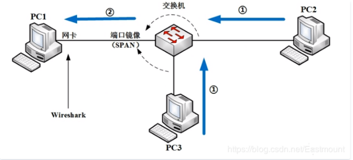
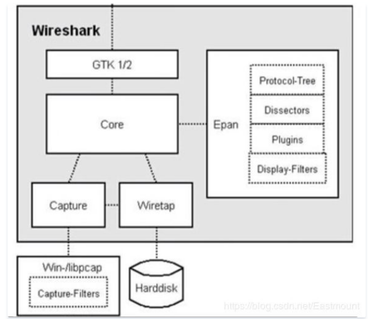

1

哪种网络情况下能够抓取到包呢？下面结合网络原理讲解。网络抓包主要存在三种情况：本机环境、集线器环境和交换机环境。

假设三台电脑通信，PC1处安装Wireshark，当PC2、PC3发送数据包到集线器网络里面（冲突域或广播域），由于集线器是物理层产品，不能识别MAC地址、IP地址，它会将接收包往其他所有接口泛洪，此时Wireshark就能抓到从同一个集线器其他电脑发过来的数据包，即局域网中的数据包。这是一种典型的老网络做法，现在基本淘汰。

交换机环境是更加常见的方式，包括端口镜像、ARP欺骗、MAC泛洪。

**（1）端口镜像**

交换机是一种数据链路层甚至网络层的产品，它的转包接包**严格按照交换机上的MAC地址表通信**。

所以正常情况下，PC2和PC3通信流量是很难流到PC1的网卡上。

当PC2和PC3通信时，PC1是无法通过Wireshark抓到包。

但是我们可以在**交换机端口做SAPN端口镜像操作**，

**它会将其他两个口的流量复制一份到PC1处，**

PC1的网卡和Wireshark设置为混插模式，此时就能进行抓包。

**该模式常用于很多付费的流量分析软件。**

（2）ARP劫持

假设我们**没有权限在交换机上做端口镜像技术**，因为有MAC地址表，又想获取整个局域网中的流量，窃取到PC2、PC3上的流量。

这可以通过著名的ARP攻击软件Cain&Abel实现，其流程是：

首先，PC2发送ARP请求广播包，交换机收到包之后会发给PC1和PC3。

PC1和PC3接收到，正常情况下PC1会丢弃该包，因为询问的是PC3，但ARP欺骗会回复“我是IP3，对应地址为MAC1”，这就是典型的ARP欺骗或ARP病毒。

最后PC2会将流量封装成底层的MAC1回复过去。

如果PC3和PC1都回应，但APR有个特性叫后到优先，PC1会做一个错误的绑定，将数据包发到MAC1，从而导致PC2和PC3的通信流量都会经过PC1，

**这也是典型的流量劫持、局域网攻击。**

3）MAC泛洪
通过工具泛洪带来大量垃圾包，产生大量MAC地址，

此时交换机MAC地址表会变为右边这张表（爆表），

MAC2和MAC3被挤出了MAC地址表。

一旦这种MAC地址被挤出MAC地址表，

**按照交换机原理，如果收到的数据包是未知，它会对外泛洪，此时PC2和PC3对外流量泛洪。**

参考资料

1、网络安全自学篇（十三）| Wireshark抓包原理（ARP劫持、MAC泛洪）及数据流追踪和图像抓取（二）

https://cloud.tencent.com/developer/article/1626729