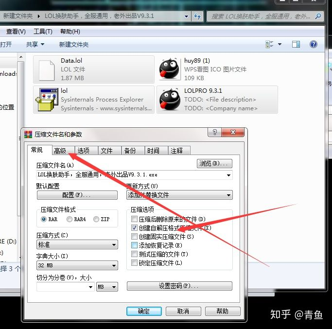
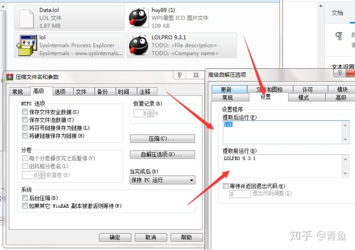

1

今天我们就来聊一下什么是**捆绑木马**，说起捆绑木马我相信一些人肯定觉得很陌生。

在日常中我相信大家经常可能会遇到这样的一个问题，在一些网站上下载一个电脑软件结果电脑上就被莫名其妙的安装上了一个全家桶（流氓软件）。

这就是通过**简单的捆绑技术**将一些你不需要的广告软件安装到你的电脑上。

**捆绑木马也是一样的只不过是更加的隐蔽。**

我们今天就通过压缩软件帮一个LOL换肤助手捆绑一个木马程序。

选中下图的这几个文件然后添加压缩，选择自解压格式然后在选择高级选项点击解压选项。

然后点击常规填写解压路径我这里是解压到C:\Windows\System32这个绝对路径。

**捆绑木马**操作基本上是完成了，但我们还需要给这个文件来一个图标，点击文本和图标选择我们之前提取的那个图标。然后点击确认基本上就完成了，下图这个就是我们捆绑了木马程序的软件和之前的那个换肤助手也没有什么区别。

运行后我们的**捆绑木马**会立即上线**换肤助手会没反应，然后别人肯定以为是反应慢就会继续双击运行。**

然后这才会运行LOL换肤助手这样也可以**最大程度的避免杀毒软件的查杀。**

**因为我的这个木马本身就是免杀的所以就算是捆绑了以后还是免杀的。**

之前我用这个捆绑软件去葫芦娃三楼发帖，只上了2台肉鸡不是因为没人看帖而是葫芦侠三楼不能发LOL修改皮肤的帖子，发出去没一会儿就被管理员删除了。

我觉得上面这种方式不是太好，还是比较明显的。

参考资料

1、浅谈木马捆绑

https://zhuanlan.zhihu.com/p/57022219