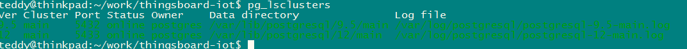
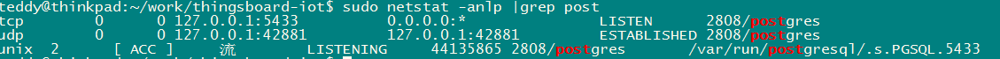
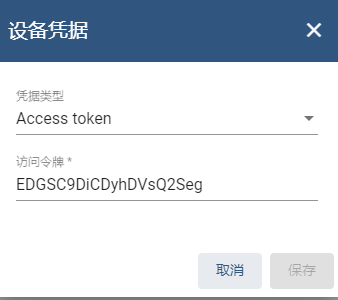
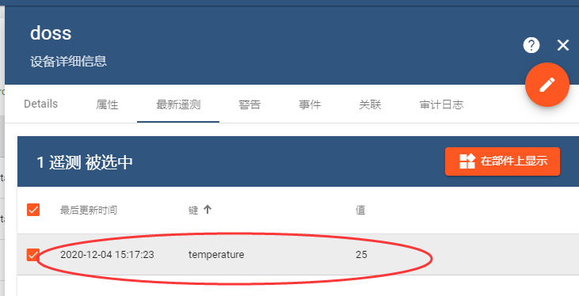

1

slogo是：一个开源的iot平台，用于数据收集、处理、可视化以及设备管理。

支持mqtt、coap、http。

支持云端部署和本地部署。

Ubuntu下安装

```
# 下载安装包
wget https://github.com/thingsboard/thingsboard/releases/download/v3.2/thingsboard-3.2.deb
# 安装
sudo dpkg -i thingsboard-3.2.deb
```

然后是配置数据库。

我们使用postgresql数据库。

先切换到postgres这个用户。

```
sudo su - postgres
```

然后在这个用户下，执行psql。进入到psql的命令行下面：

```
# 反斜杠表示命令。这个是修改密码。
\password
# 然后根据提示输入密码。
# 退出
\q
```

然后退出postgres用户。

进入psql，创建数据库thingsboard。

```
psql -U postgres -d postgres -h 127.0.0.1 -W
```

在psql命令行下面。

```
# 创建数据库
create database thingsboard;
# 退出
\q
```

修改thingsboard配置文件。/etc/thingsboard/conf/thingsboard.conf

把下面的内容添加到配置文件的末尾。注意替换PUT_YOUR_POSTGRESQL_PASSWORD_HERE为你的真实密码。

```
# DB Configuration 
export DATABASE_ENTITIES_TYPE=sql
export DATABASE_TS_TYPE=sql
export SPRING_JPA_DATABASE_PLATFORM=org.hibernate.dialect.PostgreSQLDialect
export SPRING_DRIVER_CLASS_NAME=org.postgresql.Driver
export SPRING_DATASOURCE_URL=jdbc:postgresql://localhost:5432/thingsboard
export SPRING_DATASOURCE_USERNAME=postgres
export SPRING_DATASOURCE_PASSWORD=PUT_YOUR_POSTGRESQL_PASSWORD_HERE
export SPRING_DATASOURCE_MAXIMUM_POOL_SIZE=5
# Specify partitioning size for timestamp key-value storage. Allowed values: DAYS, MONTHS, YEARS, INDEFINITE.
export SQL_POSTGRES_TS_KV_PARTITIONING=MONTHS
```

然后是选择消息队列服务。

我们就用默认的内建的in-memory。所以什么都不用做。

然后运行安装脚本。

```
sudo /usr/share/thingsboard/bin/install/install.sh --loadDemo
```

这一步有点慢。cpu直接到100%了。

报错了。

```
org.postgresql.util.PSQLException: ERROR: syntax error at or near "PROCEDURE"
```

谷歌了一下，在官方的issure里找到这个。

Hello Barnabe, i got the solution. you need to have postgresql 12 on you machine.

那就是需要升级postgresql的版本了。

我当前的版本：

```
$ psql --version
psql (PostgreSQL) 9.5.24
```

到postgresql的官网，看安装命令。

https://www.postgresql.org/download/linux/ubuntu/

```
sudo sh -c 'echo "deb http://apt.postgresql.org/pub/repos/apt $(lsb_release -cs)-pgdg main" > /etc/apt/sources.list.d/pgdg.list'
wget --quiet -O - https://www.postgresql.org/media/keys/ACCC4CF8.asc | sudo apt-key add -
sudo apt-get update
sudo apt-get -y install postgresql
```

安装

```
sudo apt-get install postgresql-12
```

最后提示：

```
成功。您现在可以用下面的命令开启数据库服务器：

    pg_ctlcluster 12 main start
```

现在看版本号。

```
psql --version
psql (PostgreSQL) 12.5 (Ubuntu 12.5-1.pgdg16.04+1)
```

再重新运行安装脚本。

```
sudo /usr/share/thingsboard/bin/install/install.sh --loadDemo
```

还是一样的错误。

难度是必须先进行卸载操作？



参考这个笔记操作。

https://gist.github.com/ShvaykaD/1f0e6c1321a0a2b4b9f3b9ea9ab3e8d3

停掉9.5


```
sudo pg_dropcluster 9.5 main --stop
```

移除9.5

```
sudo pg_dropcluster 9.5 main
```

再试。

这次不同了。

```
 Connection to localhost:5432 refused
```



应该是端口号不对。

我这为什么是5433？

我直接改postgresql的配置文件，改成5432的。

然后把postgresql重启。

再试。

这次可以了。

最后，启动服务。

```
sudo service thingsboard start
```

然后用8080端口访问就好了。

但是访问不到。

感觉是启动失败了。

把service restart一下，看日志打印。

发现是mqtt服务启动失败。那么应该是我本地安装的mosquitto导致的。

把mosquitto停掉。再启动thingsboard服务。

现在启动正常了。


用户名:

sysadmin@thingsboard.org 

密码为:

sysadmin

可以正常接入管理界面。

但是我的界面跟官方教程里的界面不同，少了很多东西。

还是看官方的demo界面。在这里操作。

https://demo.thingsboard.io/home

知道了。是因为登陆的身份不同，用下面的身份登陆就跟教程里界面一样了。

 **tenant@thingsboard.org** and password **tenant**

新增一个设备，名字叫doss。不做多余设置。点击管理凭据，可以看到这个。把token拷贝下来。



在本机执行下面的命令。

```
curl -v -X POST -d "{\"temperature\": 25}" http://localhost:8080/api/v1/EDGSC9DiCDyhDVsQ2Seg/telemetry --header "Content-Type:application/json"
```

在设备的遥测，可以看到这个信息。




根据入门教程的操作一遍，基本知道这个的操作逻辑了。

感觉thingsboard是跟homeassistant类似的。

不是类似阿里云物联网平台的东西。而是一个家庭内部用来管理设备的。

适合做小公司的物联网平台吗？


看看案例里的智能电表。

http://www.ithingsboard.com/smart-metering/


对于实施智能电表的公司而言，

典型的挑战是如何将其集成到基础架构中，并设置量身定制的智能电表用例。

实现这些目标的最佳方法是使用IoT平台，

该平台提供开箱即用的解决方案和智能计量的模板，例如ThingsBoard。

企业级物联网平台的最大优势之一是其数据处理功能。

您不仅可以集中地从各种智能电表收集数据，还可以设置自定义可视化仪表板，配置用户警报和通知，并将收集的数据馈送到其他应用程序或数据存储中。


ThingsBoard后端是用Java编写的但是我们也有一些基于Node.js的微服务。

ThingsBoard前端是基于Angular JS框架的SPA。


感觉对我的价值不是很大。


参考资料

1、github代码

https://github.com/thingsboard/thingsboard

2、官网

https://thingsboard.io/

3、官方安装教程

https://thingsboard.io/docs/user-guide/install/ubuntu/

4、教程

https://iot.mushuwei.cn/#/thingsboard/thingsboard-build

5、

https://cloud.tencent.com/developer/article/1605151

6、

https://thingsboard.io/docs/getting-started-guides/helloworld/

7、ThingsBoard微服务架构

http://www.ithingsboard.com/docs/reference/msa/

8、基于ZStack构建物联网平台

https://zhuanlan.zhihu.com/p/89461289