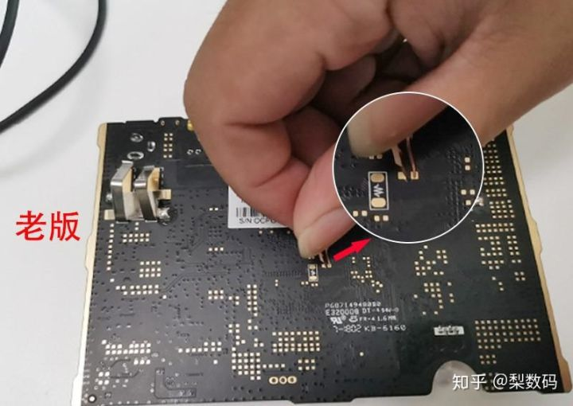

在淘宝上买了个二手的玩客云。

打算下载一些电影过年带回去看看的。

跑的是linux系统，能不能破解？


我发现在.onething_data目录下，有些img文件，一直在变大。

不知道具体是在做什么。

我觉得可能是把资源拉下来，做种子，提供给其他的用户。

晚上放一晚上，看看是不是会把400G的空间都占满。


https://github.com/onethingpcs


是占用上行带宽？

我限速为1KB（上行和下行都是），为什么img文件还是增长还是那么快？


# 刷armbian


之前因为玩客云一直往硬盘大量写入数据。而我的下载又不是刚需，所以就一直闲置着。

在B站上看到有人把玩客云刷其他的系统。所以现在也把我的机器刷一下。


玩客云有两个 USB 口，这两个口刷机时的功能不同，本文为了后面称呼方便，在此就把左边靠近网口的称为一号口，右边靠近 HDMI 的称为二号口。


晶晨刷机软件 USB Burning Tool 装好后打开，左上角点击 “文件”，然后选择导入烧录包，选择下载的 update.img 文件导入，然后确认右边配置里的擦除 flash 和擦除 bootloader 都是勾选上的，并且选择擦除所有。


短接引脚，我的是老版。



1、下载需要的资料。

```
玩客云使用的是amlogic的S805芯片。所以刷机工具就是amlogic的烧写工具USB Buring Tool。
我之前开发的产品有用到这个工具，所以电脑上就是安装了。
需要的东西有：
1、通刷固件。
	百度云地址：https://pan.baidu.com/s/1utrrmPxWWL2X5EEhO73Cjg
2、armbian镜像。
	镜像在这里。
	链接：https://pan.baidu.com/s/1VwYhT77Tqev3XgYL0vSeVg
	提取码：kavd

```

2、把armbian镜像烧录到SD卡。

```
boot分区是FAT32格式的。这个跟树莓派很像。
看看boot分区下的东西。
```

aml_autoscript。这个文件是设置uboot的环境变量。

看逻辑是先看usb启动行不行，不行就尝试mmc的。最后是emmc的。这个不用管，这个是armbian的开机逻辑。

```
setenv bootcmd 'run start_autoscript; run storeboot;'
setenv start_autoscript 'if usb start; then run start_usb_autoscript; fi; if mmcinfo; then run start_mmc_autoscript; fi; run start_emmc_autoscript;'
setenv start_emmc_autoscript 'if fatload mmc 0 11000000 emmc_autoscript; then autoscr 11000000; fi; if ext4load mmc 0:${system_part} 11000000 emmc_autoscript; then autoscr 11000000; fi; if fatload mmc 1 11000000 emmc_autoscript; then autoscr 11000000; fi; if ext4load mmc 1:${system_part} 11000000 emmc_autoscript; then autoscr 11000000; fi;'
setenv start_mmc_autoscript 'if fatload mmc 0 11000000 s805_autoscript; then autoscr 11000000; fi;'
setenv start_usb_autoscript 'if fatload usb 0 11000000 s805_autoscript; then autoscr 11000000; fi; if fatload usb 1 11000000 s805_autoscript; then autoscr 11000000; fi; if fatload usb 2 11000000 s805_autoscript; then autoscr 11000000; fi; if fatload usb 3 11000000 s805_autoscript; then autoscr 11000000; fi;'
setenv system_part "b"
setenv reboot_mode normal
saveenv
reset
```

3、打开usb burning tool。


碰到问题，能进烧录模式，但是烧录一直失败。

现在直接开机也起不来了。估计要焊接串口上来看看了。

串口的接法。

USB转TTL串口线 GND 接 玩客云GND

USB转TTL串口线 RXD 接 玩客云TX

USB转TTL串口线 TXD 接 玩客云RX


一般电路板都会留test point，方便进行短接进烧录模式。例如这样：


之前烧录一半失败了。接上串口。上电就打印这个。

```
QA5:B;SVN:B72;POC:1FF;STS:0;BOOT:0;INIT:0;READ:41;READ:41;READ:41;BOOT:1;INIT:10;USB:3;SERIAL:4;
```

网上找到方法，就是失败了点停止，再点开始，如此反复直到成功为止。

试了3次就成功了。

接下来做什么？

看起来进不了uboot的串口界面。

我换成Android的镜像。Android的镜像只有300多M。是一个比较老的版本。

然后我拔掉线之后，我的电脑崩了。

重启电脑后，看到串口可以看到打印了。

板上的Android也正常启动了。是一个电视盒子系统。

但是版本很老，没有什么实用性。

所以还是继续刷armbian。

Android系统下执行reboot，然后一直按enter键，就可以停在uboot里。

用网上提供的onekey工具一键配置为从U盘或者SD卡启动。

现在用SD卡可以正常启动了。

armbian默认的用户是root，密码1234，进去后，马上让你修改root的密码。还不能太简单。我就用1号密码。

然后让你添加一个用户。我添加teddy。

但是我当前只有一个读卡器，不可能一直插着用。

我有一张4G的大的SD卡。插到板子上，识别为mmcblk1.正常。

我就把镜像烧录到这个卡里面。这样2个usb口也就都可以空出来了。

刚好我的读卡器是多接口的，可以直接读各种SD卡的。把armbian镜像烧录到这个4G的SD卡上。

用rufus这个工具就挺好的。之前一直用win32diskimager这个工具，但是这个工具启动太慢了。所以被我抛弃了。

```
Welcome to ARMBIAN 5.74 user-built Ubuntu 18.04.1 LTS 3.10.108   
System load:   1.58 0.55 0.19   Up time:       1 min
Memory usage:  7 % of 792MB     IP:            
CPU temp:      38°C           
Usage of /:    23% of 3.3G 
```

现在有个问题，就是获取不到ip地址。

看开机打印。

```
[   13.686030@0] systemd[1]: Starting Journal Service...
[   13.694709@3] ethernet_driver probe!
[   13.694715@3] Please config phy  interface.
[   13.694717@3] Please config savepowermode.
[   13.694719@3] Please config reset_pin_enable.
[   13.694720@3] Please config reset_delay.
[   13.694722@3] Please config reset_pin.
[   13.694726@3] ethernetinit(dbg[bf01d1a8]=1)
[   13.694755@3] ethernet base addr is fe0c0000
[   13.694768@3] write mac add to:edc01ac8: 00 01 23 cd ee af |..#...|
[   13.760060@3] libphy: AMLMAC MII Bus: probed
[   13.760069@3] eth0: PHY ID 001cc916 at 0 IRQ -1 (0:00) active
```

网上找了一下，好像是需要另外打补丁才行的。


https://dl.armbian.com/

这个是armbian的网站。

但是下载并不快。

https://gitee.com/jiangwei0402/Build-Armbian

现在是用这个来编译网卡的驱动。

慢慢下载吧。挂着梯子速度也不快。

反正aosp的下载过程已经极大地提高了我的耐心。

同时在我的香港阿里云服务器上进行编译吧。

国内这个实在是太慢了。

阿里云服务器上是几十兆的速度。

Build-Armbian 这个是整个armbian的源代码。

编译报错。

```
apt-get install  dialog
```


```
fel.c:31:18: fatal error: zlib.h: No such file or directory
compilation terminated.
fel_lib.c:26:20: fatal error: libusb.h: No such file or directory

libstdc++.so.6: cannot open shared object file: No such file or directory
```

安装需要的东西。

```
apt-get install zlib libusb 
```


直接看网络不好的问题。

网上找了一下，说是要替换一个dtb文件。

但是我下载下来对比，发现跟我板端的是一样的。


http://nctoro.com/zhonghe/339.html

暂时解决不了这个问题。


# 做轻量级的nas

这个只有一个有线网卡。


# 刷openwrt

这个up讲得很好了。

而且把我对旁路由，应该把主路由的网关设置为旁路由的ip。

也就是对我的情况，需要把主路由的网关设置为192.168.1.3 。

https://www.bilibili.com/video/BV1ra411w76d?from=search&seid=16021247016417958057

这个up分享的下载链接。

https://cloud.189.cn/t/6ryUv2aYBvam

a8ez


我可以把openwrt弄起来，然后就可以解放出一个树莓派来折腾了。

也算是物尽其用了。

底包也需要另外刷，对比了一下，跟之前下载的s805_flash.img，还是不一样的。


不知道为什么，我这个总是死机。卡在这里。

```
[    8.565995@1] EXT4-fs (sda2): mounting with "discard" option, but the device does not support discard
[    8.573989@1] EXT4-fs (sda2): mounted filesystem with writeback data mode. Opts: data=writeback
[   14.369115@3] Connect Timeout
[   14.437895@3] Device Not Connected/Responding

```


# 参考资料

1、玩客云开启SSH和root 默认密码的生成的算法 

http://bbs.mydigit.cn/read.php?tid=2241880

2、分析一下前段很火的玩客云（区块链相关产品）

https://blog.csdn.net/hungerliu/article/details/79138669

3、

http://nctoro.com/zhonghe/335.html

4、[求助] 刷机时 提示 [0x10105002]Romcode/初始化DDR/读取初始化结果/USB.

参考这个解决了刷入失败的问题。

https://www.znds.com/tv-998330-2-1.html

5、armbian玩客云支持

https://www.right.com.cn/forum/thread-439086-6-1.html