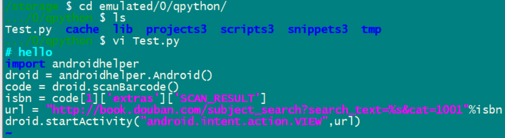

现在需要在Android上上执行一些脚本，搜索了一下，qpython可以在Android上跑python脚本。

# 什么是qpython

今天我们介绍的就是一个利用碎片化时间学习Python的利器：QPython。

这是一款能够在安卓手机上运行Python的软件，你可以在地铁上、公交车上甚至在无聊的会议上随时随地练习Python。

QPython是一种通用叫法，其实它分为两款，分别是QPython、QPython3分别对应支持Python2和Python3。

QPython3只能支持到Python3.2.2，当然作为练习也足够了。


qpython for Android是Android上的python引擎。（另外有qpython for ios）

它可以让你在Android上运行python程序。

它包括：

1、python解释器。

2、控制台。

3、编辑器。

除了集成了基础的python库之外，它还集成了支持webapp开发的bottle库。

支持调用Android api的SL4A库。

# qpython的历史

qpython诞生于2012年。

最初是作者River为了能够在Android上实现热更新。

后来作为一个App独立发布。

发布后受到广大python爱好者的喜爱。

是目前Android上最受欢迎的python集成开发环境。

# 支持的程序类型

目前qpython可以运行的语言有：

1、控制台程序。

2、webapp程序。

3、后台应用程序。

4、GUI程序。

这些程序通过在文件头部加一个注释来进行区分：

```
#qpy:webapp   这个表示是一个
#qpy:kivy
#qpy:
```

# 安装第三方库

qpython内置了大量的python标准库。

因为Android里不能使用编译工具链。

所以不能编译的方式来安装库。

但是qpypi有不少的已经编译好的库。

包括：kivy、numpy、opencv、pycrypto、tornado。

# 社区版本和商业版本

qpython使用Apache协议开源。

有社区版本和商业版本。

# 作者

https://github.com/riverfor

River Yan。看名字是个中国人。

这个是作者的官网：

http://river.aipy.org/

是一家公司的CTO。

# 源代码

https://github.com/qpython-android/qpython

# 后台应用怎样不挂起

这个是作者的文章。

https://segmentfault.com/q/1010000021666585

# qpython webapp

qpython相比于其他的移动端的web app，有什么优势？

优势有：

1、qpython是一个强大的python引擎，可以处理许多逻辑事务。

2、支持大量的python库。

3、可以在手机上进行开发。

## qpython的webapp是如何工作的

包含了这些模块：

1、webapp服务。

2、webview。

webapp service在后台运行，用来响应用户的输入。

webview是前端组件。

需要在py文件的头部写上这样的注释：

```
#qpy:webapp:demo-app
#qpy://ip:port/app_path
```

## kivi app

```
# 剪贴板
#qpy:kivy
from kivy.app import App
from kivy.uix.button import Button
class TestApp(App):
    def build(self):
        return Button(text='Hello World')
TestApp().run()
```

这个只支持python2的。

# 在电脑上直接写手机上的python文件

在手机上写代码无疑是不方便的。

能不能直接电脑上写代码，手机上马上就可以执行的方法。

看了一下qpython的设置里，内置了ftp服务。

默认在2121端口，用户名和密码默认是qpy3、qpy3

但是连接会失败。

## 用termux安装sshd

另外写了篇文章记录过程。

可以正常进行编写的：



目录是：

```
/storage/emulated/0/qpython
```

# 标准库

https://www.qpython.org/en/guide_libraries.html#qpython-dynload-libraries


# QPypi安装

# SL4A

# 一些例子

定时发短信

https://github.com/xdbcb8/QPython3Sms/blob/master/qpython_sms.py

公交查询的webapp

https://github.com/qpython-lab/BusHelper

flappy-bird游戏

https://github.com/qpython-android/qpy-flappybird

# 拷贝文件到openwrt

工作逻辑：

```

```


# 参考资料

1、官网资料

https://www.qpython.org/en/guide.html

2、安卓运行Python的神器：QPython

https://zhuanlan.zhihu.com/p/29990939

3、官网qpython历史介绍

https://edu.qpython.org/qpython-quick-start/cn/index.html?form=web

4、中文文档

https://www.qpython.org/zhindex.html

5、pdf文档

https://readthedocs.org/projects/qpython/downloads/pdf/latest/

6、

https://qpython.readthedocs.io/en/latest/index.html