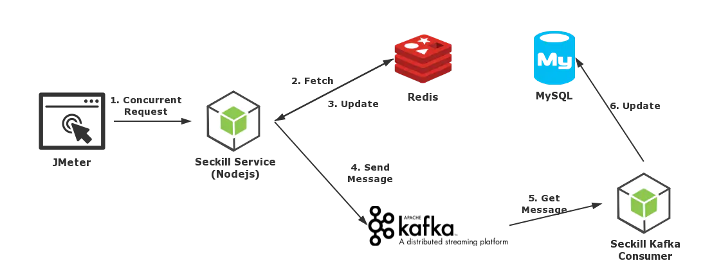
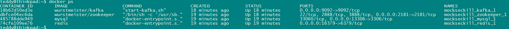

--

# 模拟秒杀系统



上面是一个简单的模拟秒杀系统。

jmeter：用来模拟秒杀系统里的大量并发的用户请求。

seckill service：使用express来做服务端。上面的2、3、4步都是这个服务来做的工作。

redis：在docker里运行，里面放一个名为counter的数据来模拟剩余库存。

kafka：kafka使用zookeeper来存放一些元数据。seckill服务在更新redis之后，会被kafka发一条消息，表示秒杀成功。

mysql：一次秒杀成功，在数据库里对应一条数据。

代码在这里：

https://github.com/geshenyi/MockSecKill

把代码取下来。

因为我本地已经安装了redis和mysql，所以端口已经被占用。

所以，修改docker-compose.yml文件。

把本地的16379和13306映射给容器。（就是在默认端口基础上加10000）

操作步骤：

1、启动docker容器。

```
docker-compose up
```



2、启动express。

```
cd seckill_service
npm i
npm run start
```

这一步在安装依赖的时候出错了。是编译snappy的时候出错。

网上查了一下，说是需要使用v8.x版本的nodejs。

我切换一下版本，

```
nvm use v8.17.0
```

删除当前的node_modules目录，重新执行npm i进行安装，安装成功了。

需要修改routes/seckill.js里的

```
redis.createClient({
	port: 16379
});
```


3、启动seckill_kafka_comsumer这个js脚本。

```
node seckill_kafka_consumer.js
```

需要修改该js文件里的mysql配置，添加port为13306

运行报错。

```
TopicsNotExistError: The topic(s) CAR_NUMBER do not exist
```

是kafka报的错。

需要在mysql里创建一个名为seckill的数据库。

进入docker里的mysql命令行

先进入到bash。xxx替换为mysql对应容器的名字。

```
docker exec -it xxx bash
```

然后进入到mysql

```
mysql -u root -proot
```

然后创建数据库和表。

```
create database seckill;
use seckill;
create table seckill(id int auto_increment primary key, date timestamp); 
```

kafka里需要创建一个名字为CAR_NUMBER的主题。

```
docker exec mockseckill_kafka_1 /opt/kafka/bin/kafka-topics.sh --create --topic CAR_NUMBER --replication-factor 1 --partitions 1 --zookeeper 172.16.2.153:2181
```

去Redis容器中创建一个名为counter的计数器(设置值为100，代表库存初始值为100)

现在再执行还是报错。

```
Error: ER_NOT_SUPPORTED_AUTH_MODE: Client does not support authentication protocol requested by server; consider upgrading MySQL client
```

docker容器里的mysql版本太高了。

不折腾这个问题。我直接使用我本地的mysql。把数据库的配置改成我本地的。

现在运行不报错了。

到这里下载jmeter。

https://jmeter.apache.org/download_jmeter.cgi

按照文章里的配置 好jmeter的，发现发送是找不到。

用postman发送测试一下，也是不行，看了一下代码，url应该是这样：

```
http://172.16.2.153:3001/seckill/seckill
```

就这样写。

现在express打印

```
count=0
POST /seckill/seckill 200 27.006 ms - 4
{ CAR_NUMBER: { '0': 0 } }
```

现在有些问题。

我先学习一下kafka的用法。


参考资料

1、一次模拟简单秒杀场景的实践 Docker + Nodejs + Kafka + Redis + MySQL

https://www.jianshu.com/p/c18e61d0726c

