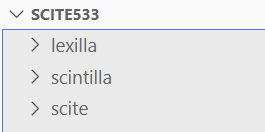

最近notepad++作者各种作妖。

我就进行这个工具的替代。

目前主要使用了notepad--。简称为ndd。

但是也想要参与到notepad--的开发里。

想要看看lua能不能做ndd的插件系统。

看到NotepadNext里是有lua插件的。

然后看到里面的组件有：

LuaExtension类。

LuaBridge库。

然后c++配合lua来做。

看到这个不少的东西是来自于scite的。这个是各种基于scintilla的编辑器的老祖宗。

所以值得先研究一下scite的。

# scite

这个对各种编程语言的支持，是通过解析各种properties文件来做的。

没有必要做这么复杂吧。

Next是用lua来描述的。

这个是使用stl库。界面是用gtk的库。

没有使用qt。

代码看起来比较整洁干净。



编译方法：

需要gtk2.24版本以上 。如果使用gtk3，需要给make传递参数GTK3=1

gcc需要7.1版本以上。

编译scintilla

```
	cd scintilla/gtk
	make
	cd ../..
```

编译scite

```
	cd scite/gtk
	make
	sudo make install
```

其余不研究太多。

就看看lua相关的。


# NotepadNext依赖的仓库

在.gitmodules里。

## SingleApplication

这个主要是为了解决qt的版本兼容性。

https://github.com/itay-grudev/SingleApplication.git

## uchardet

检测语言的编码的库。

https://gitlab.freedesktop.org/uchardet/uchardet.git

## Qt-Advanced-Docking-System

https://github.com/githubuser0xFFFF/Qt-Advanced-Docking-System

这个是个比较复杂的扩展库。可以做出visual studio这样复杂IDE的可以拖拽的窗口布局的效果。


# 参考资料

1、

