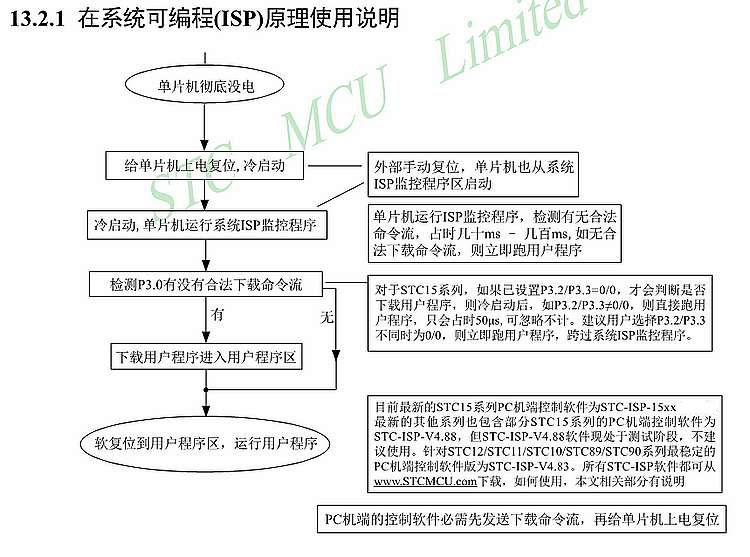

--

对于单片机烧录这一块不太了解，通过研究自制单片机烧录器来了解一下。

# 如何自制

制作自制单片机烧录器可以是一个有趣且具有挑战性的项目。下面是一般步骤的概述，以帮助你开始制作自己的单片机烧录器：

1. **确定单片机型号**: 首先要确定你要烧录的单片机型号。这是因为不同的单片机有不同的烧录接口和通信协议。

2. **选择烧录方法**: 了解你选择的单片机的烧录方法。常见的烧录方法包括串口烧录、ISP（In-System Programming）烧录和JTAG烧录等。根据你选择的单片机型号，确定适合的烧录方法。

3. **收集所需材料**: 根据选择的烧录方法，收集所需的材料和工具。这可能包括单片机烧录器芯片、电路板、电路元件、电缆和连接器等。

4. **设计电路**: 设计单片机烧录器的电路。这包括与单片机通信的接口电路，例如串口电路或ISP接口电路。你可以使用EDA工具（如Eagle、KiCad等）来设计电路图，并生成PCB布局。

5. **制作电路板**: 使用PCB制作工具，如切割机或化学腐蚀法，制作电路板。确保按照设计准确布局并连接电路元件。

6. **焊接和组装**: 将电路元件焊接到电路板上，并按照设计连接线路。确保焊接质量良好，避免短路或接触不良。

7. **编程软件**: 选择合适的编程软件来烧录单片机。这可能是官方提供的编程软件，也可能是第三方的编程工具。确保按照单片机的烧录协议和方法进行设置和操作。

8. **连接和烧录**: 将你制作的单片机烧录器连接到计算机或编程设备上，然后根据烧录方法和软件的指导，进行单片机的烧录操作。

请注意，制作自制单片机烧录器需要一定的电子知识和技能，包括电路设计、焊接和编程等。确保你具备相关的技能，并在进行项目时遵循安全操作和使用合适的材料和工具。此外，了解和遵守相关的法律和知识产权规定也是非常重要的。

# 一个简单的开源方案

以下是一个简单的开源方案，用于制作自制单片机烧录器：

硬件部分：
1. 单片机选择：选择一个适合你的需求的单片机，如Arduino Uno、ATmega328P等。
2. USB转串口模块：使用一个USB转串口模块，例如常见的CH340G芯片的模块，用于与计算机进行通信。
3. ISP接口：设计一个ISP（In-System Programming）接口电路，用于与目标单片机进行烧录通信。你可以参考单片机的数据手册和规格说明来设计接口电路。
4. 电路板：根据设计的电路图，制作一个简单的电路板，包括连接USB转串口模块、ISP接口电路以及其他必要的元件。

软件部分：
1. 烧录软件：使用开源的烧录软件，例如avrdude或Arduino IDE等，来进行单片机的烧录操作。这些软件通常支持多种单片机型号和烧录方法，你可以根据需要选择合适的软件。
2. 驱动程序：根据你选择的USB转串口模块，确保安装了相应的驱动程序，以便计算机能够识别和与模块进行通信。

操作步骤：
1. 将自制的电路板与USB转串口模块连接，并通过USB将其连接到计算机上。
2. 安装所需的驱动程序，确保计算机能够正确识别USB转串口模块。
3. 打开烧录软件，并选择正确的单片机型号和烧录方法。
4. 按照软件的指导，选择烧录文件（如.hex或.bin文件）并开始烧录操作。
5. 程序将通过USB转串口模块发送到自制烧录器，然后通过ISP接口与目标单片机进行通信并完成烧录操作。

请注意，这只是一个简单的开源方案示例，可以根据你的需求和具体情况进行定制和调整。在制作自制单片机烧录器时，建议参考相关的电路设计和编程资源，并确保遵循相关的法律和知识产权规定。

# 什么是isp烧录器

ISP烧录器（In-System Programmer）是一种用于编程或烧录单片机的设备或工具。它允许在目标单片机中直接编程，而无需将单片机从电路板中取出。ISP烧录器通过特定的接口与目标单片机进行通信，将程序或数据加载到单片机的存储器中。

ISP烧录器通常具备以下特点和功能：
1. 接口支持：ISP烧录器根据单片机的规格和接口标准设计，以确保与目标单片机的通信兼容性。常见的接口包括SPI（串行外设接口）、I2C（双线串行接口）、JTAG（联合测试行动组接口）等。
2. 电路连接：ISP烧录器通过适配器或插座与目标单片机的接口进行连接，以确保正确的引脚连接和电气特性匹配。
3. 软件支持：ISP烧录器通常配套有相应的烧录软件，用于选择目标单片机型号、加载程序或数据文件，并控制烧录过程。
4. 供电功能：ISP烧录器通常提供目标单片机所需的供电功能，以确保单片机在烧录过程中获得正确的电源供应。
5. 调试功能（部分烧录器）：一些ISP烧录器还具备调试功能，可以进行单步执行、断点设置和变量查看等调试操作，以辅助单片机程序的开发和调试。

使用ISP烧录器，你可以将编写好的程序或数据加载到目标单片机中，实现功能的烧录和更新。它在单片机开发、嵌入式系统设计和电子制作等领域得到广泛应用，为开发者提供了一种方便快捷的方式来烧录和调试单片机。

# avrdude介绍

avrdude（AVR Downloader/UploaDEr）是一个开源的命令行工具，用于与AVR单片机进行编程和通信。它是一个跨平台的工具，可以在多个操作系统上使用，包括Windows、Linux和macOS等。

avrdude主要用于以下功能：
1. 烧录程序：avrdude可以将编写好的程序文件（通常是以.hex、.bin或.elf格式）加载到AVR单片机的闪存（Flash）存储器中，以使单片机能够运行该程序。
2. 读取和写入数据：avrdude可以读取和写入单片机的EEPROM、Fuse Bits、Lock Bits和Signature Bytes等数据，以进行配置和调整。
3. 擦除存储器：avrdude可以擦除单片机的闪存、EEPROM和其他存储器区域，以清除之前加载的程序或数据。
4. 通信和调试：avrdude可以通过不同的通信接口（如串口、USB等）与AVR单片机进行通信，并提供调试功能，如单步执行、断点设置和寄存器查看等。

avrdude的使用方式是通过命令行界面，提供一系列的命令和选项来执行不同的操作。例如，你可以指定要烧录的目标单片机型号、选择通信接口、设置波特率、指定要加载的程序文件等。

除了命令行界面，avrdude还可以与其他编程工具、集成开发环境（IDE）和脚本等进行集成，以方便自动化和批量烧录操作。

由于avrdude是一个开源工具，你可以在其官方网站或各种开源项目中找到相关的文档、示例和支持。它是AVR单片机开发中常用的工具之一，为开发者提供了一种便捷的方式来与AVR单片机进行编程和通信。

代码：

https://github.com/avrdudes/avrdude

是个人维护的。不是官方的。

# AT89C51 烧录器实现

要实现AT89C51单片机的烧录器，可以遵循以下步骤：

1. 硬件设计：
   - 使用一个可编程的串行通信芯片（如FT232RL或CH340G）作为USB转串口模块，用于与计算机建立串口通信。
   - 设计一个ISP（In-System Programming）接口电路，用于与AT89C51单片机进行烧录通信。ISP接口通常包括引脚连接、电平转换电路和复位电路等。
   - 添加适当的电源电路，确保单片机和其他元件获得稳定的电源供应。

2. 硬件连接：
   - 连接USB转串口模块与计算机，确保驱动程序正确安装，并在计算机上获得可用的串口。
   - 连接ISP接口电路与AT89C51单片机的对应引脚，包括VCC、GND、RESET、PSEN、EA、RD、WR和数据总线（D0-D7）等。

3. 软件开发：
   - 选择适当的烧录软件，如Flash Magic、ISP-PRO等。这些软件支持AT89C51单片机的烧录操作，并提供用户友好的界面。
   - 打开烧录软件，选择正确的串口端口和波特率设置，以与USB转串口模块建立通信。
   - 选择AT89C51单片机的型号和烧录模式（ISP模式），加载要烧录的程序文件（.hex或.bin格式）。
   - 设置其他烧录选项，如擦除存储器、校验烧录结果等。
   - 连接目标单片机与烧录器，并确保烧录器和目标单片机的电源均已连接。
   - 开始烧录操作，等待烧录完成，并根据烧录软件的提示进行操作。

请注意，以上步骤仅为基本指导，具体的硬件设计和软件开发可能会根据你的需求和具体情况有所不同。在进行自制烧录器设计时，建议参考AT89C51的数据手册和规格说明，以了解准确的引脚连接和烧录操作细节。同时，确保遵循相关的法律和知识产权规定。

## AT89C51介绍

AT89C51是一种常见的8位单片机，属于AT89系列微控制器。它是由Atmel（现已被Microchip收购）推出的一款经典产品。AT89C51是一款高性能、低功耗的单片机，广泛应用于各种嵌入式系统和电子设备中。

下面是一些关于AT89C51的主要特点和功能：

1. 架构和处理器：AT89C51基于Harvard架构，内部集成了一颗8位的8051兼容处理器。它具有4KB的闪存程序存储器、128字节的RAM和32个I/O引脚。

2. 时钟和定时器：AT89C51支持多种时钟源，包括外部晶体振荡器和内部时钟源。它内部集成了两个16位定时器/计数器和一个可编程的分频器。这些定时器可以用于计时、脉冲宽度调制、脉冲计数等应用。

3. 串口通信：AT89C51具有一个全双工的串口通信接口，支持异步串行通信协议（UART）。这使得它可以方便地与其他外部设备进行通信，如PC、传感器、显示器等。

4. 中断系统：AT89C51支持多种中断源，包括外部中断和定时器中断。它可以响应外部事件和定时器溢出等中断请求，以实现实时响应和任务处理。

5. 存储器扩展：AT89C51具有存储器扩展能力，可以通过外部存储器接口（例如并行外部数据存储器或片上数据存储器）扩展程序存储器和数据存储器的容量。

6. 低功耗模式：AT89C51支持多种低功耗模式，如空闲模式和电源下降模式。这些模式可以有效地降低功耗，延长电池寿命。

7. 开发工具和编程语言：AT89C51可以使用多种集成开发环境（IDE）和编程语言进行开发。常见的工具包括Keil C51和Atmel Studio等。编程语言方面，C语言是最常用的选择，也支持汇编语言编程。

总之，AT89C51是一款功能强大且广泛使用的8位单片机。它适用于各种嵌入式系统和电子设备的控制和处理任务，并且具有丰富的外设接口和强大的处理能力。

## AT89C51烧录接口是串口还是i2c

AT89C51并没有内置的专用烧录接口，因此它既可以通过串口（UART）也可以通过I2C接口进行烧录。

对于串口烧录，通常使用具有相应串口功能的烧录器连接到AT89C51的UART引脚（例如TXD和RXD）。通过串口连接，烧录器可以向AT89C51发送烧录指令和程序代码，并接收来自单片机的响应。

对于I2C烧录，通常使用支持I2C通信协议的烧录器。烧录器通过I2C总线连接到AT89C51的SDA（数据线）和SCL（时钟线）引脚，使用I2C协议与单片机进行通信。通过I2C连接，烧录器可以发送烧录指令和程序代码，并接收来自单片机的响应。

需要注意的是，具体的烧录接口和烧录器取决于你使用的具体烧录设备和软件。在进行烧录之前，最好查阅烧录设备和软件的用户手册或文档，了解它们支持的烧录接口和配置方法。这样可以确保正确选择和设置烧录接口，以便与AT89C51单片机进行烧录操作。

## 51单片机有bootrom吗？

传统的8051系列单片机（包括AT89C51）通常没有内置的Boot ROM。Boot ROM（引导只读存储器）是一种内部存储器，用于存储引导程序或启动代码，以便在系统上电或复位时执行。

在传统的8051单片机中，引导程序通常存储在外部存储器（如闪存、EEPROM等）中，并通过复位向量或其他方式在启动时加载到单片机内部进行执行。

然而，值得注意的是，有些改进型的8051单片机和衍生产品可能在芯片内部集成了一小块引导代码存储区域，也被称为内部Boot ROM或Bootloader。这样的引导代码区域通常非常有限，仅能用于执行简单的引导功能，如加载程序代码等。这些改进型单片机通常由具体的芯片制造商提供，并且其功能和使用方法可能会有所不同。

因此，对于一般的8051单片机（包括AT89C51），如果需要引导功能，通常需要将引导程序存储在外部存储器中，并通过外部设备（如编程器或烧录器）将其加载到单片机中。

# STC-ISP

## 原理

来自官网的图片：

https://www.stcisp.com/stcisp620_off.html



# 单片机启动时ISP监控程序

在单片机启动时，可以使用ISP（In-System Programming）监控程序来实现编程和调试的功能。**ISP监控程序是一种特殊的程序，常驻在单片机内部的闪存或EEPROM中，并在启动时运行。**

ISP监控程序可以通过串口、USB、I2C等接口与外部设备（如计算机）进行通信，以便进行程序的编程、调试和数据传输。它可以接收来自外部设备的命令和数据，并根据这些命令执行相应的操作。

使用ISP监控程序，你可以实现以下功能：

1. 程序的编程：通过ISP监控程序，你可以将程序代码通过通信接口传输到单片机的闪存或EEPROM中，实现程序的编程。

2. 调试功能：ISP监控程序可以支持调试功能，如单步执行、断点调试等。通过与外部设备的通信，你可以在单片机上设置断点、查看和修改寄存器、观察变量值等，帮助调试程序。

3. 数据传输：除了程序代码，ISP监控程序还可以用于数据的传输。通过与外部设备的通信，你可以将数据传输到单片机中，或从单片机中读取数据。

ISP监控程序通常由单片机厂商提供，每个厂商的实现可能有所不同。一些厂商提供官方的ISP监控程序，而其他厂商可能提供第三方或开源的ISP监控程序。这些程序通常与特定的单片机系列或型号相关。

因此，如果你想使用ISP监控程序，在选择和使用之前，最好参考单片机厂商的文档和资料，了解他们提供的ISP监控程序的功能、用法和支持的通信接口等。

# isp监控程序实现协议

ISP监控程序实现的协议通常是与特定的单片机芯片系列或型号相关的。在AVR芯片的ISP编程中，最常见的协议是STK500（Serial Transfer Kit 500）协议和STK600（Serial Transfer Kit 600）协议。

STK500协议是一种串行通信协议，用于与AVR单片机进行编程和通信。它定义了命令和数据传输的格式，包括读取芯片信息、擦除、编程、读取等操作。STK500协议通常通过串口（如RS-232）或USB接口与计算机进行通信。

STK600协议是一种更高级的编程和调试协议，支持更多功能和选项。除了基本的编程和调试功能外，STK600协议还提供了高级调试功能，如单步执行、断点调试、寄存器观察等。STK600协议通常通过USB或其他接口与计算机进行通信。

这些协议中定义了一系列的命令和数据格式，用于实现与单片机的通信和编程操作。通常，烧录软件或工具会使用这些协议进行通信，并将命令和数据传输到单片机的闪存或EEPROM中。

需要注意的是，不同的单片机芯片可能会有不同的编程协议和通信方式。因此，在选择和使用ISP监控程序时，最好参考芯片厂商提供的文档和资料，了解他们支持的协议和通信方式，并相应地选择合适的烧录工具和软件。

# STK500协议介绍

STK500协议是一种常用的串行通信协议，用于与AVR单片机进行编程和通信。它是由Atmel（现在为Microchip Technology）开发的，用于与STK500开发板进行通信，但也可以与其他支持该协议的硬件设备进行通信。

STK500协议定义了一系列的命令和数据格式，用于实现与AVR单片机的通信和编程操作。通过STK500协议，可以进行芯片信息读取、擦除、编程、读取等操作。

以下是STK500协议的主要特点和功能：

1. 通信接口：STK500协议通常通过串口（如RS-232）或USB接口与计算机进行通信。它使用异步串行通信方式，使用特定的波特率和数据格式进行数据传输。

2. 命令和数据格式：STK500协议定义了一系列的命令和数据格式，用于控制和操作AVR单片机。例如，通过特定的命令可以读取设备签名、擦除芯片、编程闪存、读取闪存数据等。

3. 设备支持：STK500协议支持多种AVR单片机型号和系列。可以通过命令和参数指定目标设备的类型和特定操作。

4. 编程功能：STK500协议支持将程序代码和数据传输到AVR单片机的闪存或EEPROM中。可以按字节、页或块的方式进行数据传输。

5. 启动引导程序：STK500协议还支持启动引导程序（Bootloader），以便在单片机上运行自定义的引导代码。通过特定的命令，可以启动引导程序，并进行相关操作。

STK500协议是一种广泛应用于AVR单片机编程和通信的标准协议。许多烧录软件和工具都支持该协议，使得用户可以方便地与AVR单片机进行交互和编程。

请注意，STK500协议是一种特定的协议，与其他单片机或微控制器的编程协议是不兼容的。因此，在选择烧录器或编程工具时，需要确保其支持STK500协议，并与目标AVR单片机兼容。

# stm32的烧录协议是怎样的？

STM32系列单片机的烧录协议主要是基于STMicroelectronics提供的ST-Link协议。ST-Link是一种用于STM32系列单片机的调试和编程协议，支持通过SWD（Serial Wire Debug）和JTAG（Joint Test Action Group）接口与单片机进行通信。

ST-Link协议定义了一系列的命令和数据格式，用于控制和操作STM32单片机。通过ST-Link协议，可以进行单片机的擦除、编程、读取、调试等操作。

以下是ST-Link协议的主要特点和功能：

1. 通信接口：ST-Link协议通常通过USB接口与计算机进行通信。它使用异步串行通信方式，通过特定的命令和数据包进行数据传输。

2. SWD和JTAG支持：ST-Link协议同时支持SWD和JTAG接口。SWD接口是一种快速、简单的调试和编程接口，而JTAG接口提供了更多的调试功能和灵活性。

3. 命令和数据格式：ST-Link协议定义了一系列的命令和数据格式，用于控制和操作STM32单片机。例如，可以通过特定的命令擦除芯片、编程闪存、读取闪存数据、设置断点、单步执行等。

4. 多种功能支持：ST-Link协议支持多种功能，包括编程单片机的闪存、RAM和Option字节，读取和写入寄存器、调试功能等。

5. 支持调试器和烧录器：ST-Link协议适用于ST-Link调试器和烧录器，这些设备可以连接到目标STM32单片机进行编程和调试操作。此外，一些第三方的烧录工具和软件也支持ST-Link协议。

ST-Link协议是STMicroelectronics针对STM32系列单片机的专有协议。使用ST-Link调试器或烧录器配合支持ST-Link协议的烧录软件，可以方便地与STM32单片机进行交互、编程和调试操作。

# st-link 内部实现

ST-Link是STMicroelectronics提供的一种调试和编程工具，用于与STM32系列单片机进行通信。ST-Link通常由两部分组成：调试器（Debugger）和目标板接口（Target Board Interface）。

调试器部分是一个硬件设备，通常是一个USB连接的模块。它负责与计算机进行通信，并提供调试和编程功能。调试器通过USB接口与计算机连接，与烧录软件或集成开发环境（IDE）进行通信。

目标板接口部分是连接到目标STM32单片机的硬件接口。它与调试器部分通过SWD（Serial Wire Debug）或JTAG（Joint Test Action Group）接口进行连接。目标板接口提供了与单片机的通信和控制接口，允许调试器与单片机进行数据传输、调试操作等。

ST-Link的内部实现主要包括以下组件：

1. 通信接口：ST-Link调试器通过USB接口与计算机进行通信。USB接口提供高速的数据传输和供电功能，使得调试器可以快速传输数据和与计算机进行通信。

2. 调试核心：ST-Link调试器内部包含一个调试核心，负责处理来自计算机的命令和数据，并与目标STM32单片机进行通信。调试核心处理命令和数据的解析、传输、存储等操作。

3. SWD和JTAG接口：ST-Link调试器支持SWD和JTAG接口，用于与目标STM32单片机进行连接和通信。SWD接口通常是一种2线调试接口，提供简单和高速的调试功能。JTAG接口提供更多的调试功能和灵活性。

4. 调试功能：ST-Link调试器支持调试功能，如单步执行、断点调试、寄存器观察等。通过与目标STM32单片机的通信，调试器可以读取和写入寄存器的值，观察变量的值，并进行调试操作。

总体而言，ST-Link调试器内部实现了与计算机的通信接口、调试核心、SWD/JTAG接口等组件，以实现与STM32单片机的通信、调试和编程功能。这使得开发人员可以使用ST-Link调试器进行STM32单片机的调试、编程和调试操作，加快开发和调试过程。

# 开源的stm32烧录器方案github

以下是一些在GitHub上可以找到的开源STM32烧录器方案：

1. OpenOCD：Open On-Chip Debugger（OpenOCD）是一个开源的调试和编程工具，支持多种芯片架构，包括STM32。它提供了与目标设备通信的功能，可以用于烧录STM32芯片、调试程序等。GitHub链接：[https://github.com/ntfreak/openocd](https://github.com/ntfreak/openocd)

2. stm32flash：stm32flash是一个简单的命令行工具，用于通过串口烧录STM32芯片。它支持多种STM32系列芯片，并提供了擦除、编程和读取功能。GitHub链接：[https://github.com/rogerclarkmelbourne/Arduino\_STM32/tree/master/tools/win\_linux](https://github.com/rogerclarkmelbourne/Arduino_STM32/tree/master/tools/win_linux)

3. stm32loader：stm32loader是一个Python脚本工具，用于通过串口烧录STM32芯片。它支持多种串口接口（如ST-Link、USB转串口模块等），提供了简单的命令行界面进行烧录操作。GitHub链接：[https://github.com/jsnyder/stm32loader](https://github.com/jsnyder/stm32loader)

4. stm32pio：stm32pio是一个Python工具，用于通过SWD接口烧录STM32芯片。它支持多种编程器（如ST-Link、J-Link等），提供了简单的命令行界面进行烧录操作，并支持自动化脚本。GitHub链接：[https://github.com/RoboticsBrno/stm32pio](https://github.com/RoboticsBrno/stm32pio)

这些开源烧录器方案提供了不同的功能和特性，可以根据你的需求选择适合的方案。在使用这些工具时，请仔细阅读文档和使用说明，并确保按照正确的步骤进行操作。

# STM32 bootloader 怎么进入？

STM32单片机通常具有内置的bootloader程序，该程序允许通过不同的通信接口（如串口、USB、CAN等）进行固件烧录。进入STM32 bootloader模式的方法取决于具体的芯片型号和启动配置。下面列出一些常见的进入STM32 bootloader模式的方式：

1. 外部引脚控制：某些STM32单片机允许使用外部引脚来控制是否进入bootloader模式。例如，将BOOT0引脚拉高（或拉低）并复位芯片可以触发进入bootloader模式。

2. 复位方式：某些STM32单片机可以通过特定的复位方式来进入bootloader模式。例如，通过在复位时保持特定的引脚状态或使用特定的复位源（如看门狗定时器）来触发进入bootloader模式。

3. 命令触发：一些STM32单片机支持通过特定的命令或序列来触发进入bootloader模式。这通常涉及与芯片进行通信，并发送预定义的命令以触发切换到bootloader模式。

4. 软件触发：一些STM32单片机可以通过在应用程序中执行特定的软件操作来触发进入bootloader模式。这可能涉及在特定的内存地址中写入特定的值或执行特定的函数调用。

请注意，具体的进入bootloader模式的方法可能因芯片型号和启动配置而异。因此，建议参考相关的STM32芯片型号的参考手册或数据手册，以获取关于进入bootloader模式的详细说明和具体方法。

# 用rp2040做烧录器

使用RP2040作为烧录器可以是一个有趣的项目。RP2040是一款强大的微控制器芯片，可以用来与其他微控制器进行通信，并执行编程和烧录操作。下面是一个基本的步骤来使用RP2040作为烧录器：

1. 硬件准备：
   - 获取一个RP2040开发板，如Raspberry Pi Pico。
   - 连接一个USB转串口模块到RP2040的UART引脚，用于与目标芯片进行通信。

2. 烧录器固件：
   - 使用适当的开发工具（如C/C++编译器）编写烧录器固件代码，可以使用RP2040的SDK或者第三方库。
   - 在固件代码中，设置RP2040的UART接口作为串口通信接口，用于与目标芯片进行通信。
   - 实现烧录器功能，如读取目标芯片的固件、擦除芯片、编程芯片等。

3. 连接目标芯片：
   - 根据目标芯片的引脚定义和通信协议，连接RP2040与目标芯片。这可能涉及连接目标芯片的SWD或JTAG接口，并确保引脚连接正确。

4. 编程和烧录操作：
   - 使用RP2040作为烧录器，通过串口与目标芯片进行通信。
   - 在烧录器固件中，实现与目标芯片的编程和烧录操作，如擦除目标芯片的存储器，编程目标芯片的固件等。

5. 调试和验证：
   - 完成烧录操作后，使用RP2040作为烧录器进行调试和验证。
   - 可以实现读取目标芯片的寄存器值、观察变量的值等操作，以确保固件的正确性和功能的正常运行。

需要注意的是，使用RP2040作为烧录器需要具备一定的硬件和软件开发知识。同时，了解目标芯片的规格和技术要求也是非常重要的。确保在开发过程中参考相关的文档和资料，并按照正确的步骤进行操作。

如果你没有足够的经验和资源来开发自己的RP2040烧录器，也可以考虑使用现有的RP2040烧录工具或市售的烧录器，它们通常经过验证和测试，能够提供更可靠和方便的烧录操作。

# daplink

这个是合宙的一个daplink的板子。

https://mp.weixin.qq.com/s/EKx_rdx0hjQi1MAvjW3iLA

**DAPLink**是ARM官方开源的一个调试器方案 (官方地址github.com/ARMmbed/DAPLink)，可用来调试ARM-Cortex内核的几乎所有单片机，最新出的M33/M85内核也支持调试。

Arm Mbed DAPLink 是一个开源软件项目，支持对在 Arm Cortex CPU 上运行的应用软件进行编程和调试。 DAPLink 通常称为接口固件，在附加到应用 MCU 的 SWD 或 JTAG 端口的辅助 MCU 上运行。这种配置在几乎所有的开发板上都有。作为 USB 复合设备枚举，它在您的开发计算机和 CPU 调试访问端口之间创建了一个桥梁。 DAPLink 使开发人员能够：

MSC - 拖放编程闪存
CDC - 用于日志、跟踪和终端仿真的虚拟 com 端口
CMSIS-DAPv2 WinUSB（无驱动程序供应商特定批量）- 符合 CMSIS 的调试通道
CMSIS-DAPv1 HID - 符合 CMSIS 的调试通道
WebUSB CMSIS-DAP HID - 符合 CMSIS 的调试通道


https://wiki.luatos.com/chips/air32f103/board.html#id2

https://www.cnblogs.com/milton/p/16411228.html


# pyocd

要使用PyOCD对RP2040进行烧录，您需要按照以下步骤进行操作：

1. 安装PyOCD：首先，确保您已经在您的开发环境中安装了Python，并使用pip命令安装PyOCD。可以通过以下命令进行安装：

   ```
   pip install pyocd
   ```

2. 连接目标设备：将RP2040开发板通过USB连接到计算机。

3. 确定目标设备：运行以下命令，确认PyOCD可以正确识别和连接到RP2040设备：

   ```
   pyocd list
   ```

   您应该能够看到RP2040设备的信息。

4. 编写固件：使用您选择的开发工具（如C/C++编译器或MicroPython）编写您的固件程序，并将其保存为二进制文件（.bin）。

5. 使用PyOCD进行烧录：运行以下命令，使用PyOCD将固件烧录到RP2040设备：

   ```
   pyocd flash -t target_name -e -f firmware.bin
   ```

   其中，`target_name`是您的目标设备的名称，可以从步骤3中的输出中找到。`firmware.bin`是您的固件二进制文件的路径。

   `-e`选项表示在烧录完成后擦除设备的存储器。

6. 烧录完成后，您的固件将被成功加载到RP2040设备上。

请注意，确保您的开发板已正确连接，并且在使用PyOCD进行烧录之前，没有其他调试工具占用了目标设备。此外，根据您使用的具体开发板和目标设备，某些步骤可能会有所变化，请参考您的开发板文档和PyOCD的官方文档进行详细操作说明。

参考资料

1、

https://pyocd.io/docs/

