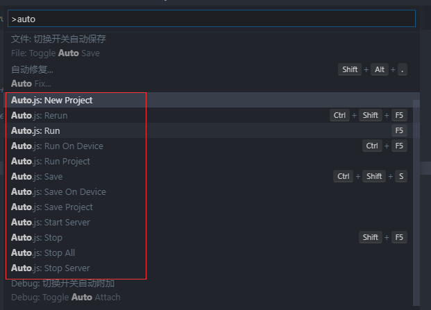

# 蚂蚁森林能量自动收取

我首先搜索的就是这个，然后就找到了auto.js。就研究autojs。

**在手机根目录下新建一个“脚本”文件夹，把下载的蚂蚁森林脚本解压到里面**

~~需要先放脚本到脚本目录下，再安装autojs。至少在我的华为手机上，这样才正常。~~

（其实下拉刷新一下就可以看到了。）

可以正常收取所有能量。

https://www.52pojie.cn/thread-1117218-1-1.html

这个脚本功能完备，可以作为学习autojs的材料。

代码在这里：

https://github.com/SuperMonster003/Ant-Forest/tree/Ant_Forest

但是代码是真的有点多。最外层的2个入口文件，就分别有7000行左右。

# auto.js

官网：

http://www.autojs.org

Auto.JS是Android平台上的JavaScript自动化工具。

它的本质是可执行自己编写的简易Javascript脚本的，尤其可以在开启“无障碍模式”的情况下对其他App进行一些操作的一个Android App，便于进行自动化操作。学习成本**非常低**。

Auto.JS已被黑产广泛使用，以至于作者关闭了官方下载通道。

一个支持无障碍服务的Android平台上的JavaScript IDE，其发展目标是JsBox和Workflow。

1） 对于黑产

微博：自动注册、远程获取内容、动发微博，点赞关注收藏、评价回复转发

注册类：163邮箱注册，抖音注册

签到类：百度地图签到、大众点评签到、叮咚买菜签到、拼多多签到、云闪付签到积分、支付宝签到积分、京东签到京豆等

2） 对于普通人

启动游戏时自动屏蔽通知、一键与特定联系人微信视频、淘宝双十一一键领猫币等

作者在github issue里的说明：

由于Auto.js已经被大面积用于灰产用途，为了避免造成超出控制的后果，因此下线全部Auto.js版本和release。
后续将尝试采取一些措施，尽量让Auto.js往良好的方向发展。

现在弄了付费版本，45元。

https://pro.autojs.org/

这里放了下载链接。最后一个免费版本：Auto.js 4.1.1 Alpha2 

https://www.dujin.org/13187.html

这里有一些demo。

https://github.com/snailuncle/autojsDemo

通过 Auto.js 封装模块及安卓 API 调用

实现蚂蚁森林的一系列自动化智能操作  

如自动点击/滑动/页面跳转等

Auto.js 使用 Rhino 作为代码解释器 
可直接运行 JavaScript 语言代码 
支持 ES5 与部分 ES6 特性  

Auto.js是利用安卓系统的“辅助功能”实现类似于按键精灵一样，可以通过代码模拟一系列界面动作的辅助工作。

与“按键精灵”不同的是，它的模拟动作并不是简单的使用在界面定坐标点来实现，**而是类似与win一般，找窗口句柄来实现的，这一点，挺优雅。**

手机安装auto.js后，需要打开无障碍模式（为了脚本能执行）和悬浮框（为了查看控件信息）

接下来需要写脚本了，你可以

- 在vscode上写脚本，写好后发给手机，在Auto.js应用中加载运行
- 在vscode上写脚本，电脑与手机在同一局域网，通过安装auto.js的[vscode插件](https://link.zhihu.com/?target=https%3A//github.com/hyb1996/Auto.js-VSCode-Extension)，实现在vscode上运行，手机就会相应执行脚本
- 在手机的Auto.js应用中直接码代码（不提倡）

## 教程

因为auto()函数如果无障碍服务未启动会停止脚本；而auto.waitFor()则会在在无障碍服务启动后继续运行。

https://zhuanlan.zhihu.com/p/90065914

## 替代

因为原作者不继续维护了。所以这个接替了。

但是这个人气不太高。作者的能力也不是很清楚。

https://github.com/kkevsekk1/AutoX

# 搭建开发环境

基于vscode来做。

在vs扩展插件中搜索“hyb1996”，就可以搜索到autojs的插件。

确保手机和电脑在同一个局域网中。
你可以将手机和电脑都连到同一个Wifi上，或者电脑开启热点给手机连接，或者手机开启热点给电脑连接。如果以上都无法做到，你还可以通过USB线连接手机

打开vscode的命令控制面板，输入auto，可以看到autojs的相关操作。例如，可以新建一个工程。

工程目录是这样：

默认就是显示一个toast，helloworld。

vscode里，autojs start server（上面vscode截图图片里有）

手机跟电脑连接到同一个局域网。

手机上autojs里，点击连接到电脑，输入电脑的ip地址。

可以正常连接。

然后电脑上，autojs run on device。就可以看到手机上弹出了toast内容。

本文档的章节大致上是以模块来分的，

总体上可以分成"自动操作"类模块(控件操作、触摸模拟、按键模拟等)和其他类模块(设备、应用、界面等)。

"自动操作"的部分又可以大致分为基于控件和基于坐标的操作。

基于坐标的操作是传统按键精灵、触摸精灵等脚本软件采用的方式，

通过屏幕坐标来点击、长按指定位置模拟操作，从而到达目的。

这种方式在游戏类脚本中比较有可行性，结合找图找色、坐标放缩功能也能达到较好的兼容性。

但是，这种方式对一般软件脚本却难以达到想要的效果，

而且这种方式需要安卓7.0版本以上或者root权限才能执行。

所以对于一般软件脚本(例如批量添加联系人、自动提取短信验证码等等)，

我们采用基于控件的模拟操作方式，结合通知事情、按键事情等达成更好的工作流。

建议在安卓7-9的系统下运行autojs脚本。
低版本系统的手机早已被淘汰，运行脚本会出现五花八门的问题。

autojs是基于安卓界面的XML节点进行操作的。
无法抓取节点的APP，只能用找图、找色的办法。
如果APP屏蔽了界面截图，这通常是平台做了强力的反脚本、反外挂的风控机制。这种问题暂时没有解决的办法。

安卓的无障碍服务不太稳定。这不仅是autojs的问题，还有安卓底层的问题。
有时候无障碍明明开了，却提示没打开。
遇到这种情况，只需要将无障碍的开关关闭，再打开。通常就解决了。

# 无障碍服务

## 应用场景

● 操作自动化，通过辅助功能服务来代替用户执行连续性的操作，重复性的操作，或者特殊场景的操作（例如自动抢红包，自动点赞，自动回复，自动搜索更优惠商品）

● 辅助操作，帮助无法和设备完全交互的用户（例如患有视力问题或正在忙而无法操作手机的用户）执行操作（例如talkback（视力低弱辅助），随选听读，语音操作）

无障碍服务是一种应用程序，给有残疾的用户或暂时无法与设备完全交互的用户提供了更好的无障碍用户交互功能。

比如驾驶、照顾小孩或者在吵闹的派对上可能需要额外或者替代的交互反馈。

## 原理

Q:为什么辅助功能可以监听用户的操作，界面变化，并根据需要进行反馈

A:辅助功能通过在后台中运行无障碍服务，通过AccessibilityEvent接收指定事件的回调，这样的事件表示用户在界面中的一些状态转换，例如：焦点改变了，一个按钮被点击，等等。

简单的说无障碍就是一个后台监控服务，当你监控的内容发生改变时，就会调用后台服务的回调方法

聊到 App 端的自动化，大家能想到的可能是 Appium、UIAutomator2、Airtest 等一系列自动化框架。

Android 系统内置了一个 **无障碍服务**，能完成一系列自动化操作；相比其他自动化框架，无障碍服务可以能完全脱离 PC 端，手机也不需要获取 Root 权限。另外，无障碍服务操作起来更加高效、更加智能。

要开启无障碍服务，只需要 5 个简单的步骤即可实现。

1. 使用 Android Studio 新建一个 Android 项目
2. 创建无障碍服务的配置文件
3. 创建一个无障碍服务的子类，并配置 AndroidManifest 文件
4. 重写服务的方法，针对页面变化、内容变化、通知变化，编写业务逻辑
5. 开启无障碍服务

什么是*TalkBack*. *TalkBack* 服务是Android专门为有视力*障碍*的用户所提供的语音提示功能。该服务启用后，手机将自动读出您所触摸、选择和激活的*具体*内容。

# 其他自动化方案

常用URLscheme整理+不同场景下打开URLscheme的方法（adb/安卓原生/按键精灵/auto.js/uniapp/easyclick）

https://blog.csdn.net/l17862868372/article/details/110427133

参考资料

1、Auto.JS简介与教程

https://www.jianshu.com/p/4602db0618df
2、

https://easydoc.xyz/doc/25791054/uw2FUUiw/F30Lmx8U

3、详解安卓辅助功能服务AccessibilityService（无障碍服务，微信抢红包助手原理）

https://blog.csdn.net/WHHGARSKY/article/details/106268526

4、自动化篇 - 黑客们使用的自动化方案，很多人还不知道

https://cloud.tencent.com/developer/article/1494808