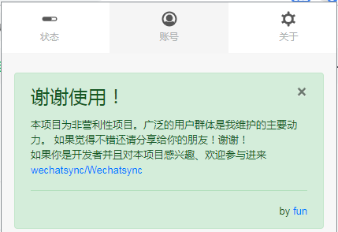
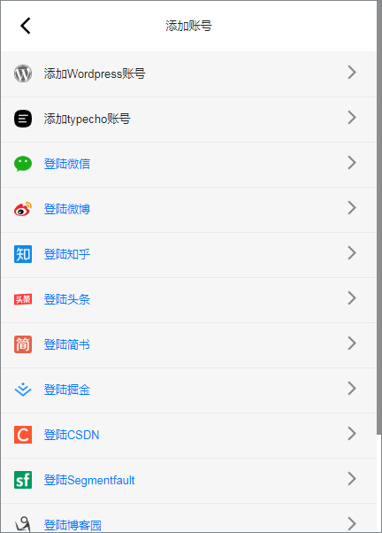
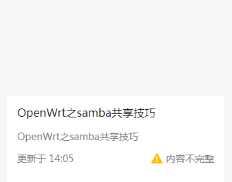
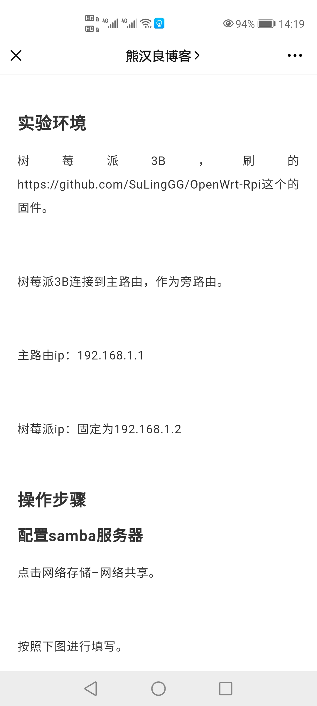
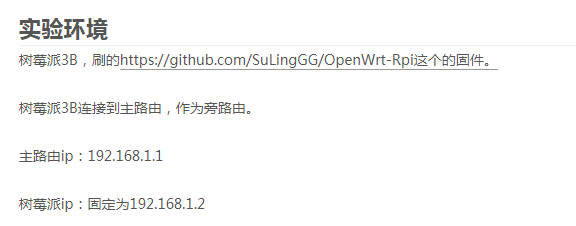
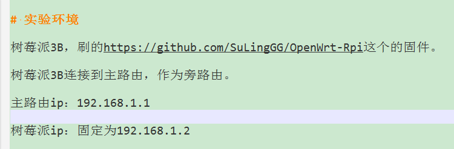

--

# 之前的折腾

现在打算搞一搞自媒体。

这个就作为折腾的记录吧。

主要发布平台：个人网站、今日头条、微信公众号。

编写工具：typora写markdown。

图床用gitee的仓库，picgo集成到typora直接上传。

第一个需要解决的问题就是，怎样一键发布到不同的平台？

微信同步助手

wechatsync，这个是个人开发者开源的一个实用chrome插件。

一键推送，直接输出内容到草稿箱，检查无误后即可发布。

作者的github

https://github.com/lljxx1

还有官网。

https://www.wechatsync.com

作者的个人简介

https://blog.dev4eos.com/about

操作用的浏览器，就用chrome。不用国内的浏览器。

chrome就专门当前创作工具来用。

这个插件也需要注册。

密码要是复杂的那种。

支持的网站有这些。

把自己想要同步的网站加进来。

把微信和头条加进来。

写一篇测试文章测试一下。

我就用hexo s，打开本地的网页，然后在网页右键，选择提取文章并同步。

头条同步失败了。

微信显示同步成功。

但是到微信公众号后台，发现是内容不完整。

很明显，没有封面。

所以，还是需要自己进行一些微调，才能真的可用。

不过已经很不错了。

自己加上图片和描述。

可用发布文章成功。

但是仔细看内容，有几处代码没有提取出来。

而且微信的排版太稀疏了。

行距特别大。非常影响阅读。

这个如何解决呢？

不过next主题渲染出来，行距就显得比较大。在手机上就更加明显了。

相当于多了一个换行符。

这个是什么原因导致的？

应该是typora里导致的。typora里本来就是多了一个换行符的。

用文本编辑器打开，可以看到是有多一个空行的。

这个跟windows换行符还没有关系。

如果要没有多一个空格，则需要使用shift+enter来换行。

多一个空行，在typora里看起来效果还可以接受。

换行在markdown里是比较让人困惑的。

typora官网是这样推荐换行符的最佳实践的：

1、使用typora的默认配置。

2、在typora的hybrid 视图下来写作。

3、使用enter键来开始新的段落。

4、如果你需要单个换行，使用` `

单个换行符，不同的markdown引擎的处理不一样。

CommonMark这引擎是不换行。

看看在今日头条的显示效果。

目前这种方式效果不好。

而我的风格，又是大量使用断句。空白太大的影响是不好的。

我决定改一下，订阅号，还是不发博客了。

还是重点放在交互上。

类似刷尽天下这个，可以发消息，有一些响应。

文章主要发今日头条，B站也可以。重点还要是自己的网站。

至少目前还是发不了今日头条的。

先研究一些markdown发布到今日头条的方法。

可以这样操作：

1、用typora写完内容。

2、用vscode打开预览。

3、把vscode预览里的内容拷贝粘贴到今日头条的写文章的文本框里。

目前基本是好的，就是代码框的，会多2个换行。手动删除掉。

这个工作量倒还可以接受。

那就这样，电脑端，主要还是靠我的网站，移动端，就靠今日头条。

发太多的平台，也没有太大的价值。

今日头条文章审核倒是挺快的。

接下来怎么做呢？

还是应该写一批高质量的文章。

先把网站优化一下。主题配置完了。后面不改了。

现在就差备案通过，把seo做一下。

# 制作科普动画的方式

制作科普动画的方式有很多种，其中使用 PowerPoint 是一个简单而有效的选择。以下是一些用普通的工作制作科普动画的方式：

1. **使用 PowerPoint**：
   - 利用 PowerPoint 的幻灯片和动画功能，可以制作简单而直观的科普动画。你可以创建不同的幻灯片来呈现不同的概念，然后利用动画效果使其动态展示。

2. **手绘动画**：
   - 如果你擅长手绘，可以利用纸张或绘图软件（如Procreate、Adobe Illustrator等）制作手绘动画。你可以一帧一帧地绘制，然后使用视频编辑软件将它们组合成动画。

3. **使用视频编辑软件**：
   - 你可以使用像Adobe After Effects、Premiere Pro这样的专业视频编辑软件，通过组合图像、文字、音频和动画效果来制作科普动画。这种方式通常能够制作出更加精细和复杂的动画效果。

4. **白板动画**：
   - 白板动画是一种简单而生动的动画形式，它通过在白板上绘制图像和文字来讲解概念。你可以使用软件如VideoScribe或手工制作来创建这种类型的动画。

5. **3D建模与动画**：
   - 如果你有3D建模和动画制作的技能，你可以使用软件如Blender或Maya来制作精美的科普动画。这种方式能够创建出非常逼真和生动的效果，但也需要更多的技术和时间投入。

6. **使用在线工具**：
   - 还有一些在线工具和平台（如Powtoon、Animaker等）提供了简单的界面和预设动画效果，可以帮助你制作科普动画，即使没有专业的技能也可以轻松上手。

不论选择哪种方式，都要根据目标观众的需求和你的技能水平来选择最合适的工具和方法。

# 用ai生成科普动画

使用 AI 生成科普动画是一个相对较新的领域，但已经有了一些工具和平台可以尝试。以下是一个简化的流程，描述了如何使用 AI 来生成科普动画：
1. **确定主题和内容**：首先，你需要确定动画的主题和要传达的科普信息。这可能涉及科学原理、历史事件、生物知识等。
2. **编写脚本**：根据主题和内容，编写一个详细的脚本，包括对话、旁白和视觉元素。
3. **设计角色和场景**：使用 AI 工具设计动画中的角色和场景。例如，可以使用生成对抗网络（GANs）来创建独特的角色外观。
4. **生成动画**：利用 AI 动画生成工具，如 Plotagon、Vyond、Artisto 等，根据脚本和设计来生成动画。这些工具通常允许用户上传自己的脚本和角色模型，然后自动生成动画。
5. **编辑和后期制作**：一旦动画生成，可能需要进行编辑，添加音效、音乐和特效，以及调整时间线和场景过渡。
6. **分享和发布**：最后，将完成的科普动画分享到视频平台、社交媒体或教育网站上。
目前，AI 在动画制作方面的应用还处于发展阶段，生成的动画可能需要人工干预来提高质量。但随着技术的进步，未来 AI 生成的动画将更加精细和自然。

# 参考资料

1、自媒体神器！文章一次编辑，多平台推送！

https://zhuanlan.zhihu.com/p/97788789

2、关于Typora的markdown编辑器行间距过大、不一致的问题

https://blog.csdn.net/tastyrekeke/article/details/102664860

3、Whitespace and Line Breaks

typora官网关于换行的说明

https://support.typora.io/Line-Break/