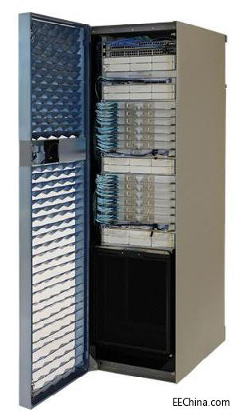

--

# Palladium Z1

Palladium Z1是业内第一个数据中心级硬件 仿真加速器，

仿真处理能力是上一代产品的5倍，

平均工作负载效率据称比最直接竞争对手高出2.5倍。

这样一台性能强劲的产品，其价格自然不菲。

当然，这里所说的“谁”指的是大型IC设计机构或大型 电子系统设计机构。

大家知道，随着 集成电路线宽的不断缩小，

IC开发成本呈指数级上升，

这让很多 半导体厂商不堪重负。

这也是近期半导体行业出现大量并购案的原因之一：只有巨无霸才能承担得起高昂的开发成本。

在 SoC开发成本中，验证（verification）和确认（validation）占据了很大的比例，

而这正是设计 自动化的用武之地。

有了Palladium Z1这样的仿真利器，

设计机构可以降低开发成本、保证产品质量并缩短开发时间。

反之，如果这项工作出现失误，事主将承担非常沉重的损失。

Lau先生说，业内熟知的一个案例是，高通公司的骁龙810处理器曾因发热过大而被三星公司弃用。

如果你不想发生这样的事故，仿真工作就要做足，而Palladium Z1这样得利的仿真工具则能帮上大忙。

据介绍，Palladium Z1的硬件仿真加速处理能力大幅领先竞争产品。

在建立（build）阶段，它比竞品快去3.5至14倍；

在分配（allocate）阶段比竞品高出2.5至5.2倍；

在运行（run）阶段比竞品快1.25倍；

在调试（debug）阶段比竞品高5至20倍。

除了性能上的大幅提升，Palladium Z1的外形也与上一代产品Palladium XP不同。

Palladium Z1采用了IT行业通行的服务器刀片式架构，体积缩小了92%，功耗密度降低了44%。

Palladium Z1可扩容，每个机架可支持4百万门到5.76亿万门的容量，最多可以扩展到16个机架、92亿门，最多可支持2304个用户。

而且，Palladium Z1的扩展性可在服务中进行（in-service scalability），运行中的项目不会受到任何影响。

最后，Cadence的Palladium硬件仿真加速平台基于该公司自己的处理器建造。

这是一种超标量（superscalar）处理器，其工作分配效率极高。

Palladium Z1的每个机架配有50万个这样的处理器。

目前，Palladium Z1包含两个系列：XL系列每个机架最多包含384百万门，GXL系列最多包含576百万门。Cadence还可以为用户提供机架托管服务。

和EDA以及FPGA相比，EMU是有些优势的。

EDA最灵活，但是速度最慢，毫秒的仿真时间都要按天记。

EMU次灵活，需要出版本，不需要特别的硬件支持。仿真时间一般分频比为几千，也就是几千秒等于一秒。时钟应该和asic时钟频率一致。

FPGA，最不灵活，需要做单板。由于FPGA时序限制，一般时钟都上不去，甚至需要裁剪以及和asic不同的逻辑。但是仿真时间＝现实时间，最有效率

用过PXP的人说一下。

PXP基本是为了IC而生的专用硬件。

但是由于PXP的支援的语言和环境和普通的不太一样。

因此用起来会有个移植的过程。这个会麻烦点。

但是运行速度和运行效率真的是比普通的服务器实在是高太多。

一个星期才能跑完的仿真在PXP基本上几个小时就能跑完。对于

那种视频测试IP能够节省非常多的时间。按照这个效率来看的话，

这个会是未来发展的趋势。

当然这个玩意儿最大的缺点还是太贵了！！！！动不动几千万。。

小公司压根买不起。

PXP基于CPU阵列，编译快，兼容多种仿真工具，擅长加速simulation。

zebu和veloce是基于FPGA阵列，zebu擅长系统级验证，可以跑操作系统，跑bencmark，速度快。

veloce用自家的FPGA板子，觉得稳定性不如Xilinx，不过其成熟性和用户友好性更好些。

三家价格都不便宜。。终于体验到硬件不是白菜价了。。。

“中小用户完全可以从自身实际出发，购买机架1/3或是1/2的功能，就能实现至少2亿门以上的验证规模。如果只是做AIOT方面的设计，普通的软件仿真就可以解决，并不需要Palladium Z2/Protium X2这样的工具。”

# 参考资料

1、Palladium and Protium Platforms, the Hardware Twins

https://community.cadence.com/cadence_blogs_8/b/breakfast-bytes/posts/palladium-and-protium

2、

https://community.cadence.com/cadence_blogs_8/b/breakfast-bytes/posts/palladium-z1

3、Cadence最新硬件仿真平台Palladium Z1出来了。你敢不用吗？

https://blog.csdn.net/yazhouren/article/details/80014459

4、Hardware Emulation Platform (硬件仿真平台) 在IC验证中的运用情况如何？

https://www.zhihu.com/question/47732296