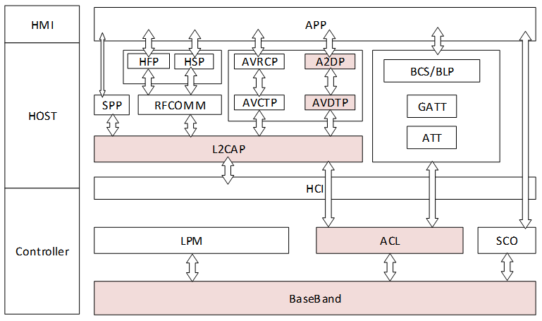
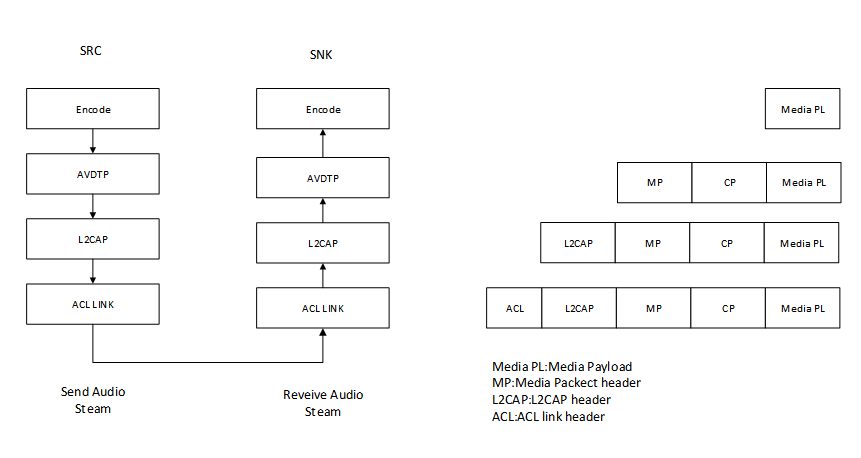
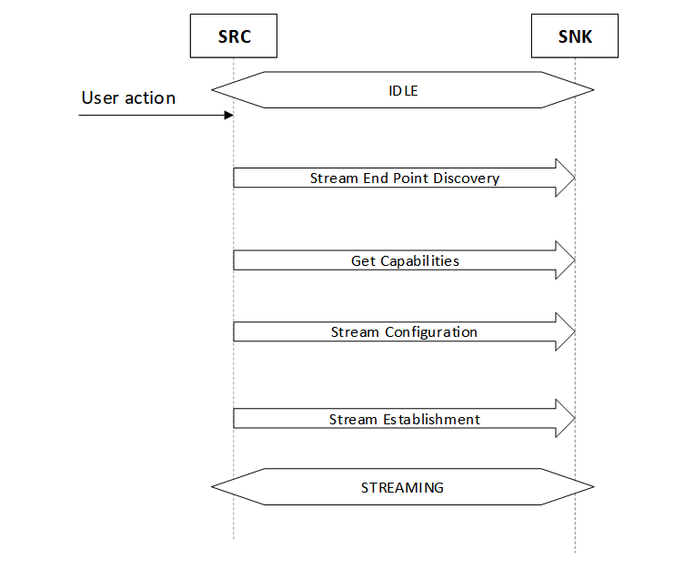
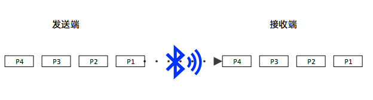
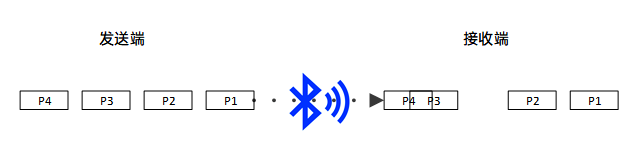

--

# A2DP和AVRCP是什么关系

A2DP（Advanced Audio Distribution Profile）和AVRCP（Audio/Video Remote Control Profile）是蓝牙协议中的两个不同的配置文件，它们在蓝牙音频传输中扮演着不同的角色，但它们通常是一起使用的，以提供完整的音频播放体验。

### 1. A2DP（Advanced Audio Distribution Profile）
- **功能**：用于高质量的音频流传输。
- **应用**：主要用于将音频从源设备（如智能手机、电脑）传输到接收设备（如蓝牙耳机、无线扬声器）。
- **音频格式**：支持多种音频编码格式，如SBC（Subband Coding）、AAC（Advanced Audio Codec）、aptX等。
- **传输方式**：A2DP定义了如何以高质量的立体声音频格式通过蓝牙进行传输，保证音质不变。

### 2. AVRCP（Audio/Video Remote Control Profile）
- **功能**：用于远程控制音频和视频设备的操作。
- **应用**：允许用户控制媒体播放、暂停、停止、音量调节等功能。
- **控制功能**：包括播放/暂停、前进/后退、音量控制、曲目选择等。
- **控制方式**：AVRCP定义了控制指令的发送和接收方式，使用户能够从控制设备（如手机、车载系统）控制播放设备（如蓝牙耳机、无线扬声器）。

### 关系
- **配合使用**：A2DP和AVRCP通常一起使用。例如，当你使用蓝牙耳机听音乐时，A2DP负责将音频流从手机传输到耳机，而AVRCP则允许你通过耳机上的按钮来控制音乐播放（如播放、暂停、跳过曲目）。
- **互补**：A2DP处理音频数据的传输，AVRCP则处理用户控制命令的传输，两者配合可以实现完整的音频播放和控制功能。

### 实际场景举例
- **音乐播放**：使用A2DP将手机上的音乐流传输到蓝牙耳机，同时使用AVRCP控制耳机上的播放、暂停、跳过曲目等功能。
- **车载系统**：通过A2DP将车载系统的音频流传输到车载音响，同时使用AVRCP控制车载音响的媒体播放功能。

这两个配置文件的协作提供了高质量的音频体验和便捷的操作控制。

# A2DP 和avdtp的关系

**A2DP**（Advanced Audio Distribution Profile）和**AVDTP**（Audio/Video Distribution Transport Protocol）是在蓝牙音频传输中密切相关的两个概念。它们之间的关系如下：

1. **A2DP**：
   - A2DP 是一种蓝牙配置文件（Profile），旨在使蓝牙设备可以高质量地传输音频流。它通常用于音频播放，如音乐播放器、手机、耳机等。
   - A2DP 定义了从音频源（如手机或音乐播放器）到音频接收者（如蓝牙耳机或扬声器）之间的音频流传输规范。

2. **AVDTP**：
   - AVDTP 是一个协议，位于蓝牙的应用层之上，用于在 A2DP 中传输音频数据流。它定义了音频数据流的传输方式和控制命令。
   - AVDTP 负责管理音频数据的传输过程，包括数据的封装、解封装、传输和控制。

3. **关系**：
   - A2DP 和 AVDTP 是紧密关联的，A2DP 使用 AVDTP 来传输音频数据流。
   - A2DP Profile 定义了如何在蓝牙设备之间传输高质量音频流的规范，而 AVDTP 则在 A2DP Profile 的基础上提供了音频流的传输和控制。
   - AVDTP 通过处理音频数据的传输和控制，使得 A2DP 能够实现音频源和音频接收者之间的高质量音频传输。

总之，A2DP 是一个蓝牙配置文件，定义了高质量音频流的传输规范，而 AVDTP 是在 A2DP 中使用的协议，负责管理音频数据的传输和控制。它们共同工作，使得在蓝牙设备之间实现高质量音频传输成为可能。

# A2DP协议分析

A2DP协议的音频数据在ACL Link上传输，这与SCO上传输的语音数据有本质区别。

==A2DP不包括远程控制的功能，==

==远程控制的功能则依赖AVRCP协议规范。==

A2DP是建立在AVDTP协议之上的高层协议，

AVDTP定义了蓝牙设备之间数据流句柄的参数协商，建立和传输过程以及相互交换的信令实体形式，该协议是A2DP框架的基础协议。

蓝牙A2DP数据包基于AVDTP协议进行传输，其层级关系如下数据包在每一层都有自己的包头。

进行数据传输之前发送端(SRC)与接收端(SNK)需进行一系列信令交互以确认双方传输数据的参数之后才能开始数据传输，其信令交互流程如下：

实际上影响延迟的主要因素是蓝牙传输的稳定性。

理想情况下发送蓝牙音频发送端等时间间距均匀的发送数据包，

接收端等时间间距均匀的接收数据，

这种情况下接收端可稍微延迟后将收到数据通过喇叭送出，

在喇叭播放完这包数据之前可收到下包数据继而能够连续不断的播放，

此时蓝牙音频的时延取决于发包间隔和传输时间。

然而现实情况总是不如人意，

蓝牙作为一种无线传输协议传输数据可能受到周边无线设备或强电磁设备比如电磁炉、微波炉等设备干扰导致数据出错重传，

实际上即使没有干扰由于蓝牙器件本身的性能、或是因为无线传输的特性都是有可能出现传输错误的。

传输错误重传导致其中某些包重传次数多传输时间变长，接收端收到的数据包并不是等时间均匀的。

这种情况下接收端想要流畅播放必须先缓存一定时间长度的数据之后再进行播放，

以防止其中包晚到导致播放不连续，

这种情况下真实主要因素是为了抵抗网络传输不稳定性而人为添加的延迟(缓存)，

而传输码率越高网络波动带来的影响会更大也就需要更长的延迟来防止卡顿。

https://kernel.0voice.com/forum.php?mod=viewthread&tid=3286

# 参考资料

https://metaso.cn/search/8485893416483274752?q=%20A2DP%20specification%20%E5%88%86%E6%9E%90

https://developer.aliyun.com/article/1171880

