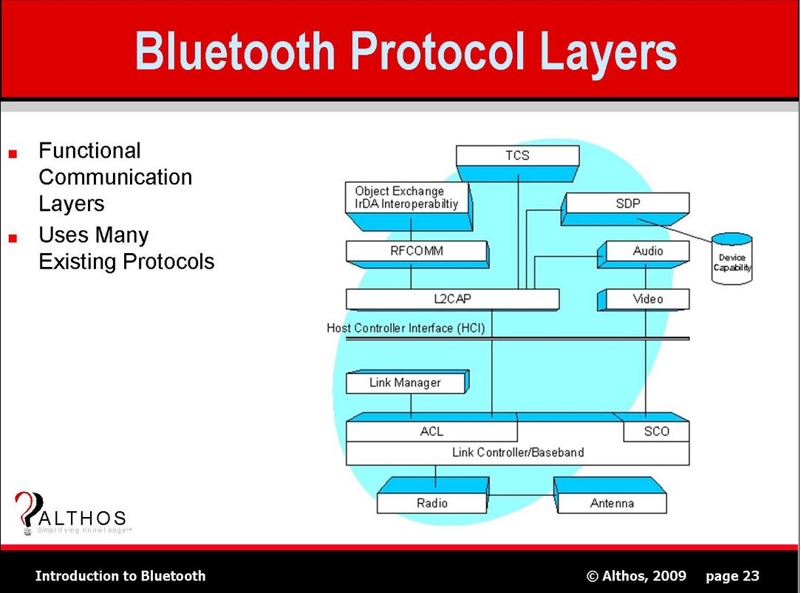

蓝牙基带技术支持两种连接方式：

ACL：Asynchronous Connection Link。异步连接链路。主要用于分组数据传输。

SCO：Synchronous Connection Oriented Link。同步连接链路。主要用于语音传输。

acl，就是异步链路。适用于数据量较大，对于通信时间要求又不高的情况。例如音乐播放的A2DP就是在异步链路之上的。

sco，就是同步链路，就是用于对通信时间要求非常高的情况。这个就是蓝牙打电话这种场景。

sco连接，也是对称连接。连接建立后，主设备和从设备可以不被选中就直接发送sco数据包。

sco数据包可以传递语音，也可以传递数据。只是传递数据的时候，只重传被损坏的那部分数据。

==acl，既可以支持对称连接，也可以支持不对称连接（也就是一对多）。==

主设备负责控制链路带宽，并决定当前蓝牙微微网里每个从设备可以占用的带宽和连接的对称性。

从设备只有被选中时才能传送数据。

蓝牙物理链路ACL(Asynchronous Connectionless), 

另外的一种链路是SCO(Synchronous Connection Oriented)主要用来传输对时间要求很高的数据通信。

​    蓝牙基带技术支持两种连接类型：

同步定向连接(SCO)类型和异步无连接(ACL)类型。

前者主要用于同步话音传送，后者主要用于分组数据传送。

​    SCO连接为对称连接，利用保留时隙传送数据包。连接建立后，主设备和从设备可以不被选中就发送SCO数据包。SCO数据包既可以传送话音，也可以传送数据，但在传送数据时，只用于重发被损坏的那部分的数据。
​    ACL链路就是定向发送数据包，它既支持对称连接，也支持不对称连接（既可以一对一，也可以一对多）。主设备负责控制链路带宽，并决定微微网中的每个从设备可以占用多少带宽和连接的对称性。从设备只有被选中时才能传送数据。ACL链路也支持接收主设备发给微微网中所有从设备的广播消息。

  在主单元和从单元之间，可以确定不同的类型链接关系。如下定义了两种链接类：

● 同步定向链接（SCO，Synchronous Connection Oritened）

● 异步无链接（ACL,Asynchronous Connection Less）

  (可以参照TCP/IP协议的 TCP 连接和UDP 连接，当然TCP/IP的连接方式不止这两种，还有SCTP； 蓝牙协议的理解还是要参照TCP/IP协议进行的)

上一篇博文介绍的是inquiry的整个过程中HCI层的command和event。

**在寻找到有效的远端蓝牙设备后，开始建立ACL连接，**这里仅仅反应HCI层的数据包，对于LM层和Baseband层的数据可能需要抓取FW的log进行查看。

对主设备而言，最多可同时存在7台从设备，则，最多可同时存在7条ACL链路；但是仅能保证有3条SCO链路连接。

但每一个主从设备连接，支持1个ACL连接和3个SCO连接。

不过要注意，在ACL方式下使用的轮询机制：由主设备控制链路带宽，负责从设备带宽的分配，从设备依轮询发送数据。

# ACL和SCO是蓝牙协议栈哪一层的概念？

ACL（Asynchronous Connection-Less）和SCO（Synchronous Connection-Oriented）是蓝牙协议栈中链路层（Link Layer）和物理层（PHY）的概念。这两个术语主要涉及到经典蓝牙（BR/EDR）中的数据传输方式和链路类型。下面是它们在蓝牙协议栈中的具体位置和作用：

### 1. **链路层（Link Layer）**

- **位置**：链路层位于蓝牙协议栈的底层，直接与物理层（PHY）交互，负责设备之间的数据传输和链路管理。
- **功能**：链路层处理数据包的组装、发送、接收、链路管理等功能，并定义了不同的链路类型。

### 2. **ACL（Asynchronous Connection-Less）**

- **定义**：ACL链路是一种异步的、无连接的链路，适用于不需要实时数据传输的应用。它是经典蓝牙中的主要数据传输方式之一。
- **特点**：
  - **异步**：数据传输是异步的，不保证数据包的传输时间。
  - **无连接**：在数据传输期间不需要建立持久的连接。
  - **用途**：用于传输大量数据，如文件传输、网络数据等。

### 3. **SCO（Synchronous Connection-Oriented）**

- **定义**：SCO链路是一种同步的、面向连接的链路，适用于实时数据传输，通常用于音频传输等需要低延迟的应用。
- **特点**：
  - **同步**：数据传输是同步的，保证了数据包的传输时间，并且可以提供固定的传输时隙。
  - **面向连接**：需要在数据传输期间建立和维护连接。
  - **用途**：主要用于语音传输和其他需要实时性的应用，如蓝牙耳机和免提设备。

### 总结

- **ACL** 和 **SCO** 都是蓝牙链路层（Link Layer）的概念。
- **ACL** 用于异步数据传输，适合传输非实时数据。
- **SCO** 用于同步数据传输，适合需要低延迟的实时应用。

它们的定义和使用方式在经典蓝牙（BR/EDR）中是非常重要的，并且直接影响到数据传输的类型和质量。在蓝牙低功耗（BLE）中，这些概念有所不同，BLE主要使用GATT和GAP来处理数据传输。

# acl和sco的区别

SCO用于实时窄带信号，不需要重传。

蓝牙免提套件中的语音数据就是一个例子。

这种窄带音频称为“蓝牙语音”类型。

其中 ACL 用于所有其他 BT 数据传输，包括高质量的音频/视频数据。

例如，通过 A2DP 播放音乐。

==这是高带宽数据，因此被称为“高级音频”。==

SCO 是固定带宽通道，每个设备最多可以有 3 个通道，但 ACL 的吞吐量随当时其他活动连接（SCO 和 ACL）的变化而变化。

ACL：专门用于传输数据。基于 ARQ 的重传。可用类型 DMx（中等速率）、DHx（高数据速率）。其中 x=1,3,5

SCO：主要用于语音通信（或数据和语音相结合）。没有重传。HV1，HV2，HV3 是可能的不同类型的语音数据包。每个都有不同的编码方案。

https://stackoverflow.com/questions/40033827/what-is-the-difference-between-acl-and-sco-link-in-bluetooth

# 参考资料

1、蓝牙技术中ACL和SCO 指的是?

https://www.plantronics.com/us/en/support/knowledge-base/kb-article-page?type=Product_Information__kav&lang=zh_CN&urlName=RN16991&t=all

2、蓝牙物理链路类型：SCO和ACL链路与A2DP

https://blog.csdn.net/android_lover2014/article/details/88421594

3、android 蓝牙ACL通讯详解

https://blog.csdn.net/jonch_hzc/article/details/80570826

4、蓝牙ACL链路和SCO链路的最大个数

https://blog.csdn.net/software_wyq/article/details/103456464

5、

https://blog.csdn.net/u010698858/article/details/43566451