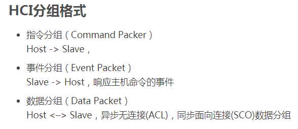
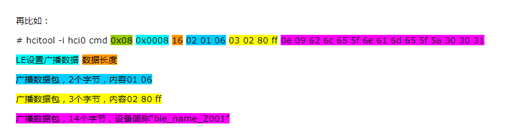
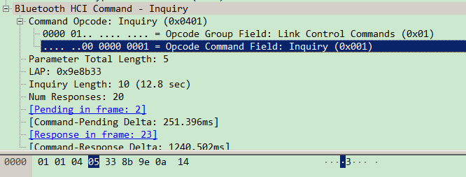
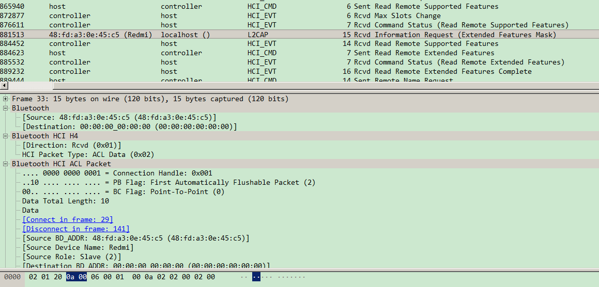
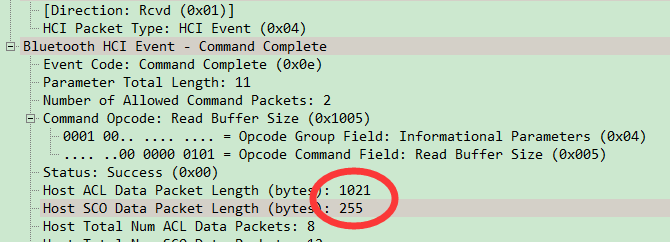
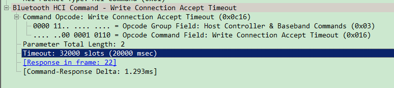
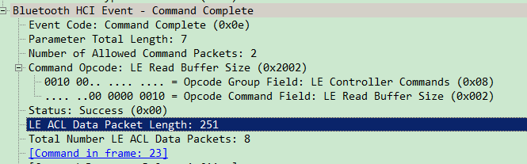
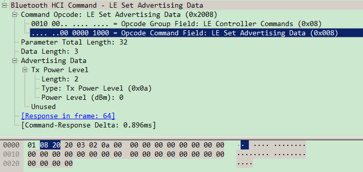
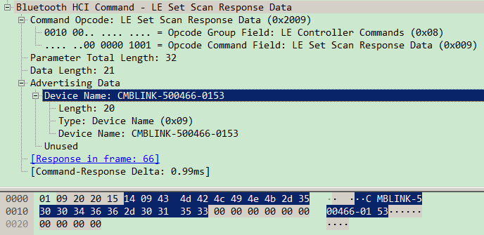
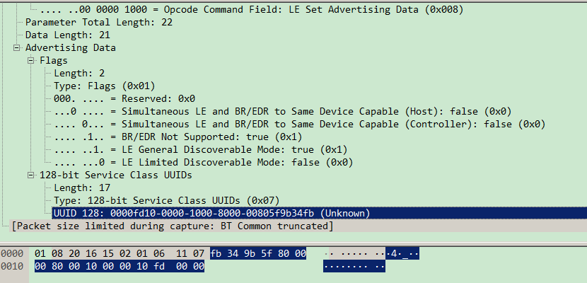

蓝牙比较头疼的一点就是，上来就是一堆的缩写，把人都整懵了。

一个个缩写来啃。

还是按照协议栈从底层到上层的顺序来。


HCI是蓝牙协议栈最底层的一个协议。

根据蓝牙4.0的规范里写的，HCI的传输层主要有四种：

1、usb。优点是通用，缺点是复杂。

2、uart。跟RS232的串口类似。但是避开了232的缺点，速度可以达到跟usb接近的水平。更加简单。

3、三线串口。

4、sd接口。


命令是从协议栈到底层。

事件是底层到协议栈。

数据是双向的。


hci数据包分为4种：

1、命令。

2、ACL数据。

3、SCO数据。

4、event。



同步链路(SCO)类型和异步链路(ACL)类型。前者主要用于同步话音传送，后者主要用于分组数据传送。

bluez/lib/hci.h里：

```
/* HCI Packet types */
#define HCI_COMMAND_PKT		0x01
#define HCI_ACLDATA_PKT		0x02
#define HCI_SCODATA_PKT		0x03
#define HCI_EVENT_PKT		0x04
#define HCI_VENDOR_PKT		0xff
```


handle是什么？唯一标志一个连接。相当于一个socket的fd。

```
/**
 * @brief hci connection handle type
 */
typedef uint16_t hci_con_handle_t;
```


hci 链路层 inquiry命令

发送时是这样：

```
hci_send_cmd(&hci_inquiry, GAP_IAC_GENERAL_INQUIRY, duration, 0);
```

hci_inquiry定义：

```
OPCODE(OGF_LINK_CONTROL, 0x01), "311"
```

311表示后面的数据组成是：3字节+1字节+1字节。

3字节部分是固定的3个字节。1字节是duration。1字节是设备数。


2个设备之间，最多只有一个acl连接，但是可以有多个sco连接。


# 命令

命令包的结构是：

```
前面2个字节是：opcode
	分为2个部分：高6bit：ogf。低10位，表示ocf。g表示group。c表示command。
1个字节的参数长度。
后面是N个参数。
```


命令可以分为这些类：（序号就是ogf的值）

1、link control。

2、link policy。

3、HCI control 和baseband 命令。

4、信息参数指令。

5、状态指令参数。

6、测试指令。

8、ble控制器命令。


例如ble广播命令是这样：

```
hcitool -i hci0 cmd 0x08 0x000a 01
```

0x08，是ogf。表示是ble控制器命令。

0x000a，是ocf。表示控制ble广播。

01，表示使能。如果是关闭，那么就是00


hci cmd和hci event是请求响应模型的。




# ACL数据

ACL数据包的结构是这样：

```
前面2个字节是handle。
	准确说，高12bit是handle。
	2个bit的package boundary flag。
	2个bit的broadcast flag。
然后是2个自己字节的包长度。
```

# sco数据包

包的结构是这样：

```
前面2个字节的handle
	准确说是12bit的handle。
	然后2个bit的packet status flag
	2个bit的保留。
1个字节的数据长度。
后面就是数据。
```


# event包

包的结构是这样：

```
1个字节的事件码。
1个字节的数据长度。
后面就是数据。
```


hci cmd的payload长度是32字节，或者64字节。

hci event的header的长度是2字节。event payload长度是255字节。

hci acl的payload长度是1695字节。

hci 的in buffer长度，就用1695这个。因为这个是可能的最长的包。

hci 的out buffer也是。


# 驱动

蓝牙协议栈与蓝牙底层设备一般是通过串口连接，两者之间通过HCI协议通讯。

这就要求实现一个串口tty驱动。

而对于Bluez协议栈来说，它是通过建立蓝牙的socket来发送、接收数据。

因此，在蓝牙通信中，对上层应用是socket通信，对底层则一般是通过一个tty驱动实现。

本文以HCIUART_LL为例，讨论了蓝牙底层的tty驱动部分，代码在drivers\bluetooth\hci_ll.c和hci_ldis.c。

**Hci_ldis.c实现一个蓝牙专用的线路规程**，disc id为N_HCI，结构体如下：


# sdptool browse抓包

下面是内容是通过sdptool browse命令配合hcidump -t -X -w 1.txt命令来进行抓包分析。

这个操作相当于手机打开蓝牙，点击刷新的操作。可以扫描出周围有哪些蓝牙设备。

hci的OGF为0x01的比较常见，这个表示hci cmd。

OCF为0x01的时候，表示inquiry。

```
const hci_cmd_t hci_inquiry = {
OPCODE(OGF_LINK_CONTROL, 0x01), "311"
};
```




hci inquiry代表了什么行为？

inquiry是从协议栈下发的一个HCI命令。

格式如下：

```
ogf | ocf | param(lap, inquiry len, num_response)| return params
```

inquiry len这个是表示inquiry持续的时间。

值的范围是0x01到0x30。单位是1.28秒。所以表示的时间范围是1.28秒到61.44秒。

host向controller下发了这个cmd之后，controller回复的event是什么呢？


hci的cmd有多少种？hci event又有多少种？

在bluez/tools/parser/hci.c里，有这样的一个数组：

那么就是说明有77种hci event。这个还可以从btstack/bluetooth.h头文件里的HCI_EVENT_INQUIRY_COMPLETE这些宏可以看出。

```
#define EVENT_NUM 77
static char *event_str[EVENT_NUM + 1] = {
	"Unknown",
	"Inquiry Complete",
	"Inquiry Result",
	"Connect Complete",
	"Connect Request",
	"Disconn Complete",
	"Auth Complete",
	"Remote Name Req Complete",
	"Encrypt Change",
	"Change Connection Link Key Complete",
	"Master Link Key Complete",
	"Read Remote Supported Features",
	"Read Remote Ver Info Complete",
	"QoS Setup Complete",
	"Command Complete",
	"Command Status",
	"Hardware Error",
	"Flush Occurred",
	"Role Change",
	"Number of Completed Packets",
	"Mode Change",
	"Return Link Keys",
	"PIN Code Request",
	"Link Key Request",
	"Link Key Notification",
	"Loopback Command",
	"Data Buffer Overflow",
	"Max Slots Change",
	"Read Clock Offset Complete",
	"Connection Packet Type Changed",
	"QoS Violation",
	"Page Scan Mode Change",
	"Page Scan Repetition Mode Change",
	"Flow Specification Complete",
	"Inquiry Result with RSSI",
	"Read Remote Extended Features",
	"Unknown",
	"Unknown",
	"Unknown",
	"Unknown",
	"Unknown",
	"Unknown",
	"Unknown",
	"Unknown",
	"Synchronous Connect Complete",
	"Synchronous Connect Changed",
	"Sniff Subrate",
	"Extended Inquiry Result",
	"Encryption Key Refresh Complete",
	"IO Capability Request",
	"IO Capability Response",
	"User Confirmation Request",
	"User Passkey Request",
	"Remote OOB Data Request",
	"Simple Pairing Complete",
	"Unknown",
	"Link Supervision Timeout Change",
	"Enhanced Flush Complete",
	"Unknown",
	"User Passkey Notification",
	"Keypress Notification",
	"Remote Host Supported Features Notification",
	"LE Meta Event",
	"Unknown",
	"Physical Link Complete",
	"Channel Selected",
	"Disconnection Physical Link Complete",
	"Physical Link Loss Early Warning",
	"Physical Link Recovery",
	"Logical Link Complete",
	"Disconnection Logical Link Complete",
	"Flow Spec Modify Complete",
	"Number Of Completed Data Blocks",
	"AMP Start Test",
	"AMP Test End",
	"AMP Receiver Report",
	"Short Range Mode Change Complete",
	"AMP Status Change",
};
```

而hci cmd的种类，可以在btstack/hci_cmd.h里看出。

```
// HCI Commands - see hci_cmd.c for info on parameters
extern const hci_cmd_t hci_accept_connection_request;
extern const hci_cmd_t hci_accept_synchronous_connection;
extern const hci_cmd_t hci_authentication_requested;
extern const hci_cmd_t hci_change_connection_link_key;
extern const hci_cmd_t hci_change_connection_packet_type;
//后面省略了。
```

可以看到扫描过程中，这里有发送ACL数据。src是一个手机。dest是本机。




sdp browse local。这样是不会进入协议栈，所以这样抓不到数据包的。

然后看看本机进入蓝牙配网模式时的包。

会读取本机蓝牙地址。

会读取本机的buffer size。



读取本机的class。

读取本机的name。

读取本机voice设置。

写入连接accept超时时间为20秒。



读取ble的read buffer size。是251个字节。



写入simple pair mode。

然后一些其他的操作，不关注。

然后写入ble 广播数据。




然后是设置扫描答复数据。



配网的service 的uuid设置。




# 参考资料

1、HCI层数据包格式

https://blog.csdn.net/u010657219/article/details/42191039

2、HCI数据包格式分类

https://blog.csdn.net/zmk0810612124/article/details/82590371

3、

https://www.cnblogs.com/rockyching2009/p/10610288.html

4、蓝牙底层HCI驱动的实现

https://blog.csdn.net/sunjing_/article/details/53007005

5、蓝牙inquiry流程之HCI_Inquiry_Result_With_RSSI和HCI Extended Inquiry Result处理

https://www.cnblogs.com/libs-liu/p/9243500.html

6、

https://blog.csdn.net/yuanzhangmei1/article/details/25074059