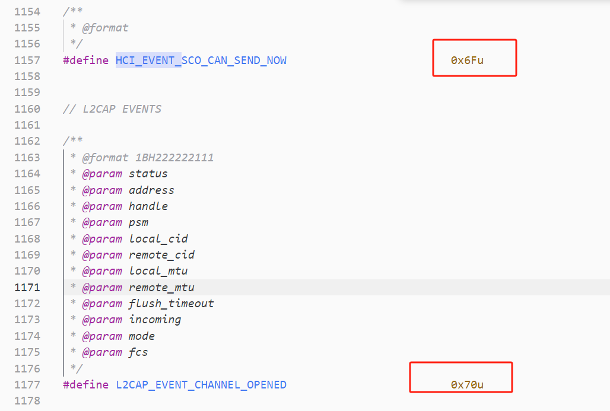

--

蓝牙比较头疼的一点就是，上来就是一堆的缩写，把人都整懵了。

一个个缩写来啃。

还是按照协议栈从底层到上层的顺序来。


HCI是蓝牙协议栈最底层的一个协议。

根据蓝牙4.0的规范里写的，HCI的传输层主要有四种：

1、usb。优点是通用，缺点是复杂。

2、uart。跟RS232的串口类似。但是避开了232的缺点，速度可以达到跟usb接近的水平。更加简单。

3、三线串口。

4、sd接口。


命令是从协议栈到底层。

事件是底层到协议栈。

数据是双向的。


hci数据包分为4种：

1、hci 命令。

2、ACL数据。

3、SCO数据。

4、hci event。

5、iso数据。（leaudio新增的）


同步链路(SCO)类型和异步链路(ACL)类型。前者主要用于同步话音传送，后者主要用于分组数据传送。

bluez/lib/hci.h里：

```
/* HCI Packet types */
#define HCI_COMMAND_PKT		0x01
#define HCI_ACLDATA_PKT		0x02
#define HCI_SCODATA_PKT		0x03
#define HCI_EVENT_PKT		0x04
#define HCI_VENDOR_PKT		0xff
```

# 蓝牙hci数据的hci command header是几个字节，分析举例

蓝牙 HCI（Host Controller Interface）数据包中的 HCI Command Header 通常是 3 个字节，用于包含发送到蓝牙芯片的命令的相关信息。下面是一个 HCI Command Header 的示例及其分析：

假设一个 HCI 命令的数据包如下（16进制表示）：

```
01 0A FC
```

分析如下：

1. **Byte 1 (0x01)：**
   - 该字节表示 HCI Command Packet 的类型，0x01 表示这是一个 Command Packet。

2. **Byte 2 (0x0A)：**
   - 该字节是 Opcode Group Field，指示了命令所属的命令组。
   - 0x0A 可能对应于某个特定的命令组，比如 Link Control Commands 或者 Vendor-Specific Commands。

3. **Byte 3 (0xFC)：**
   - 该字节是命令的 Opcode，指定了具体的命令。
   - 0xFC 对应于某个特定的命令，不同的 Opcode 对应不同的命令和操作。

根据以上分析，这个数据包的含义可能是：这是一个 HCI Command Packet，属于某个特定的命令组，Opcode 对应于某个具体的命令。

请注意，实际的 HCI Command Packet 的内容会根据具体的命令和操作而有所不同，上述示例仅用于说明 HCI Command Header 的基本结构和分析方式。要准确理解和解析 HCI 数据包，需要参考蓝牙标准文档中有关命令的定义和格式。

# hci acl header是几个字节，分析举例

HCI ACL（Asynchronous Connectionless Link）数据包的头部通常是 4 个字节，用于携带数据包的一些控制信息。下面是一个 HCI ACL 数据包头部的示例及其分析：

假设一个 HCI ACL 数据包的头部如下（16进制表示）：

```
02 0A 00 10
```

分析如下：

1. **Byte 1 (0x02)：**
   - 该字节表示 ACL 数据包的类型，0x02 表示这是一个 ACL 数据包。

2. **Byte 2-3 (0x0A 00)：**
   - 这两个字节组成了 ACL 数据包的 Length 字段，指示了 ACL 数据包的有效载荷部分的长度。
   - 在这个示例中，Length 为 0x000A，表示 ACL 数据包有效载荷的长度为 10 个字节。

3. **Byte 4 (0x10)：**
   - 这个字节包含了连接句柄（Connection Handle），用于标识 ACL 数据包关联的连接。
   - Connection Handle 可以用于在多个连接间区分数据包，确保数据包被正确地路由到目标设备。

根据以上分析，这个数据包头部的含义可能是：这是一个 ACL 数据包，有效载荷长度为 10 个字节，并与某个特定的连接关联。

请注意，实际的 ACL 数据包头部内容可能会因具体的情况而有所不同，在解析 ACL 数据包时，需要根据蓝牙标准和具体的协议规范来理解头部中的字段含义。

# hci sco header是几个字节，分析举例

HCI SCO（Synchronous Connection-Oriented）数据包的头部通常是 3 个字节，用于携带 SCO 音频数据的一些控制信息。下面是一个 HCI SCO 数据包头部的示例及其分析：

假设一个 HCI SCO 数据包的头部如下（16进制表示）：

```
03 00 10
```

分析如下：

1. **Byte 1 (0x03)：**
   - 该字节表示 SCO 数据包的类型，0x03 表示这是一个 SCO 数据包。

2. **Byte 2-3 (0x00 10)：**
   - 这两个字节组成了 SCO 数据包的 Length 字段，指示了 SCO 数据包的有效载荷部分的长度。
   - 在这个示例中，Length 为 0x0010，表示 SCO 数据包有效载荷的长度为 16 个字节。

根据以上分析，这个数据包头部的含义可能是：这是一个 SCO 数据包，有效载荷长度为 16 个字节。

请注意，实际的 SCO 数据包头部内容可能会因具体的情况而有所不同。在解析 SCO 数据包时，需要根据蓝牙标准和具体的协议规范来理解头部中的字段含义。


# hci sco header是几个字节，分析举例

HCI（Host Controller Interface）事件数据包的头部通常是 2 个字节，用于标识事件类型和事件参数。下面是一个 HCI 事件数据包头部的示例及其分析：

假设一个 HCI 事件数据包的头部如下（16进制表示）：

```
04 0E
```

分析如下：

1. **Byte 1 (0x04)：**
   - 该字节表示 HCI 事件数据包的类型，0x04 表示这是一个事件数据包。

2. **Byte 2 (0x0E)：**
   - 这个字节是事件代码（Event Code），指示了具体的事件类型。
   - 0x0E 对应于某个特定的事件代码，代表某种特定的事件。

根据以上分析，这个数据包头部的含义可能是：这是一个 HCI 事件数据包，其中包含了一个特定的事件，对应的事件代码为 0x0E。

请注意，实 actual HCI 事件数据包头部内容可能会因具体的事件类型而有所不同。在解析 HCI 事件数据包时，需要根据蓝牙标准和具体的协议规范来理解头部中的字段含义。


# handle

handle是什么？唯一标志一个连接。相当于一个socket的fd。

```
/**
 * @brief hci connection handle type
 */
typedef uint16_t hci_con_handle_t;
```

# hci inquiry分析

hci 链路层 inquiry命令

发送时是这样：

```
hci_send_cmd(&hci_inquiry, GAP_IAC_GENERAL_INQUIRY, duration, 0);
```

hci_inquiry定义：

```
OPCODE(OGF_LINK_CONTROL, 0x01), "311"
```

311表示后面的数据组成是：3字节+1字节+1字节。

3字节部分是固定的3个字节。1字节是duration。1字节是设备数。


==2个设备之间，最多只有一个acl连接，但是可以有多个sco连接。==


# hci command分析

命令包的结构是：

```
前面2个字节是：opcode
	分为2个部分：高6bit：ogf。低10位，表示ocf。g表示group。c表示command。
1个字节的参数长度。
后面是N个参数。
```

## OGF/OCF

在蓝牙的 HCI（Host Controller Interface）命令中，OCF（Opcode Command Field）和 OGF（Opcode Group Field）用于识别和分类不同类型的命令。它们组合在一起构成了命令的完整操作码（Opcode）。

- **OCF（Opcode Command Field）：** OCF 表示具体的命令操作码，用于指定要执行的具体命令。在命令中，OCF 字段用于表示该命令的具体功能或操作。

- **OGF（Opcode Group Field）：** OGF 表示命令的分组，用于将命令按照功能分类和管理。不同的 OGF 对应于不同的命令组，每个命令组包含一组相关的命令。

通过组合 OCF 和 OGF，可以唯一地识别和区分每个 HCI 命令。在 HCI 命令中，操作码通常由 OGF 和 OCF 两个字段组成，如下所示：

```
+----------+-------+-----------------------------+
| OGF (6b) | OCF (10b) |         Command         |
+----------+-------+-----------------------------+
|  Group   |  Code |                             |
+----------+-------+-----------------------------+
```

其中，OGF 占据命令操作码的高 6 位，而 OCF 占据低 10 位。

举例来说，对于 Inquiry 命令（查询命令），其 OGF 可能是 0x01（基础控制命令组），而其 OCF 可能是 0x01（Inquiry 命令）。因此，将 OGF 设置为 0x01，OCF 设置为 0x01 就组成了 Inquiry 命令的操作码。

对于每个 OGF，有一组相关的 OCF，每个 OCF 对应一种特定的功能或操作。这种组织方式使得 HCI 命令的管理和扩展变得更加方便和可靠。


命令可以分为这些类：（序号就是ogf的值）

1、link control。

2、link policy。

3、HCI control 和baseband 命令。

4、信息参数指令。

5、状态指令参数。

6、测试指令。

8、ble控制器命令。

对应的代码宏定义是：

```c
#define OGF_LINK_CONTROL          0x01
#define OGF_LINK_POLICY           0x02
#define OGF_CONTROLLER_BASEBAND   0x03
#define OGF_INFORMATIONAL_PARAMETERS 0x04
#define OGF_STATUS_PARAMETERS     0x05
#define OGF_TESTING               0x06
#define OGF_LE_CONTROLLER 0x08
```


例如ble广播命令是这样：

```
hcitool -i hci0 cmd 0x08 0x000a 01
```

0x08，是ogf。表示是ble控制器命令。

0x000a，是ocf。表示控制ble广播。

01，表示使能。如果是关闭，那么就是00


hci cmd和hci event是请求响应模型的。


# 最大的HCI连接个数

蓝牙规范中定义了蓝牙主机（Host）可以同时维持的最大HCI（Host Controller Interface）连接数。这个数目通常取决于蓝牙主机的硬件和软件能力，以及蓝牙规范的版本。

在实践中，最大的HCI连接数取决于以下几个因素：

1. **蓝牙规范版本：** 较新的蓝牙规范版本通常会支持更多的HCI连接。例如，蓝牙4.0版本通常支持较少的连接数，而蓝牙5.0版本及以上通常支持更多的连接数。

2. **蓝牙主机硬件能力：** 蓝牙主机的硬件性能（如处理器、内存）会影响其能够同时维持的连接数。较强大的硬件通常能够支持更多的连接。

3. **蓝牙主机软件实现：** 蓝牙协议栈的软件实现也会影响最大的HCI连接数。优化的软件实现可以提高连接管理的效率，从而支持更多的连接。

总的来说，虽然蓝牙规范没有明确规定最大的HCI连接数，但通常在实践中，蓝牙主机可以支持数十个甚至更多的HCI连接，具体取决于上述因素的综合影响。

# ACL

## ACL是什么

HCI（Host Controller Interface）是蓝牙系统中主机和控制器之间的标准接口。

ACL（Asynchronous Connectionless Link）是HCI中的一个重要概念，代表异步无连接链路。

**ACL的含义**

- **描述：** ACL是一种蓝牙连接方式，允许设备在==无需建立连接的情况下进行数据传输。==
- **作用：** ACL链路用于在蓝牙设备之间传输数据，例如音频、视频、文件等。
- **特点：** ==ACL链路是异步的，允许设备在连接期间进行其他操作，如扫描其他设备或建立新连接。==

**ACL链路的重要性**

- **数据传输：** ACL链路用于在蓝牙设备之间进行数据传输，可以是双向的，也可以是单向的。
- **低功耗：** ACL链路能够有效管理电源，以确保设备在数据传输期间的低功耗。

**ACL链路的使用**
- **建立连接：** 设备之间在建立连接时，可以选择使用ACL链路来传输数据。
- **数据传输：** 一旦连接建立，设备可以使用ACL链路来传输各种类型的数据，如音频、视频、文件等。

**总结**
ACL（Asynchronous Connectionless Link）是HCI中用于异步无连接数据传输的概念。它允许设备在无需建立连接的情况下进行数据传输，是蓝牙系统中重要的数据传输机制之一。

## 有哪些profile是使用的ACL

ACL（Asynchronous Connectionless Link）通常用于传输数据，而不依赖于特定的profile。然而，许多蓝牙profile都可以使用ACL链路来传输数据。以下是一些常见的profile，它们通常使用ACL链路进行数据传输：

1. **A2DP（Advanced Audio Distribution Profile）：** A2DP用于高质量音频流的传输，如音乐或其他音频数据。通过ACL链路，音频数据可以从源设备（如手机）传输到目标设备（如蓝牙耳机或音响系统）。

2. **AVRCP（Audio/Video Remote Control Profile）：** AVRCP用于控制远程音频/视频设备，如播放、暂停、调整音量等。虽然它本身不传输音频数据，但它通常与A2DP一起使用，利用ACL链路传输控制命令。

3. **HFP（Hands-Free Profile）：** HFP用于蓝牙耳机或汽车系统等设备与手机之间进行电话通信。音频数据（如通话声音）可以通过ACL链路传输。

4. **PBAP（Phone Book Access Profile）：** PBAP允许设备访问手机中存储的电话簿联系人信息。虽然PBAP本身不传输音频数据，但在某些情况下，例如更新电话簿数据时，可能会使用ACL链路。

5. **MAP（Message Access Profile）：** MAP允许设备访问手机中的消息，如短信和邮件。消息数据通常通过ACL链路传输。

这些profile只是蓝牙协议栈中的一小部分，它们利用ACL链路来传输各种类型的数据。ACL链路的优点在于它可以实现高速的数据传输，适用于许多不同类型的应用场景。


## ACL怎么解决丢包问题

ACL（Asynchronous Connectionless Link）是一种蓝牙传输数据的方式，它在数据传输过程中可能会遇到丢包问题。丢包问题可能由于多种原因引起，例如信号干扰、距离远近、设备负载等。以下是一些解决ACL丢包问题的方法：

1. **重传机制：** 在传输数据时，可以实现一个简单的重传机制。当接收方检测到数据包丢失时，它可以向发送方发送一个请求，要求重新发送该数据包。发送方收到请求后，重新发送数据包，从而解决了丢包问题。

2. **流控制：** 通过流控制机制，接收方可以通知发送方自己的接收能力，以避免数据发送速度过快而导致的丢包问题。例如，接收方可以向发送方发送一个窗口大小，表示它当前可以接收的数据量，发送方根据接收方的窗口大小来调整数据发送速度。

3. **自动重传请求（ARQ）：** 自动重传请求是一种基于错误检测和纠正的机制，用于在数据传输过程中检测和纠正错误。当接收方检测到数据包错误时，它可以向发送方发送一个重传请求，请求发送方重新发送数据包。

4. **增加重传次数：** 在一些情况下，增加重传次数可能有助于解决丢包问题。通过增加重传次数，可以提高数据包的可靠性，降低丢包的可能性。

5. **信号增强：** 通过优化设备位置、增加天线功率等方式，可以增强信号强度，减少丢包的发生率。

这些方法可以单独或结合使用，根据具体情况选择合适的方法来解决ACL丢包问题。在设计蓝牙系统时，考虑到丢包问题并采取相应的措施是非常重要的，以确保数据传输的可靠性和稳定性。

# ACL数据

ACL数据包的结构是这样：

```
前面2个字节是handle。
	准确说，高12bit是handle。
	2个bit的package boundary flag。
	2个bit的broadcast flag。
然后是2个自己字节的包长度。
```

# sco数据包

包的结构是这样：

```
前面2个字节的handle
	准确说是12bit的handle。
	然后2个bit的packet status flag
	2个bit的保留。
1个字节的数据长度。
后面就是数据。
```


# event包

包的结构是这样：

```
1个字节的事件码。
1个字节的数据长度。
后面就是数据。
```


hci cmd的payload长度是32字节，或者64字节。

hci event的header的长度是2字节。event payload长度是255字节。

hci acl的payload长度是1695字节。

hci 的in buffer长度，就用1695这个。因为这个是可能的最长的包。

hci 的out buffer也是。

# hci event有多少种

在蓝牙协议栈中，**HCI（Host Controller Interface）**事件是主机与控制器之间进行通信的主要方式之一。这些事件包括控制器向主机报告的各种状态和信息。以下是常见的HCI事件类型：

| **事件代码** | **事件名称**                                      | **描述**                                         |
| ------------ | ------------------------------------------------- | ------------------------------------------------ |
| 0x01         | Inquiry Complete Event                            | 设备查询完成。                                   |
| 0x02         | Inquiry Result Event                              | 返回设备查询结果。                               |
| 0x03         | Connection Complete Event                         | 连接建立完成。                                   |
| 0x04         | Connection Request Event                          | 收到连接请求。                                   |
| 0x05         | Disconnection Complete Event                      | 连接断开完成。                                   |
| 0x06         | Authentication Complete Event                     | 认证过程完成。                                   |
| 0x07         | Remote Name Request Complete Event                | 远程设备名称请求完成。                           |
| 0x08         | Encryption Change Event                           | 加密状态变化。                                   |
| 0x09         | Change Connection Link Key Complete Event         | 连接密钥更改完成。                               |
| 0x0A         | Master Link Key Complete Event                    | 主设备连接密钥状态更改完成。                     |
| 0x0B         | Read Remote Supported Features Complete Event     | 读取远程设备支持的功能完成。                     |
| 0x0C         | Read Remote Version Information Complete Event    | 读取远程设备版本信息完成。                       |
| 0x0D         | QoS Setup Complete Event                          | 服务质量（QoS）设置完成。                        |
| 0x0E         | Command Complete Event                            | 命令执行完成，返回结果。                         |
| 0x0F         | Command Status Event                              | 命令状态报告。                                   |
| 0x10         | Hardware Error Event                              | 硬件错误报告。                                   |
| 0x11         | Flush Occurred Event                              | 数据包刷新完成。                                 |
| 0x12         | Role Change Event                                 | 角色切换完成（主/从设备切换）。                  |
| 0x13         | Number Of Completed Packets Event                 | 已完成的数据包数量报告。                         |
| 0x14         | Mode Change Event                                 | 连接模式变化。                                   |
| 0x15         | Return Link Keys Event                            | 返回链路密钥。                                   |
| 0x16         | PIN Code Request Event                            | 请求PIN码。                                      |
| 0x17         | Link Key Request Event                            | 请求链路密钥。                                   |
| 0x18         | Link Key Notification Event                       | 链路密钥通知。                                   |
| 0x19         | Loopback Command Event                            | 回环命令事件。                                   |
| 0x1A         | Data Buffer Overflow Event                        | 数据缓冲区溢出。                                 |
| 0x1B         | Max Slots Change Event                            | 最大时隙数变化。                                 |
| 0x1C         | Read Clock Offset Complete Event                  | 读取时钟偏移完成。                               |
| 0x1D         | Connection Packet Type Changed Event              | 连接数据包类型变化。                             |
| 0x1E         | QoS Violation Event                               | 服务质量（QoS）违规。                            |
| 0x1F         | Page Scan Repetition Mode Change Event            | 页面扫描重复模式变化。                           |
| 0x20         | Flow Specification Complete Event                 | 流规范设置完成。                                 |
| 0x21         | Inquiry Result with RSSI Event                    | 带有RSSI的设备查询结果。                         |
| 0x22         | Read Remote Extended Features Complete Event      | 读取远程设备扩展功能完成。                       |
| 0x23         | Synchronous Connection Complete Event             | 同步连接建立完成。                               |
| 0x24         | Synchronous Connection Changed Event              | 同步连接参数变化。                               |
| 0x25         | Sniff Subrating Event                             | Sniff子等级变化。                                |
| 0x26         | Extended Inquiry Result Event                     | 扩展设备查询结果。                               |
| 0x27         | Encryption Key Refresh Complete Event             | 加密密钥刷新完成。                               |
| 0x28         | IO Capability Request Event                       | IO能力请求。                                     |
| 0x29         | IO Capability Response Event                      | IO能力响应。                                     |
| 0x2A         | User Confirmation Request Event                   | 用户确认请求。                                   |
| 0x2B         | User Passkey Request Event                        | 用户密码键请求。                                 |
| 0x2C         | Remote OOB Data Request Event                     | 远程OOB数据请求。                                |
| 0x2D         | Simple Pairing Complete Event                     | 简单配对完成。                                   |
| 0x2E         | Link Supervision Timeout Changed Event            | 链路监督超时时间变化。                           |
| 0x2F         | Enhanced Flush Complete Event                     | 增强刷新完成。                                   |
| 0x30         | User Passkey Notification Event                   | 用户密码键通知。                                 |
| 0x31         | Keypress Notification Event                       | 按键通知。                                       |
| 0x32         | Remote Host Supported Features Notification Event | 远程主机支持功能通知。                           |
| 0x33         | LE Meta Event                                     | LE（低功耗）相关的元事件，包括各种LE特性和事件。 |

### LE Meta Event (0x3E)
- **LE Connection Complete Event (0x01)**: LE连接建立完成。
- **LE Advertising Report Event (0x02)**: LE广告报告。
- **LE Connection Update Complete Event (0x03)**: LE连接参数更新完成。
- **LE Read Remote Used Features Complete Event (0x04)**: LE读取远程设备使用的功能完成。
- **LE Long Term Key Request Event (0x05)**: LE长期密钥请求。
- **LE Remote Connection Parameter Request Event (0x06)**: LE远程连接参数请求。

这些事件用于蓝牙设备之间的各种通信和控制任务，如连接管理、数据传输、安全管理等。每个事件都有一个特定的事件代码和相关参数，帮助主机与控制器之间进行有效的交互。

# hci event还包含了L2CAP的event

宏定义是这样体现的。0x70开始的就是L2CAP的event。




# 驱动

蓝牙协议栈与蓝牙底层设备一般是通过串口连接，两者之间通过HCI协议通讯。

这就要求实现一个串口tty驱动。

而对于Bluez协议栈来说，它是通过建立蓝牙的socket来发送、接收数据。

因此，在蓝牙通信中，对上层应用是socket通信，对底层则一般是通过一个tty驱动实现。

本文以HCIUART_LL为例，讨论了蓝牙底层的tty驱动部分，代码在drivers\bluetooth\hci_ll.c和hci_ldis.c。

**Hci_ldis.c实现一个蓝牙专用的线路规程**，disc id为N_HCI，结构体如下：


# sdptool browse抓包

下面是内容是通过sdptool browse命令配合hcidump -t -X -w 1.txt命令来进行抓包分析。

这个操作相当于手机打开蓝牙，点击刷新的操作。可以扫描出周围有哪些蓝牙设备。

hci的OGF为0x01的比较常见，这个表示hci cmd。

OCF为0x01的时候，表示inquiry。

```
const hci_cmd_t hci_inquiry = {
OPCODE(OGF_LINK_CONTROL, 0x01), "311"
};
```


hci inquiry代表了什么行为？

inquiry是从协议栈下发的一个HCI命令。

格式如下：

```
ogf | ocf | param(lap, inquiry len, num_response)| return params
```

inquiry len这个是表示inquiry持续的时间。

值的范围是0x01到0x30。单位是1.28秒。所以表示的时间范围是1.28秒到61.44秒。

host向controller下发了这个cmd之后，controller回复的event是什么呢？


hci的cmd有多少种？hci event又有多少种？

在bluez/tools/parser/hci.c里，有这样的一个数组：

那么就是说明有77种hci event。这个还可以从btstack/bluetooth.h头文件里的HCI_EVENT_INQUIRY_COMPLETE这些宏可以看出。

```
#define EVENT_NUM 77
static char *event_str[EVENT_NUM + 1] = {
	"Unknown",
	"Inquiry Complete",
	"Inquiry Result",
	"Connect Complete",
	"Connect Request",
	"Disconn Complete",
	"Auth Complete",
	"Remote Name Req Complete",
	"Encrypt Change",
	"Change Connection Link Key Complete",
	"Master Link Key Complete",
	"Read Remote Supported Features",
	"Read Remote Ver Info Complete",
	"QoS Setup Complete",
	"Command Complete",
	"Command Status",
	"Hardware Error",
	"Flush Occurred",
	"Role Change",
	"Number of Completed Packets",
	"Mode Change",
	"Return Link Keys",
	"PIN Code Request",
	"Link Key Request",
	"Link Key Notification",
	"Loopback Command",
	"Data Buffer Overflow",
	"Max Slots Change",
	"Read Clock Offset Complete",
	"Connection Packet Type Changed",
	"QoS Violation",
	"Page Scan Mode Change",
	"Page Scan Repetition Mode Change",
	"Flow Specification Complete",
	"Inquiry Result with RSSI",
	"Read Remote Extended Features",
	"Unknown",
	"Unknown",
	"Unknown",
	"Unknown",
	"Unknown",
	"Unknown",
	"Unknown",
	"Unknown",
	"Synchronous Connect Complete",
	"Synchronous Connect Changed",
	"Sniff Subrate",
	"Extended Inquiry Result",
	"Encryption Key Refresh Complete",
	"IO Capability Request",
	"IO Capability Response",
	"User Confirmation Request",
	"User Passkey Request",
	"Remote OOB Data Request",
	"Simple Pairing Complete",
	"Unknown",
	"Link Supervision Timeout Change",
	"Enhanced Flush Complete",
	"Unknown",
	"User Passkey Notification",
	"Keypress Notification",
	"Remote Host Supported Features Notification",
	"LE Meta Event",
	"Unknown",
	"Physical Link Complete",
	"Channel Selected",
	"Disconnection Physical Link Complete",
	"Physical Link Loss Early Warning",
	"Physical Link Recovery",
	"Logical Link Complete",
	"Disconnection Logical Link Complete",
	"Flow Spec Modify Complete",
	"Number Of Completed Data Blocks",
	"AMP Start Test",
	"AMP Test End",
	"AMP Receiver Report",
	"Short Range Mode Change Complete",
	"AMP Status Change",
};
```

而hci cmd的种类，可以在btstack/hci_cmd.h里看出。

```
// HCI Commands - see hci_cmd.c for info on parameters
extern const hci_cmd_t hci_accept_connection_request;
extern const hci_cmd_t hci_accept_synchronous_connection;
extern const hci_cmd_t hci_authentication_requested;
extern const hci_cmd_t hci_change_connection_link_key;
extern const hci_cmd_t hci_change_connection_packet_type;
//后面省略了。
```

可以看到扫描过程中，这里有发送ACL数据。src是一个手机。dest是本机。


sdp browse local。这样是不会进入协议栈，所以这样抓不到数据包的。

然后看看本机进入蓝牙配网模式时的包。

会读取本机蓝牙地址。

会读取本机的buffer size。


读取本机的class。

读取本机的name。

读取本机voice设置。

写入连接accept超时时间为20秒。


读取ble的read buffer size。是251个字节。


写入simple pair mode。

然后一些其他的操作，不关注。

然后写入ble 广播数据。


然后是设置扫描答复数据。


配网的service 的uuid设置。


# 参考资料

1、HCI层数据包格式

https://blog.csdn.net/u010657219/article/details/42191039

2、HCI数据包格式分类

https://blog.csdn.net/zmk0810612124/article/details/82590371

3、

https://www.cnblogs.com/rockyching2009/p/10610288.html

4、蓝牙底层HCI驱动的实现

https://blog.csdn.net/sunjing_/article/details/53007005

5、蓝牙inquiry流程之HCI_Inquiry_Result_With_RSSI和HCI Extended Inquiry Result处理

https://www.cnblogs.com/libs-liu/p/9243500.html

6、

https://blog.csdn.net/yuanzhangmei1/article/details/25074059

7、

这里有hci事件列表。

https://blog.csdn.net/XiaoXiaoPengBo/article/details/107642939