--

在今年的在美国消费电子展（Consumer Electronics Show，CES 2020）上，蓝牙技术联盟（Bluetooth Special Interest Group，Bluetooth SIG）公开了即将应用在音频方面的下一代蓝牙技术标准“LE Audio”（Low Energy Audio，低功耗音频），这不同于一般的蓝牙格式，如蓝牙5（Bluetooth 5），这是蓝牙音频的新标准。

也就是说，未来蓝牙音频将支持两种工作模式。最新推出的LE Audio将基于低功耗蓝牙无线通信(Bluetooth Low Energy)，而Classic Audio将基于经典蓝牙无线通信(Bluetooth Classic)。

# 资源收集

stm32官网这篇文章很好，对各个usecase描述简单清晰。

https://wiki.st.com/stm32mcu/wiki/Connectivity:Introduction_to_Bluetooth_LE_Audio

官方的简介文档，中文的

https://www.bluetooth.com/wp-content/uploads/2020/03/LE-Audio_FAQ_Chinese.pdf

BAP 文档

https://blog.csdn.net/HaaSTech/article/details/119565156

https://www.nordicsemi.cn/news/le-audio-bis/

http://bbs.apkplus.com/?t/185.html

这个系列可以

https://blog.csdn.net/m0_47580899/category_11800316.html

mathworks网站的leaudio写得不错。我不知道为什么mathworks会关注蓝牙。

https://ww2.mathworks.cn/help/bluetooth/ug/bluetooth-le-audio.html


Bluetooth_LE_Primer_Paper，这个是中文的，很好。值得反复细读。

https://www.cnblogs.com/likent/p/17328427.html

# 简介

下面是关于蓝牙LE Audio的简介：

| 名称     | 蓝牙LE Audio                                                 |
| -------- | ------------------------------------------------------------ |
| 发布日期 | 2020年1月                                                    |
| 概述     | 蓝牙LE Audio是蓝牙技术联盟推出的新一代蓝牙音频标准。它建立在蓝牙低功耗（LE）技术之上，旨在提供更好的音频质量、更低的功耗和更丰富的功能。 |
| 主要特点 | - 支持多流音频传输（Multistream Audio）  <br />- 低能耗语音（Low Energy Voice） <br /> - 支持更好的音频编解码器（Codec Support）<br /> - 提供更好的听力辅助功能（Hearing Aid Support） |
| 应用领域 | - 无线耳机（Wireless Earbuds） <br />- 便携式音箱（Portable Speakers） <br />- 汽车音频系统（Automotive Audio Systems）<br /> - 耳聋助听器（Hearing Aids）等。 |

LE Audio标准的推出为蓝牙音频设备带来了许多新的机会和功能，使得蓝牙技术在音频领域有了更广泛的应用。

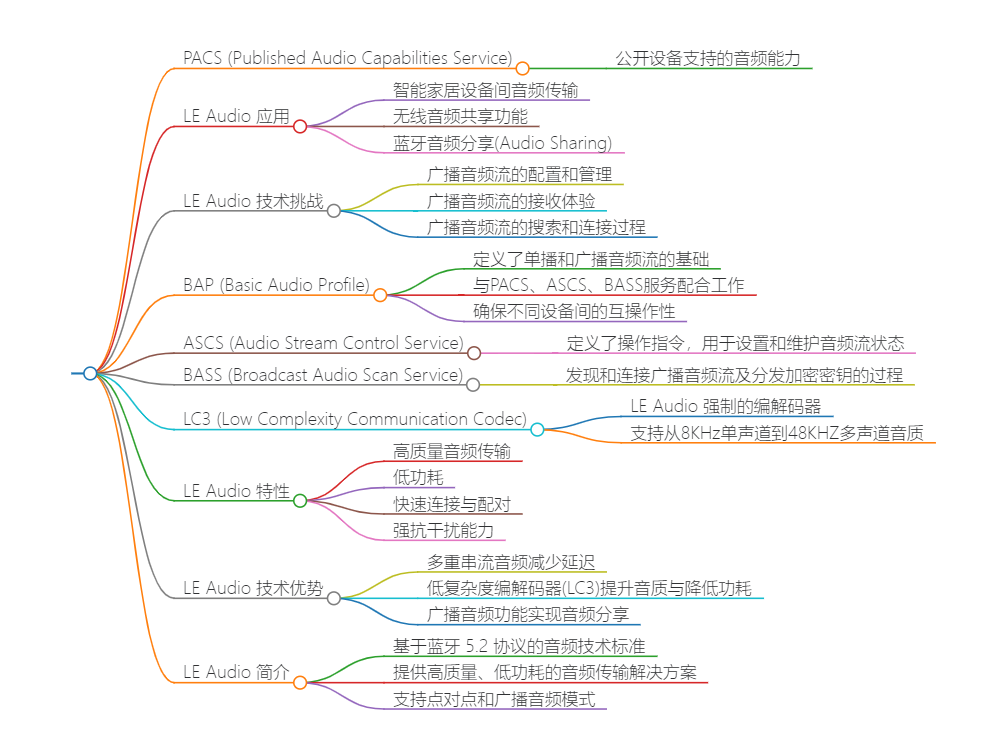


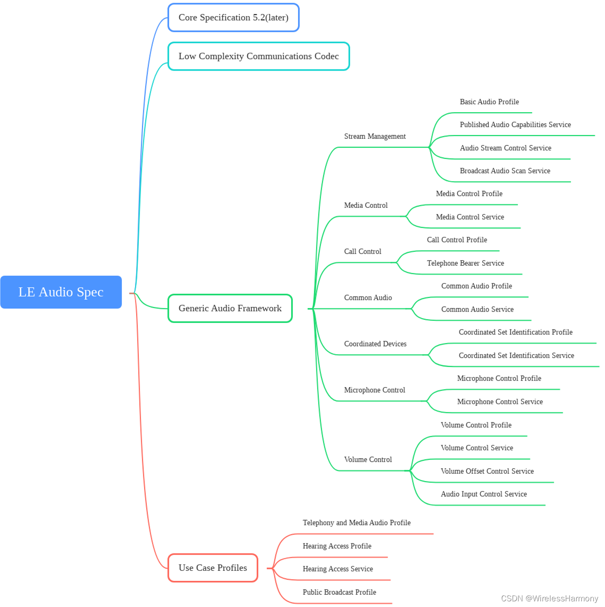

https://blog.csdn.net/ppc_dragon/article/details/135902404


# 我应该怎么学习leaudio的开发

学习LE Audio的开发可以通过以下步骤进行：

1. **了解基础知识**：首先，你需要了解蓝牙技术的基础知识，包括蓝牙低功耗（LE）技术的原理、蓝牙协议栈以及蓝牙音频的相关概念。

2. **学习LE Audio标准**：深入研究蓝牙技术联盟发布的LE Audio标准文档，了解其架构、协议、特性和规范要求。

3. **掌握开发工具**：熟悉并掌握用于LE Audio开发的工具和平台，例如蓝牙开发套件、蓝牙调试工具等。

4. **参考示例代码**：查阅蓝牙技术联盟或其他相关资源中的LE Audio示例代码，理解其实现原理和代码结构。

5. **开发和调试**：根据学习的知识和参考资料，开始自己的LE Audio开发项目，并通过调试工具和设备进行验证和调试。

6. **持续学习和更新**：由于技术不断更新和演进，保持学习和了解最新的LE Audio技术发展和更新，以便不断提升自己的开发能力。

通过以上步骤，你可以逐步掌握LE Audio的开发技能，并在实践中不断提升自己的能力。

# LE Audio标准文档内容概要

LE Audio 标准文档的内容概要通常包括以下主题：

1. **介绍和背景**：LE Audio 标准文档通常会介绍 LE Audio 的背景、发展历程以及主要的技术目标。这一部分通常会概述 LE Audio 相对于传统蓝牙音频的优势和特点。

2. **架构和协议**：LE Audio 标准文档会详细介绍 LE Audio 的架构和协议设计。这包括了多流音频传输、低能耗语音、新的音频编解码器支持等方面的内容。文档可能会提供协议栈的层级结构图以及各层之间的通信协议描述。

3. **特性和功能**：LE Audio 标准文档会列举 LE Audio 提供的特性和功能，例如多流音频传输、低功耗语音、听力辅助功能支持等。这部分通常会详细说明每个特性的实现原理和使用场景。

4. **编解码器支持**：LE Audio 标准文档会介绍 LE Audio 支持的音频编解码器，包括新的低能耗编解码器和高质量编解码器的特点和性能比较。

5. **应用场景和用例**：LE Audio 标准文档会列举一些 LE Audio 的应用场景和典型用例，例如无线耳机、便携式音箱、汽车音频系统和听力辅助器等。

6. **测试和认证**：最后，LE Audio 标准文档可能会提供与 LE Audio 相关的测试要求和认证流程，以确保产品符合标准并能够顺利通过认证。

以上是 LE Audio 标准文档可能包含的主要内容概要。具体的文档内容可能会根据不同版本和发布时间有所变化，建议查阅最新版本的文档以获取最准确的信息。

# 哪些芯片支持了le audio

目前，支持 LE Audio 的芯片厂商和型号可能在不断增加，但以下是一些主要的芯片厂商和型号，它们已经或者可能会支持 LE Audio：

| 厂商         | 芯片型号            | 备注                                                         |
| ------------ | ------------------- | ------------------------------------------------------------ |
| Qualcomm     | QCC514x、QCC305x 等 | Qualcomm 的蓝牙芯片通常会支持最新的蓝牙标准，因此 QCC514x 和 QCC305x 等型号有望支持 LE Audio。 |
| Nordic       | nRF52 系列          | Nordic Semiconductor 的 nRF52 系列芯片在蓝牙低功耗领域具有较高的知名度，有望支持 LE Audio。 |
| Cypress      | PSoC 6 系列         | Cypress 的 PSoC 6 系列芯片具有较强的蓝牙功能，可能会支持 LE Audio。 |
| Dialog       | DA1469x 系列        | Dialog Semiconductor 的 DA1469x 系列芯片支持蓝牙 5.1 标准，有望支持 LE Audio。 |
| Silicon Labs | EFR32 系列          | Silicon Labs 的 EFR32 系列芯片在蓝牙领域有一定的市场份额，可能会支持 LE Audio。 |
| MediaTek     | MT2511 等           | MediaTek 的一些蓝牙芯片型号，如 MT2511，可能会支持 LE Audio。 |
| TI           | CC26xx、CC13xx 等   | 德州仪器（TI）的一些蓝牙芯片型号，如 CC26xx 和 CC13xx 等，可能会支持 LE Audio。 |

请注意，以上列出的芯片型号仅是一些主要厂商和型号，实际上可能还有其他厂商和型号的芯片也支持 LE Audio。建议在选择芯片时，查阅厂商提供的最新文档，以确认其是否支持 LE Audio。

# 支持LEAudio的手机

安卓 13 系统虽然原生支持蓝牙 LE Audio，但是 Pixel 7 系列并未提供该功能。而 **Xperia 1 IV 和 Xperia 5 IV 两款手机将会通过更新率先支持蓝牙 LE Audio。**


Xperia 1 V 和 Xperia 5 V 两款机型支持蓝牙 LE Audio 后，可以使用低复杂性通信编解码器（LC3）。LC3 具有像 aptX Adaptive 这样的动态音频缩放功能。

从理论上讲，蓝牙 LE Audio 和 LC3 比其他主流蓝牙技术消耗更少的功率并提供更大的范围，同时还提供更小的延迟。

https://m.ithome.com/html/673535.htm

# pipewire对leaudio的支持

分析里面的代码，

MediaTransport1 从这个字符串开始入手搜索。

蓝牙transport 有3个接口，acquire、release、set_voluem。

下面具体实现可以是a2dp和leaudio。

```
static const struct spa_bt_transport_implementation transport_impl = {
	SPA_VERSION_BT_TRANSPORT_IMPLEMENTATION,
	.acquire = transport_acquire,
	.release = transport_release,
	.set_volume = transport_set_volume,
};
```

除了transport这一层。还有哪些连接需要建立的？

以cis为例，前期的ble连接，是建立了什么关系？

source这边相当于手机，进行discovery。只扫描指定的uuid的服务。这个uuid随意指定的。

sink这边相当于耳机，进行广播。

以bluze_inc的代码进行的连接为例。

调用了binc_device_connect进行连接。这个连接的内涵是什么？

是进行了经典蓝牙的连接？

```
static const char *const INTERFACE_DEVICE = "org.bluez.Device1";

static const char *const DEVICE_METHOD_CONNECT = "Connect";
g_dbus_connection_call(device->connection,
                           BLUEZ_DBUS,
                           device->path,
                           INTERFACE_DEVICE,
                           DEVICE_METHOD_CONNECT,
                           NULL,
                           NULL,
                           G_DBUS_CALL_FLAGS_NONE,
                           -1,
                           NULL,
                           (GAsyncReadyCallback) binc_internal_device_connect_cb,
                           device);
```

这个连接的内涵就是建立了链路层的连接，只有在这个连接的基础上，才有资格进行后续的业务层的交互。

然后pipewire里的iso-io.c。这个是音频数据的主要通路。

spa\plugins\bluez5\bt-latency.h

这个里面有cmsghdr相关的操作。

bap跟a2dp是并列的关系。

```
this->profile == DEVICE_PROFILE_A2DP || this->profile == DEVICE_PROFILE_BAP)
```

bat的然后再这样细分：

```
SPA_BT_PROFILE_BAP_SINK | SPA_BT_PROFILE_BAP_SOURCE
				| SPA_BT_PROFILE_BAP_BROADCAST_SOURCE
				| SPA_BT_PROFILE_BAP_BROADCAST_SINK
```

register_media_application 这个函数是重要入口。

单播其实跟a2dp的对等关系还是比较匹配的。

```
	if (direction == SPA_BT_MEDIA_SOURCE)
		endpoint = codec->bap ? BAP_SOURCE_ENDPOINT : A2DP_SOURCE_ENDPOINT;
	else if (direction == SPA_BT_MEDIA_SINK)
		endpoint = codec->bap ? BAP_SINK_ENDPOINT : A2DP_SINK_ENDPOINT;
```

相关的几个uuid

```
#define SPA_BT_UUID_PACS        "00001850-0000-1000-8000-00805f9b34fb"
#define SPA_BT_UUID_BAP_SINK    "00002bc9-0000-1000-8000-00805f9b34fb"
#define SPA_BT_UUID_BAP_SOURCE  "00002bcb-0000-1000-8000-00805f9b34fb"
#define SPA_BT_UUID_BAP_BROADCAST_SOURCE  "00001852-0000-1000-8000-00805f9b34fb"
#define SPA_BT_UUID_BAP_BROADCAST_SINK    "00001851-0000-1000-8000-00805f9b34fb"
```

注册endpoint。

```
	for (int i = 0; media_codecs[i]; i++) {
		const struct media_codec *codec = media_codecs[i];

		register_media_endpoint(monitor, codec, SPA_BT_MEDIA_SOURCE);
		register_media_endpoint(monitor, codec, SPA_BT_MEDIA_SINK);
		if (codec->bap) {
			register_media_endpoint(monitor, codec, SPA_BT_MEDIA_SOURCE_BROADCAST);
			register_media_endpoint(monitor, codec, SPA_BT_MEDIA_SINK_BROADCAST);
		}
	}
```

cis应该基本跟a2dp对等。

只需要增加lc3 codec支持就行？


# BAP

从版本 5.66 开始，添加了对 BAP（基本音频配置文件）的初始支持，BAP 是负责流控制的 LE Audio 的重要组成部分。

该插件被认为是实验性的，依赖于 ISO 套接字才能工作，因此需要更改以下设置才能启用它：

```
Experimental = true

# Enables kernel experimental features, alternatively a list of UUIDs
# can be given.
# a6695ace-ee7f-4fb9-881a-5fac66c629af (BlueZ Experimental Offload Codecs)
# 6fbaf188-05e0-496a-9885-d6ddfdb4e03e (BlueZ Experimental ISO socket)
# Defaults to false.
KernelExperimental = 6fbaf188-05e0-496a-9885-d6ddfdb4e03e
```


BAP为LE Audio设备提供了基本的互操作性。

即使两个LE Audio设备具有不同的上层profile，

它们也应该能够使用BAP设置音频流。

这意味着BAP为所有LE Audio设备提供了一个共同的基础，

使得不同品牌和型号的设备之间可以更容易地进行音频传输和协作。


LE Audio的Basic Audio Profile（BAP）是实现单播音频和广播音频的核心技术规范，它定义了实现这些音频传输的基本流程和配置。所有支持LE Audio的产品都必须支持BAP。

#### 单播音频配置方案

对于单播音频，BAP定义了16种音频配置方案，这些方案对应不同的产品形态。例如，一些配置方案适用于不带麦克风的单声道耳机，而其他配置方案则适用于带有麦克风的单声道设备。这些配置方案涵盖了从简单的单声道音频流到复杂的多通道音频流的各种场景。

#### 广播音频配置方案

对于广播音频，BAP定义了3种音频配置方案，这些方案对应不同的产品形态。例如，一些配置方案适用于广播两路音频流，其中一路是左声道，另一路是右声道；而其他配置方案则适用于广播单一声道音频或多语言音频流。

#### 音频配置的特点

LE Audio BAP支持的音频配置方案具有高度的灵活性和适应性，能够满足不同产品和应用场景的需求。这些配置方案不仅支持传统的音频传输，还支持新型的音频应用，如多房间音频、3D音效等。

综上所述，LE Audio BAP支持的音频配置方案非常丰富，能够满足现代音频产品的多样化需求。随着LE Audio技术的不断发展和完善，未来可能会有更多新的音频配置方案出现，以支持更加先进和创新的音频应用.


为了区分不同的音频流，BAP利用了一系列的服务和状态机。

其中，PACS（Published Audio Capabilities Service）负责发布音频能力，

ASCS（Audio Stream Control Service）则定义了用于设置和维护单播音频流的状态机。

BASS（Broadcast Audio Scan Service）则负责发现和连接广播音频流以及分发广播加密密钥的过程。


在实际操作中，BAP通过这些服务和状态机来管理音频流。

例如，当一个设备想要广播音频时，

它会首先配置BAP，然后建立一个广播音频流。

在这个过程中，BAP会根据预设的参数来创建一个BIG（Broadcast Information Group），

这个BIG包含了所有需要广播的音频数据。

接着，设备会通过周期性广播（PA）来传播这个BIG，

其他设备则可以通过扫描广播信息来找到并连接到这个音频流。


虽然对 PulseAudio 和 Pipewire 等的适当支持仍在进行中，但可以通过以下命令使用 bluetoothctl 进行测试：


https://www.bluez.org/le-audio-support/


蓝牙® 低功耗音频还基于蓝牙® 5.2 可选功能：同步通道。

这是链路层功能。

此功能允许通过新连接传输流：同步流。

有两种类型的同步流：

* 连接同步流 (CIS)：使用户能够通过蓝牙® 连接获得音频流。这是处理蓝牙低功耗音频的经典方法（一台设备一个连接，例如耳机）。通过两个 CIS，用户可以将同步音频流传输到两个不同的设备（用于耳塞或助听器）

* 广播等时流 (BIS)：使用户能够向任何能够接收该音频流的接收器广播一个或两个音频流。它不需要连接，这意味着可以有无限数量的接收器。

这两种类型的同步流为蓝牙®低功耗添加了新功能：

* 它定义了整个流媒体时间的系统延迟（没有任何漂移）。该延迟低于经典蓝牙®音频）。

* 同时它还定义了重传。应用程序可以请求优先考虑尽可能低的延迟的系统（这可能会导致由于最小重传而丢失一些数据包），或者优先考虑更好的质量的系统（这确保接收所有数据包，但可能导致更高的延迟）。

|                           HFP/HSP                            |                             A2DP                             |     Bluetooth® LE Audio with BAP 带 BAP 的蓝牙® LE 音频      |
| :----------------------------------------------------------: | :----------------------------------------------------------: | :----------------------------------------------------------: |
| Data is sent over SCO (Synchronous Connection Oriented) 数据通过 SCO（面向同步连接）发送 | Data is sent over ACL (Asynchronous Connection Oriented) 数据通过 ACL（面向异步连接）发送 | Data is sent over Isochronous data stream (CIS or BIS) 数据通过同步数据流（CIS 或 BIS）发送 |
|               Data is continuous 数据是连续的                |               Data is continuous 数据是连续的                |     Data is synchronized on a timestamp 数据按时间戳同步     |
|       There is no retransmission in SCO SCO中没有重传        | All packets are transmitted, leading to an infinity of retransmissions if the link has bad quality 所有数据包都会被传输，如果链路质量较差，则会导致无限重传 | Data can be retransmitted, but has a validity in time, becoming obsolete after a certain time 数据可以重传，但有时间有效性，过了一定时间就过时了 |
| Latency is always the same but is not defined 延迟始终相同但未定义 | Latency is not defined and can have some lags or drifts. 延迟未定义，可能会有一些滞后或漂移。 | Latency is always defined in the system and cannot change during the stream. 延迟始终在系统中定义，并且在流传输期间不能更改。 |

# zephyr的leaudio实现

现在就是相关资料太少，无论哪个系统的，我都要看一看。

LE Audio 堆栈的整体设计是实现尽可能严格地遵循规范，

无论是在结构方面还是在命名方面。

大多数 API 函数都以规范首字母缩略词为前缀（例如，bt_bap 表示基本音频配置文件 （BAP），bt_vcp 表示音量控制配置文件 （VCP））。

然后，在适用的情况下，每个配置文件中的特定角色为前缀（例如和 `bt_bap_unicast_client_discover()` `bt_vcp_vol_rend_set_vol()` ）。

通常每个过程都有一个由配置文件或服务规范定义的函数，

以及与过程不对应的其他帮助程序或元函数。

文件的结构通常也遵循这一点，其中 BAP 相关文件以 bap 为前缀，VCP 相关文件以 vcp 为前缀。如果文件特定于配置文件角色，则该角色也会嵌入到文件名中。

通用音频框架 （GAF） 被视为蓝牙 LE 音频体系结构的中间件。

GAF 包含配置文件和服务，允许更高层的应用程序和配置文件设置流、更改音量、控制媒体和电话等。

GAF 建立在 GATT、GAP 和同步通道 （ISO） 之上。

GAF 使用 GAP 连接、通告和同步到其他设备。

GAF 使用 GATT 来配置流、将流与内容（例如媒体或电话）相关联、控制音量等。

GAF 将 ISO 用于音频流本身，既可以作为单播（连接）音频流，也可以作为广播（未连接）音频流。

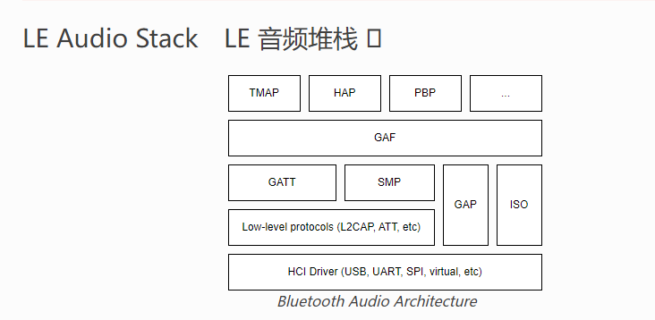


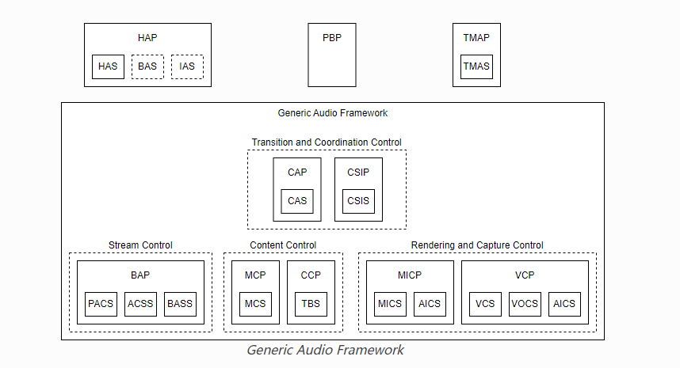

GAF 已在 Zephyr 中实现，结构如下

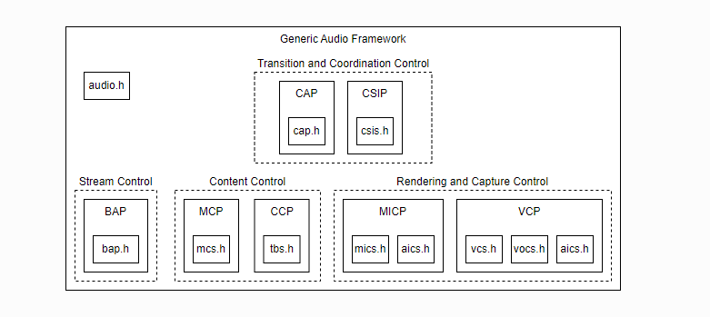


https://docs.zephyrproject.org/latest/connectivity/bluetooth/api/audio/bluetooth-le-audio-arch.html

# LE audio BIS 音频播放

使用 BlueZ 实现 BLE Audio Broadcast Isochronous Stream (BIS) 的音频播放涉及一些特定步骤。由于 BLE Audio BIS 是一个相对较新的蓝牙功能，BlueZ 可能需要特定版本支持这些功能。在开始之前，请确保您的 BlueZ 版本支持 BLE Audio 规范，特别是 ISOchronous Channels (ISO)。

### 前提条件

1. **确保系统环境**：
   - 一个支持 BLE Audio 的蓝牙适配器。
   - BlueZ 和内核版本支持 ISOchronous Channels。

2. **安装所需库**：
   - `pybluez` 和 `dbus-python` 用于蓝牙操作和 D-Bus 交互。
   - GStreamer 或其他音频播放库。

```bash
pip install pybluez dbus-python
sudo apt-get install gstreamer1.0-tools gstreamer1.0-plugins-base gstreamer1.0-plugins-good
```

### BLE Audio BIS 实现步骤

#### 1. 设置 BLE 广播

要设置 BLE 广播，我们需要定义广播参数，并将音频数据传输到广播通道。以下是一个简单的 Python 示例代码，用于初始化 BLE 广播并设置 BIS。

#### 2. 初始化蓝牙和 D-Bus

```python
import dbus
import dbus.mainloop.glib
from gi.repository import GLib

def setup_dbus():
    dbus.mainloop.glib.DBusGMainLoop(set_as_default=True)
    bus = dbus.SystemBus()
    return bus

def register_broadcast(bus):
    adapter_path = "/org/bluez/hci0"
    adapter = dbus.Interface(bus.get_object("org.bluez", adapter_path), "org.freedesktop.DBus.Properties")
    adapter.Set("org.bluez.Adapter1", "Powered", dbus.Boolean(1))

    manager = dbus.Interface(bus.get_object("org.bluez", "/org/bluez"),
                             "org.bluez.BassManager1")
    
    broadcast_params = {
        "Interval": dbus.UInt16(10),
        "Latency": dbus.UInt16(30),
        "PHY": dbus.UInt16(1),
        "ChannelMap": dbus.UInt16(0x07),
        "TxPower": dbus.Int16(0)
    }
    
    manager.RegisterBroadcast(broadcast_params)

def main():
    bus = setup_dbus()
    register_broadcast(bus)

    loop = GLib.MainLoop()
    loop.run()

if __name__ == "__main__":
    main()
```

#### 3. 使用 GStreamer 播放音频

要将音频数据流传输到 BLE 广播通道，可以使用 GStreamer 从文件或麦克风获取音频数据，并通过蓝牙发送。以下是一个简单的 GStreamer 管道示例：

```bash
gst-launch-1.0 filesrc location=your_audio_file.mp3 ! decodebin ! audioconvert ! audioresample ! autoaudiosink
```

将其整合到 Python 脚本中：

```python
import subprocess

def start_audio_stream(file_path):
    gst_command = [
        "gst-launch-1.0", "filesrc", f"location={file_path}", "!", "decodebin", "!", "audioconvert", "!", 
        "audioresample", "!", "autoaudiosink"
    ]
    subprocess.run(gst_command)

if __name__ == "__main__":
    audio_file = "your_audio_file.mp3"
    start_audio_stream(audio_file)
```

### 完整的代码整合

以下是将 BLE 广播和音频播放整合在一起的完整示例代码：

```python
import dbus
import dbus.mainloop.glib
from gi.repository import GLib
import subprocess

def setup_dbus():
    dbus.mainloop.glib.DBusGMainLoop(set_as_default=True)
    bus = dbus.SystemBus()
    return bus

def register_broadcast(bus):
    adapter_path = "/org/bluez/hci0"
    adapter = dbus.Interface(bus.get_object("org.bluez", adapter_path), "org.freedesktop.DBus.Properties")
    adapter.Set("org.bluez.Adapter1", "Powered", dbus.Boolean(1))

    manager = dbus.Interface(bus.get_object("org.bluez", "/org/bluez"),
                             "org.bluez.BassManager1")
    
    broadcast_params = {
        "Interval": dbus.UInt16(10),
        "Latency": dbus.UInt16(30),
        "PHY": dbus.UInt16(1),
        "ChannelMap": dbus.UInt16(0x07),
        "TxPower": dbus.Int16(0)
    }
    
    manager.RegisterBroadcast(broadcast_params)

def start_audio_stream(file_path):
    gst_command = [
        "gst-launch-1.0", "filesrc", f"location={file_path}", "!", "decodebin", "!", "audioconvert", "!", 
        "audioresample", "!", "autoaudiosink"
    ]
    subprocess.run(gst_command)

def main():
    bus = setup_dbus()
    register_broadcast(bus)

    audio_file = "your_audio_file.mp3"
    start_audio_stream(audio_file)

    loop = GLib.MainLoop()
    loop.run()

if __name__ == "__main__":
    main()
```

### 总结

通过上述步骤和代码示例，你可以使用 Python 和 BlueZ 实现 BLE Audio BIS 音频播放功能。确保使用支持 BLE Audio 的设备和 BlueZ 版本，调整配置以匹配具体的应用需求。

# 安卓手机怎么进行leaudio连接？手机怎么决定是使用A2DP还是leaudio

在安卓手机上进行LE Audio连接，需要确保手机的蓝牙堆栈和硬件支持蓝牙5.2及以上版本，同时安卓操作系统要支持LE Audio功能。以下是步骤和关键点：

**1. 确认设备支持**

- **硬件支持**：确保你的安卓手机硬件支持蓝牙5.2及以上版本。
- **软件支持**：安卓系统版本需要支持LE Audio，通常是Android 13及以上版本。

**2. 配对和连接LE Audio设备**
在安卓设备上，配对和连接LE Audio设备的步骤与经典蓝牙设备相似：

1. **打开蓝牙**：
   - 进入设置 > 连接 > 蓝牙，确保蓝牙已打开。

2. **扫描设备**：
   - 系统会自动扫描附近的蓝牙设备，找到你的LE Audio设备。

3. **配对设备**：
   - 选择你的LE Audio设备进行配对。配对过程中，设备可能会要求输入PIN码或确认配对请求。

**3. 决定使用A2DP还是LE Audio**
安卓设备自动选择合适的音频协议（A2DP或LE Audio）取决于以下因素：

1. **设备能力**：设备广播的蓝牙服务和配置文件决定了连接的类型。支持LE Audio的设备会广播支持LE Audio的服务。
2. **优先级和用户设置**：如果设备同时支持A2DP和LE Audio，系统可能基于优先级和用户设置选择协议。
3. **应用需求**：某些应用程序可能会指定使用哪种音频协议。

**4. 检查连接协议**
- 在安卓系统中，通常无法直接查看使用的是A2DP还是LE Audio。但是，如果连接的是LE Audio设备，系统会优先选择LE Audio协议，因为它在功耗和音质方面更具优势。
- 一些第三方应用程序可以显示详细的蓝牙连接信息，例如`Bluetooth Scanner`或`BLE Scanner`，这些应用程序可以帮助你查看设备连接的具体细节。

**5. 配置LE Audio**
- LE Audio设备可能会有专门的应用程序，用于管理设备和音频设置。下载并安装这些应用程序，可以帮助你更好地配置和管理LE Audio连接。

以下是简要步骤的Markdown表格：

| 步骤                     | 详细操作                                   |
| ------------------------ | ------------------------------------------ |
| 确认设备支持             | 确保手机和音频设备支持蓝牙5.2及以上版本    |
| 打开蓝牙                 | 设置 > 连接 > 蓝牙，确保蓝牙已打开         |
| 扫描设备                 | 自动扫描附近的蓝牙设备                     |
| 配对设备                 | 选择LE Audio设备进行配对，确认配对请求     |
| 决定使用A2DP还是LE Audio | 系统自动选择，优先使用LE Audio             |
| 检查连接协议             | 使用第三方应用查看详细连接信息（可选）     |
| 配置LE Audio             | 使用专用应用程序管理设备和音频设置（可选） |

**注意事项**：

- 确保设备固件和操作系统都是最新版本，以支持最新的蓝牙功能。
- 某些功能可能需要设备制造商提供的软件支持，例如固件更新或专用管理应用程序。

# android leaudio

https://developer.android.com/develop/connectivity/bluetooth/ble-audio/overview?hl=zh-cn

蓝牙低功耗音频 (LEA) 可确保用户能够接收高保真音频，而不会牺牲电池续航时间，并可让用户在不同的使用情形之间无缝切换。Android 13（API 级别 33）包含对 LEA 的内置支持。

在 LEA 源设备市场份额不断扩大之前，

大多数 LEA 耳机都将采用双模式。

用户应该能够在其双模式耳机上配对和设置这两种传输方式。

# stm32 leaudio

https://wiki.st.com/stm32mcu/wiki/Connectivity:Introduction_to_Bluetooth_LE_Audio


音频框架的基础是音频流管理，由基本音频配置文件 (BAP) [[7\]](https://wiki.st.com/stm32mcu/wiki/Connectivity:Introduction_to_Bluetooth_LE_Audio#cite_note-bap-7) 定义。它是蓝牙®低功耗音频的强制性配置文件。它定义了流类型、配置、功能、质量、延迟等。


BAP 与三种服务一起使用：

- 发布的音频功能服务 (PACS)：用于公开设备的音频功能。
- 音频流控制服务（ASCS）：启用配置单播流。
- 广播音频扫描服务（BASS）：允许请求客户端代表服务器扫描广播音频流。


BAP 定义了两种类型的流：单播和广播，

## 单播

单播是基于连接的同步流 (CIS) 的连接音频流。

这意味着通过单播，您可以通过 CIS 创建连接的音频流。

==要创建单播流，首先需要一个 ACL 连接来通过 GATT 和 LLCP 交换所有有用信息。==

单播分为两个角色：

单播客户端：建立与单播服务器的连接，发现其功能并配置音频流。该角色由智能手机、笔记本电脑、电视等使用。

单播服务器：通告其角色，公开其功能，接受单播服务器配置音频流。耳机、扬声器、某些助听器、某些耳塞甚至麦克风都可以使用此角色。

此外，单播客户端可以同步流式传输到两个单播服务器。

为了通过 ACL 连接启动单播音频流，单播客户端和服务器交换有关流质量、重传、音频通道数量（单声道/立体声）和延迟的信息。

stream可以是：

1、单向的（用于音乐），双向的（用于通话）。这个是client根据server列出的服务里挑选执行。

2、低质量的，也可以是高质量的。

3、低延迟，或者高可靠。

主要的usecase是：

1、一个手机连接到一个耳机。

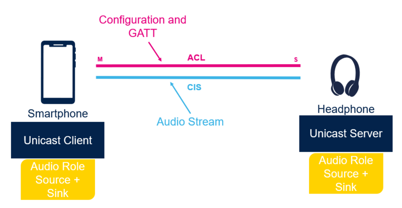

2、一个手机连接到2个耳机。

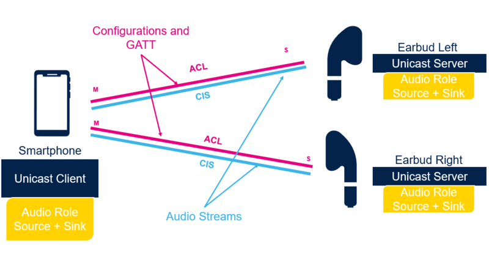

## 广播

广播是一种非连接的stream。

发送方通过BIS广播音频数据。

通过扩展广告和定期广告来发布广播信息。

任何可以扫描到这个stream的设备都可以收听。

这个是一个新的usecase，允许的接收设备数量无限。

这个stream一般是没有加密的，但是你可以加密。

只能是单向传播。

因为广播是没有连接的，用户需要一种方式来同步到stream的状态。

而耳机这类设备一般是没有屏幕的。

所以蓝牙协议在这里增加了一个新的role。

这个role被叫做广播助理。

这个role一般是手机来实现。

手机来扫描发现广播stream，并把它发送到耳机上。

广播定义了4种角色。

1、广播源。发出广播的设备。

2、广播接收器。接收广播的设备，一般是耳机。

3、扫描委托者。暴露一些信息，等待广播助手。

4、广播助手，一般是手机。


主要是usecase是：

1、一个手机或者电脑把音频发送给多个设备。

2、在公共场所发布公告。

3、翻译。

# bluez里的bap

看这个测试的写法。

unit\test-bap.c

有6000多行代码。看起来内容非常多。

profiles\audio\bap.c 看这个。

```
#define ISO_SOCKET_UUID "6fbaf188-05e0-496a-9885-d6ddfdb4e03e"
#define PACS_UUID_STR "00001850-0000-1000-8000-00805f9b34fb"
#define BCAAS_UUID_STR "00001852-0000-1000-8000-00805f9b34fb"
#define MEDIA_ENDPOINT_INTERFACE "org.bluez.MediaEndpoint1"
#define MEDIA_INTERFACE "org.bluez.Media1"
```

应该是针对org.bluez.MediaEndpoint1来编程。


# leaudio的连接和传输过程，以CIS单播为例

LE Audio（低能耗音频）是蓝牙技术的一项新标准，它使用低能耗蓝牙（BLE）来传输音频数据。CIS（Connected Isochronous Stream）单播是 LE Audio 中用于单个设备之间音频传输的一种模式。以下是使用 CIS 单播进行 LE Audio 连接和传输的过程：

### 1. 设备发现与配对

在传输音频数据之前，设备需要进行发现和配对：

1. **设备发现**：音频源设备（如智能手机）和音频接收设备（如耳机）进行扫描和广播。
2. **配对**：使用 BLE 标准的配对和绑定过程，确保设备之间的通信是安全的。

### 2. 建立连接

一旦设备成功配对，音频源设备和接收设备之间将建立 BLE 连接。

### 3. ISO 链路的建立

建立连接后，需要建立 ISO（Isochronous）链路，以便传输实时音频数据。

1. **创建 CIS 请求**：音频源设备向音频接收设备发送创建 CIS 的请求。请求中包含 CIS 的参数，如帧间隔、最大传输单元（MTU）等。
2. **创建 CIS 响应**：音频接收设备响应创建 CIS 的请求，确认可以接受这些参数。

### 4. 数据传输

建立 ISO 链路后，音频数据通过 CIS 单播通道进行传输。

1. **配置音频编解码器**：配置使用的音频编解码器（如 LC3 编解码器）。
2. **开始音频传输**：音频源设备开始通过 CIS 通道发送音频数据包，接收设备解码并播放音频。

### 5. 连接的管理

在传输过程中，设备需要管理和维护连接，以确保音频流的稳定性。

1. **链路保持**：定期发送链路保持消息，以确保连接的持续性。
2. **错误恢复**：处理和恢复传输错误，确保音频流的质量。

### 6. 断开连接

当音频传输完成或需要终止时，设备之间将断开 CIS 连接。

1. **终止 CIS 请求**：音频源设备发送终止 CIS 请求。
2. **终止 CIS 响应**：音频接收设备响应请求并终止连接。

### 示例代码

以下是一个简化的示例代码，展示了如何使用 C 语言来处理 BLE 连接和 CIS 单播音频传输。注意，这只是一个伪代码示例，实际实现将依赖于具体的 BLE 堆栈和硬件平台。

```c
#include <stdio.h>
#include <bluetooth/bluetooth.h>
#include <bluetooth/l2cap.h>
#include <bluetooth/iso.h>

// 初始化 BLE 连接
int init_ble_connection() {
    // 设置 BLE 连接参数
    struct sockaddr_l2 src, dst;
    int sock;
    sock = socket(AF_BLUETOOTH, SOCK_SEQPACKET, BTPROTO_L2CAP);
    if (sock < 0) {
        perror("socket");
        return -1;
    }

    // 绑定到本地蓝牙适配器
    memset(&src, 0, sizeof(src));
    src.l2_family = AF_BLUETOOTH;
    src.l2_bdaddr = *BDADDR_ANY;
    bind(sock, (struct sockaddr *)&src, sizeof(src));

    // 连接到远程设备
    memset(&dst, 0, sizeof(dst));
    dst.l2_family = AF_BLUETOOTH;
    str2ba("XX:XX:XX:XX:XX:XX", &dst.l2_bdaddr); // 替换为目标设备的地址
    connect(sock, (struct sockaddr *)&dst, sizeof(dst));

    return sock;
}

// 建立 CIS 连接
int establish_cis_connection(int sock) {
    // 设置 CIS 参数
    struct iso_conn_params params;
    memset(&params, 0, sizeof(params));
    params.interval = 10; // 帧间隔
    params.latency = 20;  // 延迟
    params.pkt_len = ISO_DEFAULT_MTU;

    // 发送创建 CIS 请求
    if (ioctl(sock, IOCTL_CREATE_CIS, &params) < 0) {
        perror("ioctl");
        return -1;
    }

    return 0;
}

// 传输音频数据
int transmit_audio_data(int sock, const uint8_t *data, size_t len) {
    // 发送音频数据包
    if (send(sock, data, len, 0) < 0) {
        perror("send");
        return -1;
    }

    return 0;
}

int main() {
    int sock;
    uint8_t audio_data[ISO_DEFAULT_MTU];

    // 初始化 BLE 连接
    sock = init_ble_connection();
    if (sock < 0) {
        return -1;
    }

    // 建立 CIS 连接
    if (establish_cis_connection(sock) < 0) {
        close(sock);
        return -1;
    }

    // 模拟音频数据传输
    while (1) {
        // 生成或读取音频数据
        memset(audio_data, 0, sizeof(audio_data));
        // 传输音频数据
        if (transmit_audio_data(sock, audio_data, sizeof(audio_data)) < 0) {
            break;
        }
    }

    // 关闭连接
    close(sock);
    return 0;
}
```

这个示例展示了 BLE 连接的初始化、CIS 连接的建立和音频数据的传输过程。实际实现中需要处理更多的错误和状态管理，并根据具体的 BLE 堆栈和硬件平台进行调整。

# CIS

这篇文章画图比较好。

https://blog.csdn.net/sinat_21154803/article/details/122136201

# MCP：Media Controller Profile

https://blog.csdn.net/weixin_42884925/article/details/132850775

# 低功耗蓝牙LE Audio Profile 详细介绍

https://blog.csdn.net/HaaSTech/article/details/119565156

# LE Audio PTS dongle破解和调试方法

 目前市面上支持LE Audio的USB dongle很少，如果要在Ubuntu Sim上调试LE Audio，基本只能用蓝牙官方PTS Dongle，但目前国内很难买到。本文介绍一种破解PTS Dongle的方法，以及如何在ubuntu上用bluez + zephyr调试LE Audio。

执行west build -t run 运行zephyr，然后在shell终端执行下面命令初始化le audio，发送le audio广播

```
bt init

audio init

mcc init

vcs init

bt adv-create conn-nscan ext-adv name

bt adv-data discov

bt adv-start
```

https://blog.csdn.net/fan_hang/article/details/135423795

# zephyr leaudio

https://fanhang.blog.csdn.net/article/details/135582605

LE Audio 堆栈的整体设计是实现尽可能严格地遵循规范，

无论是在结构方面还是在命名方面。

大多数 API 函数都以规范首字母缩略词为前缀（例如，bt_bap 表示基本音频配置文件 （BAP），bt_vcp 表示音量控制配置文件 （VCP））。

然后，在适用的情况下，以每个配置文件中的特定角色为前缀（例如和 `bt_bap_unicast_client_discover()` `bt_vcp_vol_rend_set_vol()` ）。

文件的结构通常也遵循这一点，其中 BAP 相关文件以 bap 为前缀，VCP 相关文件以 vcp 为前缀。

通用音频框架 （GAF） 被视为蓝牙 LE 音频体系结构的中间件。GAF 包含配置文件和服务，允许更高层的应用程序和配置文件设置流、更改音量、控制媒体和电话等。GAF 建立在 GATT、GAP 和同步通道 （ISO） 之上。


# 实测Qaulcomm LE Audio低延迟

Bluetooth LE Audio 是蓝牙标准的最新技术，

相对于传统蓝牙技术，提供了一系列的改进。

其中一个显著的改进是音频延迟。

==Bluetooth LE Audio 通过改进编解码器==

==和引入一个名为LE等时通道的新功能来实现低延迟。==

实际上延迟到底是多少呢?

我们就拿Qualcoomm QCC3086 开发板当发射端和QCC5181 开发板当接收端实际量测给大家看。

第一种验证: 

使用一个USB sound card搭配Audacity音讯编辑软体

首先量测USB sound card本身的延迟，

使用Audacity音讯编辑软体拨放和录音功能，

将拨放和录音装置皆设为USB sound card。

接着将一条音源线分别插入耳机和麦克风的音源孔按下录音键，这时Audacity就会拨放音档并且做录音动作。

量测拨放音档和录音音档的起始位置，就可以大概得到约0.008秒(8毫秒)的延迟。

# 蓝牙5.2新特性 LE Audio - Isochronous channel

Isochronous channel 是蓝牙5.2发布的新特性，

可以翻译为同步通道，

主要应用在LE Audio上。

它定义了一个有时间依赖的数据的传输通道和传输策略。

首先是定义了一个对于多接收方同步获取数据的机制；

==其次是定义了发送方在允许的时间外丢弃数据，==

从而保证接收方收取的数据满足时效要求。

同步通道分为连接同步通道和广播同步通道。

看名字就可以知道，

连接同步通道是需要两个设备建立gatt连接之后才可以使用的用来传输音频的通道，

广播同步通道则是使用广播来传输音频流。

为什么需要同步通道？

   ble 的传统的gatt也可以同时连接多个slaver设备，但是master与多个slaver建立连接的后，master与每个slaver建立的连接通道都是相互独立的，使用的是不同的时间基准，并且每个gatt通道的连接间隔可能也不一样，所以master在给不同的slaver发送数据的时候无法做到精确的时间同步。

   这也是ble之前的应用场景所决定的，ble传统的gatt连接通道适合进行数据流的传输，并且通过调整连接interval来提高ble数据传输的峰值速率，这样的设计满足了大部分的数据流的传输要求。

但是音频流和数据流对传输速率的要求是不一样的，

音频流的数据码率是固定的，

比如128bps， 192bps， 

所以音频流并不追求绝对的峰值速率，

而是稳定的、实时的传输通道，

并且音频流通常有多个声道，需要让多个声道的数据有很好的同步性。

就这样，在音频流传输的需求背景下，Isochronous channel 同步通道应运而生。


连接同步通道有两个新的概念，分别是CIG （Connected Isochronous Group） 和 CIS （Connected Isochronous Stream）。

连接同步通道也有连接间隔，称为ISO_Interval，这个和ble传统的gatt连接的interval有些类似，但是ISO_Interval把时序分的更加细一些。

CIG：是由master建立的，建立CIG的时候interval已经确认好了。 建立连接后， master可以向slaver发送建立CIG请求，一个CIG最多可以建立31个CIS。

CIS： CIS表示每个连接的音频流，可以简单理解为每个CIS就是TWS耳机中的一个设备。每个CIS最多可以包含31个subevent，依次轮流发送， 每个subevent最小的间隔是400us。

连接同步通道又分为两种模式，sequential模式和interleave模式


总结

- 连接同步通道是基于蓝牙连接的，首先要先建立ble连接
- 基于时间同步的音频传输机制，可以实现多个设备的数据同步
- 一个master可以建立多个CIG
- 每个CIG可以最多31个CIS
- 每个CIS里面最多有31个subevent
- 链路层有LL_CIS_REQ 和 LL_CIS_RSP来创建CIS


# 使用蓝牙 LE 的助听器音频支持

针对助听器使用 CoC 时，

网络拓扑会假设存在一个中央设备和两个外围设备（一个在左侧，一个在右侧），

如**图 1** 所示。

蓝牙音频系统会将左右外围设备分别视为一个音频接收器。

如果由于单耳选配或连接中断而导致某个外围设备缺失，则中央设备会混合左右声道，并将音频传输到剩余的那个外围设备。

如果中央设备与这两个外围设备之间的连接均中断，则中央设备会认为指向音频接收器的链接发生中断。

在这些情况下，中央设备会将音频路由到其他输出设备。


**图 1.**用于使用支持 BLE 的 CoC 将助听器与 Android 移动设备配对的拓扑

如果中央设备未将音频数据流式传输到外围设备，且可以保持 BLE 连接，那么中央设备应该不会与外围设备断开连接。保持连接可以与位于外围设备上的 GATT 服务器进行数据通信。


https://source.android.com/docs/core/connect/bluetooth/asha?hl=zh-cn

# **LE Audio BIS 模式流程解析**

https://www.nordicsemi.cn/news/le-audio-bis/


# ISO音频流

如果过去你的工作主要是蓝牙应用程序，

那么你可能专注于配置文件，

几乎没有看核心规范。 

一个可能的原因是蓝牙经典音频配置文件的接口配置已经跟核心设规范绑定好了，

因此没有太多需要了解配置文件下面发生的事情或其相关协议。

但对于低功耗音频配置文件却不同了，

==你可能会改变核心规范的工作方式。==


核心规范为了支持起更灵活的应用系统，

而必须允许更大程度的灵活，

该应用系统不仅满足当今的音频需求，

还可以满足我们甚至还没有考虑过的需求，

==为了实现这点，做出了一个基本的架构层面的修改—把音频流和控制流分开。==

这意味着定义了一套新的ISO同步物理信道传输音频流，

ISO同步物理信道与BLE ACL链路分开且同时存在。

核心规范中的ISO物理信道可以同时创建很多ISO音频流，

这些音频流可以传输所有类型的音频，

从非常低音质到难以置信的高音质类型。

ISO数据流不包含控制信息，它完成只传输音频流，

控制信息是被BLE ACL链路传输的。

共同存在的BLE ACL信道被用来创建ISO信道，打开，关闭，添加音频和媒体控制，以及其他我们需要的所有功能等，以上这些操作都是基于使用BLE规范中标准的GATT规范来完成的。


为了提供不同延迟，不同音频质量和不同级别稳健性的灵活性，

研发人员需要能够控制这些ISO流的配置方式。

这些在通用音频框架配置文件协议栈中实现的非常好。

这意味着当你开发蓝牙低功耗音频应用程序时，

虽然只是使用协议栈顶层的音频配置文件，

==但是仍需要了解很多底层ISO信道的工作机制。==

这与之前开发的很多蓝牙应用程序不同。

为了帮助理解蓝牙低功耗音频的整体框架，

我们需要底层ISO信道是如何开发的，

它们实现的功能以及如何使用它们。


目前为止，蓝牙规范主要关注点到点的连接：

一个主设备与一个从设备建立一个连接，然后传输数据，这是一个非常局限的拓扑，

==许多公司已经开发私有的功能扩展来增加灵活性，==

==正如所看到的真无线立体声耳机。==

但是ISO信道比这些私有的功能扩展能够提供更广泛的拓扑。

除了让一部手机可以连接一对耳机或者一个扬声器，

蓝牙低功耗还能够把左右耳音频信号分别传给对应的左右耳机，

也需要能够将相同的信息发送给一对以上的耳机，并且可以增加设备数量和音频流数量。


存在两种ISO信道：单播模式和广播模式。

单播模式连接称为可连接的ISO信道，简称CIS，与现有蓝牙音频方案交类似，某种程度上，CIS意味着两个设备之间已经建立连接来交互数据，并且使用确认机制提供设备之间流控。==与CIS共存的还有一个ACL控制信道，该ACL信道在CIS整个传输音频过程中一直存在。==


用于广播模式的BIS与CIS具有相似结构，但是也有一个主要区别：数据确认机制。

设备使用广播发送ISO数据流时，不知道有多少设备收到音频数据，这些设备之间没有建立连接，==不需要ACL链路==，简而言之，广播模式是纯粹混杂的。

然而，可以添加控制链路给广播。

在蓝牙核心规范级别，==BIS与CIS的明显区别是他们传输数据是否被确认。==（可以理解为tcp和udp）

但是蓝牙应用程序为了实现不同应用场景需要在广播和单播之间进行切换，这种切换对用户是无感的。


广播模式允许多个设备像FM收音机或电视那样听取相同东西，

最初电线圈助听器应用要求蓝牙低功耗音频广播能力，

在公共场所佩戴助听器的人可以听到相同信号，

助听器要求相对低的音频质量，广泛应用于语音。

蓝牙低功耗音频拥有着高质量音频且明显的低安装成本，将来在工业界拥有更广泛的应用场景。

传统场所：

会议中心，剧院和礼拜场所；

公共信息发布：航班公告，火车发车时间和巴士时刻表，佩戴耳机或者助听器的人们都可以听到这些信息。

广播模式也适用更多私人应用场景，例如一群人收听同一个电视节目，或者互相分享手机上的音乐。

最后一个例子展示了蓝牙低功耗音频应用程序 ==如何在不可见情况下来回切换底层协议栈==。

如果你正在带着耳机听手机音乐时，此时底层协议栈可能使用的CIS链路。

当你朋友过来问你“想不想一起听音乐？”，

手机分享音乐程序会把你的手机从私有单播连接切换到加密广播模式，

这样你们都可以听到相同的音乐了，

这种切换场景的功能可以发生在耳塞，助听器，耳机和扬声器上。

在应用程序方面，与其他人一起分享音乐应用是无缝切换的，音乐用户不必知道单播模式和多播模式，切换只发生在底层协议栈。


核心规范V5.2中增加ISO流特性是低功耗蓝牙协议中一个全新的概念。

==熟悉A2DP和HFP协议的读者都知道其拓扑结构局限不灵活。==

HFP具有双向一对一的链路，

典型场景是电话和耳机或免提设备之间。

A2DP是一个更简单的单播链路，

定义Source设备产生音频数据，

Sink设备通常是耳机，扬声器，放大器或录音设备，用来接收音频数据。

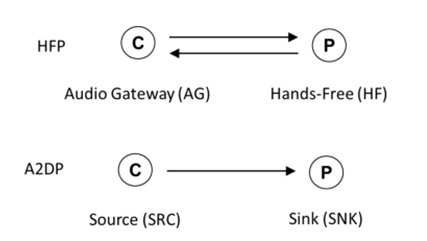


蓝牙低功耗音频建立在一个基本不对称的协议：

一个设备是主设备，负责ISO链路的创建及其链路控制，主设备可连接很多外围设备，主设备和外围设备通过ISO链路交互音频数据。

==这里提及不对称一定程度是指外围设备比主设备要求更低功耗。==

CIS与经典蓝牙音频配置文件相比，主设备更擅长配置ISO流程，以达到影响音频质量，延迟和电池寿命。

对于BIS，主设备控制所有链路配置，外围设备决定想要接收的ISO流。

重复第3.3节术语描述的，从低往上整体研究蓝牙低功耗音频协议栈，

我们可能会看到各种不同的名字代表设备执行的角色。

在核心规范中，定义主设备和外围设别。

在BAPS系列规范中，设备被称为客户端和服务端，

在CAP协议中，变成发起者和接受者，发起者一定是主设备，其负责ISO链路的调度，接受者通常接收这些流的设备。

==一定有一个设备是发起者，但是可以有许多接受者。==

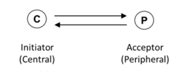


 在顶部的配置文件中，会出现大量的新角色名称，

包括发送者，广播者和接收者。

==为了更好地介绍蓝牙低功耗音频，我们只使用发起者和接受者，而忽略其他角色名称。==

当在核心规范中没有涉及音频流时，会退回使用客户端和服务端。

除广播模式BIS以外，任何设备既可以作为音频源产生音频数据，也可以作为音频接收者，接收数据。

发起者和接受者都可以同时作为音频源设备和音频接收设备，并且他们都可以包含多个蓝牙低功耗音频中的接收设备和源设备。

对于谁生成音频数据和谁接收和渲染音频数据的讨论内容，与谁是发起者和接受者的内容，两者是截然不同的。

极其重要的一点内容是：

发起者的设备负责计算每次音频数据发送的时间点，该工作可以成为调度。

接受者的设备主要负责接收这些音频数据流。

这个概念定义同样也适用于单播和多播。

一个接受者也可以产生音频数据例如同从头戴耳机的麦克风中采集你的声音，但是发起者负责决定发回数据的时机。


由于发起者角色远远比接受者角色更复杂，

通常发起者是手机设备，电视设备和平板，

这些设备的特点是拥有更大的电池容量和更多的资源。

链路调度必须要考虑其他无线连接，例如：Wi-Fi连接，其他蓝牙连接等，

这些都是芯片设计工程师需要处理的棘手问题。

但是，正如我们稍后介绍的，蓝牙低功耗音频方案的上层应用程序拥护很大的权限来影响适配链路调度，

这就是为什么让开发工程师需要熟练地掌握底层协议栈ISO的工作原理。


对于单播的蓝牙低功耗音频，其拥有更灵活的网络拓扑结构，如图4.3。

可以使用与HFP或A2DP类似的网络拓扑结构，一个手机连接一个外围设备（耳机），建立一条音频链路。

在这个拓扑基础上，蓝牙技术允许一个发起者与2个甚至更多的接受者进行通信。

典型的应用场景是手机可以连接一对耳机或者助听器。

这个耳机或者助听器不需要是同一个厂商制作，原因是蓝牙低功耗音频设备是一种可互操作的标准协议。


https://www.feasycom.cn/industry_news/366.html


# 蓝牙连接iso的这个iso怎么理解

在蓝牙音频连接中，ISO (Isochronous Channels) 是指用于时间同步的数据传输通道。蓝牙5.2及以后版本引入了ISO通道，以支持LE Audio的新特性。

### ISO (Isochronous Channels) 概念解释

| **特性**     | **描述**                                                     |
| ------------ | ------------------------------------------------------------ |
| **定义**     | ISO (Isochronous Channels) 是一种用于同步数据传输的通道，保证数据在固定时间间隔内传输。 |
| **用途**     | 主要用于传输音频数据，确保音频流在多个设备间保持同步，减少延迟和抖动。 |
| **工作原理** | 通过设置固定的时间间隔进行数据传输，确保数据包在预定的时间内发送和接收。 |
| **蓝牙5.2**  | 蓝牙5.2引入了ISO通道，以支持LE Audio的高质量音频传输和低延迟通信。 |

### ISO在LE Audio中的应用

1. **多流音频 (Multi-Stream Audio)**
   - 允许多个音频流同时传输，例如左右耳机的独立音频流。
   - 提供更好的立体声效果和音频同步。

2. **广播音频 (Broadcast Audio)**
   - 支持一个设备同时向多个接收设备广播音频数据。
   - 实现公共广播、多人共享音频等场景。

3. **助听器**
   - 提供更低延迟和更高音质的音频传输。
   - 支持多个助听器间的音频同步，提高用户体验。

### ISO通道的优势

| **优势**       | **描述**                                           |
| -------------- | -------------------------------------------------- |
| **低延迟**     | ISO通道提供更低的延迟，适合实时音频应用。          |
| **高可靠性**   | 保证数据在固定时间间隔内传输，减少数据丢失和抖动。 |
| **多设备同步** | 支持多个设备之间的时间同步，确保音频流一致性。     |
| **高质量音频** | 结合LC3编解码器，提高音频质量。                    |

### 总结

ISO (Isochronous Channels) 是蓝牙LE Audio的重要技术，它通过时间同步的数据传输通道，确保高质量、低延迟的音频传输，并支持多流音频和广播音频等新特性。这使得蓝牙LE Audio在音频体验上有了显著提升，适用于各种音频应用场景，如无线耳机、助听器和公共广播系统等。

# ISO interval

每个 CIS 事件都以规则的 ISO 间隔发生，该间隔在 5 毫秒到 4 秒的范围内，以 1.25 毫秒的倍数发生。

每个 CIS 事件都划分为一个或多个子事件。

在 CIS 中，在子事件期间，中央设备发送一次，外设响应，如上图所示。


# 为什么需要同步通道

https://developer.aliyun.com/article/1171620

Isochronous channel 是蓝牙5.2发布的新特性，可以翻译为同步通道，

主要应用在LE Audio上。

它定义了一个有时间依赖的数据的传输通道和传输策略。

首先是定义了一个对于多接收方同步获取数据的机制；

其次是定义了发送方在允许的时间外丢弃数据，从而保证接收方收取的数据满足时效要求。

## 为什么需要同步通道？

ble 的传统的gatt也可以同时连接多个slaver设备，

但是master与多个slaver建立连接的后，

master与每个slaver建立的连接通道都是相互独立的，

使用的是不同的时间基准，

并且每个gatt通道的连接间隔可能也不一样，

所以master在给不同的slaver发送数据的时候无法做到精确的时间同步。

这也是ble之前的应用场景所决定的，

ble传统的gatt连接通道适合进行数据流的传输，

并且通过调整连接interval来提高ble数据传输的峰值速率，这样的设计满足了大部分的数据流的传输要求。

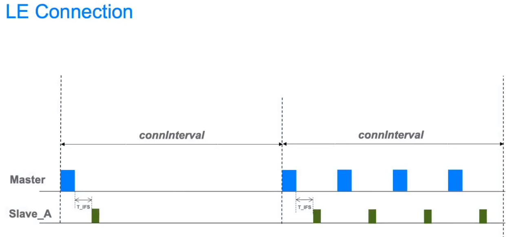


但是音频流和数据流对传输速率的要求是不一样的，

音频流的数据码率是固定的，

比如128bps， 192bps， 

所以音频流并不追求绝对的峰值速率，

而是稳定的、实时的传输通道，

并且音频流通常有多个声道，需要让多个声道的数据有很好的同步性。

就这样，在音频流传输的需求背景下，Isochronous channel 同步通道应运而生。

## 连接同步通道

连接同步通道有两个新的概念，

分别是CIG （Connected Isochronous Group） 和 CIS （Connected Isochronous Stream）。

连接同步通道也有连接间隔，称为ISO_Interval，

这个和ble传统的gatt连接的interval有些类似，但是ISO_Interval把时序分的更加细一些。

CIG：是由master建立的，建立CIG的时候interval已经确认好了。 建立连接后， master可以向slaver发送建立CIG请求，==一个CIG最多可以建立31个CIS。==

CIS： CIS表示每个连接的音频流，可以简单理解为每个CIS就是TWS耳机中的一个设备。每个CIS最多可以包含31个subevent，依次轮流发送， 每个subevent最小的间隔是400us。

连接同步通道又分为两种模式，sequential模式和interleave模式

（这个就跟音频的里的interleave模式那个有点像）

### 总结

1. 连接同步通道是基于蓝牙连接的，首先要先建立ble连接
2. 基于时间同步的音频传输机制，可以实现多个设备的数据同步
3. 一个master可以建立多个CIG
4. 每个CIG可以最多31个CIS
5. 每个CIS里面最多有31个subevent
6. 链路层有LL_CIS_REQ 和 LL_CIS_RSP来创建CIS


## 广播同步通道

广播同步通道 boardcast isochronous 是一个全新的概念，

是建立在蓝牙5.0的周期性广播Periodic advertising的基础之上，

周期广播通道是可以使用预设的0 -36的数据通道上进行数据的发送的，

==首先广播者在37 38 39 广播的时候会广播下一次会出现在哪个数据channel，==

扫描设备可以基于此在特定的时间段，在对应的通道上进行扫描，这样就可以建立一个周期性广播的单向通道。

 广播同步通道也有BIG和 BIS两个概念，这部分和连接同步通道类似。

big boardcast isochronous group：一个设备可以发送多个BIG

bis boardcast isochronous stream： 每个BIG最多可以由多个BIS。

### 总结

1. 无连接的
2. 单向的，无应答机制
3. 广播通道，对接收者的数量没有限制
4. 不仅可以广播数据包还可以广播控制包
5. 每个big里面最多可以包含31个bis


从BT 5.2规范中可见，LE Audio是纯软件协议栈层面的更新，

这一点和需要硬件支持的BT5.1的CODER PHY， LE 2M PHY不一样，

也就是说，各大原厂的产品，部分功能可以直接通过更新SDK即可支持BT5.2 的LE Audio功能。


# 1

为了支持LE Audio的开发，蓝牙官方组织提供了一套完整的规范和工具集，

包括超过二十个文档和SDK，帮助开发者快速上手并开发创新的LE Audio产品


面向开发人员的白皮书

**An Overview of Auracast™ Broadcast Audio**

**How to Design Auracast™ Earbuds**

**How to Build an Auracast™ Transmitter**

**How to Build an Auracast™ Assistant**

**The Auracast™️ Simple Transmitter Best Practices Guide**

**Developing Auracast™ Receivers with an Assistant Application for Legacy Smartphones**


低功耗蓝牙 （LE） 入门介绍了蓝牙 LE 堆栈的每一层，

从底部的物理层开始，

到顶部的通用访问配置文件结束。

还涵盖了与堆栈的分层架构相关的主题，例如安全性。

如果您不熟悉 Bluetooth LE 并希望从技术角度了解该技术，那么这里就是您的起点。

75页的入门文档

https://www.bluetooth.com/wp-content/uploads/2022/05/the-bluetooth-le-primer-v1.2.0.pdf


配置文件规范定义了相关设备（如智能手表和遥控钥匙）所承担的角色，特别是定义了客户端设备的行为以及它应该使用的连接服务器上的数据。

蓝牙的所有规格书

https://www.bluetooth.com/specifications/specs/

linux下开发蓝牙的指导说明

https://www.bluetooth.com/bluetooth-resources/bluetooth-for-linux/

https://www.bluetooth.com/learn-about-bluetooth/feature-enhancements/le-audio/resources/


Nordic Semiconductor的nRF5340音频开发套件（DK）就是一个推荐平台，它包含所有必要的配置和示例代码，可以作为USB收发器发送或接收来自PC的音频

# LC3

LC3采用了更灵活的编码策略，支持独立的左右音频流，这使得它在处理复杂音频信号时更加高效

另外，LE Audio基于蓝牙协议5.2 Isochronous Channels功能，传递数据时减少了不必要的信息交互，从而极大降低了功耗。

与经典蓝牙相比，LE Audio的能耗仅为Wi-Fi的10-20%，比经典蓝牙低5%。

LC3plus作为LC3的超集，在LC3的基础上增加了抗干扰传输、极低延迟和高解析音频等功能，使其在无线耳机或扬声器上实现了高质量的音频流。

这些特性不仅提升了音质，还确保了在各种环境下的稳定性和可靠性。


随着 TWS（True Wireless Stereo）耳机的兴起，用户对便携式音频设备的需求不断增加，希望体验更加自由、无拘束的音频享受。

然而，在这个音频革命的时代，传统蓝牙技术在面对一些挑战时显得力不从心。

传统蓝牙音频通常需要更高的功耗，

而连接管理、同步性能等方面也存在一些限制，无法完全满足用户对高品质、低功耗音频体验的期望。


正是在这个背景下，蓝牙技术的新一代——BLE Audio应运而生。

BLE Audio汲取了TWS耳机兴起时用户对自由、便捷音频体验的追求，

通过引入先进的编解码器（如LC3）、支持多流音频、实现广播音频等一系列创新技术，

为用户提供更高音质、更低功耗的音频传输方案。

BLE Audio的诞生不仅为用户带来更出色的音频体验，也推动了蓝牙技术在音频领域的不断进步，使得蓝牙成为无线音频连接的先锋技术。

https://blog.csdn.net/ppc_dragon/article/details/135827836


Auracast广播音频还支持两种模式：

一种是开放模式，允许任何范围内的接收设备参与；

另一种是密钥保护模式，只允许具有正确密钥的接收设备参与。


https://www.feasycom.com.cn/6390.html

# LEAudio协议详解

https://blog.csdn.net/cai472861/category_7886266.html

状态是从宏观角度了解ble，

spec将状态分为划分为7种状态，

这些状态又可以分属于非连接状态和连接状态 。

不同状态下,链路层都会有对应的PDU格式定义，

不同的PDU对应不同的物理信道，这些知识点可以继续衍生

首先了解这些状态之间的切换，对于后面深入分析整个LE audio 流程十分必要


ble audio分为两种方式，

一个是通过GATT连接（UMS和UMR），

一个是通过ble 广播包(BMS和BMR)。

需要建立连接的GATT需要关注initiating 和 connection state

非连接广播包需要关注 Advertising，Scanning，Isochronous Broadcasting state，Synchronization state

基本上所有状态都会涉及到ble audio的应用场景。


如spec所规定，LE在2.4GHz频段定义了40个RF信道，

这些信道又重新抽象到了四种LE 物理信道。

分别是advertising, periodic, isochronous, and data。

广播信道分为两类： primary 物理信道37,38,39， 其他的为secondary 物理信道。


# 蓝牙leaudio一帧7.5ms和一帧10ms具体是指什么

在蓝牙LE Audio中，一帧7.5ms和一帧10ms指的是音频数据传输的时间帧（Time Frame），具体来说，是指每次音频数据包的传输时间间隔。这些时间帧的选择影响音频流的延迟和质量。

| 时间帧 | 描述                                                         |
| ------ | ------------------------------------------------------------ |
| 7.5ms  | 每隔7.5毫秒传输一个音频数据包。较短的时间帧可以减少音频延迟，适用于实时性要求较高的应用，如语音通话。 |
| 10ms   | 每隔10毫秒传输一个音频数据包。稍长的时间帧可能会增加一点延迟，但有助于减少传输开销和功耗，适用于音乐播放等应用。 |

选择不同的时间帧长度取决于具体应用的需求。7.5ms的时间帧提供更低的延迟，适合需要高实时性的场景。而10ms的时间帧则在降低功耗和系统开销方面更有优势。


# 手机和手环的场景，手环是gatt server还是gatt client？

在手机和手环的场景中，手环通常作为GATT Server（通用属性配置文件服务器），手机作为GATT Client（通用属性配置文件客户端）。这种配置允许手环提供传感器数据（如心率、步数等），而手机通过读取和写入手环上的GATT特性来获取或控制这些数据。

### 角色划分

| 设备 | 角色        | 描述                                                     |
| ---- | ----------- | -------------------------------------------------------- |
| 手机 | GATT Client | 发起GATT操作，读取或写入手环的特性。                     |
| 手环 | GATT Server | 托管GATT服务，提供传感器数据和其他特性供手机读取或写入。 |

### 工作流程

1. **连接建立**：手机（GATT Client）通过蓝牙扫描并连接到手环（GATT Server）。
2. **服务发现**：手机发现并浏览手环托管的GATT服务和特性。
3. **数据读取**：手机通过读取手环上的GATT特性获取传感器数据。
4. **数据写入**：手机通过写入GATT特性向手环发送控制指令，如启动或停止某个传感器。
5. **通知和指示**：手环可以通过通知或指示机制主动向手机发送数据更新。

### 示例场景

假设手环提供心率数据服务，手机需要读取心率数据并显示给用户。

**手环（GATT Server）代码示例**：

```c
// 定义心率服务和特性
static struct bt_gatt_attr attrs[] = {
    BT_GATT_PRIMARY_SERVICE(BT_UUID_HRS),
    BT_GATT_CHARACTERISTIC(BT_UUID_HRS_MEASUREMENT, BT_GATT_CHRC_NOTIFY,
                           BT_GATT_PERM_READ, NULL, NULL, &heart_rate_value),
    BT_GATT_CCC(heart_rate_ccc_cfg_changed, BT_GATT_PERM_READ | BT_GATT_PERM_WRITE),
};

// 回调函数：心率通知配置更改
static void heart_rate_ccc_cfg_changed(const struct bt_gatt_attr *attr, uint16_t value) {
    notify_enabled = (value == BT_GATT_CCC_NOTIFY);
}

// 更新心率数据并发送通知
void update_heart_rate(uint8_t heart_rate) {
    heart_rate_value = heart_rate;
    if (notify_enabled) {
        bt_gatt_notify(NULL, &attrs[1], &heart_rate_value, sizeof(heart_rate_value));
    }
}
```

**手机（GATT Client）代码示例**：

```c
// 发现手环上的心率服务
static void discover_hrs_service(struct bt_conn *conn) {
    // 执行服务发现，找到心率服务并订阅心率特性通知
}

// 回调函数：接收心率数据
static void heart_rate_received(struct bt_conn *conn, const struct bt_gatt_attr *attr, const void *buf, uint16_t len) {
    uint8_t heart_rate = *(uint8_t *)buf;
    // 处理接收到的心率数据，更新UI等
}

// 订阅心率特性通知
void subscribe_heart_rate(struct bt_conn *conn) {
    bt_gatt_subscribe(conn, &heart_rate_subscription);
}
```

### 理解

- **GATT Server（手环）**：托管GATT服务和特性，提供传感器数据（如心率）。
- **GATT Client（手机）**：发起GATT操作，读取手环上的数据并进行处理，如显示在应用界面上。

这种配置允许手机通过蓝牙连接手环，获取实时的传感器数据，并对手环进行控制。这是手机和可穿戴设备（如手环、智能手表）之间常见的交互模式。

# gap central 角色和gatt server之间有关系吗？

GAP（Generic Access Profile）和GATT（Generic Attribute Profile）是蓝牙协议中的两个不同层面，它们之间的角色虽然可以相互关联，但并不直接依赖。

### GAP Central 角色

GAP定义了设备如何在物理层面上相互发现和连接。在GAP中，Central角色是指主动扫描并连接其他设备的角色。Central角色通常是主动发起连接请求的设备，例如智能手机在扫描和连接手环时就扮演Central角色。

### GATT Server 角色

GATT定义了设备如何在应用层面上使用属性（Attributes）进行通信。GATT Server是指托管数据属性并响应客户端请求的设备。例如，手环托管心率服务和特性，允许手机读取心率数据。

### 关系

GAP角色和GATT角色是独立定义的，但它们可以在一个设备上组合使用。以下是两者之间关系的常见情形：

1. **Central + GATT Client**：
    - 典型场景：智能手机连接手环。
    - GAP角色：Central（主动扫描和连接手环）。
    - GATT角色：Client（读取手环上的数据特性，如心率）。

2. **Peripheral + GATT Server**：
    - 典型场景：手环提供数据给手机。
    - GAP角色：Peripheral（被扫描并接受连接）。
    - GATT角色：Server（托管心率数据服务，响应手机的读取请求）。

3. **Central + GATT Server**（较少见）：
    - 设备作为Central角色连接其他设备，同时也托管一些GATT服务供其他设备使用。
    - 典型场景：智能手机既主动连接手环，又被其他设备读取一些本地服务（如位置服务）。

### 示例场景解析

| 场景             | GAP角色    | GATT角色 | 描述                                           |
| ---------------- | ---------- | -------- | ---------------------------------------------- |
| 手机连接手环     | Central    | Client   | 手机扫描并连接手环，读取心率数据。             |
| 手环提供心率数据 | Peripheral | Server   | 手环被手机连接，托管心率数据服务。             |
| 手机连接并被读取 | Central    | Server   | 手机连接其他设备，同时被其他设备读取一些服务。 |

### 示例代码

以下是假想的代码片段，展示了手机作为GAP Central和GATT Client，手环作为GAP Peripheral和GATT Server的实现：

**手机（Central + GATT Client）**：

```c
// 扫描并连接手环
void start_scan_and_connect() {
    // 扫描代码
    // 连接代码
}

// 发现手环上的GATT服务
void discover_services(struct bt_conn *conn) {
    // 执行服务发现
}

// 读取手环上的心率数据
void read_heart_rate(struct bt_conn *conn) {
    // 读取心率特性
}
```

**手环（Peripheral + GATT Server）**：

```c
// 广播并等待连接
void start_advertising() {
    // 广播代码
}

// 定义心率服务和特性
static struct bt_gatt_attr attrs[] = {
    BT_GATT_PRIMARY_SERVICE(BT_UUID_HRS),
    BT_GATT_CHARACTERISTIC(BT_UUID_HRS_MEASUREMENT, BT_GATT_CHRC_NOTIFY,
                           BT_GATT_PERM_READ, NULL, NULL, &heart_rate_value),
    BT_GATT_CCC(heart_rate_ccc_cfg_changed, BT_GATT_PERM_READ | BT_GATT_PERM_WRITE),
};

// 回调函数：心率通知配置更改
static void heart_rate_ccc_cfg_changed(const struct bt_gatt_attr *attr, uint16_t value) {
    notify_enabled = (value == BT_GATT_CCC_NOTIFY);
}

// 更新心率数据并发送通知
void update_heart_rate(uint8_t heart_rate) {
    heart_rate_value = heart_rate;
    if (notify_enabled) {
        bt_gatt_notify(NULL, &attrs[1], &heart_rate_value, sizeof(heart_rate_value));
    }
}
```

### 总结

GAP Central和GATT Server角色在蓝牙设备中可以独立存在，也可以组合使用。理解它们的关系有助于正确配置和使用蓝牙设备以实现特定的应用场景。

# Auracast

https://news.eeworld.com.cn/qrs/ic627344.html

https://www.wpgdadatong.com.cn/blog/detail/71442

https://www.telink-semi.com/implementing-bluetooth-bis-and-cis-le-audio/


无线音频设备必须支持两个基本功能：播放音频和电话。

要播放音乐和其他音轨，必须支持双声道立体声音频。

通话过程中，必须支持同时发送和接收音频数据。

此外，许多扬声器和耳机现在都支持语音助手功能，其主要功能之一是响应唤醒词。

最后，必须可以进行多个连接，因为许多用户将耳机连接到多个设备，例如，同时连接到计算机和手机。


Classic Audio 中有三个配置文件：

- **A2DP (Advanced Audio Distribution Profile)** – handles stereo multimedia audio streaming from one device to another
  A2DP（高级音频分发配置文件）– 处理从一台设备到另一台设备的立体声多媒体音频流
- **HFP (Hands-free Profile)** – provides two-way audio (at a lower quality) for hands-free calls and other functions
  HFP（免提配置文件） – 为免提通话和其他功能提供双向音频（质量较低）
- **AVCRP (Audio/Video Remote Control Profile)** – provides audio remote control functionality (play/pause and volume)
  AVCRP （音频/视频远程控制配置文件） – 提供音频远程控制功能（播放/暂停和音量）


对于大多数应用程序，Classic Audio 中的配置文件运行良好;

但是，在许多情况下，它们需要组合在一起才能提供设备的全部功能。

例如，耳机用于听音乐和打电话，需要 A2DP 和 HFP 配置文件（如果耳机有音频遥控器，则除了 AVCRP 之外）。

==安装后，许多头戴式耳机将显示为两种设备：免提式耳机和立体声式耳机。==

==如果用户正在听音乐，则使用 A2DP 配置文件，但如果有呼叫进来，设备必须切换到音频质量较低的 HFP 配置文件。==


通用音频框架 （GAF） 是 LE Audio 的新增功能，是一组规范，

它们构成了一个中间件，其中包含许多音频应用程序通用的功能。

许多音频设备只需 GAF 中的定义即可实现全部功能。

各个规范定义了互操作性的基本级别，允许两个蓝牙 LE 音频设备在彼此之间传输音频。

顶级规范以 GAF 中的规范为基础，并为特定音频应用添加了附加功能。


BAP 中的规范可用于开发 LE Audio 产品;

例如，对于单播应用程序（一个源和一个接收器），使用 BAP、ASCS 和 PACS，并且用于广播 BAP、PACS 和 BASS。

经典音频的缺点之一是当两个设备没有共同的音频配置文件时，它们之间不兼容。

使用 LE Audio，即使两个设备具有不同的顶级配置文件，它们仍然能够设置音频流，因为两者都与 BAP 兼容。


https://community.element14.com/learn/learning-center/essentials/w/documents/27815/learn-the-basics-and-implementations-of-bluetooth-le-audio-and-its-applications


蓝牙5.2的改动点

https://novelbits.io/bluetooth-version-5-2-le-audio/


# leaudio的 gatt UUID

LE Audio使用了多个GATT（Generic Attribute Profile）服务和特性，它们都有各自的UUID（通用唯一标识符）。这些UUID在LE Audio中定义了不同的功能，如音频流传输、音频控制等。

### LE Audio的GATT UUID

以下是一些LE Audio相关的主要GATT服务和特性的UUID：

| 服务/特性 | 名称                                    | UUID   |
| --------- | --------------------------------------- | ------ |
| 服务      | **Audio Stream Control Service (ASCS)** | 0x184E |
| 特性      | **ASE Control Point**                   | 0x2BC1 |
| 特性      | **ASE Status**                          | 0x2BC2 |
| 特性      | **ASE Data**                            | 0x2BC3 |
| 服务      | **Microphone Control Service (MCS)**    | 0x184F |
| 特性      | **Microphone Control Point**            | 0x2BC4 |
| 特性      | **Microphone Gain**                     | 0x2BC5 |
| 服务      | **Audio Input Control Service (AICS)**  | 0x1850 |
| 特性      | **Audio Input Control Point**           | 0x2BC6 |
| 特性      | **Audio Input Status**                  | 0x2BC7 |
| 特性      | **Audio Input Gain**                    | 0x2BC8 |
| 服务      | **Volume Control Service (VCS)**        | 0x184B |
| 特性      | **Volume Control Point**                | 0x2BC9 |
| 特性      | **Volume State**                        | 0x2BCA |
| 特性      | **Volume Flag**                         | 0x2BCB |

### 具体功能说明

1. **Audio Stream Control Service (ASCS)**
   - **ASE Control Point (0x2BC1)**: 用于控制音频流端点（Audio Stream Endpoint, ASE）的特性，执行命令如启动、停止和配置音频流。
   - **ASE Status (0x2BC2)**: 提供ASE的当前状态信息。
   - **ASE Data (0x2BC3)**: 用于传输实际的音频数据。

2. **Microphone Control Service (MCS)**
   - **Microphone Control Point (0x2BC4)**: 控制麦克风的特性，如启动和停止麦克风。
   - **Microphone Gain (0x2BC5)**: 用于调节麦克风增益。

3. **Audio Input Control Service (AICS)**
   - **Audio Input Control Point (0x2BC6)**: 控制音频输入的特性，如选择音频输入源。
   - **Audio Input Status (0x2BC7)**: 提供音频输入的当前状态信息。
   - **Audio Input Gain (0x2BC8)**: 用于调节音频输入增益。

4. **Volume Control Service (VCS)**
   - **Volume Control Point (0x2BC9)**: 控制音量的特性，如调节音量大小。
   - **Volume State (0x2BCA)**: 提供当前的音量状态信息。
   - **Volume Flag (0x2BCB)**: 用于表示音量控制的标志。

### 示例代码

以下是一个简化的示例代码，展示如何使用GATT UUID配置一个LE Audio设备的GATT服务：

```c
// 定义Audio Stream Control Service (ASCS)
static struct bt_gatt_attr ascs_attrs[] = {
    BT_GATT_PRIMARY_SERVICE(BT_UUID_DECLARE_16(0x184E)),
    BT_GATT_CHARACTERISTIC(BT_UUID_DECLARE_16(0x2BC1),
                           BT_GATT_CHRC_WRITE_WITHOUT_RESP,
                           BT_GATT_PERM_WRITE, NULL, ase_control_write, NULL),
    BT_GATT_CHARACTERISTIC(BT_UUID_DECLARE_16(0x2BC2),
                           BT_GATT_CHRC_NOTIFY,
                           BT_GATT_PERM_READ, NULL, NULL, &ase_status),
    BT_GATT_CHARACTERISTIC(BT_UUID_DECLARE_16(0x2BC3),
                           BT_GATT_CHRC_NOTIFY | BT_GATT_CHRC_WRITE_WITHOUT_RESP,
                           BT_GATT_PERM_READ | BT_GATT_PERM_WRITE, NULL, ase_data_write, &ase_data),
};

// 回调函数：写入ASE Control Point
static ssize_t ase_control_write(struct bt_conn *conn, const struct bt_gatt_attr *attr, const void *buf, uint16_t len, uint16_t offset, uint8_t flags) {
    // 处理写入的数据
    return len;
}

// 回调函数：写入ASE Data
static ssize_t ase_data_write(struct bt_conn *conn, const struct bt_gatt_attr *attr, const void *buf, uint16_t len, uint16_t offset, uint8_t flags) {
    // 处理音频数据
    return len;
}
```

### 总结

LE Audio中的GATT UUID定义了不同的服务和特性，用于支持音频数据的传输和控制。理解这些UUID及其对应的功能对于实现和调试LE Audio设备至关重要。在实际开发中，这些UUID将用于配置GATT服务，以实现音频流的控制、传输和管理。

# Leaudio在单播场景里，同时使用了ACL和CIS，那是同时使用了经典蓝牙和BLE吗？

在LE Audio的单播场景中，同时使用了ACL（Asynchronous Connection-Less）和CIS（Connected Isochronous Stream），但这并不意味着同时使用了经典蓝牙和BLE。具体解释如下：

| **概念**                                | **说明**                                                     |
| --------------------------------------- | ------------------------------------------------------------ |
| **ACL（Asynchronous Connection-Less）** | 在LE Audio中指的是蓝牙低功耗（BLE）中的一种数据传输方式，用于传输常规数据包。 |
| **CIS（Connected Isochronous Stream）** | 在LE Audio中指的是蓝牙低功耗（BLE）中的一种数据传输方式，用于传输同步音频数据。 |

### 详细解释

1. **ACL在LE Audio中的应用**：
   - 虽然ACL在经典蓝牙中也有使用，但在LE Audio中，ACL指的是BLE的ACL数据包。
   - ACL数据包用于传输常规的控制数据和非音频数据。

2. **CIS在LE Audio中的应用**：
   - CIS是一种新的数据传输方式，引入于Bluetooth 5.2，专门用于LE Audio。
   - CIS用于传输高优先级的音频数据，保证音频传输的同步性和低延迟。

### 关键点

- **LE Audio专用**：LE Audio完全基于BLE技术，并不涉及经典蓝牙（BR/EDR）。因此，在LE Audio的单播场景中，同时使用的ACL和CIS都是基于BLE的，不涉及经典蓝牙。
- **数据传输方式**：ACL用于常规数据传输，CIS用于高优先级音频数据传输，二者共同工作以实现高效、低延迟的音频传输。

总结来说，在LE Audio的单播场景中，同时使用ACL和CIS指的是在蓝牙低功耗（BLE）下，同时使用这两种不同的数据传输方式，并不涉及经典蓝牙。

# 经典蓝牙的acl和ble的acl是什么关系

经典蓝牙（BR/EDR）的ACL和BLE的ACL在名称上相同，但它们在技术上有不同的实现和应用场景。以下是经典蓝牙的ACL和BLE的ACL之间的关系和区别：

| **特性**     | **经典蓝牙的ACL**                                       | **BLE的ACL**                                 |
| ------------ | ------------------------------------------------------- | -------------------------------------------- |
| **全称**     | Asynchronous Connection-Less                            | Asynchronous Connection-Less                 |
| **技术标准** | 经典蓝牙（Bluetooth BR/EDR）                            | 蓝牙低功耗（Bluetooth Low Energy, BLE）      |
| **引入版本** | Bluetooth 1.2                                           | Bluetooth 4.0                                |
| **功耗**     | 较高，适用于高数据速率和持续连接                        | 低功耗，适用于间歇性数据传输和节能应用       |
| **数据速率** | 高，可达3 Mbps                                          | 较低，通常在1 Mbps以内                       |
| **应用场景** | 音频流、文件传输、蓝牙耳机、蓝牙音箱等                  | 物联网设备、传感器、智能家居、健康监测设备等 |
| **连接机制** | 使用基础带宽（BR）或增强数据率（EDR）进行连接和数据传输 | 使用广告包和连接事件进行连接和数据传输       |
| **协议栈**   | 包括L2CAP、RFCOMM等                                     | 包括GATT、ATT等                              |

### 关系与区别

- **关系**：
  - **相同名称**：两者都使用了“ACL”这个术语，表示异步连接，旨在区分同步连接（如SCO，用于音频）。
  - **不同实现**：尽管名称相同，但它们在技术实现上有很大差异，适用于不同的蓝牙标准和应用场景。

- **区别**：
  - **技术标准**：经典蓝牙的ACL属于Bluetooth BR/EDR标准，而BLE的ACL属于Bluetooth Low Energy标准。
  - **功耗和数据速率**：经典蓝牙的ACL功耗较高，数据速率也较高，适用于需要持续连接和高数据速率的应用；而BLE的ACL功耗低，数据速率较低，适用于低功耗和间歇性数据传输的应用。
  - **应用场景**：经典蓝牙的ACL主要用于音频传输和高数据速率的应用，而BLE的ACL主要用于低功耗物联网设备和传感器。

### 总结

经典蓝牙的ACL和BLE的ACL虽然在名称上相同，但它们属于不同的蓝牙标准，有不同的技术实现和应用场景。经典蓝牙的ACL适用于高数据速率和持续连接的应用，而BLE的ACL则专为低功耗和间歇性数据传输设计。


# leaudio的音频数据是在GATT上传输吗？GATT一次可以传输多少字节

LeAudio（Bluetooth Low Energy Audio）是蓝牙5.2及以后的标准中引入的音频传输方案，旨在提供高效的音频流传输。LeAudio音频数据的传输并不是通过传统的GATT（Generic Attribute Profile）进行的，而是通过一个新的协议层——**ISO（Isochronous）** 数据通道进行的。

### 1. **LeAudio和GATT的区别**

- **LeAudio**：使用ISO数据通道来传输音频数据。ISO数据通道支持低延迟、同步的音频流传输，适合音频应用的需求。
- **GATT**：主要用于传输短小的属性数据，适用于设备的配置信息和状态信息传输。

### 2. **ISO数据通道**

- **音频数据流**：LeAudio通过ISO数据通道进行音频数据的流式传输。ISO数据通道提供了定期、同步的数据传输，这对音频流的质量和实时性非常重要。
- **流式传输**：ISO数据通道支持音频流的定期传输，确保数据的同步性和实时性。

### 3. **GATT的传输限制**

在GATT中，数据的传输是通过特性（Characteristics）进行的。每个特性可以定义一个数据长度限制，通常有以下几个方面：

- **MTU（Maximum Transmission Unit）**：GATT的最大传输单元（MTU）决定了单次传输的数据长度。在BLE中，默认的MTU是23字节（包括4字节的GATT头部），但可以通过协商增加到更大的值。
- **最大字节数**：GATT的MTU大小可以协商到最大512字节。这意味着在使用GATT传输数据时，一次可以传输的数据长度可以达到512字节（不包括GATT头部）。

### 4. **GATT和音频数据传输**

- **音频传输不使用GATT**：虽然GATT可以用于传输数据，但LeAudio的音频数据传输依赖于ISO数据通道，因为它需要保证数据的实时性和同步性，而GATT更适合传输控制和配置信息。

### 总结

- **LeAudio音频数据传输**：通过ISO数据通道进行，不使用GATT。
- **GATT的传输限制**：GATT一次传输的数据长度由MTU决定，最大可以协商到512字节。

LeAudio利用ISO数据通道提供了更适合音频流传输的机制，而GATT主要用于其他类型的数据传输。

# iso在蓝牙协议栈的哪一层

可以看到跟L2CAP是并排的，并不是基于L2CAP。

https://docs.zephyrproject.org/latest/connectivity/bluetooth/api/audio/bluetooth-le-audio-arch.html

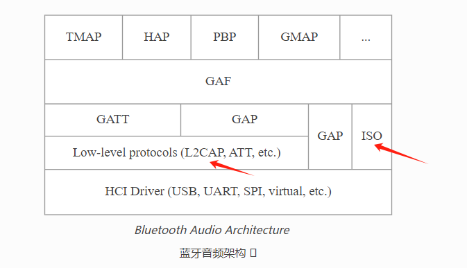

# leaudio实现multi-stream同步的原理是什么

LeAudio 实现 Multi-Stream 同步（多流同步）的关键在于使用了新的 ISO（Isochronous）数据通道以及与其配合的技术和机制。这些技术和机制使得多个音频流可以在不同设备之间同步传输，确保多设备间的音频播放一致性。

### 1. **ISO数据通道和CIS**

- **ISO数据通道**：用于提供定期的、同步的音频流传输。
- **CIS（Connected Isochronous Stream）**：是ISO数据通道的一种，专门用于同步的音频流传输。每个CIS代表一个单独的音频流，它们可以在不同的设备之间同步。

### 2. **同步组（Broadcast Isochronous Group, BIG）**

- **同步组**：多个CIS可以被组织成一个同步组（BIG）。所有属于同一个BIG的CIS会共享一个公共的时钟基准，这意味着它们的数据包会在一个共同的时间基准上传输，从而实现同步。

### 3. **时钟同步机制**

- **广播基准时钟**：主设备（或源设备）负责广播一个基准时钟，这个时钟用作同步参考。接收设备（如多个耳机）使用这个基准时钟来同步它们的本地时钟。
- **时钟偏移调整**：接收设备通过调整自身时钟与基准时钟的偏差来确保它们在同一时间点接收和播放音频数据。

### 4. **帧同步**

- **帧计数**：每个CIS的音频数据包按帧传输，每帧都有一个帧计数。这些帧计数帮助接收设备识别和排列音频数据，确保音频流的正确顺序。
- **帧对齐**：通过帧计数和基准时钟的共同作用，多个CIS可以实现帧对齐，即不同设备播放的音频帧能够在相同的时间点被播放，从而实现音频的同步。

### 5. **低延迟和抖动控制**

- **低延迟**：ISO数据通道设计用于低延迟传输，这对于音频同步尤其重要。低延迟确保音频流能快速传输和播放，减少了声音不同步的可能性。
- **抖动缓冲**：设备可以使用抖动缓冲（Jitter Buffer）来处理因网络波动引起的抖动，进一步提高同步精度。

### 6. **应用场景**

- **立体声耳机**：两个耳机同时接收来自同一源的音频流，确保左右耳的声音同步。
- **多房间音响系统**：在不同房间的音响设备之间同步播放音乐，实现全屋同步音频体验。

### 总结

LeAudio 实现 Multi-Stream 同步的原理主要依赖于 ISO 数据通道，尤其是 CIS 和 BIG 的使用。这些机制通过共享基准时钟、帧计数和帧对齐等技术，实现了多设备之间音频流的同步播放。时钟同步、低延迟和抖动控制等措施也为音频的同步传输提供了技术保障。这些技术共同确保了在多设备场景下，音频播放的一致性和同步性。

# leaudio使用的iso和gatt是怎么配合的

LE Audio 使用 ISO（Isochronous Channels）和 GATT（Generic Attribute Profile）来实现音频传输和控制。两者的配合可以分为以下几个方面：

### 1. **ISO（Isochronous Channels）**
ISO 是一种新的蓝牙数据传输机制，专门设计用于高质量、低延迟的音频传输。它支持两种类型的流：
- **CIS（Connected Isochronous Stream）**：用于单播音频传输，适合点对点的音频传输，例如耳机和手机之间的通信。
- **BIS（Broadcast Isochronous Stream）**：用于广播音频传输，适合一对多的场景，例如广播音频。

ISO 允许更好的同步和数据传输管理，这对于实现高质量的音频体验至关重要。

### 2. **GATT（Generic Attribute Profile）**
GATT 是蓝牙协议栈中的一个配置文件，用于定义如何通过蓝牙低功耗（BLE）设备进行数据通信。GATT 服务和特征用于发现和配置设备功能。

在 LE Audio 中，GATT 主要用于以下目的：
- **服务发现**：确定设备是否支持 LE Audio 以及支持哪些功能。
- **特征配置**：例如，音频控制、音量设置等。
- **音频控制**：通过 GATT 特性来控制音频传输的参数，例如选择编码格式、设置采样率等。

### 3. **ISO 和 GATT 的配合**
LE Audio 的实现通常会遵循以下步骤：
1. **设备连接和配对**：使用标准的 BLE 连接过程。
2. **服务发现（GATT）**：连接后，客户端设备使用 GATT 发现服务器设备上支持的服务，尤其是与音频相关的服务，如 Audio Stream Control Service (ASCS)。
3. **特征配置（GATT）**：客户端根据需要配置服务特性，如音频格式、音量控制等。
4. **ISO 通道配置**：配置 ISO 通道，用于实际的音频数据传输。这包括建立 ISO 链接、设置传输参数等。
5. **音频数据传输（ISO）**：实际的音频数据通过 ISO 通道传输。根据应用需求，可以是单播（CIS）或广播（BIS）模式。
6. **音频控制（GATT）**：使用 GATT 特性进行音频控制，例如播放、暂停、音量调整等。

### 图示说明

| 步骤                | 描述                                           |
| ------------------- | ---------------------------------------------- |
| 设备连接和配对      | 建立 BLE 连接，进行设备配对和认证              |
| 服务发现（GATT）    | 客户端发现服务器设备上支持的 GATT 服务         |
| 特征配置（GATT）    | 配置音频相关的 GATT 特性（如编码格式、音量等） |
| ISO 通道配置        | 建立和配置 ISO 通道用于音频数据传输            |
| 音频数据传输（ISO） | 使用 ISO 通道传输音频数据，保证低延迟和高质量  |
| 音频控制（GATT）    | 通过 GATT 特性控制音频播放、暂停、音量等参数   |

这个流程确保了设备之间能够高效地传输高质量的音频数据，同时提供了灵活的控制选项。

# leaudio是发完一帧音频后马上就发送下一帧吗？

LE Audio 的 ISO（Isochronous）通道设计用于定期和同步地传输音频数据。通常情况下，音频帧以固定的时间间隔发送，这个时间间隔称为**ISO 间隔**（ISO Interval）。每个 ISO 间隔内可以包含一个或多个音频帧，具体取决于帧的长度和使用的比特率。

在 LE Audio 的传输机制中，发送器不会等到一个音频帧完全发送完毕才开始处理和发送下一个音频帧，而是会在每个 ISO 间隔开始时，根据提前设定的时间表，发送对应的数据包。这种方式确保了音频数据的定期和连续传输，减少了延迟和抖动。

因此，发送下一个音频帧的时间是预先确定的，并不是立即在前一个帧发送完毕后才决定的。这种安排有助于同步发送和接收器的操作，确保音频流的平稳性。

# LC3的帧的7.5ms和这里说的iso间隔7.5ms是同一个东西吗？

LC3 的帧长度和 ISO 间隔是两个不同的概念，但它们之间有一定的关联。

- **LC3 帧长度**：
  - 指的是编码器生成的一段音频数据所对应的时间长度。比如，7.5ms 的 LC3 帧表示这段编码音频数据涵盖 7.5 毫秒的音频内容。LC3 支持不同的帧长度，如 7.5ms 和 10ms，帧长度选择会影响音频的延迟和质量。

- **ISO 间隔**：
  - 是 LE Audio ISO 通道中数据包传输的时间间隔。它定义了两个连续音频数据包之间的时间间隔。ISO 间隔决定了音频数据的传输频率，从而影响整体的音频流的延迟和同步性。

**关联**：
- ISO 间隔通常设置为 LC3 帧长度的整数倍，以便每个 ISO 间隔内传输完整的 LC3 帧或帧的倍数。例如，如果使用 7.5ms 的 LC3 帧，ISO 间隔可以设置为 7.5ms 或 15ms。这样可以确保每个 ISO 间隔内的数据包包含完整的音频帧，避免音频数据被切割不完整。

因此，虽然 LC3 的帧长度和 ISO 间隔是不同的概念，它们在系统设计中必须协调一致，以确保音频流的平滑和高效传输。

# iso间隔值一般设置为多少？基于什么因素决定？

ISO 间隔是 LE Audio 中用于确定数据包传输周期的时间间隔，通常以毫秒为单位。它决定了数据包的发送频率，从而影响音频的延迟和传输效率。

ISO 间隔的选择主要基于以下几个因素：

1. **应用延迟要求**：
   - 如果需要较低的延迟，比如在实时语音通信中，通常选择较小的 ISO 间隔，比如 7.5ms 或 10ms。
   - 对于不太敏感于延迟的应用（如音乐流媒体），可以选择稍长的 ISO 间隔以提高传输效率。

2. **音频质量和比特率**：
   - 较高的音频质量通常需要更高的比特率，这会影响每个间隔内可以传输的数据量。
   - 比特率和帧大小决定了每个间隔需要发送的数据包的大小和数量。

3. **设备的处理能力**：
   - 发送和接收设备的处理能力也会影响 ISO 间隔的选择。较短的间隔要求设备能够更频繁地处理和传输数据。

4. **能耗考虑**：
   - 较长的 ISO 间隔通常意味着较低的传输频率，这可能有助于节省功耗。

典型的 ISO 间隔值包括 7.5ms、10ms、20ms 等。7.5ms 和 10ms 是常见的选择，特别是在要求较低延迟的应用中。具体选择哪个值，需要在音频质量、延迟、设备能力和能耗之间找到一个平衡点。

# iso的等时性在实际中是怎么体现的？什么时候会丢弃数据？

LE Audio 的 ISO 通道的等时性（isochronous）指的是数据传输的定期性和同步性，即数据包按照固定的时间间隔（ISO 间隔）传输。这种特性对于实时音频流的传输非常重要，因为它保证了数据以恒定的速度和时间到达接收端，避免音频断续和延迟波动。

### 实际中的等时性体现

1. **固定的发送和接收时间**：
   - 数据包的发送和接收发生在固定的时间点上。例如，如果 ISO 间隔为 10ms，那么每 10ms 就会有一个新的音频数据包被发送和接收。这种规律性的传输可以保证音频的同步和连续性。

2. **同步的音频流处理**：
   - 发送端和接收端会同步处理音频数据，以确保音频流的平稳传输和播放。接收端的解码器会根据接收到的数据包的时间戳来调整播放的时序。

### 数据丢弃的情形

在 ISO 通道中，有可能发生数据丢弃的情况，这通常与以下几个因素有关：

1. **网络拥塞或干扰**：
   - 如果无线环境中的干扰较大或网络拥塞，可能会导致数据包传输失败或丢失。在等时性通信中，丢失的数据包通常不会重新传输，因为这会引入额外的延迟。

2. **接收端缓冲区溢出**：
   - 如果接收端无法及时处理传入的数据包，可能导致缓冲区溢出。这种情况下，多余的数据包会被丢弃。

3. **数据包到达延迟过大**：
   - 如果某些数据包未能在预定的时间窗口内到达，接收端可能会丢弃这些数据包，以保持音频流的时间同步性。这种情况通常发生在网络延迟波动较大的情况下。

数据丢弃的处理通常由应用层决定。

对于音频流，丢弃一些数据包可能会导致音质降低或音频间断，但这比引入较大的延迟或抖动更容易接受。

在实际应用中，选择合适的 ISO 间隔和音频编码参数，以减少数据丢弃和确保音频流的平滑播放是至关重要的。

# 决定是否丢弃数据的时间窗口一般是多大

在 LE Audio 等时性（isochronous）传输中，决定是否丢弃数据的时间窗口通常与音频帧的间隔和系统的延迟容忍度有关。具体的时间窗口大小取决于应用场景和设备的设计，但有几个关键因素影响这个时间窗口的大小：

1. **音频帧长度**：
   - 例如，如果使用的是 7.5ms 的 LC3 音频帧，那么每个帧必须在 7.5ms 的时间窗口内到达并被处理，否则就会被视为延迟过大。

2. **ISO 间隔**：
   - 如果 ISO 间隔设定为 10ms，那么理论上，数据包应该在下一个 ISO 间隔到来之前到达接收端。如果未能在此间隔内到达，接收端可能会丢弃数据，以维持音频流的时间同步性。

3. **缓冲策略和容忍延迟**：
   - 有些系统可能会在接收端设置额外的缓冲，以容忍小幅度的延迟波动。但这种缓冲通常不会太大，以避免引入显著的音频延迟。常见的缓冲时间窗口可能会在 10ms 到 20ms 之间。

4. **质量要求和抖动缓冲**：
   - 在高质量音频应用中，抖动缓冲器（jitter buffer）可能会被用来处理小范围的延迟波动。抖动缓冲的大小会影响时间窗口的设置，通常抖动缓冲大小和时间窗口不会超过一个或两个 ISO 间隔。

综上所述，决定是否丢弃数据的时间窗口通常在一个或两个 ISO 间隔内（例如 7.5ms、10ms 或 20ms），具体取决于系统设计、音频流的延迟要求以及网络的稳定性。这个时间窗口的设置是为了在确保音频流的时间同步性的同时，尽量减少因网络抖动或延迟波动导致的音质问题。


# 单播模式可以最多有几个CIG？每个CIG最多几个CIS？

在蓝牙LE Audio的单播模式下：

- **每个CIG（Connected Isochronous Group）最多可以包含** 31个CIS（Connected Isochronous Stream）。
- **单个设备最多可以支持** 32个CIG。

这意味着在最理想的情况下，一个设备最多可以管理 **32个CIG × 31个CIS = 992个CIS**。但实际支持的数量可能受设备的硬件和软件实现的限制。

## 这个数字是怎么规定出来的？

蓝牙LE Audio中的CIG和CIS的数量限制是由蓝牙规范（Bluetooth Core Specification）定义的。这些限制主要是基于以下几个方面的考虑：

1. **无线频谱资源**：蓝牙设备在2.4 GHz ISM频段上工作，频段资源有限。多路CIS传输时，需要有效管理频率和时隙以避免冲突和干扰。

2. **时间片调度**：蓝牙使用时间片来调度数据传输。每个CIS的存在会占用一定的时间片。因此，管理大量CIS需要复杂的时间调度策略。

3. **设备能力**：不同设备的硬件能力，如处理器性能、内存和电池寿命等，会影响其处理多个CIS的能力。规范中设定的上限确保设备在实际应用中能够稳定运行。

4. **复杂性和兼容性**：设定合理的上限可以控制系统的复杂性，并确保不同设备之间的兼容性。过高的上限可能导致实现困难且增加兼容性问题。

这些上限确保蓝牙LE Audio系统在多设备、多流传输的情况下能够保持高效、稳定的性能。


# 一篇好文章

这篇文章对信息进行了总结，清晰明了。

https://developer.aliyun.com/article/1171620


广播同步通道 boardcast isochronous 是一个全新的概念，是建立在蓝牙5.0的周期性广播Periodic advertising的基础之上，周期广播通道是可以使用预设的0 -36的数据通道上进行数据的发送的，首先广播者在37 38 39 广播的时候会广播下一次会出现在哪个数据channel，扫描设备可以基于此在特定的时间段，在对应的通道上进行扫描，这样就可以建立一个周期性广播的单向通道。


# leaudio LC3 一帧数据是多少？

LE Audio中的LC3（Low Complexity Communication Codec）编码器生成的每一帧数据大小取决于以下两个因素：**采样频率**和**比特率**。

以下是常用配置的LC3每帧数据大小（单位：字节）：

| 采样频率 (Hz) | 比特率 (kbps) | 每帧大小 (字节) |
| :-----------: | :-----------: | :-------------: |
|     8,000     |      16       |       40        |
|     8,000     |      32       |       80        |
|    16,000     |      24       |       60        |
|    16,000     |      32       |       80        |
|    24,000     |      32       |       120       |
|    24,000     |      48       |       160       |
|    48,000     |      80       |       400       |
|    48,000     |      128      |       640       |

LC3的帧长度根据应用场景和质量要求可以有所不同，这使得它能在音频质量和带宽之间取得平衡。

## 这样一帧数据可以播放多久？

LC3每一帧数据的播放时间取决于采样频率和帧长度（帧时间）。在LC3中，帧时间通常是**7.5 ms**或**10 ms**。

### 计算帧的播放时长：
1. **采样频率**：音频每秒采样的次数（例如：8 kHz、16 kHz、48 kHz）。
2. **帧时间**：编码一帧数据的时间。

每帧数据的播放时间与帧时间直接对应。因此，LC3编码的音频数据一帧的播放时长通常是**7.5毫秒**或**10毫秒**，具体取决于选择的帧时间设置。

例如：
- 如果选择的是7.5毫秒的帧时间，每一帧的数据将播放**7.5毫秒**。
- 如果选择的是10毫秒的帧时间，每一帧的数据将播放**10毫秒**。

# 那leaudio间隔多久就接收下一帧数据，确保播放能够连续而且延时小？

在LE Audio中，为了确保音频播放的连续性和低延迟，接收下一帧数据的间隔通常等于每帧的播放时间。这意味着设备应每**7.5毫秒**或**10毫秒**（具体取决于所使用的帧时间）接收一次新数据。

### 间隔的选择：
- **7.5毫秒帧时间**：接收间隔为7.5毫秒。
- **10毫秒帧时间**：接收间隔为10毫秒。

### 确保播放连续和低延迟：
1. **同步**：接收端和发送端必须严格同步，以避免出现卡顿或音频丢失。
2. **缓冲**：为了应对偶尔的传输延迟或数据包丢失，设备通常会有一个小的缓冲区。这个缓冲区能够在延迟或丢失发生时，暂时储存一些音频数据，确保音频播放的连续性。
3. **低延迟**：LC3编码的设计本身就考虑了低延迟，以适应实时通信和多媒体应用。

接收数据的间隔和播放时间的严格控制，有助于保持音频播放的稳定性和流畅性。

# leaudio的音频帧超时多久作废？

在LE Audio中，音频帧的有效时间称为`Maximum Transport Latency`，它表示从发送到接收端处理的最大允许延迟。超过这个时间的音频帧将被丢弃，视为无效。这是为了确保音频的连续性和流畅性，避免出现明显的延迟。

### 超时时间：
1. **单播场景**：通常，超时时间由音频流的配置决定，可能是几十毫秒到几百毫秒不等。具体时间取决于系统的延迟容忍度、使用场景（如语音通信、音乐播放）、设备能力等因素。

2. **广播场景（Auracast）**：广播场景下，为了确保所有接收设备同步，通常设置一个更严格的延迟界限。比如，常见的设置可能是几十毫秒。

### 实际应用：
- **语音通信**：为了避免语音延迟过大，通常设置较短的超时时间，比如20-30毫秒。
- **音乐播放**：音乐播放可能允许稍长的延迟，比如100-200毫秒，以保证音质和同步性。

这些超时时间是LE Audio系统设计的一部分，旨在平衡延迟和音频质量之间的关系。如果音频帧超过了设定的最大延迟，就会被丢弃，避免传输不稳定时的音频延迟和卡顿。

# iso interval的间隔跟LC3 帧时长有什么关系

在LE Audio中，**ISO Interval**（即ISO时隙间隔）和**LC3帧时长**有直接的关系，因为它们共同决定了音频数据的传输和处理周期。

### 定义和关系

1. **ISO Interval**：
   - 是定义在ISO（Isochronous）传输模式下，数据包传输的时间间隔。
   - ISO Interval的单位是时间（例如，7.5 ms、10 ms、20 ms、40 ms、80 ms），这决定了数据包的发送频率。

2. **LC3帧时长**：
   - LC3编码器将音频数据分成若干帧进行编码，每一帧有一个固定的时间长度，例如7.5 ms或10 ms。
   - LC3帧时长决定了每一帧音频数据的持续时间。

### 关系：
- **同步**：ISO Interval应与LC3帧时长对齐，以确保音频数据的正确传输和处理。例如，如果LC3帧时长为10 ms，那么ISO Interval也应该设置为10 ms或其整数倍，以确保数据包能够在每帧的开始和结束之间传输。
  
- **传输稳定性**：为了保证音频流的连续性和稳定性，ISO Interval的设置必须能够覆盖LC3帧的持续时间。这样，每个ISO间隔就能确保在发送和接收之间完成数据传输，不会出现数据丢失或音频播放不连贯的情况。

### 实际应用：
- 如果LC3帧时长为7.5 ms，而ISO Interval设置为10 ms，可能会导致帧间隔的非对齐，可能需要缓冲来处理延迟。
- 为了优化性能，通常ISO Interval会选择LC3帧时长的整数倍，例如LC3帧时长为10 ms时，ISO Interval设置为10 ms，以保持数据传输的同步性。

总结来说，**ISO Interval**和**LC3帧时长**之间的关系是为了确保音频数据的正确传输和播放的连续性，通过合理设置ISO Interval来匹配LC3帧的时长，从而保证低延迟和高质量的音频体验。


https://www.zhihu.com/question/528381540

https://www.52audio.com/archives/102020.html

https://www.zhihu.com/question/366096381/answer/2517781453

# totti-huang的知乎文章

这个不错，有不少总结得很好的内容。

https://www.zhihu.com/people/totti-huang

这个LEaudio系列文章

https://www.zhihu.com/column/c_1521807984023343105


# Auracast交互的流程

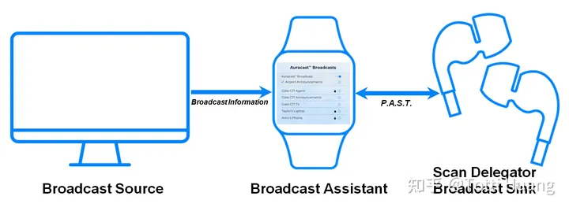

https://zhuanlan.zhihu.com/p/531581527

# leaudio的音频数据串生存时间FT 

在LE Audio的ISO（Isochronous Channels）传输中，音频数据串的生存时间（Frame Timeout，FT）或生存时间（Frame Life Time, FLT）是指数据从传输开始到被接收处理的最大允许时间。

==如果在此时间内音频数据没有被成功传输并处理，它就会被丢弃，视为无效数据。==

**音频数据串生存时间**是确保音频传输的实时性和低延迟的一项重要参数，通常由以下几部分组成：

1. **ISO Interval**：ISO传输通道的时间间隔。
2. **Max Transport Latency**：最大传输延迟时间，定义了从发送到接收的最大允许时间。
3. **帧到期时间（Frame Expiry Time）**：具体表示一个音频帧从生成到接收处理的时限。

### 生存时间（FT）的设定
- **实时性**：为了确保音频的实时性和低延迟，LE Audio系统对生存时间有严格的要求。一般来说，音频数据串的==生存时间不会超过一个ISO Interval周期。==
- **数据同步**：生存时间的设定需要确保发送和接收设备之间的数据同步，避免因为网络延迟等原因导致音频数据播放的卡顿或延迟。

### 规范参考
- **Bluetooth Core Specification**：LE Audio的详细时间参数和生存时间规范可以在蓝牙核心规范的ISO章节找到。
- **Bluetooth LE Audio Specification**：具体的LE Audio特性和要求也在该规范中有描述。

### 实际应用
- 在实际应用中，如果音频数据超过了生存时间仍未被成功接收或处理，这些数据将会被丢弃，以避免影响后续音频数据的播放和质量。
- 例如，在语音通话或音乐播放中，及时传输和处理音频数据对于维持语音通话的清晰度或音乐播放的流畅性至关重要。

综上所述，音频数据串生存时间FT是LE Audio确保低延迟和高质量音频传输的一项关键参数，其设定和管理直接影响音频传输的效果和用户体验。

# leaudio的latency分析

https://zhuanlan.zhihu.com/p/521839239

# leaudio发送的数据帧里有时间戳信息吗？怎么判定是否超时的？

在LE Audio中，音频数据帧的传输是通过ISO（Isochronous Channels）来完成的。LE Audio确实在数据帧中包含了时间戳信息，以帮助接收端确定数据帧的时序和有效性。

### 时间戳的作用

1. **同步播放**：时间戳用于在接收端确保音频数据的同步播放。接收端使用时间戳信息来确定音频数据应该在什么时候被播放，以保持音频流的连续性和同步性。

2. **延迟管理**：通过时间戳，接收端可以判断每一帧数据的到达时间是否在允许的延迟范围内。如果数据帧的时间戳超出了接收端的容忍范围，这个数据帧将被视为过期或无效。

### 判定是否超时

1. **时间戳的记录**：每个音频数据帧在发送时都会带有一个时间戳，这个时间戳记录了该数据帧被生成的时间或预计播放的时间。

2. **接收端的处理**：
   - 接收端设备接收到数据帧后，会根据时间戳信息和当前时间进行比较。
   - 如果接收端设备检测到数据帧的时间戳与当前时间的差异超过了预设的最大传输延迟（Max Transport Latency）或帧生存时间（Frame Life Time, FLT），这个数据帧将被丢弃。
   - 这种机制确保了音频流的实时性和流畅性，避免因网络延迟或其他原因导致的音频播放不连贯。

### 技术规范

- **Bluetooth Core Specification**和**Bluetooth LE Audio Specification**详细描述了LE Audio系统中的时间戳处理机制和最大传输延迟参数。这些规范定义了时间戳的格式、时间同步的机制，以及如何处理延迟或超时的数据帧。

通过时间戳信息，LE Audio系统能够有效地管理和控制音频数据的传输和播放时间，确保用户能够体验到高质量和低延迟的音频服务。

# AICS

"AICS" 是指 "Audio Input Control Service"，是 LE Audio 的一个特性，用于控制音频输入。

在 LE Audio 中，AICS 提供了一种用于管理音频输入的机制。其主要功能包括控制麦克风的增益、方向性、降噪等功能，以及控制音频输入通道的选择等。

AICS 通常会定义一组特征（Characteristics），这些特征包括了与音频输入控制相关的各种参数和属性。通过对这些特征进行读取和写入操作，可以实现对音频输入的控制和配置。

在 LE Audio 的应用中，AICS 可以用于实现诸如以下功能：

1. **控制麦克风增益**：调整麦克风的增益级别，以适应不同的录音环境和音频源。

2. **控制麦克风方向性**：对支持方向性麦克风的设备，可以通过 AICS 控制麦克风的方向性参数。

3. **控制降噪功能**：在有降噪功能的设备上，可以通过 AICS 启用或调整降噪效果。

4. **选择音频输入通道**：对于支持多个音频输入通道的设备，可以通过 AICS 选择所需的输入通道。

总之，AICS 是 LE Audio 中用于管理音频输入的一个服务，通过这个服务可以方便地对音频输入进行控制和配置，提升用户体验和设备的灵活性。

# ASCS

"ASCS" 是指 "Audio Source Control Service"，是 LE Audio 的一个特性，用于控制音频源。

在 LE Audio 中，ASCS 提供了一种机制，用于管理和控制音频源，包括对音频输入输出设备的管理、配置和控制。ASCS 的主要功能包括控制音频源的连接、断开，管理音频传输等。

ASCS 通常会定义一组特征（Characteristics），这些特征包括了与音频源控制相关的各种参数和属性。通过对这些特征进行读取和写入操作，可以实现对音频源的控制和配置。

在 LE Audio 的应用中，ASCS 可以用于实现以下功能：

1. **管理音频源连接**：ASCS 可以用于管理不同音频源（例如蓝牙耳机、扬声器等）的连接和断开。

2. **配置音频传输**：通过 ASCS 可以配置音频传输的参数，例如音频编解码器的选择、音频格式的配置等。

3. **控制音频播放/暂停**：ASCS 可以用于控制音频源的播放、暂停等操作。

4. **处理音频源切换**：ASCS 可以处理不同音频源之间的切换，例如从一个音频源切换到另一个音频源。

总之，ASCS 是 LE Audio 中用于管理和控制音频源的一个服务，通过这个服务可以方便地对音频源进行管理和控制，实现音频设备之间的互操作性和灵活性。

# isotest

这个是bluez里对iso进行测试的c工具。

看看这个里面是怎么做的。

命令格式：

```
isotest <模式> [选项] [btaddr1] [btaddr2]
```


模式有这些：

| 模式      | 说明                       |
| --------- | -------------------------- |
| -d 1.data | dump收到的数据到文件里     |
| -c        | 重新连接CIS client         |
| -m        | 多个CIS client             |
| -r        | 把收到的数据存到文件里     |
| -s        | 从指定文件读取内容进行发送 |
| -n        | silent的意思               |

选项有这些：

| 选项 | 说明                 |
| ---- | -------------------- |
| -b   | packet的size         |
| -i   | 指定hciX             |
| -q   | 不要打印packet的log  |
| -t   | socket发送的超时时间 |
| -S   | 广播的间隔           |
|      | 其他的就不列举了     |

## 命令举例

创建一个unicast中心设备，应该就是相当于手机的角色。进行数据的发送。

```
isotest -s XX:XX:XX:XX:XX:XX
```

然后这个中心设备连接到2个外围设备，使用CIG 编号为0x01

```
isotest -G 0x01 -s XX:XX:XX:XX:XX:XX YY:YY:YY:YY:YY:YY
```

unicast的外围设备：

```
isotest -d
```

## 代码分析

看代码，这个是使用了socket编程的方式来做的。

本质就是建立socket然后进行send和recv操作。

# leaudio的性能和可靠性测试

以下是LE Audio性能和可靠性测试的常见参数、测量方法及学习资料：

------

**1. 常见测试参数**

| **参数类别**   | **具体参数**                                                 |
| -------------- | ------------------------------------------------------------ |
| **音频质量**   | - 编解码器性能（LC3音质）- 采样率和比特率- 延迟（编码、传输、解码） |
| **连接稳定性** | - 信道稳定性- 丢包率（Packet Loss Rate）- 重传率（Retransmission Rate） |
| **功耗**       | - 设备耗电量（Streaming、Idle）- 电池寿命                    |
| **吞吐量**     | - 数据传输速率                                               |
| **多设备同步** | - 多设备音频同步延迟                                         |
| **信号强度**   | - RSSI（接收信号强度）- 信道干扰（Interference）             |
| **环境适应性** | - 不同环境（室内、室外）下的性能表现                         |
| **切换速度**   | - 耳机间切换时间- 音频源切换时间                             |

------

**2. 测试方法和工具**

| **测试项**     | **测量方法**                                                 | **工具**                              |
| -------------- | ------------------------------------------------------------ | ------------------------------------- |
| **音频质量**   | - 使用音频分析仪（如 APx555）测试 LC3 编解码性能- 人耳测试（主观评价MOS分值） | - Audio Precision- 主观听测工具       |
| **连接稳定性** | - 使用蓝牙分析仪捕获 HCI 数据包，分析丢包率和重传率          | - Ellisys Bluetooth Analyzer          |
| **功耗**       | - 使用功率分析仪测量设备的电流和电压                         | - Keysight 功率分析仪                 |
| **吞吐量**     | - 运行蓝牙吞吐量测试（如 iPerf）- 测量数据传输速率           | - 自定义测试工具                      |
| **多设备同步** | - 使用时钟同步工具测量多设备音频延迟                         | - Chronos Sync                        |
| **信号强度**   | - 记录 RSSI 和信道状态分析数据（Channel Map Updates）        | - 蓝牙协议栈工具（如 BlueZ、BTstack） |
| **环境适应性** | - 在不同环境中运行一致性测试（室外长距离测试，室内多障碍测试） | - 实验室环境搭建                      |
| **切换速度**   | - 编写自动化脚本测试耳机切换和音频切换的时间                 | - Python 脚本 + 蓝牙 API 接口工具     |

------

**3. 参考学习资料**

| **类型**           | **来源**                                                     |
| ------------------ | ------------------------------------------------------------ |
| **官方规范**       | - [Bluetooth SIG](https://www.bluetooth.com/specifications/) |
| **技术文章和博客** | - 蓝牙 SIG 技术博客- Nordic Semiconductor、Qualcomm 技术文档 |
| **开发者文档**     | - 蓝牙协议栈文档（如 Zephyr、BlueZ）                         |
| **论坛和社区**     | - Stack Overflow- Nordic DevZone- Embedded Linux Mailing List |
| **工具文档**       | - 测试工具使用手册（如 Ellisys、APx 系列）                   |
| **书籍**           | - 《Bluetooth Low Energy: The Developer's Handbook》         |

通过对性能和可靠性参数进行详细测试，可以发现潜在问题并优化设备的设计与实现。同时，建议结合实际使用场景进行压力测试，确保产品在不同使用条件下的稳定性。

# bap_qos

这个 `bap_qos` 结构体通常用于描述 **LE Audio**（低功耗蓝牙音频）中 **QoS（服务质量）** 参数，主要定义了音频传输的特性和质量需求。下面详细说明每个字段的作用：

------

| **字段名**               | **类型**       | **说明**                                                     |
| ------------------------ | -------------- | ------------------------------------------------------------ |
| `char *name`             | 字符串指针     | QoS 配置的名称，用于标识该配置，比如 "low_latency" 或 "high_quality"。 |
| `uint8_t rate`           | 8位无符号整型  | 音频传输的 **数据速率**，通常表示编码或传输数据速率（例如 kbps 速率）。 |
| `uint8_t frame_duration` | 8位无符号整型  | **音频帧的持续时间**，单位为毫秒（例如 7.5ms、10ms），表示每个音频帧的时间间隔。 |
| `bool framing`           | 布尔值         | 表示是否使用 **帧边界**（Framing）。`true` 表示有边界，`false` 表示无边界。 |
| `uint16_t framelen`      | 16位无符号整型 | **单个音频帧的长度**，单位为字节，表示帧数据的大小。         |
| `uint8_t retransmission` | 8位无符号整型  | 允许的 **重传次数**，用于提高可靠性，表示在音频数据丢失时的最大重传次数。 |
| `uint16_t latency`       | 16位无符号整型 | 音频传输的 **最大时延**，单位为毫秒，表示数据在传输路径中允许的最大延迟。 |
| `uint32_t delay`         | 32位无符号整型 | 音频数据的 **传输延迟**，单位为微秒（μs），用于控制播放和同步的延迟。 |
| `unsigned int priority`  | 无符号整型     | 音频流的 **优先级**，用于区分不同音频流（例如主音频流和辅助音频流）的调度优先级。 |

------

### **参数示例**

假设你需要定义一组 QoS 配置，用于 LE Audio 音频传输：

```c
struct bap_qos qos_high_quality = {
    .name = "high_quality",
    .rate = 256,                    // 数据速率为 256 kbps
    .frame_duration = 10,           // 每帧持续时间为 10 ms
    .framing = true,                // 使用帧边界
    .framelen = 80,                 // 每帧数据长度 80 字节
    .retransmission = 2,            // 允许最多重传 2 次
    .latency = 20,                  // 最大延迟 20 ms
    .delay = 4000,                  // 传输延迟 4000 μs (4 ms)
    .priority = 1                   // 最高优先级
};
```

------

### **使用场景**

1. **高质量音频传输**：低延迟、高数据速率和较小的重传次数，适用于音乐播放。
2. **低延迟音频传输**：优先保证传输的低延迟，而牺牲部分音频质量，适用于语音通话。
3. **QoS 优化与调度**：根据不同音频流的优先级调整传输资源，确保主音频流的高可靠性和低延迟。

------

### **总结**

这个结构体提供了一个灵活的方式来定义蓝牙 LE Audio 音频流的服务质量（QoS）参数，包括数据速率、时延、重传次数等。在实际应用中，可以根据不同的使用场景（如通话、音乐播放）进行参数优化。

# PAC

在蓝牙音频相关的规范中，

PAC即Published Audio Capability（发布音频能力）。

它在设备间的音频通信过程中起着关键作用，

用于描述设备的音频能力信息，

使设备之间能够相互了解对方的音频功能，

进而实现音频流的有效配置与传输。 

从具体构成来看，

它包含了如支持的音频编码格式、采样率、声道数量等重要信息。

在涉及LC3编码的场景中，

会详细说明对LC3编码的支持情况，

包括不同采样率（如8kHz、16kHz、24kHz、44.1kHz、48kHz等）和帧率组合下的支持状态，

这些信息有助于设备在建立连接和传输音频数据前，

确定双方是否能够兼容对方的音频格式和参数设置。 

在实际应用中，Unicast Server会通过PAC向Unicast Client展示其音频接收和发送能力。

若Unicast Server支持接收采用特定设置编码的音频数据，会在PAC中明确体现，

Unicast Client可据此判断是否能与该Server进行音频传输。

同样，Broadcast Sink也会利用PAC告知周围设备其音频解码能力，

以便Broadcast Source能根据这些信息调整音频流的编码和传输参数，

确保音频数据能被Broadcast Sink正确接收和解码。 

# sdu是什么

在蓝牙音频相关的技术文档中，

SDU（Service Data Unit）即服务数据单元。

它是在蓝牙设备间传输音频数据的重要组成部分。

 在音频流传输过程中，SDU承载着经过编码的音频数据。

以LC3编码为例，LC3编码器会将音频信号按照一定的规则编码成适合在蓝牙链路传输的格式，

并封装在SDU中进行传输。

其传输的时间间隔（如SDU Interval）等参数对于音频传输的实时性和连续性有着关键影响。 

不同的音频编码和QoS配置会导致SDU的大小、传输频率等特性有所不同。

在一些低延迟音频数据的QoS配置场景中，

会对SDU的相关参数进行精细调整，

以满足音频传输的低延迟需求，

确保音频数据能够及时、准确地在源设备和接收设备之间传递，从而保障音频播放的流畅性和质量。 


#  LC3为什么是使用LC3_PCM_FORMAT_S24 这个格式？

在 LC3 解码中使用 `LC3_PCM_FORMAT_S24`（24 位有符号 PCM 格式）通常与以下原因有关：

------

### 1. **音质与精度需求**

- **24 位 PCM** 提供更高的动态范围（144 dB），相比于 16 位 PCM（96 dB），可以更精确地还原音频信号的细节。
- 在高质量音频传输应用中（如 LE Audio），24 位 PCM 格式能更好地满足需求。

------

### 2. **兼容音频处理链**

- 下游音频处理

  ：

  - 如果接收端（Sink）需要后续音频处理，例如混音、均衡或音效增强，24 位 PCM 数据能减少因量化误差导致的音质损失。

- 硬件支持

  ：

  - 高性能音频设备（如 DAC、耳机）通常支持 24 位或更高的输入精度。

------

### 3. **LC3 的特性**

- LC3 编解码器可以灵活地支持多种 PCM 格式（包括 S16、S24 和 Float）。
- 使用 24 位格式作为解码输出，可以避免在解码时丢失精度。

------

### 4. **蓝牙音频规范**

- 在 LE Audio 的蓝牙 SIG 标准中，广播或连接流可以选择支持 24 位 PCM 数据格式。
- 如果源设备和 Sink 设备都支持 24 位格式，那么解码时使用 `LC3_PCM_FORMAT_S24` 能确保传输链的无损还原。

------

### 5. **开发者设置**

- 在代码中，选择 PCM 格式可能与以下因素相关：
  - **兼容性**：部分应用场景可能默认使用 24 位格式以保持一致性。
  - **方便转换**：从 24 位 PCM 格式可以方便地转换为 16 位或浮点格式，而不会显著增加复杂度。

------

### 是否可以改为 16 位 PCM？

可以。通过更改参数为 `LC3_PCM_FORMAT_S16`，即可将解码后的 PCM 数据调整为 16 位。这样可以减少内存占用，但可能损失部分音质。

如果您确认下游设备（如播放设备）仅支持 16 位 PCM，可以调整这一设置，同时优化性能。

------

# 1

LC3（低复杂度通信编码器）是一个高效的低延迟音频编解码器，

主要针对受限的传输层（例如包大小和间隔）进行音频流媒体传输。

以下是其主要特点和工作原理的解释：

### 1. **流媒体专注**
- **音频流传输**：LC3专门设计用于流媒体传输，而不是处理复杂的音频输入信号。
- **不支持动态比特率**：与大多数其他编解码器不同，LC3不支持可变比特率（VBR）和自适应比特率（ABR）。它不使用比特储备，意味着每一帧都严格按照用户或传输层给定的字节预算进行编码。

### 2. **比特率调整**
- **灵活的比特率**：虽然LC3不依赖信号复杂度来调整比特率，但可以在任何时候自由更改比特率。这一变化可以响应临时的带宽增加或减少，但不基于音频信号的实际复杂度。

### 3. **固定帧持续时间**
- **帧持续时间**：LC3并不基于固定的输入样本数量进行处理，而是基于固定的帧持续时间进行编码。支持的采样率范围从8 kHz到48 kHz。
- **可选帧持续时间**：LC3提供两种帧持续时间选项：7.5毫秒和10毫秒。这意味着无论输入信号的样本数量如何，编码过程将基于这些固定的时间段进行。

### 总结
LC3的设计使其在有限的带宽和严格的传输条件下，依然能够实现高效、低延迟的音频传输。这种灵活性和高效性使其适合于无线耳机、扬声器等设备中使用。


# 10MS

在 LC3 编码中，10 毫秒（ms）是一个重要的帧持续时间选项。以下是关于 10 ms 帧持续时间的一些关键点：

### 1. **帧持续时间**
- **定义**：10 ms 帧持续时间意味着每个音频帧的处理时间为 10 毫秒。每帧会包含一定数量的音频样本，具体取决于采样率。
  
### 2. **样本数量**
- **依赖采样率**：例如：
  - 在 8 kHz 的采样率下，10 ms 的帧将包含 80 个样本。
  - 在 44.1 kHz 的采样率下，10 ms 的帧将包含 441 个样本。
  - 在 48 kHz 的采样率下，10 ms 的帧将包含 480 个样本。

### 3. **优点**
- **低延迟**：10 ms 的帧持续时间有助于降低音频传输的延迟，适合需要实时响应的应用，如语音通话和游戏。
- **适应性**：在网络条件变化时，10 ms 帧可以快速调整比特率，以应对带宽的波动。

### 4. **应用场景**
- **无线耳机**：可以提供流畅的音频体验，特别是在动态环境中。
- **语音通讯**：能够确保语音清晰且延迟最低，提高用户体验。

### 总结
选择 10 ms 的帧持续时间在 LC3 编码中，提供了低延迟和高效的音频处理能力，使其适合多种音频流应用。

# 参考资料

1、

https://www.eet-china.com/news/202001081019.html

2、

https://wiki.archlinux.org/title/bluetooth_headset