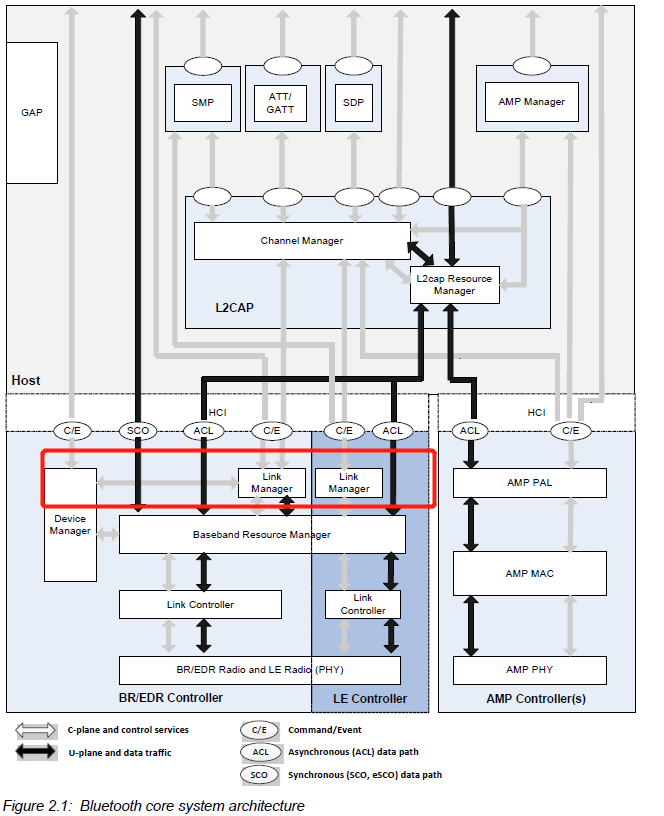

--

看btstack代码，rfcomm部分，看到gap_security_level这个东西。

搜索一下，就找到了LMP。

LMP是Link Manager Protocol。

LMP的位置是在HCI层下面，在baseband以上。是在蓝牙模块内部的。

LMP是用来控制2个设备的的连接行为的协议。

参考资料

1、蓝牙LMP概述

https://www.cnblogs.com/libs-liu/p/9496440.html

2、

http://www.wowotech.net/bluetooth/bt_protocol_arch.html