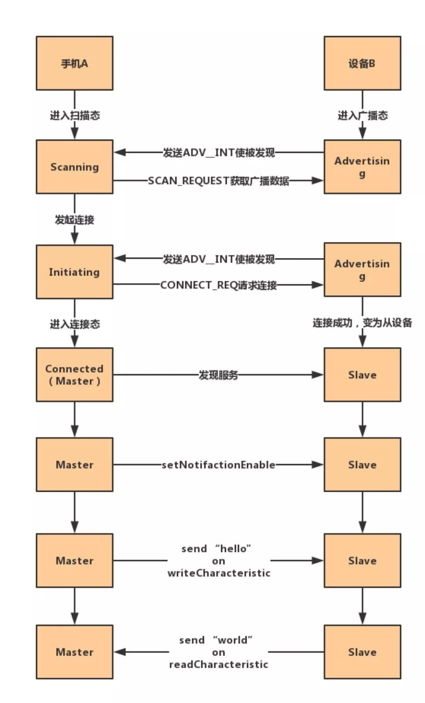

经典蓝牙bt。1.0到2.0到3.0，都是。其中1.0和2.0，叫传统蓝牙，3.0叫高速蓝牙。

低功耗蓝牙ble。4.0是。

CC2540是ble单模芯片。是不兼容传统蓝牙的。

安卓要4.3以上版本才能支持ble。

常说的蓝牙4.0一般就是指ble。

**ble默认不能传输音乐。**

**ble就是用来传输少量数据的。**

大家可以理解为service就是java里的class，characteristic是class里的public方法。所以我们应该先找到class，再调用其方法。

再往下想，写和读肯定是两个方法，所以也会是两个characteristic。

service和characteristic的uuid都是通信之前双方约定好的。android端在上文说的discoverService之后，查看有没有对应的uuid，如果有，就可以发起通信了。

# 参考资料

1、普及一下什么是蓝牙和BLE，看完让你秒懂

https://www.sohu.com/a/167206747_404276

2、ESP32必杀技 - 蓝牙配网篇

http://club.gizwits.com/thread-4966-1-1.html

3、蓝牙4.0 BLE与传统蓝牙之间的兼容性

http://blog.51cto.com/cto521/1638654

4、请问，蓝牙4.0协议能不能传音频或文件? 

https://bbs.csdn.net/topics/391493417?page=1

5、Android BLE4.0(蓝牙通信)

https://www.jianshu.com/p/2b4620c52d47

6、

https://e2echina.ti.com/question_answer/wireless_connectivity/bluetooth/f/103/t/111227

7、Android蓝牙通信过程详解

https://cloud.tencent.com/developer/news/216558