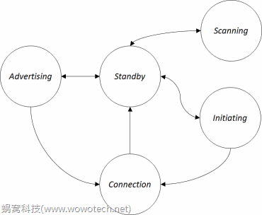
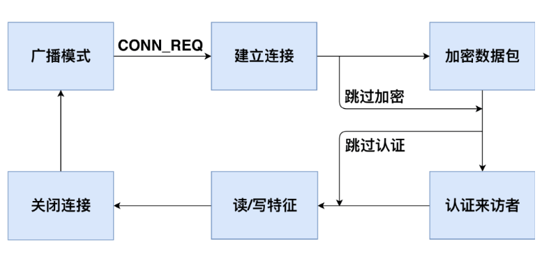
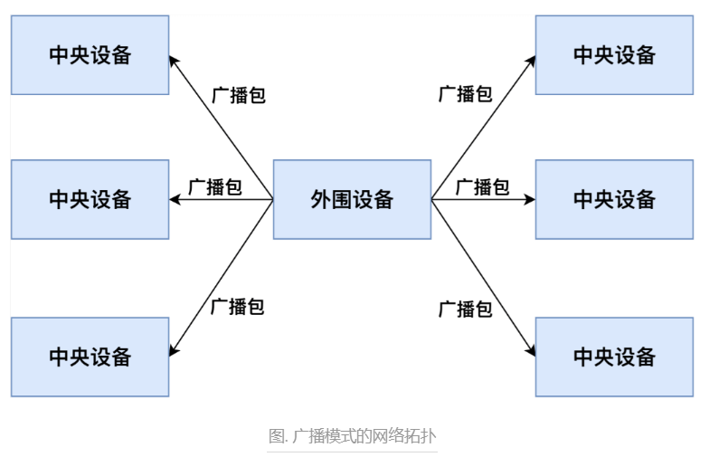

--

# 资源收集

Bluetooth_LE_Primer_Paper

https://www.cnblogs.com/likent/p/17328427.html

# 什么是ble

低功耗蓝牙（Bluetooth Low Energy，简称BLE），也称为蓝牙4.0及更高版本，是一种通信技术，旨在实现低能耗、短距离通信。它是经典蓝牙（Classic Bluetooth）的一种扩展，专门设计用于低功耗应用和物联网（IoT）设备连接。

BLE的主要特点包括：

1. **低功耗：** BLE专为电池供电设备设计，其工作方式和协议结构经过优化，以实现尽可能低的能耗。这使得BLE非常适合需要长时间运行的设备，如可穿戴设备、传感器、健康监测设备等。

2. **短距离通信：** BLE适用于短距离通信，通常在几米到十数米范围内。这有助于减少干扰和提高通信的安全性。

3. **快速连接：** BLE设备可以在非常短的时间内建立连接，以减少连接延迟，适用于需要快速响应的应用场景。

4. **多设备连接：** BLE支持多设备并行连接，这对于物联网环境中的设备互联非常重要。

5. **简化的协议栈：** BLE的协议栈相对较轻量，适用于资源受限的设备。这有助于减少开发成本和功耗。

6. **广播和扫描：** BLE设备可以通过广播发送数据，其他设备可以通过扫描接收广播数据。这种方式适用于一对多通信，如室内定位。

7. **异步数据传输：** BLE支持异步数据传输，适合断断续续的低频数据传输。

由于BLE的低功耗特性和适用范围广泛的特点，它在健康监测、智能家居、可穿戴设备、物联网、工业自动化等领域得到了广泛应用。

# ble为什么可以实现快速连接

蓝牙低功耗（BLE）能够实现快速连接的原因主要包括以下几个方面：

### 1. **简化的连接过程**

BLE的连接过程比经典蓝牙（BR/EDR）要简单得多。BLE通过减少必要的步骤来加快连接速度。主要的步骤包括：

- **广播和扫描**：BLE设备通过广播其存在（广告数据）并进行扫描来发现其他设备。
- **快速连接请求**：一旦设备发现了目标设备，便会快速发起连接请求，减少了传统蓝牙中的配对和连接过程中的繁琐步骤。

### 2. **高效的广播机制**

BLE设备使用广播（Advertising）机制来快速广播其存在。这种机制使得设备能够以较高频率广播其广告包，从而减少了设备间发现的时间。

- **广播间隔**：BLE允许设备以较短的广播间隔进行广播，从而提高了发现速度。
- **数据包优化**：BLE广告包设计较小，仅包含必需的连接信息，从而减少了广播和扫描的时间。

### 3. **低延迟的连接建立**

BLE采用了优化的连接建立流程，确保快速建立连接。连接过程包括：

- **短期连接**：BLE允许设备在短时间内进行连接建立，从而减少了连接所需的时间。
- **连接事件间隔**：连接事件间隔（Connection Interval）设置较短，可以快速建立和维护连接。

### 4. **低功耗设计**

BLE设计的低功耗特性减少了设备在连接过程中的能耗。其低功耗设计通过以下方式实现快速连接：

- **低功耗状态**：BLE设备在非活动时保持低功耗状态，减少了能量消耗和等待时间。
- **快速恢复**：BLE设备从低功耗状态恢复到活动状态的速度较快，使得连接过程更加迅速。

### 5. **高效的连接参数协商**

在BLE连接建立过程中，设备之间协商连接参数时可以快速达成一致。BLE允许设备在建立连接后通过交换连接参数来优化连接性能，以便在最短的时间内达到最佳的连接状态。

### 6. **专用的连接和配对流程**

BLE的连接和配对流程专门为低功耗和快速连接而设计。包括：

- **简化的配对过程**：BLE的配对过程较为简单，主要通过简化的密钥交换和配对机制来快速完成配对。

### 总结

BLE能够实现快速连接的原因包括其简化的连接过程、高效的广播机制、低延迟的连接建立、低功耗设计、高效的连接参数协商和专用的连接与配对流程。这些特性共同作用，使得BLE在建立连接时更加迅速和高效。

# ble多设备连接是怎么实现的

BLE（Bluetooth Low Energy）支持多设备连接的能力是其关键特性之一，尤其在需要连接多个外设的应用场景中非常有用。实现BLE多设备连接的方式包括：

### 1. **主设备与从设备角色**

在BLE中，设备可以扮演主设备（Central）或从设备（Peripheral）的角色：

- **主设备（Central）**：负责扫描、连接和管理多个从设备。主设备可以与多个从设备建立并维持连接。
- **从设备（Peripheral）**：提供服务并响应来自主设备的连接请求。

### 2. **连接管理**

- **连接并发**：BLE主设备可以同时与多个从设备建立连接。这种并发连接能力是通过管理多个连接事件实现的。
- **连接事件**：BLE主设备在连接期间会处理多个连接事件，确保每个连接的数据传输都能按时进行。

### 3. **连接参数优化**

- **连接间隔（Connection Interval）**：BLE允许调整连接间隔，以优化连接的效率和功耗。在多设备连接场景中，主设备可以调整每个连接的间隔，以平衡性能和功耗。
- **超时和窗口（Supervision Timeout and Latency）**：BLE的连接参数设置包括超时和延迟设置，以确保稳定和高效的连接。

### 4. **广播和扫描**

- **广播机制**：从设备通过广播机制（Advertising）来告知主设备其存在。主设备通过扫描（Scanning）机制来发现并连接这些从设备。
- **广播数据包**：从设备可以周期性广播广告包，主设备通过扫描这些广告包来建立连接。

### 5. **数据传输**

- **数据通道**：BLE主设备和从设备之间的数据传输是通过建立的连接通道进行的。每个连接都使用独立的数据通道进行数据传输。
- **多连接数据处理**：主设备会同时管理和处理多个连接的数据传输，确保每个连接的数据按照协议规范进行处理。

### 6. **多连接支持**

- **协议支持**：BLE协议栈本身支持多连接。大多数现代BLE主设备和从设备都能处理多个并发连接。
- **硬件资源**：多连接支持也取决于硬件资源，特别是主设备的处理能力和内存容量。设备需要足够的处理能力来管理多个连接和数据流。

### 7. **应用场景**

- **多传感器系统**：例如，一个BLE主设备可以同时连接多个BLE传感器，收集来自不同传感器的数据。
- **智能家居**：BLE主设备可以与多个智能家居设备（如灯光、门锁、温控器）连接，实现集中控制。

### 总结

BLE多设备连接的实现主要依赖于主设备对多个从设备的连接管理、优化连接参数、有效的数据传输和广播扫描机制。BLE协议栈支持同时与多个设备建立连接，并通过管理连接事件和数据通道来维持这些连接。实际应用中，主设备的处理能力和内存资源也会影响其多连接能力。

# ble一个主设备最多可以连接多少个从设备

在BLE（Bluetooth Low Energy）中，一个主设备（Central）可以同时连接多个从设备（Peripheral）。但是，具体能够连接多少个从设备取决于以下几个因素：

### 1. **协议限制**

- **BLE标准**：BLE协议本身并没有规定一个具体的最大连接数。BLE的最大连接数是由设备的硬件和软件实现来决定的。

### 2. **硬件能力**

- **处理能力**：主设备的处理器需要能够同时处理多个连接的管理和数据传输。处理能力较强的硬件可以支持更多的连接。
- **内存资源**：每个连接都需要占用一定的内存资源（如连接状态、数据缓冲区等）。主设备需要足够的内存来支持多个连接。

### 3. **软件实现**

- **协议栈实现**：不同的BLE协议栈实现可能对最大连接数有不同的限制。例如，某些BLE协议栈可能优化得很好，支持更高的连接数。
- **操作系统支持**：主设备的操作系统需要能够管理多个连接和处理多个连接事件。

### 4. **实际限制**

- **实际设备**：在实际应用中，主设备通常可以支持的最大从设备数量在10到50之间，这取决于主设备的设计和使用场景。

### 5. **设备和应用场景**

- **低功耗设计**：BLE的设计目标是低功耗，因此高连接数可能会影响设备的功耗。应用场景需要权衡连接数和功耗之间的关系。
- **数据传输需求**：连接数的增加也可能会对数据传输速率和稳定性产生影响。设备需要考虑到数据传输的效率和稳定性。

### 实际案例

- **蓝牙芯片供应商**：一些蓝牙芯片供应商提供的技术规格中，会列出主设备可以支持的最大连接数。例如，某些BLE芯片可以支持最多8个或更多的连接。

### 总结

BLE主设备可以支持多个从设备的连接，但具体的最大连接数取决于硬件能力、内存资源、软件实现和实际应用场景。在实际应用中，通常主设备可以连接10到50个从设备，具体数值需要参考具体设备的技术规格和设计要求。

# ble优点

1、高可靠性
对于无线通信而言，由于电磁波在传输过程中容易受很多因素的干扰，例如，障碍物的阻挡、天气状况等，因此，无线通信系统在数据传输过程中具有内在的不可靠性。蓝牙技术联盟 SIG 在指定蓝牙 4.0 规范时已经考虑到了这种数据传输过程中的内在的不确定性，在射频，基带协议，链路管理协议中采用可靠性措施，包括：差错检测和矫正，进行数据编解码，数据降噪等，极大地提高了蓝牙无线数据传输的可靠性，另外，使用自适应调频技术，能最大程度地减少和其他 2.4G 无线电波的串扰。

2、低成本、低功耗
低功耗蓝牙支持两种部署方式：双模式和单模式，一般智能机上采用双模式，外设一般采用 BLE 单模。

低功耗设计：蓝牙 4.0 版本强化了蓝牙在数据传输上的低功耗性能，功耗较传统蓝牙降低了 90%。

传统蓝牙设备的待机耗电量一直是其缺陷之一，这与传统蓝牙技术采用16至32个频道进行广播有很大关系，而低功耗蓝牙仅适用 3 个广播通道，且每次广播时射频的开启时间也有传统的 22.5ms 减少到 0.6~1.2ms，这两个协议规范的改变，大幅降低了因为广播数据导致的待机功耗。

低功耗蓝牙设计用深度睡眠状态来替换传统蓝牙的空闲状态，在深度睡眠状态下，主机 Host 长时间处于超低的负载循环 Duty Cycle 状态，只在需要运作时由控制器来启动，由于主机较控制器消耗的能源更多，因此这样的设计也节省了更多的能源。

3、快速启动/瞬间连接
此前蓝牙版本的启动速度非常缓慢，2.1 版本的蓝牙启动连接需要 6s 时间，而蓝牙4.0版本仅需要3ms 即可完成。

4、传输距离增强
传统蓝牙传输距离一般为 2-10 米，而蓝牙4.0的有效传输距离可以达到 60~100米，传输距离大大提高，极好的开拓了蓝牙技术的应用前景。

# ble在Link Layer抽象出来的5种状态

BLE协议在Link Layer抽象出5种状态：




Standby状态是初始状态，即不发送数据，也不接收数据。根据上层实体的命令（如位于host软件中GAP），可由其它任何一种状态进入，也可以切换到除Connection状态外的任意一种状态。

Advertising状态是可以通过广播通道发送数据的状态，由Standby状态进入。它广播的数据可以由处于Scanning或者Initiating状态的实体接收。上层实体可通过命令将Advertising状态切换回Standby状态。另外，连接成功后，也可切换为Connection状态。

Scanning状态是可以通过广播通道接收数据的状态，由Standby状态进入。根据Advertiser所广播的数据的类型，有些Scanner还可以主动向Advertiser请求一些额外数据。上层实体可通过命令将Scanning状态切换回Standby状态。

Initiating状态和Scanning状态类似，不过是一种特殊的接收状态，由Standby状态进入，只能接收Advertiser广播的connectable的数据，并在接收到数据后，发送连接请求，以便和Advertiser建立连接。当连接成功后，Initiater和对应的Advertiser都会切换到Connection状态。

Connection状态是和某个实体建立了单独通道的状态，在通道建立之后，由Initiating或者Advertising自动切换而来。通道断开后，会重新回到Standby状态。

通道建立后（通常说“已连接”），处于Connection状态的双方，分别有两种角色Master和Slave：

> Initiater方称作Mater；
>
> Advertiser方称作Slave。


# le audio是基于ble吗

是的，LE Audio（Low Energy Audio）是基于低功耗蓝牙（BLE）技术的一项扩展，旨在为蓝牙设备提供更强大的音频功能。LE Audio扩展了BLE技术，使其能够支持高质量的音频传输和更广泛的音频应用。

传统的低功耗蓝牙（BLE）在音频传输方面有一些限制，因为其设计主要是为了低功耗通信，而不是高质量的音频传输。LE Audio的引入旨在弥补这些限制，为蓝牙设备提供更好的音频体验。

LE Audio引入了以下一些新的功能：

1. **LC3编解码器：** LE Audio引入了更高效的音频编解码器，称为LC3（Low Complexity Communication Codec）。LC3编解码器可以在相对低的比特率下提供高质量的音频传输，从而实现更好的音频效果。

2. **多流传输：** LE Audio支持多个音频流同时传输，这对于多个听者之间共享音频或实现多个音频设备的协同工作非常有用。

3. **广播音频：** LE Audio引入了支持广播音频的功能，这意味着BLE设备可以广播音频流，其他设备可以扫描并连接以接收音频流，这有助于实现一对多的音频广播。

4. **声学共享：** LE Audio引入了声学共享功能，允许多个用户共享同一音频源，例如在公共场所或公共交通工具中。

总之，LE Audio是基于BLE技术的一项扩展，旨在提供更好的音频体验和更广泛的音频应用。它使BLE设备能够支持高质量的音频传输，从而扩展了BLE的应用范围。

https://shumeipai.nxez.com/2023/08/07/bluetooth-protocol-capture-based-on-raspberry-pi.html


# le audio的包结构

LE Audio的包结构是指在蓝牙低功耗音频（LE Audio）传输中，数据在传输过程中如何组织和封装。LE Audio引入了新的数据包结构以支持音频传输。以下是LE Audio的包结构概述：

在LE Audio中，音频数据通过一系列的音频数据包进行传输。每个音频数据包包含了一定数量的音频采样数据。音频数据包通常会通过BLE连接从发送端传输到接收端。

LE Audio的包结构如下：

1. **头部（Header）：** 每个音频数据包的开头包含一个头部，其中包含了一些控制信息，如数据包类型和流标识等。

2. **音频采样数据（Audio Samples）：** 在头部之后是音频采样数据。这部分包含了音频信号的采样值。数据包的大小和数据传输速率决定了每个数据包中包含的音频样本数量。

3. **纠错检验（Error Correction）：** 为了提高传输的可靠性，一些音频数据包可能包含纠错检验信息。这有助于在数据传输过程中检测和纠正错误。

4. **标识和同步（Identification and Synchronization）：** 在BLE连接中，数据包同步和识别非常重要。数据包中通常包含了标识和同步信息，以确保接收端可以正确解析数据包。

5. **连接维护信息（Connection Maintenance）：** LE Audio在数据包中还包含了一些连接维护信息，以确保数据的连续传输。

需要注意的是，LE Audio的包结构可能会因不同的音频编码、数据传输速率、连接参数等而有所不同。具体的包结构会根据实际应用和配置进行调整。这只是一个一般的概述，详细的包结构可以在LE Audio相关的蓝牙规范文档中找到。

# le audio一个包的大小

LE Audio的一个音频数据包的大小可以根据具体的配置和使用情况而有所不同。然而，LE Audio的一个典型音频数据包的大小通常在几十字节到一百多字节之间。

具体的包大小取决于以下因素：

1. **音频编码：** 使用不同的音频编码器（如LC3）会影响一个数据包中包含的音频样本数量，从而影响包的大小。

2. **采样率：** 音频数据的采样率（每秒采样次数）也会影响一个数据包中包含的音频样本数量。

3. **数据传输速率：** 数据传输速率决定了每个数据包中可用的比特数，进而影响包的大小。

4. **连接参数：** 蓝牙连接参数，如连接间隔和数据包长度等，也会影响一个数据包的大小。

5. **纠错码：** 数据包中是否包含纠错码信息以及纠错码的类型也会影响包的大小。

一般情况下，LE Audio的音频数据包大小在20字节到100字节之间。这个范围可以用于传输高质量音频，同时保持较低的延迟和功耗。

如果您在特定应用中需要精确的数据包大小，请参考相关的蓝牙规范和技术文档，这些文档会详细描述LE Audio的包结构和参数配置。

# 当前的导游讲解器是基于什么技术

当前的导游讲解器通常基于无线通信技术，其中常用的技术之一是无线语音传输技术。这些导游讲解器使用无线通信技术来实现导游和游客之间的实时语音传输，以便在旅游景点、博物馆、展览等场所提供有声导览和讲解服务。

以下是一些可能用于导游讲解器的无线通信技术：

1. **无线电频率通信：** 这是较早期使用的无线技术，通常基于无线电频率的传输。导游和游客使用不同的频率来进行语音传输，类似于对讲机的原理。

2. **蓝牙技术：** 低功耗蓝牙（BLE）可以用于导游讲解器，它可以在短距离范围内实现实时的语音传输，同时具备较低的功耗。

3. **Wi-Fi技术：** Wi-Fi技术可以用于实现更远距离的语音传输，但通常需要更多的功耗。导游和游客可以通过连接到相同的Wi-Fi网络来进行语音交流。

4. **RFID技术：** 射频识别（RFID）技术可以用于在特定区域内触发语音播放。游客带着携带RFID标签的设备，在接近特定位置时，设备会自动播放相应的讲解内容。

这些技术可以根据实际需求和场景选择。导游讲解器的设计要考虑到语音传输的稳定性、实时性、通信范围、功耗以及用户友好性等因素。不同的技术有不同的优势和限制，选择合适的技术取决于特定的应用需求。

# 基本信息

经典蓝牙bt。1.0到2.0到3.0，都是。其中1.0和2.0，叫传统蓝牙，3.0叫高速蓝牙。

低功耗蓝牙ble。4.0是。


CC2540是ble单模芯片。是不兼容传统蓝牙的。

安卓要4.3以上版本才能支持ble。


常说的蓝牙4.0一般就是指ble。

**ble默认不能传输音乐。**

**ble就是用来传输少量数据的。**


大家可以理解为service就是java里的class，characteristic是class里的public方法。所以我们应该先找到class，再调用其方法。

再往下想，写和读肯定是两个方法，所以也会是两个characteristic。

service和characteristic的uuid都是通信之前双方约定好的。android端在上文说的discoverService之后，查看有没有对应的uuid，如果有，就可以发起通信了。


# 规范

参考资料

1、

https://www.cnblogs.com/xiaorenwu702/p/4304378.html

# ble地址类型

BLE设备有多种类型的设备地址，

如

Public Device Address、

Random Device Address、

Static Device Address、

Private Device Address等等。

如果不了解内情，大家肯定会被它们绕晕。不过存在即合理，这样看似奇怪的设计，实际上反映了BLE的设计思路以及所针对的应用场景。让我们通过本文一窥究竟。


BLE（蓝牙低功耗）设备的地址类型分为以下几种，每种地址类型有不同的用途和特性。理解这些地址类型有助于更好地管理和开发 BLE 设备。

### BLE 地址类型

1. **Public Device Address (公共设备地址)**
   - **特征**：固定且全球唯一，由蓝牙设备地址 (BD_ADDR) 组成，包含一个 24 位公司标识符（OUI）和一个 24 位设备标识符。
   - **用途**：用于需要唯一标识的设备，如手机或笔记本电脑。

2. **Random Device Address (随机设备地址)**
   - **分类**：
     1. **Static Random Address (静态随机地址)**
        - **特征**：设备启动时生成，除非设备重启或电池更换，否则不会改变。静态地址的最高两个位设置为 11。
        - **用途**：提供稳定性，适用于隐私要求较低的设备。
     2. **Private Random Address (私有随机地址)**
        - **进一步分类**：
          - **Resolvable Private Address (可解析的私有地址)**
            - **特征**：使用一个由设备和配对设备共享的密钥生成，定期更改以提供隐私保护。配对设备可以解析地址以识别设备。
            - **用途**：隐私保护，适用于定期广播的设备，如健身追踪器。
          - **Non-Resolvable Private Address (不可解析的私有地址)**
            - **特征**：随机生成且短时间内使用，不包含可用于识别设备的持久信息。
            - **用途**：提供最高级别的隐私保护，适用于短时间广播的设备。

### 地址类型的具体表示

每种 BLE 地址类型在数据包中都有相应的表示方法。

| 地址类型               | 表示方法 | 说明               |
| ---------------------- | -------- | ------------------ |
| Public                 | 0x00     | 公共设备地址       |
| Random Static          | 0x01     | 静态随机地址       |
| Private Resolvable     | 0x02     | 可解析的私有地址   |
| Private Non-Resolvable | 0x03     | 不可解析的私有地址 |

### 地址生成和使用示例

1. **生成和使用公共设备地址**
   公共设备地址由设备制造商分配，通常在设备出厂时已固定。

2. **生成静态随机地址**
   静态随机地址在设备首次启动时生成，并存储在设备的非易失性存储器中。
   
   ```c
   // 生成静态随机地址示例（伪代码）
   uint8_t random_address[6];
   random_address[0] = random_byte();
   random_address[1] = random_byte();
   random_address[2] = random_byte();
   random_address[3] = random_byte();
   random_address[4] = random_byte();
   random_address[5] = (random_byte() & 0x3F) | 0xC0;  // 设置最高两位为11
```
   
3. **生成可解析的私有地址**
   可解析的私有地址使用设备和配对设备共享的 IRK（Identity Resolving Key）生成。蓝牙协议栈通常会处理这个过程。

### 使用示例

假设你要实现一个 BLE 设备，并希望支持多种地址类型。以下是如何在代码中实现地址选择的示例：

```c
#include <stdio.h>
#include <stdint.h>

// 生成一个随机字节的示例函数
uint8_t random_byte() {
    return rand() % 256;
}

// 生成静态随机地址的函数
void generate_static_random_address(uint8_t address[6]) {
    for (int i = 0; i < 5; ++i) {
        address[i] = random_byte();
    }
    address[5] = (random_byte() & 0x3F) | 0xC0;  // 设置最高两位为11
}

// 打印地址
void print_address(const char *label, uint8_t address[6]) {
    printf("%s: %02X:%02X:%02X:%02X:%02X:%02X\n", label, address[5], address[4], address[3], address[2], address[1], address[0]);
}

int main() {
    uint8_t static_random_address[6];
    generate_static_random_address(static_random_address);
    print_address("Static Random Address", static_random_address);

    // 其他地址类型的生成和使用可以类似实现
    return 0;
}
```

### 总结

不同类型的 BLE 地址在不同的应用场景下有各自的优势和适用性。理解这些地址类型及其特性，可以帮助开发者更好地设计和实现 BLE 设备的通信和隐私保护功能。


# BLE 标准的配对和绑定过程

BLE（低能耗蓝牙）标准的配对和绑定过程涉及设备发现、密钥交换、身份验证和加密等多个步骤。以下是详细步骤：

### 1. 设备发现

在配对过程开始之前，两个 BLE 设备需要相互发现对方。

- **扫描设备**：一个设备（通常是中心设备，如手机）会扫描周围的设备。
- **广播设备**：另一个设备（通常是外围设备，如智能手环）会广播其存在。

### 2. 配对过程

配对过程包括密钥交换和身份验证，用于建立加密链接。配对过程有三种主要方法，分别是“Just Works”、“Passkey Entry”和“Numeric Comparison”。

1. **Just Works**：不需要用户输入任何信息，适用于低安全性需求的场景。
2. **Passkey Entry**：一方输入另一个设备显示的6位数密码，用于中等安全性需求。
3. **Numeric Comparison**：双方显示6位数数字，用户确认数字是否相同，用于高安全性需求。

### 3. 密钥分配

配对过程中，设备会生成和交换密钥，用于保护后续的数据传输。

1. **临时密钥（TK）**：用于生成短期会话密钥的临时密钥。
2. **短期会话密钥（STK）**：配对过程中生成的会话密钥。
3. **长时间密钥（LTK）**：生成并存储用于后续连接的长期密钥。
4. **身份信息**：设备可能会交换身份信息（IRK，Identity Resolving Key）和设备地址。

### 4. 加密链接的建立

配对过程成功后，设备会使用生成的会话密钥来加密传输链路。

### 5. 绑定过程

绑定是指设备在配对后保存密钥，以便后续连接时能够快速建立加密链路。绑定过程确保了设备在断开连接后重新连接时能够安全地通信。

### 配对示例代码

以下是一个简化的示例代码，展示了如何在嵌入式系统中使用 BLE 堆栈进行配对和绑定过程。注意，这是一个伪代码示例，实际实现将依赖于具体的 BLE 堆栈和硬件平台。

```c
#include <ble.h>

// 初始化BLE配对
void init_ble_pairing() {
    // 设置配对参数
    ble_gap_sec_params_t sec_params;
    memset(&sec_params, 0, sizeof(sec_params));
    sec_params.bond = 1; // 启用绑定
    sec_params.mitm = 0; // 关闭MITM保护
    sec_params.io_caps = BLE_GAP_IO_CAPS_NONE; // 配对方式
    sec_params.min_key_size = 7; // 最小密钥长度
    sec_params.max_key_size = 16; // 最大密钥长度

    // 启动配对过程
    sd_ble_gap_sec_params_reply(conn_handle, BLE_GAP_SEC_STATUS_SUCCESS, &sec_params, NULL);
}

// 处理配对请求
void on_ble_gap_evt_sec_params_request(ble_gap_evt_sec_params_request_t *p_sec_params_request) {
    // 回复安全参数请求
    ble_gap_sec_keyset_t sec_keyset;
    memset(&sec_keyset, 0, sizeof(sec_keyset));
    sec_keyset.keys_periph.ltk_len = 16;

    sd_ble_gap_sec_params_reply(conn_handle, BLE_GAP_SEC_STATUS_SUCCESS, &sec_params, &sec_keyset);
}

// 处理加密状态变化
void on_ble_gap_evt_auth_status(ble_gap_evt_auth_status_t *p_auth_status) {
    if (p_auth_status->auth_status == BLE_GAP_SEC_STATUS_SUCCESS) {
        // 配对和加密成功
    } else {
        // 配对或加密失败
    }
}

int main() {
    // 初始化BLE堆栈
    ble_stack_init();

    // 初始化配对过程
    init_ble_pairing();

    // 主循环
    while (1) {
        // 处理BLE事件
        ble_evt_t evt;
        if (ble_evt_get(&evt)) {
            switch (evt.header.evt_id) {
                case BLE_GAP_EVT_SEC_PARAMS_REQUEST:
                    on_ble_gap_evt_sec_params_request(&evt.evt.gap_evt.params.sec_params_request);
                    break;
                case BLE_GAP_EVT_AUTH_STATUS:
                    on_ble_gap_evt_auth_status(&evt.evt.gap_evt.params.auth_status);
                    break;
                default:
                    break;
            }
        }
    }

    return 0;
}
```

这个示例展示了如何初始化配对过程、处理配对请求和处理加密状态变化。实际实现中需要处理更多的事件和错误，并根据具体的 BLE 堆栈和硬件平台进行调整。

# 使用bluez的api，让板子作为ble server，手机可以搜索并连接到ble server上

以下是一个简单的示例代码，展示如何使用BlueZ的API将嵌入式Linux设备作为BLE Server，使手机可以搜索并连接到该BLE Server。

**步骤1：安装BlueZ**
确保你的板子上已经安装了BlueZ。可以通过以下命令安装：

```sh
sudo apt-get update
sudo apt-get install bluez
```

**步骤2：编写BLE Server代码**

下面是一个Python示例代码，使用`pydbus`库（BlueZ的DBus接口）来创建一个BLE Server。

```python
from gi.repository import GLib
from pydbus import SystemBus
import dbus
import dbus.service
import dbus.mainloop.glib

# 定义BLE服务UUID和特征UUID
SERVICE_UUID = '12345678-1234-5678-1234-56789abcdef0'
CHARACTERISTIC_UUID = '12345678-1234-5678-1234-56789abcdef1'

class BLEAdvertisement(dbus.service.Object):
    PATH = '/org/bluez/example/advertisement'

    def __init__(self, bus):
        self.path = self.PATH
        self.bus = bus
        self.ad_type = 'peripheral'
        self.service_uuid = SERVICE_UUID
        dbus.service.Object.__init__(self, bus, self.path)

    @dbus.service.method('org.freedesktop.DBus.Properties', in_signature='s', out_signature='a{sv}')
    def GetAll(self, interface):
        return {
            'Type': self.ad_type,
            'ServiceUUIDs': [self.service_uuid]
        }

    @dbus.service.method('org.freedesktop.DBus.Properties', in_signature='ss', out_signature='v')
    def Get(self, interface, property):
        return self.GetAll(interface)[property]

    @dbus.service.method('org.freedesktop.DBus.Properties', in_signature='ssv')
    def Set(self, interface, property, value):
        pass

    @dbus.service.method('org.freedesktop.DBus.ObjectManager', out_signature='a{oa{sa{sv}}}')
    def GetManagedObjects(self):
        return {
            self.path: {
                'org.freedesktop.DBus.Properties': {
                    'Type': self.ad_type,
                    'ServiceUUIDs': [self.service_uuid]
                }
            }
        }

class BLEApplication(dbus.service.Object):
    PATH = '/org/bluez/example/service'

    def __init__(self, bus):
        self.path = self.PATH
        self.bus = bus
        self.service = None
        self.characteristic = None
        dbus.service.Object.__init__(self, bus, self.path)

        self.add_service()
        self.add_characteristic()

    def add_service(self):
        self.service = BLEService(self.bus, self.path, 0, SERVICE_UUID, True)
        self.bus.register_object(self.service)

    def add_characteristic(self):
        self.characteristic = BLECharacteristic(self.bus, self.service.path, 0, CHARACTERISTIC_UUID, ['read', 'write'])
        self.bus.register_object(self.characteristic)

class BLEService(dbus.service.Object):
    def __init__(self, bus, path, index, uuid, primary):
        self.path = f"{path}/service{index}"
        self.bus = bus
        self.uuid = uuid
        self.primary = primary
        dbus.service.Object.__init__(self, bus, self.path)

    @dbus.service.method('org.freedesktop.DBus.Properties', in_signature='s', out_signature='a{sv}')
    def GetAll(self, interface):
        return {
            'UUID': self.uuid,
            'Primary': self.primary
        }

class BLECharacteristic(dbus.service.Object):
    def __init__(self, bus, path, index, uuid, flags):
        self.path = f"{path}/char{index}"
        self.bus = bus
        self.uuid = uuid
        self.flags = flags
        dbus.service.Object.__init__(self, bus, self.path)

    @dbus.service.method('org.freedesktop.DBus.Properties', in_signature='s', out_signature='a{sv}')
    def GetAll(self, interface):
        return {
            'UUID': self.uuid,
            'Flags': self.flags
        }

    @dbus.service.method('org.freedesktop.DBus.Properties', in_signature='ss', out_signature='v')
    def Get(self, interface, property):
        return self.GetAll(interface)[property]

    @dbus.service.method('org.freedesktop.DBus.Properties', in_signature='ssv')
    def Set(self, interface, property, value):
        pass

dbus.mainloop.glib.DBusGMainLoop(set_as_default=True)
bus = SystemBus()

ad_manager = bus.get("org.bluez", "/org/bluez/hci0")
ad_manager.RegisterAdvertisement(BLEAdvertisement(bus), {}, reply_handler=print("Advertisement registered"), error_handler=print("Advertisement register failed"))

app = BLEApplication(bus)
mainloop = GLib.MainLoop()
mainloop.run()
```

**步骤3：运行BLE Server**

```sh
sudo python3 ble_server.py
```

**说明：**

1. **BLEAdvertisement**类负责BLE广告。
2. **BLEApplication**类负责管理BLE服务和特征。
3. **BLEService**类表示一个BLE服务。
4. **BLECharacteristic**类表示一个BLE特征。

运行代码后，你的设备将成为一个BLE Server，可以被手机搜索到并连接。

**注意：**
你可能需要修改`SERVICE_UUID`和`CHARACTERISTIC_UUID`以适应你的需求。这些UUID应当是符合BLE规范的128位UUID。

# 板端做le audio cis sink

为了将板子配置为LE Audio CIS（Connected Isochronous Stream）Sink，以下是如何使用BlueZ API实现的步骤和示例代码。请注意，LE Audio和CIS是蓝牙5.2及以上版本的新特性，可能需要更新的BlueZ版本和内核支持。

### 步骤1：确保系统支持

1. **内核**：确保使用支持蓝牙5.2及以上的内核。
2. **BlueZ**：安装最新版本的BlueZ。可以从源码编译安装。

### 步骤2：安装必要的依赖

确保安装了必要的Python包：

```sh
sudo apt-get install python3-dbus
sudo apt-get install python3-gi
sudo pip3 install pydbus
```

### 步骤3：编写CIS Sink示例代码

以下Python代码展示了如何设置LE Audio CIS Sink：

```python
from gi.repository import GLib
from pydbus import SystemBus
import dbus
import dbus.service
import dbus.mainloop.glib

# 定义LE Audio服务UUID和特征UUID
LE_AUDIO_SERVICE_UUID = '00001850-0000-1000-8000-00805f9b34fb'
LE_AUDIO_CHARACTERISTIC_UUID = '00002bb1-0000-1000-8000-00805f9b34fb'

class LEAudioAdvertisement(dbus.service.Object):
    PATH = '/org/bluez/example/advertisement'

    def __init__(self, bus):
        self.path = self.PATH
        self.bus = bus
        self.ad_type = 'peripheral'
        self.service_uuid = LE_AUDIO_SERVICE_UUID
        dbus.service.Object.__init__(self, bus, self.path)

    @dbus.service.method('org.freedesktop.DBus.Properties', in_signature='s', out_signature='a{sv}')
    def GetAll(self, interface):
        return {
            'Type': self.ad_type,
            'ServiceUUIDs': [self.service_uuid]
        }

    @dbus.service.method('org.freedesktop.DBus.Properties', in_signature='ss', out_signature='v')
    def Get(self, interface, property):
        return self.GetAll(interface)[property]

    @dbus.service.method('org.freedesktop.DBus.Properties', in_signature='ssv')
    def Set(self, interface, property, value):
        pass

    @dbus.service.method('org.freedesktop.DBus.ObjectManager', out_signature='a{oa{sa{sv}}}')
    def GetManagedObjects(self):
        return {
            self.path: {
                'org.freedesktop.DBus.Properties': {
                    'Type': self.ad_type,
                    'ServiceUUIDs': [self.service_uuid]
                }
            }
        }

class LEAudioApplication(dbus.service.Object):
    PATH = '/org/bluez/example/service'

    def __init__(self, bus):
        self.path = self.PATH
        self.bus = bus
        self.service = None
        self.characteristic = None
        dbus.service.Object.__init__(self, bus, self.path)

        self.add_service()
        self.add_characteristic()

    def add_service(self):
        self.service = LEAudioService(self.bus, self.path, 0, LE_AUDIO_SERVICE_UUID, True)
        self.bus.register_object(self.service)

    def add_characteristic(self):
        self.characteristic = LEAudioCharacteristic(self.bus, self.service.path, 0, LE_AUDIO_CHARACTERISTIC_UUID, ['read', 'notify'])
        self.bus.register_object(self.characteristic)

class LEAudioService(dbus.service.Object):
    def __init__(self, bus, path, index, uuid, primary):
        self.path = f"{path}/service{index}"
        self.bus = bus
        self.uuid = uuid
        self.primary = primary
        dbus.service.Object.__init__(self, bus, self.path)

    @dbus.service.method('org.freedesktop.DBus.Properties', in_signature='s', out_signature='a{sv}')
    def GetAll(self, interface):
        return {
            'UUID': self.uuid,
            'Primary': self.primary
        }

class LEAudioCharacteristic(dbus.service.Object):
    def __init__(self, bus, path, index, uuid, flags):
        self.path = f"{path}/char{index}"
        self.bus = bus
        self.uuid = uuid
        self.flags = flags
        dbus.service.Object.__init__(self, bus, self.path)

    @dbus.service.method('org.freedesktop.DBus.Properties', in_signature='s', out_signature='a{sv}')
    def GetAll(self, interface):
        return {
            'UUID': self.uuid,
            'Flags': self.flags
        }

    @dbus.service.method('org.freedesktop.DBus.Properties', in_signature='ss', out_signature='v')
    def Get(self, interface, property):
        return self.GetAll(interface)[property]

    @dbus.service.method('org.freedesktop.DBus.Properties', in_signature='ssv')
    def Set(self, interface, property, value):
        pass

    @dbus.service.method('org.bluez.GattCharacteristic1', in_signature='', out_signature='ay')
    def ReadValue(self):
        return dbus.ByteArray(b'\x01')

    @dbus.service.method('org.bluez.GattCharacteristic1', in_signature='ay')
    def WriteValue(self, value):
        print(f"Received value: {value}")

dbus.mainloop.glib.DBusGMainLoop(set_as_default=True)
bus = SystemBus()

ad_manager = bus.get("org.bluez", "/org/bluez/hci0")
ad_manager.RegisterAdvertisement(LEAudioAdvertisement(bus), {}, reply_handler=print("Advertisement registered"), error_handler=print("Advertisement register failed"))

app = LEAudioApplication(bus)
mainloop = GLib.MainLoop()
mainloop.run()
```

### 步骤4：运行LE Audio CIS Sink服务

```sh
sudo python3 le_audio_cis_sink.py
```

### 说明

1. **LEAudioAdvertisement**类负责LE Audio广告。
2. **LEAudioApplication**类管理LE Audio服务和特征。
3. **LEAudioService**类表示一个LE Audio服务。
4. **LEAudioCharacteristic**类表示一个LE Audio特征。

这段代码将把你的设备设置为一个LE Audio CIS Sink，允许手机搜索和连接。你可以根据需求修改UUID和特征值。请确保BlueZ和内核支持LE Audio特性。

**注意：**
LE Audio和CIS是相对较新的特性，实际实现过程中可能需要调整配置和调试。确保你的设备固件和驱动程序支持这些特性。

# bluetoothctl控制ble


# ble的数据包确认和流量控制机制 

这个机制应用于所有ACL连接及连接等时流(CIS)中。

链路层有两个参数: 发送顺序号(SN)和下一个期望顺序号(NESN)，每个参数由一个比特表示。


https://www.sohu.com/a/584653067_121201602


# 运动手环和智能手机的连接和数据交互为分析场景

在运动手环与智能手机的连接和数据交互过程中，涉及多种蓝牙相关知识。以下是详细的分析：

### 运动手环与智能手机的蓝牙通信过程

| **步骤**           | **描述**                                                     |
| ------------------ | ------------------------------------------------------------ |
| **设备配对和连接** | - **BLE配对**：使用低功耗蓝牙（BLE）进行初次配对，交换配对信息以建立信任关系。<br>- **GAP (Generic Access Profile)**：定义设备发现和连接过程。 |
| **服务发现**       | - **GATT (Generic Attribute Profile)**：手环和手机通过GATT进行服务发现，确定手环提供的服务和特征（如心率、步数等）。 |
| **数据传输**       | - **属性协议（ATT）**：用于传输小块数据，GATT基于ATT协议运行。<br>- **特征（Characteristics）**：GATT中的基本数据单位，手环通过特征发送传感器数据给手机。 |
| **数据更新**       | - **通知（Notifications）**：手环向手机发送数据更新通知，无需手机轮询。<br>- **指示（Indications）**：与通知类似，但需要手机确认接收到的数据。 |
| **连接维护**       | - **连接参数更新**：调整连接间隔、超时等参数以优化电池寿命和数据传输效率。 |
| **断开连接**       | - **GAP断开过程**：按照GAP规范安全断开连接。                 |

### 详细分析

#### 1. 设备配对和连接

| **技术**                         | **描述**                                                     |
| -------------------------------- | ------------------------------------------------------------ |
| **BLE配对**                      | - 运动手环和智能手机在初次连接时需要配对。<br>- 配对过程中，双方交换密钥以建立安全连接。 |
| **GAP (Generic Access Profile)** | - 负责设备发现、连接建立和连接管理。<br>- 包括广告、扫描、连接建立和断开连接四个主要阶段。 |

#### 2. 服务发现

| **技术**                             | **描述**                                                     |
| ------------------------------------ | ------------------------------------------------------------ |
| **GATT (Generic Attribute Profile)** | - 定义如何通过BLE传输数据。<br>- 服务由多个特征组成，每个特征代表具体的数据类型（如心率、步数）。 |

#### 3. 数据传输

| **技术**                    | **描述**                                                     |
| --------------------------- | ------------------------------------------------------------ |
| **属性协议（ATT）**         | - 低级协议，用于在设备间传输小块数据。<br>- GATT基于ATT进行数据交换。 |
| **特征（Characteristics）** | - GATT中的基本数据单位。<br>- 每个特征包含一个值和可选的描述符。<br>- 运动手环通过特征向手机发送传感器数据。 |

#### 4. 数据更新

| **技术**                  | **描述**                                                     |
| ------------------------- | ------------------------------------------------------------ |
| **通知（Notifications）** | - 手环主动向手机发送数据更新。<br>- 无需手机轮询，降低延迟和功耗。 |
| **指示（Indications）**   | - 与通知类似，但需要手机确认接收。<br>- 适用于关键数据的可靠传输。 |

#### 5. 连接维护

| **技术**         | **描述**                                                     |
| ---------------- | ------------------------------------------------------------ |
| **连接参数更新** | - 调整连接间隔、超时等参数，以平衡电池寿命和数据传输效率。<br>- 通过GAP中的连接参数更新过程实现。 |

#### 6. 断开连接

| **技术**        | **描述**                                                     |
| --------------- | ------------------------------------------------------------ |
| **GAP断开过程** | - 根据GAP规范安全断开连接。<br>- 断开后，设备进入非连接状态，准备下一次连接。 |

### 总结

在运动手环与智能手机的连接和数据交互过程中，蓝牙通信涉及多个关键技术，包括配对和连接（GAP）、服务发现（GATT）、数据传输（ATT和特征）、数据更新（通知和指示）、连接维护（连接参数更新）以及断开连接（GAP断开过程）。这些技术共同确保了运动手环和智能手机之间的高效、可靠的数据传输和交互。

# 手机和手环的配对过程说明，中间涉及的蓝牙知识详细展开

手机和手环的配对过程涉及多种蓝牙技术和协议，确保设备安全可靠地连接。以下是详细的说明：

### 配对过程概述

配对是指两个蓝牙设备（如手机和手环）建立信任关系，交换密钥，以便在后续连接中进行安全通信。配对过程可以分为以下几个步骤：

1. 设备发现
2. 配对请求和响应
3. 配对方法选择
4. 密钥生成和交换
5. 连接建立

### 配对过程详细步骤

| **步骤**           | **描述**                                                     |
| ------------------ | ------------------------------------------------------------ |
| **设备发现**       | - **广告和扫描**：手环通过广播（Advertising）发送其存在信息，手机通过扫描（Scanning）发现手环。<br>- **GAP角色**：手环扮演广播设备，手机扮演扫描设备。 |
| **配对请求和响应** | - **配对请求（Pairing Request）**：手机向手环发送配对请求。<br>- **配对响应（Pairing Response）**：手环回应手机的配对请求。 |
| **配对方法选择**   | - **配对方法**：根据设备的输入输出能力选择合适的配对方法，如Just Works、Passkey Entry、Numeric Comparison等。 |
| **密钥生成和交换** | - **加密密钥**：生成和交换短期密钥（STK）或长期密钥（LTK）。<br>- **密钥分发**：交换设备密钥，如连接密钥（Link Key）、身份信息（Identity Information）等。 |
| **连接建立**       | - **加密连接**：使用交换的密钥建立加密连接，确保数据传输安全。<br>- **连接参数协商**：协商连接参数，如连接间隔、超时等，以优化连接性能。 |

### 配对过程中的蓝牙技术

#### 1. 设备发现

| **技术**                          | **描述**                                                     |
| --------------------------------- | ------------------------------------------------------------ |
| **广告（Advertising）**           | - 手环周期性地广播其存在信息，包括设备名称、服务UUID等。<br>- 广告包中包含的有效负载最多为31字节。 |
| **扫描（Scanning）**              | - 手机扫描周围的蓝牙设备，接收广播包。<br>- 扫描响应包（Scan Response）提供额外信息。 |
| **GAP（Generic Access Profile）** | - 定义设备发现和连接建立的过程。<br>- 包含广告、扫描、连接建立和断开连接四个主要阶段。 |

#### 2. 配对请求和响应

| **技术**                                                  | **描述**                                                     |
| --------------------------------------------------------- | ------------------------------------------------------------ |
| **配对请求（Pairing Request）**                           | - 手机向手环发送配对请求，包含设备能力和安全要求。           |
| **配对响应（Pairing Response）**                          | - 手环回应手机的配对请求，确认配对意图并提供设备信息。       |
| **L2CAP（Logical Link Control and Adaptation Protocol）** | - 用于在设备间传输配对请求和响应。<br>- 提供数据分段和重组服务。 |

#### 3. 配对方法选择

| **技术**               | **描述**                                                |
| ---------------------- | ------------------------------------------------------- |
| **Just Works**         | - 无需用户交互的简单配对方法，适用于无显示和输入设备。  |
| **Passkey Entry**      | - 用户在手机和手环上输入相同的6位数字密码，以完成配对。 |
| **Numeric Comparison** | - 用户在手机和手环上比较并确认显示的6位数字是否相同。   |

#### 4. 密钥生成和交换

| **技术**                  | **描述**                                             |
| ------------------------- | ---------------------------------------------------- |
| **STK（Short Term Key）** | - 用于临时加密配对过程中的数据。                     |
| **LTK（Long Term Key）**  | - 用于长期加密连接数据，配对完成后保存用于后续连接。 |
| **密钥分发**              | - 交换连接密钥、身份信息、签名密钥等。               |

#### 5. 连接建立

| **技术**         | **描述**                                                   |
| ---------------- | ---------------------------------------------------------- |
| **加密连接**     | - 使用LTK加密通信，确保数据传输安全。                      |
| **连接参数协商** | - 协商连接间隔、超时等参数，以优化电池寿命和数据传输效率。 |

### 配对方法详细说明

| **配对方法**           | **描述**                                                     | **优缺点**                   |
| ---------------------- | ------------------------------------------------------------ | ---------------------------- |
| **Just Works**         | - 无需用户交互，直接完成配对。<br>- 适用于无显示和输入设备。 | - 简单快速，但安全性较低。   |
| **Passkey Entry**      | - 用户在两个设备上输入相同的6位数字密码。<br>- 适用于至少有一个输入设备。 | - 安全性高，但需要用户交互。 |
| **Numeric Comparison** | - 用户在两个设备上比较并确认6位数字是否相同。<br>- 适用于有显示设备。 | - 安全性高，用户交互较少。   |

### 总结

运动手环与智能手机的蓝牙配对过程涉及设备发现、配对请求和响应、配对方法选择、密钥生成和交换以及连接建立等步骤。每个步骤都涉及特定的蓝牙技术和协议，如GAP、GATT、L2CAP、STK、LTK等。根据设备的输入输出能力，选择合适的配对方法，以确保配对过程的安全性和用户体验。

# ble和蓝牙音乐同时进行通信，它们不会在无线信号上冲突吗？

蓝牙低功耗（BLE）和传统蓝牙音乐（使用经典蓝牙）可以同时进行通信，而不会在无线信号上产生显著冲突。这得益于蓝牙技术的设计和频谱管理方法。

### BLE和经典蓝牙的共存机制

| **特性**             | **描述**                                                     |
| -------------------- | ------------------------------------------------------------ |
| **频段使用**         | - BLE和经典蓝牙都使用2.4 GHz ISM频段。                       |
| **跳频技术**         | - 经典蓝牙使用跳频扩频（FHSS），在79个信道中跳频，避免干扰。<br>- BLE使用自适应跳频（AFH），在40个信道中跳频，避免干扰。 |
| **时分多址（TDMA）** | - 蓝牙协议栈采用时分多址方式，时间上进行分离，减少冲突。     |
| **频谱管理**         | - BLE和经典蓝牙协同工作，避免同一时间使用同一信道。          |

### 详细机制

#### 1. 频段使用

| **频段**            | **描述**                                                     |
| ------------------- | ------------------------------------------------------------ |
| **2.4 GHz ISM频段** | - BLE和经典蓝牙均在2.4 GHz频段工作。<br>- 此频段分为多个信道，经典蓝牙有79个1 MHz信道，BLE有40个2 MHz信道。 |

#### 2. 跳频技术

| **技术**                     | **描述**                                                     |
| ---------------------------- | ------------------------------------------------------------ |
| **经典蓝牙跳频扩频（FHSS）** | - 经典蓝牙设备在79个信道间跳频，平均分布在整个频段，减少干扰。 |
| **BLE自适应跳频（AFH）**     | - BLE设备在40个信道间跳频，根据环境情况动态选择最佳信道，避开干扰信道。 |

#### 3. 时分多址（TDMA）

| **机制**     | **描述**                                                     |
| ------------ | ------------------------------------------------------------ |
| **时间分离** | - 蓝牙协议栈采用时分多址方式，将不同连接的数据传输安排在不同时间槽内，避免冲突。 |
| **主从同步** | - 蓝牙设备间的主从同步协议确保通信在不同时间槽内进行，进一步减少干扰。 |

#### 4. 频谱管理

| **技术**     | **描述**                                                     |
| ------------ | ------------------------------------------------------------ |
| **频谱协同** | - BLE和经典蓝牙设备通过协议栈协同工作，避免同一时间使用同一信道。 |
| **干扰避免** | - 使用频谱分析和动态信道选择技术，实时检测和避开干扰信道。   |

### 实际应用中的影响

| **场景**             | **描述**                                                     |
| -------------------- | ------------------------------------------------------------ |
| **同时连接多个设备** | - 手机可以同时连接蓝牙耳机（经典蓝牙）和运动手环（BLE），两者不会产生显著干扰。 |
| **数据传输性能**     | - 跳频技术和时分多址机制确保音频流和数据传输的稳定性和可靠性。 |
| **设备互操作性**     | - 现代蓝牙芯片和协议栈设计良好，能够高效管理多设备连接，保障不同蓝牙协议间的无缝协作。 |

### 总结

BLE和经典蓝牙通过使用不同的跳频技术、自适应跳频、时分多址和频谱管理技术，能够在同一2.4 GHz频段内有效共存。它们通过协议栈的协同工作，避免了在无线信号上的冲突，确保了音频和数据传输的稳定性和可靠性。因此，在实际应用中，手机可以同时连接蓝牙耳机进行音乐播放（经典蓝牙）和运动手环进行数据传输（BLE），而不会产生显著干扰。

# BLE的1M phy 2M phy这个是指什么？

BLE（Bluetooth Low Energy）中的1M PHY和2M PHY是指BLE使用的物理层（PHY，Physical Layer）速率。PHY定义了数据传输速率和调制方式。

### PHY概述

| **术语**                  | **描述**                                   |
| ------------------------- | ------------------------------------------ |
| **PHY（Physical Layer）** | 物理层，负责定义数据传输的速率和调制方式。 |
| **1M PHY**                | 传输速率为1 Mbps（每秒1百万比特）。        |
| **2M PHY**                | 传输速率为2 Mbps（每秒2百万比特）。        |

### 详细说明

#### 1. 1M PHY

| **特性**     | **描述**                                              |
| ------------ | ----------------------------------------------------- |
| **速率**     | 1 Mbps                                                |
| **调制方式** | GFSK（Gaussian Frequency Shift Keying，高斯频移键控） |
| **优点**     | 稳定性好，覆盖范围较广，兼容性高。                    |
| **应用**     | 常用的BLE数据传输模式，适用于多数应用场景。           |

#### 2. 2M PHY

| **特性**     | **描述**                                               |
| ------------ | ------------------------------------------------------ |
| **速率**     | 2 Mbps                                                 |
| **调制方式** | GFSK（与1M PHY相同，但速率更高）                       |
| **优点**     | 提供更高的数据传输速率，适合需要快速数据传输的应用。   |
| **限制**     | 在相同条件下，覆盖范围可能比1M PHY略小，功耗相对更高。 |

### PHY的应用场景

| **PHY类型** | **应用场景**                                                 |
| ----------- | ------------------------------------------------------------ |
| **1M PHY**  | - 大多数BLE应用，如传感器数据传输、简单的控制信号传输。<br>- 适用于需要低功耗和稳定连接的场景。 |
| **2M PHY**  | - 高速数据传输，如传输高分辨率音频或图像数据。<br>- 适用于数据量较大且对传输速度有较高要求的场景。 |

### PHY选择的影响因素

| **因素**         | **影响**                                                     |
| ---------------- | ------------------------------------------------------------ |
| **数据速率需求** | - 高速传输需求下，选择2M PHY。<br>- 一般数据传输需求下，选择1M PHY。 |
| **覆盖范围**     | - 1M PHY覆盖范围更广，适合远距离通信。<br>- 2M PHY覆盖范围较小，但提供更高的传输速率。 |
| **功耗**         | - 1M PHY功耗较低，适合电池供电设备。<br>- 2M PHY功耗相对较高，但数据传输更快。 |

### 总结

BLE的1M PHY和2M PHY分别指1 Mbps和2 Mbps的物理层传输速率。1M PHY提供较好的稳定性和覆盖范围，适用于多数低功耗应用，而2M PHY则提供更高的数据传输速率，适用于需要快速传输大量数据的场景。根据具体应用需求，可以选择适当的PHY类型来优化性能和功耗。

# 信道选择算法

BLE（Bluetooth Low Energy）的调频信道选择算法主要用于在数据传输过程中选择适当的信道，以减少干扰并优化通信性能。BLE工作在2.4 GHz的ISM频段，这个频段拥挤且容易受到其他无线技术（如Wi-Fi、微波等）的干扰。BLE通过自适应跳频技术来提高通信的可靠性和稳定性。

### BLE调频信道选择算法

#### 1. 信道划分
BLE在2.4 GHz ISM频段内使用40个2 MHz宽的信道：

| **信道类型** | **数量** | **信道编号** |
| ------------ | -------- | ------------ |
| **广告信道** | 3        | 37, 38, 39   |
| **数据信道** | 37       | 0-36         |

#### 2. 自适应跳频（AFH, Adaptive Frequency Hopping）

| **步骤**     | **描述**                                                     |
| ------------ | ------------------------------------------------------------ |
| **信道监测** | BLE设备定期监测信道质量，识别出受干扰的信道。                |
| **信道映射** | 将受干扰的信道标记为“坏信道”（bad channels），将未受干扰的信道标记为“好信道”（good channels）。 |
| **跳频模式** | 根据信道映射结果，在好信道之间进行跳频，避免使用坏信道。     |

#### 3. 信道选择算法

| **算法版本**        | **描述**                                                     |
| ------------------- | ------------------------------------------------------------ |
| **信道选择算法 #1** | - 标准的信道选择算法，适用于早期的BLE版本。<br>- 基于线性伪随机数生成器（PRNG）来选择下一个信道。 |
| **信道选择算法 #2** | - 引入于Bluetooth 5，改进了跳频性能。<br>- 通过结合连接事件计数器和最优的信道映射来选择下一个信道。<br>- 更加有效地避免干扰，提高数据传输效率。 |

### 信道选择算法 #1

| **步骤**     | **描述**                                         |
| ------------ | ------------------------------------------------ |
| **初始化**   | 使用初始信道选择种子值，通常基于连接事件计数器。 |
| **信道选择** | 通过线性伪随机数生成器（PRNG）计算下一个信道。   |
| **跳频**     | 在所有可用信道之间跳频，不特别考虑信道质量。     |

### 信道选择算法 #2

| **步骤**     | **描述**                                                     |
| ------------ | ------------------------------------------------------------ |
| **初始化**   | 使用连接事件计数器和信道映射表。                             |
| **信道选择** | 通过以下公式选择信道：<br> \( \text{Next Channel} = (\text{Current Channel} + \text{Hop Increment}) \% \text{Number of Channels} \) |
| **信道映射** | 结合信道映射表，确保只在好信道之间跳频。                     |
| **干扰避免** | 动态更新信道映射表，实时避开受干扰的信道。                   |

### 总结

BLE的调频信道选择算法通过自适应跳频技术来提高通信可靠性。主要包括信道监测、信道映射和信道选择算法两种版本。自适应跳频（AFH）和信道选择算法 #2 提供了更好的干扰避免和信道利用效率，使BLE能够在2.4 GHz ISM频段的复杂环境中保持稳定、高效的通信。

https://www.cnblogs.com/simpleGao/p/17631725.html

# profile和service关系

## Profile Specifications

当两个Bluetooth LE设备在连接上进行通信时，

通常组成客户端/服务器关系这种应用场景。

服务器包含了状态数据，客户端以某种方式使用此数据。

比如一个Bluetooth钥匙扣，它的目的就是可以帮助你在把要是放到某个地方，临时又忘记放在哪里的时候可以找到它。

智能手表可以作为客户端，而Bluetooth钥匙扣作为服务器。

按一下智能手机显示屏上的按键，就会使钥匙扣的状态改变并且让它发出声响，以此来响应此状态的改变，这样你就可以找到你的钥匙了。

Profile规范了相关设备(比如智能手表和钥匙扣)所承担的角色，特别是定义了客户端设备的行为和一起运行的、连接的服务器上的数据。

在钥匙扣的例子中，智能手表或者某个其他设备的行为表现为Find Me Profile specification中定义的相同角色。

## Service Specifications

服务器上的状态数据以characteristics and descriptors的数据项形式驻留。

特征和描述符组合在称作services的结构中。

服务提供了一个上下文，在该上下文中，在其中将定义和行为都分配给了服务所包含的特征和描述符。

服务规范定义了单个服务及其包含的特征和描述符。拥有这项服务的设备对于各种条件和状态数据值的响应所表现出的行为定义在了service specification中。

服务规范可以被视为定义服务器设备行为的一个方面。

在智能手表和钥匙扣的例子中，钥匙扣充当了服务器的角色，并实现了Immediate Alert Service.

# ble和acl是什么关系

BLE（Bluetooth Low Energy）和ACL（Asynchronous Connection-Less）都是蓝牙通信中的重要概念，它们在不同的蓝牙版本和应用场景中发挥作用。以下是它们之间的关系和区别：

| **特性**     | **BLE（Bluetooth Low Energy）**                            | **ACL（Asynchronous Connection-Less）**                    |
| ------------ | ---------------------------------------------------------- | ---------------------------------------------------------- |
| **介绍**     | 一种低功耗蓝牙技术，适用于需要低功耗和间歇性数据传输的应用 | 一种经典蓝牙数据传输方式，适用于高数据速率和持续连接的应用 |
| **蓝牙版本** | 引入于Bluetooth 4.0                                        | 主要在经典蓝牙（Bluetooth BR/EDR）中使用                   |
| **功耗**     | 低，设计用于节能                                           | 相对较高，设计用于高性能数据传输                           |
| **数据速率** | 较低，适用于小数据包传输                                   | 较高，适用于音频流和大数据包传输                           |
| **应用场景** | 物联网设备、传感器、智能家居、健康监测设备等               | 音频传输、文件传输、蓝牙耳机、蓝牙音箱等                   |
| **连接方式** | 使用广告包和连接事件进行连接和数据传输                     | 使用基础带宽（BR）或增强数据率（EDR）进行连接和数据传输    |
| **协议栈**   | 蓝牙低功耗协议栈，包括GATT、ATT等                          | 蓝牙经典协议栈，包括L2CAP、RFCOMM等                        |

### 关系与区别
- **关系**：BLE和ACL都属于蓝牙技术的一部分，但用于不同的应用场景。BLE是Bluetooth 4.0引入的一种低功耗通信方式，而ACL是经典蓝牙中用于数据传输的方式。
- **区别**：主要在于功耗和数据速率。BLE设计用于低功耗应用，数据速率较低，适用于间歇性数据传输。而ACL设计用于高性能数据传输，适用于音频流和其他需要持续高数据速率的应用。

简而言之，BLE和ACL是蓝牙技术中针对不同需求和应用场景的两种通信方式，分别优化了低功耗和高性能数据传输。


# ble的广播信道是频率最高的3个信道吗

BLE（Bluetooth Low Energy）的广播信道并不是频率最高的三个信道。BLE在2.4 GHz ISM频段工作，使用了40个2 MHz宽的信道，这些信道的频率范围为2.400 GHz至2.4835 GHz。BLE的广播信道和数据信道的分布有所不同。

### 广播信道和数据信道的分布

- **广播信道（Advertising Channels）**：用于设备发现、连接建立和广播数据。BLE定义了3个专用的广播信道：
  1. **信道37**：频率为2.402 GHz
  2. **信道38**：频率为2.426 GHz
  3. **信道39**：频率为2.480 GHz

- **数据信道（Data Channels）**：用于实际的数据传输。BLE共有37个数据信道：
  - 信道0至36，频率从2.402 GHz到2.480 GHz不等。

### 广播信道的选择依据

广播信道的选择主要是为了避免与Wi-Fi等其他2.4 GHz频段的无线设备的干扰。这些信道的选择不是基于频率高低，而是为了避开常见的Wi-Fi信道（尤其是Wi-Fi的1、6、11信道），以减少干扰。

### 总结

BLE的广播信道并不是频率最高的三个信道，而是特意选择的3个信道（信道37、38和39），目的是避免2.4 GHz频段中的其他干扰源，如Wi-Fi。这些信道分布在整个BLE信道范围内，以最大程度减少干扰并确保广播数据的可靠传输。

# 从编号上看，37/38/39 应该是3个频率相邻的信道

虽然从编号上看，BLE的广播信道是37、38和39，但它们在频率上并不是相邻的。这种设计是为了避免干扰，特别是与Wi-Fi和其他2.4 GHz设备的干扰。BLE的信道编号与频率的关系并不是线性顺序排列的，而是有特定的间隔和分布。

### BLE广播信道的频率分布

以下是BLE广播信道的实际频率：

- **信道37**：频率为2.402 GHz
- **信道38**：频率为2.426 GHz
- **信道39**：频率为2.480 GHz

这些信道间并没有相邻的频率，而是有意选择的特定频率，尽量避开常见的Wi-Fi信道（1、6、11）和其他潜在的干扰源。这种选择有助于减少跨信道干扰，确保广播信道的稳定性和可靠性。

### 信道分布的意义

- **避免干扰**：由于Wi-Fi通常使用2.4 GHz频段的较宽带宽，BLE的广播信道分布在这些Wi-Fi信道之间，有助于减少干扰。
- **提高可靠性**：通过分布在2.4 GHz频段的不同部分，BLE可以确保即使一个广播信道受到干扰，其他信道仍然可以正常工作。

### 总结

BLE的广播信道编号为37、38、39，但这些信道在频率上并不相邻。相反，它们是特意分布在不同频率上，以减少干扰和提高信号传输的可靠性。这种设计策略帮助BLE设备在拥挤的2.4 GHz频段中实现更稳定的连接。

# 信道编号的规律是什么

BLE（Bluetooth Low Energy）的信道编号与频率之间存在特定的映射关系。尽管信道编号从0到39依次排列，但其实际对应的频率并不是连续的2 MHz间隔，而是存在一定的规则和间隔，以优化频谱利用和减少干扰。

### BLE信道编号和频率的映射

BLE使用40个信道，分为3个广播信道和37个数据信道。以下是具体的信道编号与频率的映射规则：

1. **广播信道（Advertising Channels）**：
   - 信道37：频率为2.402 GHz
   - 信道38：频率为2.426 GHz
   - 信道39：频率为2.480 GHz

2. **数据信道（Data Channels）**：
   - 信道0：频率为2.402 GHz
   - 信道1：频率为2.404 GHz
   - 信道2：频率为2.406 GHz
   - ...
   - 信道36：频率为2.478 GHz

### 信道分配规律

- **广播信道的分布**：广播信道分布在2.4 GHz ISM频段的三个不同位置，尽量避开常见的Wi-Fi信道。信道37和0共用一个频率（2.402 GHz），而信道38和39则分布在更高的频段位置，确保即使某一区域受到干扰，其他区域的信号仍能正常传输。

- **数据信道的分布**：数据信道从信道0到信道36，频率从2.402 GHz到2.480 GHz，每个信道之间间隔2 MHz。这些信道按照频率顺序排列，提供连续的频谱覆盖。

- **跳频机制**：BLE设备通过伪随机跳频序列在这些信道上跳转，以分散和减少干扰。

### 信道编号选择的原因

- **避免干扰**：通过选择特定的信道频率，BLE尽量避开Wi-Fi和其他2.4 GHz频段设备的干扰，尤其是避免重叠在Wi-Fi常用的信道上。
- **频谱利用**：信道编号与频率分配的规则旨在最大化频谱利用率，同时提供足够的带宽和分隔度，减少自干扰和外部干扰。

### 总结

BLE信道编号与实际频率之间存在特定的映射和分配规则。信道编号从0到39，实际频率并不完全连续或线性分布。广播信道（37、38、39）特意选在特定频率以避免干扰，而数据信道从0到36以2 MHz的间隔依次排列。这个设计考虑了干扰规避和频谱利用的平衡。

# 蓝牙ble的服务、特性和描述符的uuid的规律

在 Bluetooth Low Energy (BLE) 中，服务（Service）、特性（Characteristic）和描述符（Descriptor）使用 128 位的 UUID（Universally Unique Identifier）来唯一标识它们。这些 UUID 可以是通用规范定义的，也可以是特定应用定义的自定义 UUID。了解这些 UUID 的结构和命名规范有助于开发和调试 BLE 应用。

### UUID 的结构

1. **通用规范定义的 UUID（16 位或32位）**:
   - 16 位或 32 位的 UUID 是由 Bluetooth SIG 定义的标准 UUID。它们通常用于广泛使用的标准化服务和特性。
   - 这些 UUID 的形式是 `0000xxxx-0000-1000-8000-00805F9B34FB`，其中 `xxxx` 表示 16 位的部分（32 位 UUID 类似）。

2. **自定义 UUID（128 位）**:
   - 如果标准的 16 位 UUID 不满足需求，开发者可以使用 128 位的自定义 UUID。这些 UUID 由开发者自行定义。
   - 128 位 UUID 的形式是 `xxxxxxxx-xxxx-xxxx-xxxx-xxxxxxxxxxxx`，所有的部分都是可以自定义的。

### 规范定义的 UUID

#### 服务（Services）
服务是一个功能集合，由一组特性组成。通用的服务有：
- **Generic Access Profile (GAP)**: `00001800-0000-1000-8000-00805F9B34FB`
- **Generic Attribute Profile (GATT)**: `00001801-0000-1000-8000-00805F9B34FB`
- **Heart Rate Service**: `0000180D-0000-1000-8000-00805F9B34FB`
- **Battery Service**: `0000180F-0000-1000-8000-00805F9B34FB`

#### 特性（Characteristics）
特性是一个数据的单元，通常包含一个值和相关的描述符。标准的特性有：
- **Device Name**: `00002A00-0000-1000-8000-00805F9B34FB`
- **Battery Level**: `00002A19-0000-1000-8000-00805F9B34FB`
- **Heart Rate Measurement**: `00002A37-0000-1000-8000-00805F9B34FB`

#### 描述符（Descriptors）
描述符是与特性相关的元数据或配置信息。标准的描述符有：
- **Client Characteristic Configuration**: `00002902-0000-1000-8000-00805F9B34FB`
- **Characteristic User Description**: `00002901-0000-1000-8000-00805F9B34FB`

### 自定义 UUID
开发者可以使用自定义 UUID 为其特定的服务、特性和描述符定义唯一标识。例如：
- 自定义服务: `12345678-1234-5678-1234-56789abcdef0`
- 自定义特性: `12345678-1234-5678-1234-56789abcdef1`
- 自定义描述符: `12345678-1234-5678-1234-56789abcdef2`

### UUID 使用注意事项

1. **唯一性**: 自定义 UUID 必须全局唯一，以避免与其他服务或设备的冲突。通常推荐使用 UUID 生成工具或库来生成自定义 UUID。

2. **标准化**: 使用标准的 16 位 UUID 有助于设备间的互操作性，因为许多设备和应用程序已经支持这些标准。

3. **效率**: 在可能的情况下，优先使用 16 位 UUID，因为它们占用更少的传输和存储空间。

### 结论
BLE 的 UUID 结构和命名约定提供了强大的灵活性和标准化。了解这些规则有助于开发者更好地设计和实现 BLE 服务和特性，从而提高设备间的兼容性和用户体验。


https://blog.csdn.net/z497544849/article/details/94575987


# GATT Declarations

GATT Declarations 是在 Bluetooth Low Energy (BLE) 的 GATT（Generic Attribute Profile）中用于描述和定义服务、特性和描述符的元数据。GATT Declarations 包括了一系列的通用属性（Attributes），这些属性定义了设备暴露给外部的所有数据和行为。

### GATT Declarations 的主要类型

1. **Primary Service Declaration**:
   - 用于声明一个主要服务（Primary Service）。一个主要服务是一个设备提供的主要功能集。例如，心率监测器设备的心率服务。
   - **UUID**: `0x2800`
   - **属性值**: 包含服务的 UUID，例如 `0000180D-0000-1000-8000-00805F9B34FB` 表示心率服务。

2. **Secondary Service Declaration**:
   - 用于声明一个次要服务（Secondary Service）。次要服务通常用于辅助主要服务。
   - **UUID**: `0x2801`
   - **属性值**: 包含次要服务的 UUID。

3. **Include Declaration**:
   - 用于在一个服务中包含另一个服务。它允许一个服务引用另一个服务的属性集合。
   - **UUID**: `0x2802`
   - **属性值**: 包含被引用服务的起始句柄、结束句柄和服务 UUID。

4. **Characteristic Declaration**:
   - 用于声明一个特性（Characteristic）。特性是服务中的基本数据单位，包含一个值和零或多个描述符。
   - **UUID**: `0x2803`
   - **属性值**: 包含特性的属性（如读、写、通知等权限）、特性值的句柄和特性 UUID。

5. **Characteristic Value**:
   - 包含特性的数据值。特性值是实际的可读写数据，通常具有特定的权限和数据格式。
   - **UUID**: 与特性相关的 UUID。
   - **属性值**: 特定特性的实际数据。

6. **Descriptor Declaration**:
   - 描述特性值的额外信息或配置。常见的描述符包括 Client Characteristic Configuration (CCC) 和 Characteristic User Description (CUD)。
   - **UUID**: 例如，`0x2901` 表示特性用户描述符，`0x2902` 表示客户端特性配置描述符。
   - **属性值**: 描述符的具体内容，如用户描述或通知配置。

### GATT Declarations 的用途

- **定义服务结构**: GATT Declarations 通过声明服务和特性来定义设备提供的功能和数据结构。这些声明对于客户端（如手机或电脑）理解和使用设备提供的服务至关重要。

- **权限和行为**: 通过特性和描述符声明，GATT Declarations 还定义了特定数据的权限（如只读、可写）和行为（如是否支持通知或指示）。

- **互操作性**: GATT Declarations 使得不同厂商的设备能够理解和使用彼此的服务和特性，提供了互操作性。这对于标准化设备（如健康监测设备、智能家居设备等）尤为重要。

### 总结

GATT Declarations 是 BLE 协议中的基础构建块，它们定义了设备提供的服务和特性的元数据。通过这些声明，客户端可以发现和操作设备上的特性，从而实现设备的功能。了解和正确使用 GATT Declarations 对于设计和实现 BLE 设备至关重要。

# ble通信过程

下图展示了BLE设备完成一次通信的工作流程。

通常来说，一个外围设备开始工作后，会不断向周围发送不定向的广播数据包，以便中央设备发现它。

收到广播包的中央设备可以向该外围设备发送一个连接请求来建立一个BLE连接。

收到请求后，外围设备与中央设备会==协商一个共同的跳频序列==并建立连接。

随后，中央设备和外围设备可以使用此跳频序列进行传输数据包。

连接建立后，中央设备可以选择加密通信数据或是进行认证过程，以便访问外围设备中具有加密或认证要求的数据。

然后，中央设备可以发送读/写请求来访问外围设备中的数据。

如果中央设备满足被请求数据的加密和认证要求，则外围设备将执行相应的操作并响应请求的数据。

==完成数据通信后，外围设备或中央设备可以关闭连接，外围设备返回广播状态。==

 在之后的章节中，我们将详细介绍每一个流程的具体细节。




BLE使用与经典蓝牙技术相同的频谱范围（2.400-2.4835 GHz ISM频段）进行通信。

经典蓝牙使用79个1-MHz频道，而BLE使用40个2-MHz频道[35]。 

当外围设备开始工作后，它会在第37，38和39信道中不断发送广播包，以便中央设备发现它并与其建立连接。

广播包中包含外围设备的MAC地址，制造商相关信息和该设备的可连接性。

可连接性表示该设备是否接受连接请求。

可连接性可以在BLE配置中设置，即通用访问配置文件（Generic Access Profile, 简称GAP[36]）。

 大多数BLE设备都是可连接的，因为它们需要建立连接来进行数据同步或接受控制指令。

如图2.2所示，在BLE通信范围内，所有中央设备都可以接收到外围设备发送的广播包。

通常来说，中央设备可以通过广播包中包含的MAC地址和制造商相关信息来分辨不同的外围设备，从而选择建立连接的目标。

一旦一个中央设备和外围设备之间建立了连接，该外围设备将停止广播，其他中央设备也无法与该外围设备建立连接。




中央设备在接收到广播包之后，可以向外围设备发送连接请求数据包以建立连接。

与传统蓝牙一样，BLE使用跳频技术在剩下37个信道中传输数据。

要让外围设备和中央设备能够准确地收到对方的信息，双方必须协商共同的跳频序列来传输数据。

中央设备会发送带有跳频参数的连接请求（CONN_REQ数据包），包括跳频间隔，跳频增量，MAC地址和初始化CRC。

外围设备收到CONN_REQ数据包后，会根据其中参数计算跳频序列。

然后外围设备进入连接状态并停止广播。

中央设备和外围设备根据相同的跳频序列，到相同的信道中传输数据包。

跳频技术保证了一个区域内不同BLE设备的通信不会相互干扰，提高了BLE的稳定性（如图2.3所示）。


为了保持连接，中央设备和外围设备应该在没有数据传输时向对方发送空的心跳包。

如果中央设备或外围设备在一定时间内没有接收到任何心跳包时（例如，传输信道受到干扰或发送者停止发送心跳包），连接将被关闭，随后外围设备重新开始广播。

# ble实验分析

https://iot-book.github.io/7_%E7%9F%AD%E8%B7%9D%E7%A6%BB%E6%97%A0%E7%BA%BF%E9%80%9A%E4%BF%A1%E6%8A%80%E6%9C%AF/S4_%E6%A1%88%E4%BE%8B%EF%BC%88%E8%93%9D%E7%89%99%EF%BC%89/


# 低功耗蓝牙（BLE）基本概念汇总：信道分布、数据组包到数据交互

这篇文章非常不错。思路清晰。

https://blog.csdn.net/qq_58168857/article/details/135313693

# micropython的ble

https://docs.micropython.org/en/latest/library/bluetooth.html#bluetooth.BLE.gap_advertise


# att和eatt区别

ATT（Attribute Protocol）和 EATT（Enhanced Attribute Protocol）是用于蓝牙低功耗（BLE）通信中的两种协议，它们主要在性能和功能上有所不同。以下是它们的区别：

| **特性**         | **ATT（Attribute Protocol）**                  | **EATT（Enhanced Attribute Protocol）**            |
| ---------------- | ---------------------------------------------- | -------------------------------------------------- |
| **连接通道**     | 单通道                                         | 多通道                                             |
| **数据传输方式** | 单一请求-响应机制（同步）                      | 并发请求-响应机制（异步）                          |
| **应用场景**     | 简单的GATT（Generic Attribute Profile）操作    | 高带宽和低延迟的GATT操作，如音频传输和大文件传输等 |
| **事务并发**     | 事务单一进行，等待一个事务完成后才能进行下一个 | 支持多个事务同时进行，降低延迟                     |
| **复杂度**       | 低                                             | 较高，需要更复杂的错误处理和资源管理               |
| **QoS支持**      | 不支持                                         | 支持在不同的逻辑通道上实现不同的服务质量（QoS）    |
| **规范引入**     | 蓝牙核心规范4.0版本                            | 蓝牙核心规范5.2版本引入                            |

### 详细解释

1. **ATT（Attribute Protocol）**:
   - ATT是一种基础协议，用于在BLE设备之间传输数据。它定义了如何在服务器和客户端之间传输属性（attribute）数据。
   - ATT是单通道的，这意味着在一个连接上同一时间只能处理一个ATT事务，这种设计虽然简单，但在需要高数据吞吐量和低延迟的应用场景下表现有限。
   - 请求和响应必须成对出现，即客户端发送一个请求，服务器响应一个请求后，才能进行下一个请求，这样就限制了并发操作的能力。

2. **EATT（Enhanced Attribute Protocol）**:
   - EATT是ATT的增强版本，引入了多通道传输的概念。它允许在同一物理连接上同时存在多个逻辑通道，每个通道可以独立地处理自己的事务。
   - EATT支持并发事务，这意味着客户端可以同时发送多个请求，而不必等待每个请求的响应。这大大提高了数据传输的效率和响应速度。
   - EATT还引入了服务质量（QoS）支持，可以在不同的逻辑通道上实现不同的QoS等级，适用于更复杂和性能敏感的应用场景，如低延迟的音频传输和大数据量的传输。

### 总结

ATT和EATT的主要区别在于数据传输的并发能力和支持的功能复杂度。EATT通过多通道并发传输和QoS支持，提供了更高的性能和灵活性，适合需要更高数据吞吐量和低延迟的应用场景。ATT则适合简单的数据交互，不需要高带宽的应用。

# 参考资料

1、普及一下什么是蓝牙和BLE，看完让你秒懂

https://www.sohu.com/a/167206747_404276

2、ESP32必杀技 - 蓝牙配网篇

http://club.gizwits.com/thread-4966-1-1.html

3、蓝牙4.0 BLE与传统蓝牙之间的兼容性

http://blog.51cto.com/cto521/1638654

4、请问，蓝牙4.0协议能不能传音频或文件? 

https://bbs.csdn.net/topics/391493417?page=1

5、Android BLE4.0(蓝牙通信)

https://www.jianshu.com/p/2b4620c52d47

6、

https://e2echina.ti.com/question_answer/wireless_connectivity/bluetooth/f/103/t/111227

7、Android蓝牙通信过程详解

https://cloud.tencent.com/developer/news/216558

8、

https://blog.csdn.net/zzfenglin/article/details/51304084