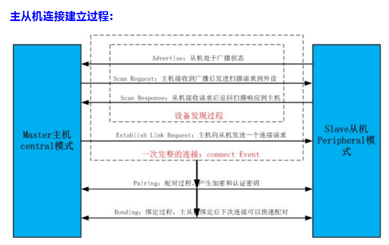

1

两个蓝牙设备想要建立连接， 第一步是 从机(server) 向外广播， 主机（client） 搜索到后发起请求。 从机广播中包含设备的相关信息，比如设备名称，设备具有的服务uuid 等。


广播包的长度是31字节。不足的要补零。

组成是：

```
1、1个字节的长度。
2、广播类型：例如广播的设备名，uuid还是什么。
3、数据部分：
```

**BLE的特点**

1）快速地建立连接。

2）小数据包。一个数据包最多只包含20个字节。

3）发送和接收持续时间短。

4）尽量少的工作时间，尽量快地进入休眠模式。

5）超低的峰值电流和待机电流。

6）超长的待机时间。

蓝牙4.0包含两个内容：传统蓝牙(CLASSIC)和低功耗(LE)。

我们常用的蓝牙芯片例如CC2540、NRF51822、QN9020、CSR1000等都只支持蓝牙低功耗(BLE)，所以我们称之为单模芯片

而支持传统蓝牙和蓝牙低功耗的IC一般是手机、平板和PC机上的芯片组。我们称之为双模芯片。

传统蓝牙可以用来连接蓝牙耳机，也可以连接支持SPP协议的蓝牙模块；蓝牙低功耗可以用来连接外部的智能外设。

蓝牙低功耗技术制定的初衷是为了最大程度上延长蓝牙设备的续航时间，这就是为什么一般常见的穿戴式设备不支持语音传输，只在一些间歇式、数据量小的场合应用的原因。


数据链路层负责广播、扫描、连接的建立和维护。

在建立连接之前，scanner(手机、平板、PC)负责扫描、发起扫描请求和发起连接请求；

而advertiser(智能外设)任务是发起广播、相应扫描请求信号、响应连接请求进而跟scanner端建立连接。

数据链路层同时也负责将各种数据包按正确的数据格式组织起来，正确地发送到对方。

**建立连接以后scanner被称为master,advertiser被称为slave.**


数据链路层的2种信道：

1)广播信道：提供给还没有建立连接的蓝牙设备提供发射广播、扫描、建立连接的信道。

BLE有3个广播信道:37、38、39,

**在每一个广播事件发生时，advertiser分别在这3个信道上各发送一次广播信号。**

传统蓝牙的广播信道有16-32个，而BLE只有3个，**这就是为什么BLE的广播时间比较短的原因。**

2)数据信道：提供给已经建立蓝牙连接的master和slave端提供可靠的数据通信信道。

BLE规定，数据信道有37个。为加强通讯的可靠性，避开干扰，BLE设备通过自适应跳频的方式在这37个信道上传输数据。

ble帧格式

```
| 1 bytes |  4 bytes |    2 bytes   |  0~37bytes     |  3 bytes |
-----------------------------------------------------------------
|前导码    | 地址      |  PDU header  |   PDU payload  |   crc    |

前导码：广播接收端可以用来进行同步。在广播帧里，前导码固定为：0x55
地址：access address。在广播帧里固定为0x8E89BED6
crc是3个字节。
```

PDU header

```
4 bits  |  2 bits |  1 bit | 1 bit |  6 bits |  2 bits | 
type       res       tx      rx       lenght    res

tx和rx的1个bit，为0表示是公共地址。为1表示是随机地址。
```

类型：

```
0： ADV_IND
1： ADV_DIRECT_IND
2： ADV_NONCONN_IND
3： SCAN_REQ
4： SCAN_RSP
5： CONNECT_REQ
6： ADV_SCAN_IND 
```

以ADV_开头的帧表示该帧是广播帧，是由advertiser(蓝牙外设)发出的，它们有4种类型，分别用在不同的蓝牙设备上面。


广播包的发送是单向的。不需要任何连接。

广播包最大31个字节。

广播包可以指向某个特定的设备。也可以不指定。



参考资料

1、BLE 广播格式定义

https://www.jianshu.com/p/fbb36c73f148

2、[蓝牙] 2、蓝牙BLE协议及架构浅析&&基于广播超时待机说广播事件

这位作者的蓝牙系列写得非常好。

https://www.cnblogs.com/zjutlitao/p/5037818.html