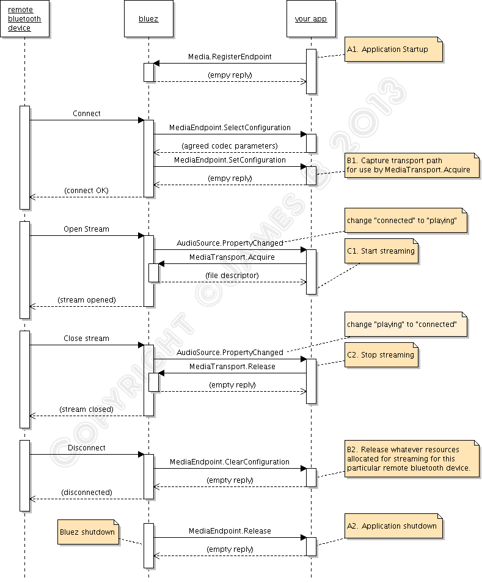

--

# a2dp-alsa

https://github.com/belese/a2dp-alsa

这个虽然很老了，api都对不上了。

但是这个实现了最基础的bluez dbus接口方式的A2DP编程。

思路是可以参考的。

# 一篇讲述A2DP app编程流程的文章

这篇文章恰好就是跟上面的a2dp-alsa配套的。

https://www.lightofdawn.org/wiki/wiki.cgi/BluezA2DP

在应用的生命周期里，会发生3个级别的event。

在这里分别标记为A、B、C。

A级别是最高级别的，是启动、关闭这一类的event。

B级别是连接、断开。

C级别是音频流数据处理相关的。播放、暂停。

## A级别事件/操作

有A1和A2这2个事件。

是app启动或者关闭时必须执行的，只做一次。

### A1

你需要在这里告诉bluez，你将要给它处理AD2P sink或者source。

你传递uuid、codec、capabilities来调用org.bluez.Media.RegisterEvent。

这些都是规定好的，不能随意填写。

uuid是A2DP sink或者source的uuid值。

code必须是A2DP规范里说明支持的某一种。

capabilities必须是对应codec的参数。

上面命令发送成功，会收到一个空的reply，否则会收到error。

### A2

应用结束。

这个是bluetoothd退出的时候会通知给app的。

org.bluez.MediaEndpoint.Release

你必须处理这个消息。

你只需要清理app的资源。

## B级别事件/操作处理

在app是生命周期里，B级别事件/操作可能发生多次。

### B1 连接

假设你开发的是音箱端的app。

当前手机蓝牙连接到音箱时，

音箱端的bluez会通知一个org.bluez.MediaEndpoint.SelectConfiguration到app。

你在app代码里需要处理这个。

这个会传递Capabilities参数给你，

你需要取出参数与自己设备的能力对比，选择最好的配置。

并且把配置的信息回复给bluez。

然后bluez会再发送org.bluez.MediaEndpoint.SetConfiguration给app。

你在这里的处理应该是：

你从数据里取出transport path。

然后把path 通过org.bluez.MediaTranport.Acquire，这个的目的是拿到pcm的fd。

### B2 断开

连接断开时，

bluez会给app发送org.bluez.MediaEndpoint.ClearConfiguration

你需要做的事情是，清除掉对应transport path的所有资源。

然后回复bluez一个空的消息就行。

## C级别事件/操作

这个是播放暂停这种stream操作。

可以发生多次。

### C1 开始播放

org.bluez.AudioSource.PropertyChanged，处理State属性。

当状态从connected变为playing的时候，

你需要调用org.bluez.MediaTransport.Acquire，bluez会传递给你一个pcm的fd。

### C2停止播放

org.bluez.AudioSource.PropertyChanged

State从playing变为connected的时候，

调用org.bluez.MediaTransport.Release。

其实可以不release，但是最好还是release。

# mpradio-py

https://github.com/morrolinux/mpradio-py

这个是一个在树莓派上进行radio广播的项目。看起来里面有很多的蓝牙操作。值得学习。

# 一个libuv跟glib冲突的问题

https://stackoverflow.com/questions/41843793/bluez-mediaendpoint1-timeout-issue-when-replying-to-dbus-call-from-node-addon

# yodaos里的蓝牙代码

hardware\modules\bluetooth\bluez\a2dp.h

这个是基于portaudio来自己写的代码。值得学习一下。

魔改了bluez的代码。

另外还有代码支持了ampak和cypress的bsa协议栈。

然后上层还有一个包装层。

hardware\modules\bluetooth\bluetooth.c
