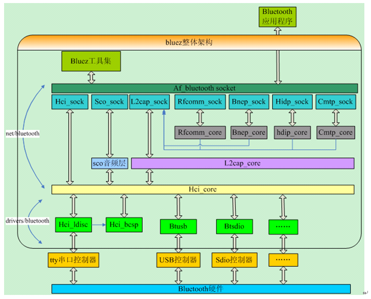
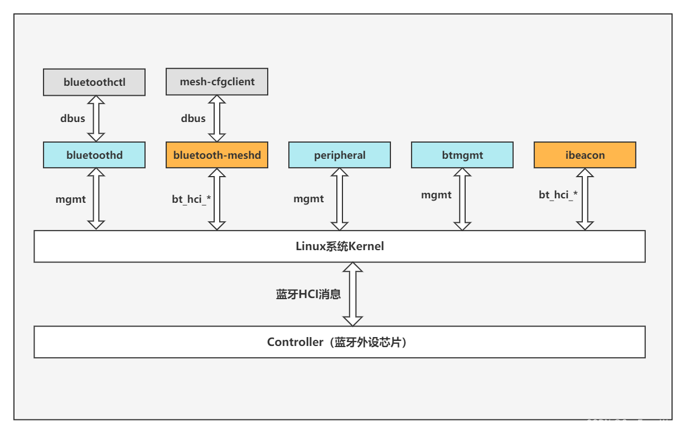

--

# 简介

BlueZ是一个开源的Linux蓝牙协议栈，为Linux系统提供了蓝牙功能的支持。

它由一个用户空间的库和一组系统工具组成，

能够实现蓝牙设备的发现、配对、连接等功能。

BlueZ由一个团队进行开发和维护，是Linux系统中最常用的蓝牙协议栈之一。

BlueZ的主要特点包括：

- **开源和免费**：BlueZ是开源的，任何人都可以查看、修改和分发它的源代码。它采用GPL许可证发布，完全免费使用。
- **功能丰富**：BlueZ提供了广泛的蓝牙功能支持，包括基本的设备发现、配对、连接，以及高级的音频传输、文件传输、串口传输等功能。
- **模块化设计**：BlueZ采用模块化的设计，提供了一系列的蓝牙协议和服务，可以根据需要进行选择和定制，从而适应不同的应用场景。
- **兼容性强**：BlueZ支持最新的蓝牙标准，能够与各种类型的蓝牙设备进行通信，包括手机、平板电脑、笔记本电脑、智能音箱、智能手表等。
- **活跃的社区支持**：BlueZ拥有一个活跃的开源社区，提供了丰富的文档、示例代码和技术支持，方便开发者学习和使用。

总的来说，BlueZ是Linux系统中最流行的蓝牙协议栈之一，被广泛应用于各种类型的Linux设备上，包括个人电脑、嵌入式系统、物联网设备等。

# 发展历史

BlueZ的发展历史可以追溯到2001年，以下是其主要里程碑和发展历程：

- **2001年**：BlueZ项目由Maksim Krasnyansky发起，最初是为了在Linux系统上支持蓝牙技术而创建的。
  
- **2002年**：BlueZ首次被合并到Linux内核中，成为Linux系统的一部分。这一举动使得Linux系统能够原生支持蓝牙设备。

- **2004年**：BlueZ发布了第一个稳定版本（版本3.x），并迅速成为Linux系统中使用最广泛的蓝牙协议栈。

- **2007年**：BlueZ项目开始转向版本4.x，这一版本带来了许多改进和新功能，包括更好的蓝牙音频支持、蓝牙低功耗（Bluetooth Low Energy，BLE）支持等。

- **2011年**：BlueZ 5.x版本发布，这一版本对BlueZ进行了彻底的重构和重新设计，采用了D-Bus作为通信机制，提供了更好的性能和可扩展性。

- **2013年**：BlueZ项目被Linux基金会接管，成为Linux基金会的一个重要项目，这一举措进一步增强了BlueZ的开发和支持力度。

- **2020年**：BlueZ项目继续发展，发布了最新版本BlueZ 5.54，该版本增加了对新蓝牙标准的支持，并改进了性能和稳定性。

在过去的二十多年里，BlueZ经历了多次重大版本更新和改进，不断适应蓝牙技术的发展和Linux系统的需求，成为了Linux系统中不可或缺的一部分，为各种类型的Linux设备提供了强大的蓝牙功能支持。

# 对比说明android的 bluedroid协议栈和bluez协议栈

好的，我们来对比一下Android的Bluedroid协议栈和BlueZ协议栈：

| 特性           | Bluedroid                             | BlueZ                                |
| -------------- | ------------------------------------- | ------------------------------------ |
| 使用平台       | Android                               | Linux（包括嵌入式Linux）             |
| 开发者         | Broadcom（后来被谷歌维护）            | Linux社区                            |
| 语言           | C                                     | C                                    |
| 主要用途       | 为Android设备提供蓝牙功能             | 为各种Linux设备提供蓝牙功能          |
| 蓝牙版本支持   | 支持最新的蓝牙规范                    | 支持最新的蓝牙规范                   |
| 体系架构       | 集成到Android框架中，专为移动设备优化 | 模块化设计，适用于广泛的设备         |
| 可扩展性       | 专为Android设计，扩展性有限           | 高度模块化，易于扩展和定制           |
| 文档和社区支持 | 文档较少，主要依赖于Android开发者社区 | 丰富的文档和活跃的开源社区支持       |
| 调试工具       | Android Studio、ADB等                 | 蓝牙调试工具（如bluetoothctl）       |
| 性能优化       | 针对移动设备进行优化                  | 更通用的优化，可在不同类型设备上运行 |
| 安全性         | 集成到Android安全体系中，定期更新     | 依赖Linux内核和开源社区的安全更新    |

### 主要区别：

1. **平台专用性**：Bluedroid专为Android设备设计，而BlueZ是为所有Linux设备设计的，包括嵌入式系统。
2. **社区和支持**：BlueZ有一个活跃的开源社区和丰富的文档支持，而Bluedroid的文档相对较少，主要依赖Android社区。
3. **架构和可扩展性**：BlueZ采用模块化设计，易于扩展和定制；Bluedroid则集成在Android框架中，更适合移动设备，但扩展性较差。

两者各有优势，选择哪个协议栈取决于具体的应用场景和需求。如果是开发Android应用或设备，Bluedroid更为合适；如果是开发通用的Linux蓝牙解决方案，BlueZ则是更好的选择。

# 简单使用

bluetooothctl的入口代码是在bluez/client/main.c里。


bluez和bsa是2个蓝牙协议栈。

bluez5_utils-5.50/lib/.libs/libbluetooth.so

bluez5_utils就是bluez

得到的有库，也有工具。


bluez有这些工具。

```
bccmd
bluemoon
	这个是进行配置，例如重启蓝牙。复位这些。
bluetoothctl
	这个很强大。主要操作工具。
btattach
	这个也是修改配置。
btmon
	
ciptool
	这个是cmtp相关操作。
hciattach
	
hciconfig ：类似于ifconfig的操作。
hcidump
	这个也比较重要。调试时把数据打出来看。
hcitool
	这个也很强大。是主要的调试工具。
hcitop
	这个类似top的行为，显示当前的动态数据。
hex2hcd
	
l2ping
	这个就是ping操作。
l2test
	这个也很有用。
mpris-proxy
rctest
rfcomm
sdptool
```


在Ubuntu上，使用的蓝牙协议栈是bluez。在Android上，用的是bluedroid。

使用bluez的时候，需要内核提供一系列的socket接口来操作蓝牙。

内核里的蓝牙框架如下图所示：




内核里的蓝牙框架，总体上可以分为2个部分：

1、蓝牙socket。

2、蓝牙驱动。

蓝牙socket是负责给bluez提供socket。并包含L2CAP层功能。

蓝牙驱动层包含：hci层协议，蓝牙硬件接口管理。

这2层的分割线就是：hci_core（图中黄色部分）。

针对bluez移植蓝牙，需要关注的就是2点：

1、蓝牙驱动。

2、bluze工具集里的hicattach这个工具。使用uart接口的蓝牙才需要。usb方式的，会自动枚举。


bluez和bluedroid的不同就是：

在bluez里，hci和L2CAP	都是在内核里。

而在bluedroid里，HCI 和L2CAP，都是内核之上了。


在蓝牙的电源控制方面，Ubuntu及debian系统都没有做很好的处理，从现在的蓝牙图形界面应用看，这两个系统中，默认蓝牙是一直有电的并且开机时就打开，并没有考虑关闭蓝牙的时候把蓝牙断电。


在Ubuntu笔记本上再次走了一般蓝牙连接的流程。碰到的问题跟之前在树莓派上碰到的问题都一样。

也按照一样的方法解决了。


```
teddy@thinkpad:~/work2/aosp$ sudo cat /var/log/syslog | grep -i protocol 
Mar 20 15:05:12 thinkpad kernel: [98813.756185] NET: Registered protocol family 31
Mar 20 15:05:43 thinkpad kernel: [98844.360067] Bluetooth: BNEP filters: protocol multicast
Mar 20 15:41:05 thinkpad bluetoothd[13253]: a2dp-source profile connect failed for B4:0B:44:F4:16:8D: Protocol not available
Mar 20 15:41:33 thinkpad bluetoothd[13253]: a2dp-source profile connect failed for B4:0B:44:F4:16:8D: Protocol not available
```

现在手机连上笔记本，笔记本相当于一个蓝牙音箱。

手机上播放音乐，声音从笔记本这边出来。


在Ubuntu上，直接用wireshark来抓包。


bluez提供的是协议栈。相当于tcpip协议栈。

bluez-utils相当于ping、arp这些工具。


怎么用Ubuntu来连接手机模拟的ble服务呢？

```
timeout -s SIGINT 5s hcitool -i hci0 lescan --passive
```

现在扫描出来有非常多，我随便选择一个：

```
gatttool -i hci0 -b 53:E3:74:F6:6B:8A -I 
```

会进入一个这样的提示符：

```
[53:E3:74:F6:6B:8A][LE]> 
```

但是实际上没有连接上：

```
[53:E3:74:F6:6B:8A][LE]> included
Command Failed: Disconnected
```


找到一份Ubuntu官方的说明。

整体流程是这样：

1、打开bluetoothctl。连接上目标设备。

2、连接成功后，会自动打印出目标设备的可以访问的服务。

```
[CHG] Device 5C:31:3E:71:0C:E7 UUIDs: 0d27ffc0-f0d4-469d-afd3-605a6ebbdb13
[NEW] Service /org/bluez/hci0/dev_5C_31_3E_71_0C_E7/service0010 Vendor specific (Primary)
[NEW] Characteristic /org/bluez/hci0/dev_5C_31_3E_71_0C_E7/service0010/char0011 Vendor specific
[NEW] Characteristic /org/bluez/hci0/dev_5C_31_3E_71_0C_E7/service0010/char0013 Vendor specific
```

但是我当前的问题，找不到Service这种。

3、如果找到。select一下属性。

```
select-attribute /org/bluez/hci0/dev_5C_31_3E_71_0C_E7/service0029/char002a
```

4、执行read操作。

```
[X4-LIFE Xmarty 2.0:/service0029/char002a]# read
Attempting to read /org/bluez/hci0/dev_5C_31_3E_71_0C_E7/service0029/char002a
[CHG] Attribute /org/bluez/hci0/dev_5C_31_3E_71_0C_E7/service0029/char002a Value: 0x49
  49
```

5、也可以打开通知，这样属性变化的时候，自动会通知过来。

```
notify on
```


bluez的版本之间不兼容。
版本5的和之前的版本就不兼容了。这个导致了很多工具在版本5上没法用了。
文档也很少。
主要的文档就是源代码目录下的txt文档。

使用了标准的dbus接口。你可以使用任何支持dbus接口的语言来进行bluez编程。

但是bluez的dbus，少了很多的东西。

bluez允许你：

1、查找出所有的蓝牙适配器，并单独对它们进行控制。

2、扫描设备，进行connect、pair、bond查找。

3、但是不能访问服务和特征值


如果你看完bluez的doc目录下的txt文档，还不知道怎么动手。

那么你可以看一下test目录下的python写的例子。


bluez更新节奏非常快，差不多每个月都会release版本。

所有有些人就开始寻找其他的库，例如在nodejs里，非常受欢迎的是noble（这个是用于中心节点）和bleno（这个用于外设节点）这2个库。

# bluez里对glib的使用

在BlueZ中，GLib是一个常用的工具库，用于简化C语言编程过程，提供了许多常用的数据结构、函数和宏。

BlueZ使用GLib来实现一些常见的功能，比如事件循环、异步操作等。

以下是BlueZ中对GLib的主要使用方式：

1. **事件循环（Event Loop）**：BlueZ使用GLib提供的事件循环机制来处理蓝牙相关的事件。通过调用GLib提供的函数，BlueZ可以注册事件源并监听事件的到来，然后在事件发生时执行相应的回调函数。

2. **异步操作**：在处理一些耗时的操作时，BlueZ可能会使用GLib提供的异步操作机制。通过GLib提供的异步函数和回调机制，BlueZ可以在后台执行耗时操作，同时不阻塞主线程。

3. **数据结构**：BlueZ可能会使用GLib提供的一些数据结构，比如链表、哈希表等，来方便地管理数据。

4. **内存管理**：BlueZ也可能会使用GLib提供的内存管理函数，比如内存分配、释放等，来管理动态分配的内存。

总的来说，GLib在BlueZ中的使用主要是为了简化编程过程，提高代码的可读性和可维护性，同时提供了一些常用的功能和工具，使开发者能够更方便地开发和维护蓝牙相关的代码。

# /etc/bluetooth/main.conf说明

`/etc/bluetooth/main.conf`是BlueZ蓝牙协议栈的主要配置文件，用于配置系统范围内的蓝牙设置和选项。以下是该文件的一般说明：

1. **[General]**：这个部分包含了一般性的蓝牙设置，如蓝牙适配器的名称、类别、可见性等。一些常见的选项包括：

   - `Name`：设定蓝牙适配器的名称。
   - `Class`：设置蓝牙适配器的设备类别。
   - `DiscoverableTimeout`：设置蓝牙设备在可见性模式下的超时时间。
   - `Discoverable`：设置蓝牙设备是否可见。

2. **[Policy]**：这个部分定义了一些与蓝牙设备连接和配对相关的策略。一些常见的选项包括：

   - `AutoEnable`：设置是否自动启用蓝牙适配器。
   - `PairableTimeout`：设置蓝牙设备在可配对模式下的超时时间。
   - `PairedDevices`：列出了已配对的蓝牙设备。

3. **[GATT]**：这个部分包含了与通用属性框架（GATT）相关的选项。GATT是蓝牙4.0及以上版本中使用的协议，用于描述蓝牙设备之间的通信和数据交换。

4. **[Policy]、[GATT]等其他部分**：除了上述列出的几个常见部分外，`main.conf`文件还可以包含其他自定义部分，用于配置其他特定的功能和选项。

总的来说，`/etc/bluetooth/main.conf`文件是用于配置系统范围内的蓝牙设置和选项的主要文件，通过修改该文件可以调整蓝牙适配器的名称、类别、可见性，以及连接和配对策略等。

## 例子

以下是一个`/etc/bluetooth/main.conf`文件的简单示例：

```plaintext
[General]
# 设置蓝牙适配器的名称
Name = MyBluetoothDevice

# 设置蓝牙适配器的设备类别
Class = 0x1F00

# 设置蓝牙设备在可见性模式下的超时时间（秒）
DiscoverableTimeout = 0

# 设置蓝牙设备是否可见
Discoverable = yes

[Policy]
# 设置是否自动启用蓝牙适配器
AutoEnable = true

# 设置蓝牙设备在可配对模式下的超时时间（秒）
PairableTimeout = 0

# 列出已配对的蓝牙设备
# PairedDevices = 00:11:22:33:44:55
```

在这个示例中：

- 蓝牙适配器的名称被设置为"MyBluetoothDevice"。
- 蓝牙适配器的设备类别被设置为0x1F00。
- 蓝牙设备的可见性被设置为永久可见。
- 蓝牙设备在可见性模式下的超时时间被设置为0，表示永久可见。
- 蓝牙适配器将会在系统启动时自动启用。
- 蓝牙设备在可配对模式下的超时时间被设置为0，表示永久可配对。
- 列出了一个已配对的蓝牙设备的示例。

这只是一个简单的示例，`/etc/bluetooth/main.conf`文件中可以包含更多的选项和配置。

## 解析函数

```
static void parse_config(GKeyFile *config)
{
	if (!config)
		return;

	check_config(config);

	DBG("parsing %s", main_conf_file_path);

	/* Parse Groups */
	parse_general(config);
	parse_br_config(config);
	parse_le_config(config);
	parse_gatt(config);
	parse_csis(config);
	parse_avdtp(config);
	parse_advmon(config);
}
```

## 可用参数在代码里的实现

```
static const char *supported_options[] = {
	"Name",
	"Class",
	"DiscoverableTimeout",
	"AlwaysPairable",
	"PairableTimeout",
	"DeviceID",
	"ReverseServiceDiscovery",
	"NameResolving",
	"DebugKeys",
	"ControllerMode",
	"MaxControllers",
	"MultiProfile",
	"FastConnectable",
	"SecureConnections",
	"Privacy",
	"JustWorksRepairing",
	"TemporaryTimeout",
	"RefreshDiscovery",
	"Experimental",
	"Testing",
	"KernelExperimental",
	"RemoteNameRequestRetryDelay",
	NULL
};

static const char *br_options[] = {
	"PageScanType",
	"PageScanInterval",
	"PageScanWindow",
	"InquiryScanType",
	"InquiryScanInterval",
	"InquiryScanWindow",
	"LinkSupervisionTimeout",
	"PageTimeout",
	"MinSniffInterval",
	"MaxSniffInterval",
	NULL
};

static const char *le_options[] = {
	"MinAdvertisementInterval",
	"MaxAdvertisementInterval",
	"MultiAdvertisementRotationInterval",
	"ScanIntervalAutoConnect",
	"ScanWindowAutoConnect",
	"ScanIntervalSuspend",
	"ScanWindowSuspend",
	"ScanIntervalDiscovery",
	"ScanWindowDiscovery",
	"ScanIntervalAdvMonitoring",
	"ScanWindowAdvMonitoring",
	"ScanIntervalConnect",
	"ScanWindowConnect",
	"MinConnectionInterval",
	"MaxConnectionInterval",
	"ConnectionLatency",
	"ConnectionSupervisionTimeout",
	"Autoconnecttimeout",
	"AdvMonAllowlistScanDuration",
	"AdvMonNoFilterScanDuration",
	"EnableAdvMonInterleaveScan",
	NULL
};

static const char *policy_options[] = {
	"ReconnectUUIDs",
	"ReconnectAttempts",
	"ReconnectIntervals",
	"AutoEnable",
	"ResumeDelay",
	NULL
};

static const char *gatt_options[] = {
	"Cache",
	"KeySize",
	"ExchangeMTU",
	"Channels",
	"Client",
	NULL
};

static const char *csip_options[] = {
	"SIRK",
	"Encryption",
	"Size",
	"Rank",
	NULL
};

static const char *avdtp_options[] = {
	"SessionMode",
	"StreamMode",
	NULL
};

static const char *advmon_options[] = {
	"RSSISamplingPeriod",
	NULL
};
// 这个是支持的section有哪些。
static const struct group_table {
	const char *name;
	const char **options;
} valid_groups[] = {
	{ "General",	supported_options },
	{ "BR",		br_options },
	{ "LE",		le_options },
	{ "Policy",	policy_options },
	{ "GATT",	gatt_options },
	{ "CSIS",	csip_options },
	{ "AVDTP",	avdtp_options },
	{ "AdvMon",	advmon_options },
	{ }
};

```


# bluez的dbus服务说明

BlueZ通过DBus（Desktop Bus）提供了一组服务，

这些服务允许其他应用程序与蓝牙协议栈进行通信，

从而实现对蓝牙功能的控制和管理。

DBus是Linux和Unix系统中用于进程间通信的一种机制，

它允许不同的进程之间通过消息传递来进行通信。

以下是 BlueZ D-Bus 服务的详细说明：

| D-Bus 服务                        | 描述                                                         |
| --------------------------------- | ------------------------------------------------------------ |
| `org.bluez.Service`               | BlueZ 的基本服务，用于管理蓝牙适配器、设备、服务等。         |
| `org.bluez.Adapter1`              | 蓝牙适配器服务，提供了对蓝牙适配器的控制和管理功能。         |
| `org.bluez.Device1`               | 蓝牙设备服务，提供了对蓝牙设备的控制和管理功能。             |
| `org.bluez.GattService1`          | GATT 服务服务，用于控制和管理 GATT 服务。                    |
| `org.bluez.GattCharacteristic1`   | GATT 特征服务，用于控制和管理 GATT 特征。                    |
| `org.bluez.LEAdvertisingManager1` | 低功耗广播管理器服务，用于控制和管理低功耗广播。             |
| `org.bluez.LEAdvertisement1`      | 低功耗广告服务，用于管理低功耗广告。                         |
| `org.bluez.Media1`                | 媒体服务，用于管理蓝牙音频和视频传输。                       |
| `org.bluez.MediaTransport1`       | 媒体传输服务，用于管理蓝牙音频和视频传输的传输参数。         |
| `org.bluez.AgentManager1`         | 代理管理器服务，用于管理蓝牙代理。                           |
| `org.bluez.ProfileManager1`       | 配置文件管理器服务，用于管理蓝牙配置文件。                   |
| `org.bluez.MediaControl1`         | 媒体控制服务，用于控制蓝牙音频和视频传输的播放、暂停、停止等操作。 |
| `org.bluez.MediaPlayer1`          | 媒体播放器服务，用于获取蓝牙音频和视频传输的播放状态、元数据等信息。 |
| `org.bluez.Thermometer1`          | 温度计服务，用于获取蓝牙温度计的温度数据。                   |
| `org.bluez.HeartRate1`            | 心率服务，用于获取蓝牙心率传感器的心率数据。                 |
| `org.bluez.CyclingSpeed1`         | 自行车速度服务，用于获取蓝牙自行车速度传感器的速度数据。     |
| `org.bluez.CyclingPower1`         | 自行车功率服务，用于获取蓝牙自行车功率传感器的功率数据。     |
| `org.bluez.CyclingCadence1`       | 自行车踏频服务，用于获取蓝牙自行车踏频传感器的踏频数据。     |
| `org.bluez.AlertAgent1`           | 警报代理服务，用于处理蓝牙警报事件。                         |
| `org.bluez.DeviceWatcher1`        | 设备监视器服务，用于监视蓝牙设备的连接状态变化。             |


# bluez test例子

我直接把bluez的代码下的test目录拷贝到Ubuntu笔记本里。

里面有这些文件。

```
├── bluezutils.py
├── dbusdef.py
├── example-advertisement
├── example-gatt-client
├── example-gatt-server
├── ftp-client
├── list-devices
├── map-client
├── monitor-bluetooth
├── opp-client
├── pbap-client
├── sap_client.py
├── service-did.xml
├── service-ftp.xml
├── service-opp.xml
├── service-record.dtd
├── service-spp.xml
├── simple-agent
├── simple-endpoint
├── simple-player
├── test-adapter
├── test-device
├── test-discovery
├── test-gatt-profile
├── test-health
├── test-health-sink
├── test-hfp
├── test-manager
├── test-nap
├── test-network
├── test-profile
└── test-sap-server
```

理解这些的关键，是把dbus-Python的基本逻辑理解清楚。

bluezutils.py 这个里面定义了

## test-device

我看test-device这个比较基础。先使用一下。

```
teddy@thinkpad:~/work/bluetooth/test$ ./test-device 
Usage: ./test-device <command>

  list
  create <address>
  remove <address|path>
  connect <address> [profile]
  disconnect <address> [profile]
  class <address>
  name <address>
  alias <address> [alias]
  trusted <address> [yes/no]
  blocked <address> [yes/no]
```

还比较友好。

直接`./test-device list`。列出的这2个，是我Ubuntu蓝牙连接过的设备。

```
18:F0:E4:E9:B6:56 小米手机
B4:0B:44:F4:16:8D Teddy
```

直接连接后面的Teddy这个。

```
./test-device connect B4:0B:44:F4:16:8D
```

可以连接成功。

查看class

```
./test-device class B4:0B:44:F4:16:8D
0x5a020c
```

用了这么几条命令，知道这个test-device的功能了。

现在我们看看代码，是怎么实现这些功能的。

使用的工具包有：

```
import dbus
import dbus.mainloop.glib
import bluezutils
```

代码都是很直白的，最直观的方式实现功能，一点弯都没有转。

逻辑都是bluezutils这个库里实现的。

但是这个bluezutils.py就在当前目录下，这个就是包装了一些dbus操作。

## test-adapter

这个就是对本机的蓝牙进行操作。

```
teddy@thinkpad:~/work/bluetooth/test$ ./test-adapter address
00:1A:7D:DA:71:13
```

```
teddy@thinkpad:~/work/bluetooth/test$ ./test-adapter list
 [ /org/bluez/hci0 ]
    Name = thinkpad
    Powered = 1
    Modalias = usb:v1D6Bp0246d0525
    DiscoverableTimeout = 180
    Alias = thinkpad
    PairableTimeout = 0
    Discoverable = 0
    Address = 00:1A:7D:DA:71:13
    Discovering = 0
    Pairable = 1
    Class = 0x0c010c
    UUIDs = dbus.Array([dbus.String(u'00001112-0000-1000-8000-00805f9b34fb'), 
```

```
teddy@thinkpad:~/work/bluetooth/test$ ./test-adapter name
thinkpad
```

感觉就是bluetoothctl的功能的一部分。

## list-devices

# test目录的python测试脚本分析

这些脚本都是通过跟dbus通信来实现功能的，所以不需要对bluez进行python binding。


# 代码分析

## bluez/lib/hci.h

这个头文件里定义了很多的重要结构体。

```
struct hci_dev_info 
```

hcitool dev，这个命令执行的是查询本地的hci设备信息。

最后是调用了系统调用。

```
ioctl(s, HCIGETDEVINFO, (void *) &di)
```

HCIGETDEVINFO 这个宏在kernel/include/net/blutooth/hci_sock.h里定义：

```
#define HCIGETDEVINFO	_IOR('H', 211, int)
```

这个hci_sock.h里，也有hci_dev_info结构体定义，跟应用层的一样。

打开一个蓝牙socket。是这样：

```
sk = socket(AF_BLUETOOTH, SOCK_RAW | SOCK_CLOEXEC, BTPROTO_HCI);
```

HCI_MAX_DEV这个最大是16个。

## bluetoothd

这个代码入口在bluez/src/main.c。

调试方法：

```
/usr/libexec/bluetooth/bluetoothd -d -n
```

-n表示前台运行，-d表示debug模式。

```
connect_dbus
	连接到bus，设置本app的name为org.bluez。
adapter_init
btd_device_init
btd_agent_init
btd_profile_init
	这些都是注册dbus的interface。
plugin_init
	Loading builtin plugins
        Loading gap plugin
        Loading a2dp plugin
        Loading avrcp plugin
        Loading hostname plugin
        Loading builtin plugins
        not load battery plugin
	Loading plugins /usr/lib/bluetooth/plugins
rfkill_init();
	fd = open("/dev/rfkill", O_RDWR);
然后就进入mainloop。
```


```
#define BTPROTO_L2CAP	0
#define BTPROTO_HCI	1
#define BTPROTO_SCO	2
#define BTPROTO_RFCOMM	3
#define BTPROTO_BNEP	4
#define BTPROTO_CMTP	5
#define BTPROTO_HIDP	6
#define BTPROTO_AVDTP	7

#define SOL_HCI		0
#define SOL_L2CAP	6
#define SOL_SCO		17
#define SOL_RFCOMM	18

```


# bluez的dbus使用

还是以gatt-service.c作为分析。

```
create_services_one
	register_service(IAS_UUID)
```

register_service函数分析

```

```

一个service，对应了dbus里一个interface。

不只是service，其实其他的对象，也都是对应一个dbus的service。

```
#define GATT_MGR_IFACE			"org.bluez.GattManager1"
#define GATT_SERVICE_IFACE		"org.bluez.GattService1"
#define GATT_CHR_IFACE			"org.bluez.GattCharacteristic1"
#define GATT_DESCRIPTOR_IFACE		"org.bluez.GattDescriptor1"
```

我似乎可以这样理解：

gatt-service.c这个app，里面就一个dbus object，所有跟dbus打交道的东西，都是这个object的interface（相当于成员变量）。

# bluez自己实现的gdbus

bluez使用了glib。

但是没有使用glib的gdbus。

而是自己实现了一个简化版本的gdbus。

在外观上的不同在于：

```
glib的gdbus接口：g_bus_xx
bluez简化实现的gdbus接口：g_dbus_xx
```

多了一个字母d。

同样对类型名字也是成立的，GDBus跟GBus的区别。

对dbus进行了一层简单实用的封装。

我觉得这个封装是不错的，可以在其他地方进行复用的。


# 如何使用bluez来进行应用开发

 1. 安装必要的库

确保安装了D-Bus开发库：

```bash
sudo apt-get install libdbus-1-dev libdbus-glib-1-dev
```

 2. 使用Python与BlueZ交互

可以使用`pydbus`库在Python中与BlueZ交互：

```bash
pip install pydbus
```

以下是一个简单的Python示例，用于扫描蓝牙设备：

```python
from pydbus import SystemBus
import time

bus = SystemBus()
adapter = bus.get("org.bluez", "/org/bluez/hci0")

adapter.StartDiscovery()

time.sleep(5)

devices = bus.get("org.bluez", "/")
for path, interfaces in devices.GetManagedObjects().items():
    if "org.bluez.Device1" in interfaces:
        print(f"Device {interfaces['org.bluez.Device1']['Address']}: {interfaces['org.bluez.Device1']['Name']}")

adapter.StopDiscovery()
```

 3. 使用C与BlueZ交互

也可以使用C语言与BlueZ的D-Bus接口进行交互。BlueZ提供了一个名为`libbluetooth`的C库。以下是一个简单的C代码示例，用于扫描蓝牙设备：

```c
include <bluetooth/bluetooth.h>
include <bluetooth/hci.h>
include <bluetooth/hci_lib.h>
include <stdio.h>
include <stdlib.h>

int main(void)
{
    inquiry_info *ii = NULL;
    int max_rsp, num_rsp;
    int dev_id, sock, len, flags;
    char addr[19] = { 0 };
    char name[248] = { 0 };

    dev_id = hci_get_route(NULL);
    sock = hci_open_dev(dev_id);

    if (dev_id < 0 || sock < 0) {
        perror("opening socket");
        exit(1);
    }

    len = 8;
    max_rsp = 255;
    flags = IREQ_CACHE_FLUSH;
    ii = (inquiry_info*)malloc(max_rsp * sizeof(inquiry_info));

    num_rsp = hci_inquiry(dev_id, len, max_rsp, NULL, &ii, flags);
    if (num_rsp < 0) perror("hci_inquiry");

    for (int i = 0; i < num_rsp; i++) {
        ba2str(&(ii+i)->bdaddr, addr);
        memset(name, 0, sizeof(name));
        if (hci_read_remote_name(sock, &(ii+i)->bdaddr, sizeof(name), name, 0) < 0)
            strcpy(name, "[unknown]");
        printf("%s  %s\n", addr, name);
    }

    free(ii);
    close(sock);
    return 0;
}
```

编译并运行上述代码：

```bash
gcc -o scan scan.c -lbluetooth
sudo ./scan
```

这些示例展示了如何使用BlueZ进行蓝牙设备的扫描和管理。通过D-Bus接口，你可以进一步开发更复杂的蓝牙应用，例如连接设备、传输数据等。


# 用bluez来实现基本的音乐播放功能

要用BlueZ实现基本的音乐播放功能，通常需要以下几个步骤：

1. **安装必要的工具和库**
2. **配置BlueZ**
3. **配对和连接蓝牙设备**
4. **使用Bluetooth Audio Sink服务**

以下是详细的步骤和相关命令：

**1. 安装必要的工具和库**

首先，确保你已经安装了BlueZ和PulseAudio（用于音频处理）。

```sh
sudo apt-get update
sudo apt-get install bluez pulseaudio pulseaudio-module-bluetooth
```

**2. 配置BlueZ**

确保蓝牙服务正在运行，并且PulseAudio加载了蓝牙模块。

```sh
sudo systemctl start bluetooth
pactl load-module module-bluetooth-discover
```

**3. 配对和连接蓝牙设备**

使用`bluetoothctl`进行蓝牙设备的配对和连接。

```sh
bluetoothctl
```

在`bluetoothctl`命令行界面中，输入以下命令：

```sh
power on
agent on
default-agent
scan on
```

找到你的设备MAC地址后，配对和连接：

```sh
pair XX:XX:XX:XX:XX:XX
connect XX:XX:XX:XX:XX:XX
```

**4. 使用Bluetooth Audio Sink服务**

确保PulseAudio已经将蓝牙设备作为音频输出设备。在配对成功后，设备应该自动连接到音频源。

可以使用以下命令检查设备状态：

```sh
pactl list short sinks
```

如果设备已经连接并作为音频输出，你可以通过音频播放器（如VLC、MPD等）播放音乐，音频将通过蓝牙设备输出。

以下是简要步骤的总结表格：

| 步骤                 | 命令/操作                                                    |
| -------------------- | ------------------------------------------------------------ |
| 安装工具和库         | `sudo apt-get install bluez pulseaudio pulseaudio-module-bluetooth` |
| 启动蓝牙服务和模块   | `sudo systemctl start bluetooth`<br>`pactl load-module module-bluetooth-discover` |
| 使用bluetoothctl     | `bluetoothctl`                                               |
| 启动蓝牙设备         | `power on`                                                   |
| 设置代理             | `agent on`<br>`default-agent`                                |
| 扫描设备             | `scan on`                                                    |
| 配对和连接设备       | `pair XX:XX:XX:XX:XX:XX`<br>`connect XX:XX:XX:XX:XX:XX`      |
| 检查音频输出设备状态 | `pactl list short sinks`                                     |

通过这些步骤，你应该能够使用BlueZ来实现基本的音乐播放功能。如果有任何具体的问题或错误信息，请告诉我，我可以提供进一步的帮助。


# 编写bluez插件并使用

要使用自定义的 BlueZ 插件，需确保插件已经正确编译、安装，并且 BlueZ 服务能够加载和调用该插件。以下是详细步骤，展示如何编写、编译、安装和使用插件。

**1. 编写插件**

假设我们编写一个简单的插件来演示基本功能。插件的源文件名为 `example_plugin.c`。

```c
#include <bluetooth/bluetooth.h>
#include <bluetooth/plugin.h>
#include <stdio.h>

// 插件初始化函数
static int example_init(void)
{
    printf("Example Bluetooth Plugin Initialized\n");
    return 0;  // 返回0表示成功
}

// 插件退出函数
static void example_exit(void)
{
    printf("Example Bluetooth Plugin Exited\n");
}

// 使用 BLUETOOTH_PLUGIN_DEFINE 宏定义和注册插件
BLUETOOTH_PLUGIN_DEFINE(example, "1.0", BLUETOOTH_PLUGIN_PRIORITY_DEFAULT, example_init, example_exit)
```

**2. 编译插件**

首先，确保你安装了必要的开发库。

```sh
sudo apt-get install libbluetooth-dev
```

然后，编译插件：

```sh
gcc -fPIC -shared -o example_plugin.so example_plugin.c `pkg-config --cflags --libs bluez`
```

**3. 安装插件**

将编译好的插件复制到 BlueZ 的插件目录中，一般是 `/usr/lib/bluez/plugins`。

```sh
sudo cp example_plugin.so /usr/lib/bluez/plugins/
```

**4. 修改 BlueZ 配置**

确保 BlueZ 配置文件允许加载你创建的插件。BlueZ 的配置文件通常位于 `/etc/bluetooth/main.conf`。编辑该文件，确保插件目录被正确包含，或者在插件加载部分添加你自定义的插件。

```sh
sudo nano /etc/bluetooth/main.conf
```

在 `main.conf` 中，确保 `PluginDir` 指向你安装插件的目录，并且插件名在 `LoadPlugins` 列表中。

例如：

```ini
[General]
# Default plugin directory
PluginDir = /usr/lib/bluez/plugins
# Load specified plugins (comma separated list)
LoadPlugins = example
```

**5. 重启蓝牙服务**

配置完成后，重启蓝牙服务使更改生效。

```sh
sudo systemctl restart bluetooth
```

**6. 验证插件**

通过查看系统日志或蓝牙日志验证插件是否已成功加载。

```sh
sudo journalctl -u bluetooth
```

在日志中，你应该能看到插件初始化和退出时的打印信息：

```plaintext
Example Bluetooth Plugin Initialized
Example Bluetooth Plugin Exited
```

**步骤总结表格：**

| 步骤               | 命令/操作                                                    |
| ------------------ | ------------------------------------------------------------ |
| 编写插件           | 创建 `example_plugin.c` 并编写插件代码                       |
| 安装开发工具和库   | `sudo apt-get install libbluetooth-dev`                      |
| 编译插件           | `gcc -fPIC -shared -o example_plugin.so example_plugin.c \`pkg-config --cflags --libs bluez\`` |
| 复制插件到插件目录 | `sudo cp example_plugin.so /usr/lib/bluez/plugins/`          |
| 修改 BlueZ 配置    | 编辑 `/etc/bluetooth/main.conf` 确保插件目录和插件名正确     |
| 重启蓝牙服务       | `sudo systemctl restart bluetooth`                           |
| 验证插件           | `sudo journalctl -u bluetooth` 查看日志确认插件加载情况      |

通过这些步骤，你应该能够成功编写、安装并使用自定义的 BlueZ 插件。如果你在任何步骤中遇到问题，请告诉我，我可以提供进一步的帮助。

# 内核里蓝牙的socket有哪几种

在 Linux 内核中，用于处理蓝牙通信的 socket 有以下几种：

1. **SCO（Synchronous Connection-Oriented）Socket：**
   - 用于同步连接导向通信，主要用于音频和语音传输。
   - 对应于 `AF_BLUETOOTH` 和 `BTPROTO_SCO` 协议族。
   - 可以通过 `socket()` 系统调用创建。
   - 可以使用 `bind()` 绑定地址、`listen()` 监听连接请求、`accept()` 接受连接等操作。

2. **L2CAP（Logical Link Control and Adaptation Protocol）Socket：**
   - 用于传输数据包，支持可靠和不可靠的数据传输。
   - 对应于 `AF_BLUETOOTH` 和 `BTPROTO_L2CAP` 协议族。
   - 可以通过 `socket()` 系统调用创建。
   - 可以使用 `bind()` 绑定地址、`listen()` 监听连接请求、`accept()` 接受连接等操作。

3. **RFCOMM（Radio Frequency Communication）Socket：**
   - 用于在蓝牙设备之间建立虚拟串口通信。
   - 对应于 `AF_BLUETOOTH` 和 `BTPROTO_RFCOMM` 协议族。
   - 可以通过 `socket()` 系统调用创建。
   - 可以使用 `bind()` 绑定地址、`listen()` 监听连接请求、`accept()` 接受连接等操作。

这些是 Linux 内核中用于蓝牙通信的主要 socket 类型。每种类型都有其特定的用途和特性，可以根据应用程序的需求选择合适的 socket 类型进行通信。

## 示例代码

以下是使用 Linux 内核蓝牙 socket 进行编程的简单示例代码，分别演示了 SCO、L2CAP 和 RFCOMM socket 的创建、绑定、监听、接受连接等操作。

**1. SCO Socket 示例代码：**

```c
#include <stdio.h>
#include <unistd.h>
#include <bluetooth/bluetooth.h>
#include <bluetooth/sco.h>

int main() {
    int sco_socket;
    struct sockaddr_sco addr;

    // 创建 SCO socket
    sco_socket = socket(AF_BLUETOOTH, SOCK_SEQPACKET, BTPROTO_SCO);
    if (sco_socket == -1) {
        perror("SCO socket creation failed");
        return 1;
    }

    // 绑定到本地地址
    memset(&addr, 0, sizeof(addr));
    addr.sco_family = AF_BLUETOOTH;
    bacpy(&addr.sco_bdaddr, BDADDR_ANY);
    addr.sco_channel = 0;
    if (bind(sco_socket, (struct sockaddr *)&addr, sizeof(addr)) == -1) {
        perror("SCO socket bind failed");
        close(sco_socket);
        return 1;
    }

    // 监听连接请求
    if (listen(sco_socket, 1) == -1) {
        perror("SCO socket listen failed");
        close(sco_socket);
        return 1;
    }

    printf("SCO socket setup complete, waiting for connection...\n");

    // 接受连接
    int client_socket = accept(sco_socket, NULL, NULL);
    if (client_socket == -1) {
        perror("SCO socket accept failed");
        close(sco_socket);
        return 1;
    }

    printf("SCO socket connection accepted\n");

    // 连接建立后的操作...
    
    // 关闭 socket
    close(client_socket);
    close(sco_socket);

    return 0;
}
```

**2. L2CAP Socket 示例代码：**

```c
#include <stdio.h>
#include <unistd.h>
#include <bluetooth/bluetooth.h>
#include <bluetooth/l2cap.h>

int main() {
    int l2cap_socket;
    struct sockaddr_l2 addr;

    // 创建 L2CAP socket
    l2cap_socket = socket(AF_BLUETOOTH, SOCK_SEQPACKET, BTPROTO_L2CAP);
    if (l2cap_socket == -1) {
        perror("L2CAP socket creation failed");
        return 1;
    }

    // 绑定到本地地址
    memset(&addr, 0, sizeof(addr));
    addr.l2_family = AF_BLUETOOTH;
    bacpy(&addr.l2_bdaddr, BDADDR_ANY);
    addr.l2_psm = htobs(0x1001); // 示例 PSM
    if (bind(l2cap_socket, (struct sockaddr *)&addr, sizeof(addr)) == -1) {
        perror("L2CAP socket bind failed");
        close(l2cap_socket);
        return 1;
    }

    // 监听连接请求
    if (listen(l2cap_socket, 1) == -1) {
        perror("L2CAP socket listen failed");
        close(l2cap_socket);
        return 1;
    }

    printf("L2CAP socket setup complete, waiting for connection...\n");

    // 接受连接
    int client_socket = accept(l2cap_socket, NULL, NULL);
    if (client_socket == -1) {
        perror("L2CAP socket accept failed");
        close(l2cap_socket);
        return 1;
    }

    printf("L2CAP socket connection accepted\n");

    // 连接建立后的操作...
    
    // 关闭 socket
    close(client_socket);
    close(l2cap_socket);

    return 0;
}
```

**3. RFCOMM Socket 示例代码：**

```c
#include <stdio.h>
#include <unistd.h>
#include <bluetooth/bluetooth.h>
#include <bluetooth/rfcomm.h>

int main() {
    int rfcomm_socket;
    struct sockaddr_rc addr;

    // 创建 RFCOMM socket
    rfcomm_socket = socket(AF_BLUETOOTH, SOCK_STREAM, BTPROTO_RFCOMM);
    if (rfcomm_socket == -1) {
        perror("RFCOMM socket creation failed");
        return 1;
    }

    // 绑定到本地地址
    memset(&addr, 0, sizeof(addr));
    addr.rc_family = AF_BLUETOOTH;
    bacpy(&addr.rc_bdaddr, BDADDR_ANY);
    addr.rc_channel = 1; // 示例通道号
    if (bind(rfcomm_socket, (struct sockaddr *)&addr, sizeof(addr)) == -1) {
        perror("RFCOMM socket bind failed");
        close(rfcomm_socket);
        return 1;
    }

    // 监听连接请求
    if (listen(rfcomm_socket, 1) == -1) {
        perror("RFCOMM socket listen failed");
        close(rfcomm_socket);
        return 1;
    }

    printf("RFCOMM socket setup complete, waiting for connection...\n");

    // 接受连接
    int client_socket = accept(rfcomm_socket, NULL, NULL);
    if (client_socket == -1) {
        perror("RFCOMM socket accept failed");
        close(rfcomm_socket);
        return 1;
    }

    printf("RFCOMM socket connection accepted\n");

    // 连接建立后的操作...
    
    // 关闭 socket
    close(client_socket);
    close(rfcomm_socket);

    return 0;
}
```

以上是分别针对 SCO、L2CAP 和 RFCOMM socket 的简单示例代码，演示了如何创建、绑定、监听和接受连接。在实际应用中，还需要根据具体需求进行进一步的数据交换和处理。

## bluez里使用了哪些socket，分别实现了什么功能

在 BlueZ 中，使用了以下几种类型的 socket，分别实现了不同的功能：

1. **SCO Socket：**
   - 实现了 SCO（Synchronous Connection-Oriented）连接功能，用于同步连接导向通信，主要用于音频和语音传输。SCO socket 通常用于实现蓝牙耳机、耳机麦克风等音频设备的通信。

2. **L2CAP Socket：**
   - 实现了 L2CAP（Logical Link Control and Adaptation Protocol）连接功能，用于在蓝牙设备之间进行数据传输。L2CAP socket 提供了底层的数据通道，可以支持可靠和不可靠的数据传输，以及面向连接和无连接的通信。

3. **RFCOMM Socket：**
   - 实现了 RFCOMM（Radio Frequency Communication）连接功能，用于在蓝牙设备之间建立虚拟串口通信。RFCOMM socket 提供了类似于串口的数据传输接口，可以方便地进行数据交换和通信。

这些 socket 类型在 BlueZ 中扮演着不同的角色，用于支持不同类型的蓝牙设备和应用场景。例如，SCO socket 用于支持音频设备的传输，L2CAP socket 用于提供底层数据通道，RFCOMM socket 用于实现虚拟串口通信。

总的来说，BlueZ 使用了这些 socket 类型来支持蓝牙设备之间的各种通信需求，从音频传输到数据交换都能够得到满足。

# bluez的plugin有哪些

BLUETOOTH_PLUGIN_DEFINE
搜索这个字符串查看有哪些plugin。
大概是29个。

| 文件名              | 解释                                         |
| ------------------- | -------------------------------------------- |
| a2dp.c              | 与高级音频分发协议（A2DP）相关的实现。       |
| admin.c             | 管理插件的实现。                             |
| autopair.c          | 自动配对功能的实现。                         |
| avrcp.c             | 与音频/视频远程控制协议（AVRCP）相关的实现。 |
| bap.c               | 与基本音频配置协议（BAP）相关的实现。        |
| bass.c              | 与广播音频同步服务（BASS）相关的实现。       |
| battery.c           | 与电池服务相关的实现。                       |
| ccp.c               | 与呼叫控制协议（CCP）相关的实现。            |
| csip.c              | 与协调设置标识协议（CSIP）相关的实现。       |
| deviceinfo.c        | 设备信息服务的实现。                         |
| gas.c               | 与通用访问服务（GAS）相关的实现。            |
| hdp_main.c          | 与健康设备配置文件（HDP）相关的实现。        |
| hog.c               | 与人机接口设备（HOG）相关的实现。            |
| hostname.c          | 主机名插件的实现。                           |
| main.c              | 与SIM卡访问配置文件（SAP）相关的实现。       |
| manager.c (input)   | 输入设备管理器的实现。                       |
| manager.c (network) | 网络管理器的实现。                           |
| mcp.c               | 与媒体控制协议（MCP）相关的实现。            |
| micp.c              | 与麦克风控制协议（MICP）相关的实现。         |
| midi.c              | 与MIDI配置文件相关的实现。                   |
| neard.c             | 近距离通信（NFC）插件的实现。                |
| policy.c            | 策略管理插件的实现。                         |
| scan.c              | 扫描参数配置文件的实现。                     |
| sixaxis.c           | 与Sixaxis手柄相关的实现。                    |
| vcp.c               | 与音量控制协议（VCP）相关的实现。            |
| wiimote.c           | 与Wiimote手柄相关的实现。                    |

# bluez/peripheral/main.c 这个文件的作用是什么

`bluez/peripheral/main.c` 文件是 BlueZ 项目中用于实现蓝牙外围设备（Peripheral）功能的主入口。这个文件通常包含程序的初始化代码、主循环和核心逻辑。在 BlueZ 中，外围设备模式主要用于设备充当被动角色，比如蓝牙耳机、扬声器等设备等待与中心设备（例如智能手机、电脑）连接。

以下是 `bluez/peripheral/main.c` 文件的主要功能和作用：

1. **初始化和配置**：
   - **初始化蓝牙子系统**：设置蓝牙适配器的模式，使其能够作为外围设备工作。
   - **加载配置文件**：读取和解析配置文件，以获取所需的参数和设置。

2. **注册服务和特性**：
   - **GATT（Generic Attribute Profile）服务**：注册 GATT 服务和特性，使外围设备能够提供蓝牙服务，例如电池状态、心率监测等。
   - **Profile 注册**：注册 A2DP、HFP 等配置文件，使设备能够提供音频传输或其他服务。

3. **事件循环**：
   - **主循环**：运行主事件循环，处理来自蓝牙堆栈的事件，例如连接请求、数据传输等。
   - **事件处理**：处理各种蓝牙事件，包括连接、断开连接、数据读取和写入等。

4. **信号处理**：
   - **信号处理程序**：处理系统信号（如 SIGINT、SIGTERM），确保在程序退出时能够正确地清理资源和关闭蓝牙连接。

5. **日志和调试**：
   - **日志记录**：记录程序的运行状态和错误信息，便于调试和维护。

以下是一个简化的伪代码示例，展示了 `bluez/peripheral/main.c` 的可能结构：

```c
#include <stdio.h>
#include <stdlib.h>
#include <signal.h>
#include <bluetooth/bluetooth.h>
#include <bluetooth/hci_lib.h>
#include <bluetooth/gatt.h>

// 初始化函数
static void init_bluetooth() {
    // 初始化蓝牙适配器、配置文件等
}

// 事件处理函数
static void event_loop() {
    // 主事件循环，处理蓝牙事件
}

// 信号处理程序
static void signal_handler(int sig) {
    // 清理资源并退出
    exit(0);
}

int main(int argc, char *argv[]) {
    // 注册信号处理程序
    signal(SIGINT, signal_handler);
    signal(SIGTERM, signal_handler);

    // 初始化蓝牙子系统
    init_bluetooth();

    // 进入事件循环
    event_loop();

    return 0;
}
```

### 主要步骤解释

1. **初始化和配置**：初始化蓝牙适配器和外围设备所需的配置。
2. **注册服务和特性**：注册蓝牙服务（例如 GATT 服务），以便外围设备能够提供服务。
3. **事件循环**：进入主事件循环，处理蓝牙连接和数据传输事件。
4. **信号处理**：处理系统信号，确保程序能够优雅地退出。

`bluez/peripheral/main.c` 文件在 BlueZ 的外围设备实现中起着核心作用，负责初始化蓝牙子系统、注册服务、处理事件并确保资源的正确清理。

# bluez/shared/mgmt.c的作用

`bluez/shared/mgmt.c` 是 BlueZ 项目中管理蓝牙设备的核心文件之一。它实现了与蓝牙管理接口的交互，负责处理和发送管理命令（management commands）以及处理管理事件（management events）。这些管理接口通常用于配置蓝牙适配器、管理连接和控制蓝牙设备的行为。

以下是 `bluez/shared/mgmt.c` 文件的主要功能和作用：

1. **管理命令处理**：
   - 发送各种管理命令到蓝牙适配器，例如设置设备可发现性、可连接性、启用或禁用蓝牙适配器等。
   - 处理来自蓝牙适配器的响应，并进行相应的操作或状态更新。

2. **事件处理**：
   - 监听和处理来自蓝牙适配器的管理事件，例如设备连接、断开连接、属性变化等。
   - 根据事件更新内部状态或触发相应的回调函数，以通知应用程序或其他模块。

3. **命令和事件的封装**：
   - 提供用于构建和解析管理命令和事件的函数，使得其他模块可以方便地与蓝牙管理接口进行交互。

4. **回调机制**：
   - 注册和调用回调函数，以便在接收到特定事件时通知应用程序或其他模块。
   - 管理回调函数的注册和注销，确保在适当的时间触发和停止触发回调。

### 主要结构和函数

以下是 `bluez/shared/mgmt.c` 中的一些关键结构和函数的简要说明：

1. **mgmt_command**：
   - 用于构建和发送管理命令。
   - 示例：`mgmt_command(int index, uint16_t opcode, uint16_t len, const void *param, mgmt_complete_func_t complete, void *user_data);`

2. **mgmt_event**：
   - 用于处理管理事件。
   - 示例：`mgmt_event(uint16_t event, int index, const void *data, uint16_t len);`

3. **回调机制**：
   - 注册回调：`mgmt_register(mgmt_event_callback_t callback, void *user_data);`
   - 注销回调：`mgmt_unregister(mgmt_event_callback_t callback, void *user_data);`

### 代码示例

下面是一个简化的示例，展示如何使用 `mgmt_command` 发送一个命令，以及如何处理回调：

```c
#include "mgmt.h"

// 回调函数，用于处理命令完成
static void cmd_complete(int index, uint16_t opcode, uint8_t status, void *user_data) {
    if (status == 0) {
        printf("Command completed successfully\n");
    } else {
        printf("Command failed with status: %d\n", status);
    }
}

int main() {
    int dev_index = 0;  // 蓝牙设备索引

    // 初始化和发送管理命令
    mgmt_command(dev_index, MGMT_OP_SET_POWERED, 1, &(uint8_t){ 1 }, cmd_complete, NULL);

    // 事件循环（假设有一个事件循环在运行）
    // ...

    return 0;
}
```

### 总结

`bluez/shared/mgmt.c` 文件在 BlueZ 中扮演了与蓝牙管理接口交互的关键角色。它实现了发送管理命令、处理管理事件以及管理回调机制等功能，使得上层应用程序和其他模块可以方便地配置和控制蓝牙设备。

# bluetoothd初始化过程

```
load_config
connect_dbus
adapter_init
	mgmt_new_default 这个里面创建了一个HCI 的raw socket，
btd_device_init
btd_agent_init
	org.bluez.AgentManager1
btd_profile_init
	org.bluez.ProfileManager1
plugin_init
	这个就是把所有注册的plugin都初始化一下。
rfkill_init
	通过/dev/rfkill来操作。
mainloop_run_with_signal
	这里死循环。
	
```


# python bluez播放A2DP

使用 Python 通过 BlueZ 实现 A2DP 音乐播放涉及几个步骤。我们需要使用 `pybluez` 库来处理蓝牙连接和 BlueZ 的 D-Bus API 来管理 A2DP 配置文件。以下是一个详细的步骤指南，展示如何实现这一功能。

### 步骤 1: 安装所需的库

首先，确保安装了 `pybluez` 和 `dbus-python` 库。你可以使用 `pip` 安装这些库：

```bash
pip install pybluez dbus-python
```

### 步骤 2: 连接到蓝牙设备

使用 `pybluez` 库来扫描和连接到蓝牙设备。下面是一个简单的示例代码，用于扫描和连接到蓝牙设备：

```python
import bluetooth

def find_devices():
    print("Searching for devices...")
    devices = bluetooth.discover_devices(duration=8, lookup_names=True, flush_cache=True, lookup_class=False)
    print("Found {} devices.".format(len(devices)))

    for addr, name in devices:
        print("  {} - {}".format(addr, name))
    
    return devices

def connect_device(address):
    service_matches = bluetooth.find_service(address=address)

    if len(service_matches) == 0:
        print("Couldn't find the service on the device.")
        return None

    for match in service_matches:
        if match["name"] == "A2DP":
            port = match["port"]
            name = match["name"]
            host = match["host"]

            print("Connecting to \"{}\" on {}...".format(name, host))

            sock = bluetooth.BluetoothSocket(bluetooth.RFCOMM)
            sock.connect((host, port))

            print("Connected.")
            return sock

    return None

if __name__ == "__main__":
    devices = find_devices()
    if devices:
        addr, name = devices[0]  # Connect to the first found device
        sock = connect_device(addr)
        if sock:
            # Do something with the connection
            sock.close()
```

### 步骤 3: 使用 D-Bus 管理 A2DP 配置文件

接下来，使用 D-Bus 通过 BlueZ 管理 A2DP 配置文件。以下是一个使用 `dbus-python` 来注册 A2DP 配置文件并进行音频播放的示例：

```python
import dbus
import dbus.mainloop.glib
from gi.repository import GLib

def register_a2dp_profile(bus, path, profile):
    manager = dbus.Interface(bus.get_object("org.bluez", "/org/bluez"),
                             "org.bluez.ProfileManager1")

    opts = {
        "UUID": "0000110a-0000-1000-8000-00805f9b34fb",  # Audio Sink UUID
        "Name": "A2DP Sink",
        "Service": "audio",
        "Role": "sink",
        "PSM": dbus.UInt16(25),
        "Channel": dbus.UInt16(10),
        "Features": dbus.UInt16(0x0001)
    }

    manager.RegisterProfile(path, profile, opts)

def main():
    dbus.mainloop.glib.DBusGMainLoop(set_as_default=True)
    bus = dbus.SystemBus()

    # Register A2DP Profile
    path = "/bluez/example/profile"
    profile = "0000110a-0000-1000-8000-00805f9b34fb"  # Audio Sink UUID

    register_a2dp_profile(bus, path, profile)

    # Run the main loop
    loop = GLib.MainLoop()
    loop.run()

if __name__ == "__main__":
    main()
```

### 步骤 4: 播放音频

要播放音频，你可以使用外部工具（如 `mpg123` 或 `aplay`）来将音频流发送到蓝牙设备。确保蓝牙设备已连接并且系统音频输出已配置为该设备。

示例使用 `mpg123` 播放音频文件：

```bash
mpg123 -a bluetooth_device_name your_audio_file.mp3
```

### 完整的代码整合

以下是整合上述步骤的完整 Python 示例代码：

```python
import bluetooth
import dbus
import dbus.mainloop.glib
from gi.repository import GLib

def find_devices():
    print("Searching for devices...")
    devices = bluetooth.discover_devices(duration=8, lookup_names=True, flush_cache=True, lookup_class=False)
    print("Found {} devices.".format(len(devices)))

    for addr, name in devices:
        print("  {} - {}".format(addr, name))
    
    return devices

def connect_device(address):
    service_matches = bluetooth.find_service(address=address)

    if len(service_matches) == 0:
        print("Couldn't find the service on the device.")
        return None

    for match in service_matches:
        if match["name"] == "A2DP":
            port = match["port"]
            name = match["name"]
            host = match["host"]

            print("Connecting to \"{}\" on {}...".format(name, host))

            sock = bluetooth.BluetoothSocket(bluetooth.RFCOMM)
            sock.connect((host, port))

            print("Connected.")
            return sock

    return None

def register_a2dp_profile(bus, path, profile):
    manager = dbus.Interface(bus.get_object("org.bluez", "/org/bluez"),
                             "org.bluez.ProfileManager1")

    opts = {
        "UUID": profile,
        "Name": "A2DP Sink",
        "Service": "audio",
        "Role": "sink",
        "PSM": dbus.UInt16(25),
        "Channel": dbus.UInt16(10),
        "Features": dbus.UInt16(0x0001)
    }

    manager.RegisterProfile(path, profile, opts)

def main():
    dbus.mainloop.glib.DBusGMainLoop(set_as_default=True)
    bus = dbus.SystemBus()

    # Register A2DP Profile
    path = "/bluez/example/profile"
    profile = "0000110a-0000-1000-8000-00805f9b34fb"  # Audio Sink UUID

    register_a2dp_profile(bus, path, profile)

    # Run the main loop
    loop = GLib.MainLoop()
    loop.run()

if __name__ == "__main__":
    devices = find_devices()
    if devices:
        addr, name = devices[0]  # Connect to the first found device
        sock = connect_device(addr)
        if sock:
            # Do something with the connection
            sock.close()
    main()
```

### 总结

通过上述步骤，你可以使用 Python 通过 BlueZ 实现蓝牙 A2DP 音乐播放功能。这个示例展示了如何扫描和连接蓝牙设备、注册 A2DP 配置文件以及使用外部工具播放音频。请根据实际需求调整代码和配置。

# ARM平台上蓝牙协议栈Bluez的移植使用和配置

这篇文章提到的版本老了一些，但是它的优点是内容很全面系统。可以读一读。

https://blog.csdn.net/gatieme/article/details/48751743


# bluez RegisterEndpoint 需要哪些信息？作用是什么

`RegisterEndpoint` 是用于在 BlueZ（Linux 中的蓝牙协议栈）中注册蓝牙端点（Endpoint）的函数。

注册端点是**为了使蓝牙设备能够提供特定的服务或功能**，

以便其他设备可以发现和与之交互。

在调用 `RegisterEndpoint` 函数时，通常需要提供以下信息：

1. `struct bte_profile *profile`：指向要注册的蓝牙 profile 的指针。
2. `const char *service`：指定服务的 UUID（Universally Unique Identifier）。
3. `const char *path`：指定服务的路径。
4. `const char *interface`：指定服务的接口。
5. `const GDBusMethodInfo *methods`：指向包含有关此服务可用方法的信息的指针。
6. `const GDBusPropertyInfo *properties`：指向包含有关此服务可用属性的信息的指针。

注册蓝牙端点的作用是让系统知道该设备支持的服务和功能以及如何与之交互。

这样其他设备就可以通过扫描蓝牙设备的服务来了解其提供的功能，

并且可以通过相应的协议与其进行通信。

注册端点是在蓝牙设备上开放特定功能的一种方式，使得其他设备可以使用这些功能。

# org.bluez.MediaTransport.Aquire的作用

在 BlueZ 中，`org.bluez.MediaTransport.Acquire` 是一个 D-Bus 接口方法，

用于获取媒体传输对象（Media Transport Object）的方法。

这个方法的作用是**获取特定媒体传输对象的句柄**，

以便在蓝牙设备之间传输媒体数据（如音频流）。

当一个蓝牙音频设备（比如蓝牙耳机或扬声器）连接到一个蓝牙音频源（比如手机或电脑）时，需要建立一个媒体传输对象来管理音频数据的传输。

通过调用 `org.bluez.MediaTransport.Acquire` 方法，

可以获取一个特定媒体传输对象的句柄，

<u>从而可以在这个传输对象上执行各种操作，</u>

<u>如开始传输音频流、停止传输等。</u>

在调用 `org.bluez.MediaTransport.Acquire` 方法时，通常需要提供特定的参数，比如要获取的媒体传输对象的路径或其他相关信息。

这个方法的主要作用是为了在蓝牙设备之间建立可靠的音频传输通道，以实现高质量的音频传输体验。

# org.bluez.Agent1 的作用是什么

`org.bluez.Agent1` 是 BlueZ（Linux 下的蓝牙协议栈）中的一个接口，

**主要用于处理蓝牙设备配对和连接过程中的用户交互。**

### 主要作用

1. **配对管理**：
   - 处理设备之间的配对请求，包括输入配对码或确认。

2. **用户交互**：
   - 提供与用户的交互功能，例如提示用户输入 PIN 码或确认连接请求。

3. **授权控制**：
   - 管理设备连接和服务访问的授权，确保用户同意连接。

### 使用场景

- 当一个蓝牙设备尝试与另一个设备配对时，`org.bluez.Agent1` 会被调用，确保正确的用户交互流程。

### 总结

`org.bluez.Agent1` 在蓝牙设备配对和连接中起着关键作用，确保安全和用户体验。

# python操作org.bluez.Agent1 

下面是一个使用 Python 和 `pydbus` 库与 `org.bluez.Agent1` 接口进行蓝牙设备配对的简单示例。

### 安装依赖

首先，确保安装了 `pydbus`：

```bash
pip install pydbus
```

### 示例代码

```python
from pydbus import SessionBus
from gi.repository import GLib

class Agent:
    def Release(self):
        print("Agent released")

    def RequestPinCode(self, device):
        print(f"Requesting PIN code for {device}")
        return "1234"  # 这里返回固定的 PIN 码

    def RequestConfirmation(self, device, uuid):
        print(f"Confirm pairing with {device} for UUID {uuid}")
        return True  # 确认配对

    def RequestPasskey(self, device):
        print(f"Requesting passkey for {device}")
        return "000000"  # 返回固定的 Passkey

    def RequestAuthorization(self, device):
        print(f"Requesting authorization for {device}")
        return True  # 授权连接

# 创建代理并注册
bus = SessionBus()
agent = Agent()
bus.publish("com.example.Agent", agent)

# 注册 Agent
bluez = bus.get("org.bluez", "/org/bluez")
bluez.AgentManager.RegisterAgent("com.example.Agent", "NoInputNoOutput")

print("Agent registered. Waiting for pairing requests...")

loop = GLib.MainLoop()
loop.run()
```

### 说明

1. **Agent 类**：实现了 `org.bluez.Agent1` 接口中的方法，用于处理配对请求。
2. **SessionBus**：连接到 D-Bus 会话总线。
3. **注册代理**：将代理注册到 BlueZ，使其能够接收配对请求。
4. **主循环**：使用 GLib 的主循环等待事件。

### 注意

- 这个示例是一个基础的实现，实际应用中可能需要更复杂的逻辑和错误处理。
- 确保运行代码的用户具有足够的权限来访问蓝牙设备。

# org.bluez.MediaPlayer1 的作用

`org.bluez.MediaPlayer1` 是 BlueZ（Linux 下的蓝牙协议栈）中的一个接口，用于管理和控制蓝牙媒体播放器的功能。它主要用于与蓝牙音频设备（如耳机、音响）进行交互。

### 主要作用

1. **媒体控制**：
   - 提供播放、暂停、停止、跳过等控制功能。

2. **媒体信息获取**：
   - 获取当前播放的曲目、艺术家、专辑等信息。

3. **状态管理**：
   - 监控和报告媒体播放器的状态（如播放、暂停、停止）。

4. **支持多种媒体格式**：
   - 适用于多种音频格式和流媒体服务。

### 使用场景

- 当蓝牙音频设备连接到系统时，可以通过 `org.bluez.MediaPlayer1` 接口控制媒体播放，提供更好的用户体验。

### 总结

`org.bluez.MediaPlayer1` 接口使得蓝牙音频设备能够与操作系统进行有效的媒体控制和状态管理，增强了蓝牙音频设备的功能和用户互动。

# org.bluez.MediaPlayer1和org.bluez.MediaEndpoint1的关系

`org.bluez.MediaPlayer1` 和 `org.bluez.MediaEndpoint1` 是 BlueZ 中的两个接口，它们在蓝牙音频设备的管理中扮演着不同但互补的角色。

### 1. **org.bluez.MediaPlayer1**
- **功能**：
  - 主要用于控制媒体播放功能，如播放、暂停、停止、跳过等。
  - 提供有关当前播放内容的信息（如曲目、艺术家、专辑等）。
- **作用**：
  - 直接与用户交互，处理媒体控制请求。

### 2. **org.bluez.MediaEndpoint1**
- **功能**：
  - 代表一个媒体流的终端，负责管理与音频流相关的连接和传输。
  - 处理音频数据的传输和管理，确保数据流的稳定性和质量。
- **作用**：
  - 作为音频流的接口，确保音频数据从源设备传输到目标设备。

### **关系**
- `MediaPlayer1` 通常通过 `MediaEndpoint1` 来实现音频流的控制和管理。
- 它们协同工作：`MediaPlayer1` 处理用户的播放控制，而 `MediaEndpoint1` 则负责实际的音频数据传输。

### 总结
`org.bluez.MediaPlayer1` 和 `org.bluez.MediaEndpoint1` 是蓝牙音频设备管理的重要组成部分，前者侧重于用户控制，后者则专注于音频流的管理和传输。

# 使用org.bluez.MediaPlayer1和org.bluez.MediaEndpoint1来实现一个蓝牙播放功能

实现蓝牙播放功能需要使用 `org.bluez.MediaPlayer1` 和 `org.bluez.MediaEndpoint1` 接口。以下是一个简单的 Python 示例，展示如何使用这些接口来控制蓝牙音频设备的播放。

### 先决条件

确保安装了 `pydbus` 和 `gi.repository`：

```bash
pip install pydbus
```

### 示例代码

```python
from pydbus import SystemBus
from gi.repository import GLib

class MediaPlayer:
    def __init__(self, player_path):
        self.bus = SystemBus()
        self.player = self.bus.get("org.bluez", player_path)

    def play(self):
        print("Playing media...")
        self.player.Play()

    def pause(self):
        print("Pausing media...")
        self.player.Pause()

    def stop(self):
        print("Stopping media...")
        self.player.Stop()

    def get_metadata(self):
        metadata = self.player.Metadata
        print("Current Metadata:")
        for key, value in metadata.items():
            print(f"{key}: {value}")

class MediaEndpoint:
    def __init__(self, endpoint_path):
        self.bus = SystemBus()
        self.endpoint = self.bus.get("org.bluez", endpoint_path)

    def register(self):
        self.endpoint.Register()

    def unregister(self):
        self.endpoint.Unregister()

# 主程序
def main():
    media_player_path = "/org/bluez/media/player/path"  # 替换为实际的路径
    media_endpoint_path = "/org/bluez/media/endpoint/path"  # 替换为实际的路径

    player = MediaPlayer(media_player_path)
    endpoint = MediaEndpoint(media_endpoint_path)

    # 注册媒体端点
    endpoint.register()

    # 控制媒体播放
    player.play()
    GLib.timeout_add(5000, player.pause)  # 5秒后暂停
    GLib.timeout_add(10000, player.stop)   # 10秒后停止

    # 获取元数据
    GLib.timeout_add(2000, player.get_metadata)  # 2秒后获取元数据

    loop = GLib.MainLoop()
    loop.run()

if __name__ == "__main__":
    main()
```

### 说明

1. **MediaPlayer 类**：
   - 用于控制媒体播放，包括播放、暂停、停止和获取元数据。

2. **MediaEndpoint 类**：
   - 用于注册和注销媒体端点。

3. **主程序**：
   - 创建 `MediaPlayer` 和 `MediaEndpoint` 实例。
   - 注册媒体端点并控制媒体播放。
   - 使用 GLib 的定时器调度播放、暂停和停止操作。

### 注意事项

- 替换 `media_player_path` 和 `media_endpoint_path` 为实际的 D-Bus 路径。
- 确保你的蓝牙设备已连接，并且支持音频播放功能。
- 运行此脚本时，确保具有足够的权限访问蓝牙设备。

# bluez dbus编程相关

c++写的

https://github.com/S3ler/SimpleBluetoothLowEnergySocket

https://www.cnblogs.com/chenbin7/archive/2012/10/16/2726510.html

# mgmt-api


## 为什么需要mgmt-api

简而言之，它是用户空间蓝牙组件（如蓝牙）与内核通信的新接口，**旨在替换现有的原始 HCI 套接字**。


linux系统的bluez的代码是存在与两部分，

一部分在kernel，实现协议的一些基本功能，

还有一部分在user space实现协议的一些上层功能。

两部分之间的交互通过sockt机制，就是mgmt。

cmd的下发主要调用的是mgmt.c中的mgmt_send（）函数


除了前面说的cmd下发注册的回调外，kernel部分的event上报一般调用mgmt.c中的mgmt_event（）函数来完成，该函数实际是调用的mgmt_send_event()

## 为什么要用MGMT接口

1，很重要的一点，占用资源少。（实测Dbus环境动态库接近2M，bin接近1M，还是strip之后的。对于flash很小的设备而言内存占用压力很大，而用MGMT加起来不到1M）
2，便于纠错，直接和kernel通信的接口，避免过多的进程间交互，导致问题出来，不需要花大量时间纠错。（也是避免了内核与用户空间没有冲突的风险）
3，剩下的优点不提了，对于我当前简单实现ble slave，单点连接设备而言，用的比较少。

### 官方给的解释

命令队列和同步
由于内核现在负责所有HCI通信，因此内核和用户空间之间没有冲突的风险。

阻塞操作
通过管理接口，可以使用简单的异步消息来打开和关闭适配器:解决了阻塞问题。

不必要的HCI事件处理
没有原始HCI套接字意味着内核端没有承诺标志。因此，不再需要对这些数据包进行额外的处理。

分布式安全策略和逻辑

在管理界面中，只有用户交互(PIN码/传递密钥请求等)和链接密钥存储在用户空间端进行处理。用户空间将在适配器初始化时为内核提供所有存储的链接键，包括键类型。之后，内核负责处理链接键请求。
使用安全抽象接口的另一个好处是，它可以用于安全管理器协议(SMP)，这是蓝牙低功耗(LE)规范的一部分。SMP具有与SSP相似的用户交互模型，因此可以重用用户空间和内核之间的相同消息。
只要SMP是在内核端实现的，那么使用现有的内核接口从用户空间处理它就会有很大的问题，因为与SSP不同，SMP使用L2CAP而不是HCI进行消息传递。

缺乏早期跟踪能力

管理接口将提供一种特殊类型的跟踪套接字，可用于获取所有连接适配器的HCI流量。这将允许用户空间进程从适配器插入的第一刻起捕获进出适配器的所有流量。

## 如何用MGMT实现ble slave。

思路如下：
[1]  如何实现开关蓝牙.
[2]  如何实现广播，包含广播包和响应包的设定，以及广播参数设定等等。
[3]  如何实现GATT连接.
[4]  如何实现服务注册，即收发数据.
[5]  如何实现状态通知，包含连接成功，断开成功，timeout，terminate等等.
[6]  如何实现更新连接参数，连接间隔设定等等。

```
需要指出，以上几点可归纳为如何两个文件以及kernel中node的设定等等。
[1][2]      -->bluez-5.5x\tools\btmgmt.c

[3][4][5]   -->bluez-5.5x\tools\btgatt-server.c

[6]         -->部分可从btmgmt.c中获取，剩下部分可参考如下：
// 仅供参考：
cat /sys/kernel/debug/bluetooth/hci0/
```


这篇文章非常好。思路清晰。

https://blog.csdn.net/u014028690/article/details/107246633

# bluez提供了哪几种编程接口

简单说，是2种：

* hci，实际也就是socket接口。hcitool这些就是基于这种接口写的。接口在hci_lib.h里。
* dbus




https://blog.csdn.net/wanguofeng8023/article/details/135642487

## hci接口编程

https://www.codeleading.com/article/64675929251/

https://blog.sina.com.cn/s/blog_602f87700100e5q9.html


# org.bluez.Device1.Connect是进行classic bt还是ble的连接？

`org.bluez.Device1.Connect` 可以用于连接Bluetooth设备，但具体是Classic Bluetooth还是Bluetooth Low Energy（BLE）连接，取决于设备本身的类型和已配对的连接方式。

- **Classic Bluetooth设备**：如果目标设备是Classic Bluetooth设备，调用`Connect`方法会进行Classic Bluetooth连接。
- **BLE设备**：如果目标设备是BLE设备，调用`Connect`方法会进行BLE连接。

所以，`org.bluez.Device1.Connect`本身并不区分连接类型，而是根据设备类型自动选择合适的连接方式。

## 这个连接是哪种应用的连接的？gatt、A2DP？这些是怎么决定的？

`org.bluez.Device1.Connect` 是用于建立设备之间的基本连接，具体的应用层协议（如GATT、A2DP等）连接，是在设备成功连接后，通过其他接口或协议进一步协商和建立的。

### 决定连接类型的因素：
1. **设备类型**：
   - **BLE设备**：通常用于GATT（Generic Attribute Profile）连接，典型应用包括心率监测器、BLE传感器等。
   - **Classic Bluetooth设备**：通常用于音频（如A2DP）、输入设备（如HID）、串行通信（如SPP）等。

2. **服务发现**：
   - 一旦设备连接成功，BlueZ会进行服务发现（Service Discovery），确定设备支持的服务（例如A2DP、GATT、HFP等）。
   - 应用层可以根据服务发现的结果，选择合适的Profile接口（如`org.bluez.MediaPlayer1`用于A2DP，`org.bluez.GattService1`用于GATT）进行进一步的交互。

3. **Profile接口**：
   - **A2DP**：通过`org.bluez.MediaPlayer1`、`org.bluez.MediaTransport1`等接口实现，用于音频播放。
   - **GATT**：通过`org.bluez.GattService1`、`org.bluez.GattCharacteristic1`等接口实现，用于BLE的GATT操作。

### 连接过程示例：
1. 调用`org.bluez.Device1.Connect`连接设备。
2. BlueZ自动进行设备类型判断并建立合适的基础连接（Classic或BLE）。
3. 连接成功后，通过服务发现获取设备支持的服务。
4. 根据应用需求，使用特定的Profile接口建立GATT、A2DP等连接。

总结来说，`org.bluez.Device1.Connect`只是建立基本的设备连接，具体的应用层协议（GATT、A2DP等）连接，是通过服务发现和相应的Profile接口来实现的。

## 这个连接是在链路层进行的连接吗？

是的，`org.bluez.Device1.Connect` 主要是在链路层（Link Layer）建立设备之间的物理连接。这是Bluetooth通信的基础步骤，但它并不涉及应用层协议的具体操作。以下是连接的基本过程：

### 链路层连接过程：
1. **设备发现**：设备通过扫描或查询发现对方（通过广播或探测）。
2. **链路建立**：调用`org.bluez.Device1.Connect`后，BlueZ开始在链路层与目标设备建立连接。这包括Classic Bluetooth的LMP（Link Manager Protocol）或BLE的LL（Link Layer）协议。
3. **链路管理**：一旦链路层连接建立，设备可以维持该连接，通过链路管理协议处理连接的维护（例如，功耗管理、重新连接等）。

### 上层协议连接：
- **链路层连接完成后**，上层协议（如L2CAP、RFCOMM、ATT/GATT、AVDTP等）才会开始工作，基于此物理连接进行更高层次的应用层数据传输。例如：
  - **GATT（BLE）**：在链路层建立后，通过ATT协议进行GATT服务和特征的操作。
  - **A2DP（Classic Bluetooth）**：通过L2CAP和AVDTP协议，在链路层连接后进行音频流传输。

总结来说，`org.bluez.Device1.Connect` 进行的确实是链路层的连接，它为上层协议（如GATT、A2DP等）的操作奠定了基础。

# org.bluez.Device1.Connect 和org.bluez.Device1.ConnectProfile区别

`org.bluez.Device1.Connect` 和 `org.bluez.Device1.ConnectProfile` 都是用于连接蓝牙设备的方法，但它们的用途和行为略有不同：

| **方法**                           | **功能**                                                     | **使用场景**                                                 |
| ---------------------------------- | ------------------------------------------------------------ | ------------------------------------------------------------ |
| `org.bluez.Device1.Connect`        | 建立与蓝牙设备的通用连接，适用于任何类型的蓝牙设备。系统根据设备类型自动选择合适的连接方式（如Classic Bluetooth或BLE）。 | 用于一般连接，适合需要自动确定连接类型（如音频设备、BLE传感器等）的场景。 |
| `org.bluez.Device1.ConnectProfile` | 用于连接特定的蓝牙Profile。你可以指定要连接的Profile UUID，BlueZ会根据该UUID尝试建立连接。通常用于需要精确控制连接Profile的情况，如只想连接A2DP或HFP等。 | 用于需要连接特定Profile的场景，如仅连接A2DP用于音频流传输，或仅连接HFP用于电话音频。 |

### 详细区别：
1. **`org.bluez.Device1.Connect`**：
   - 这是一个通用的连接方法。
   - 系统会自动选择合适的Profile进行连接，具体取决于设备的类型和可用的服务。
   - 适用于不需要特别指定连接Profile的情况。

2. **`org.bluez.Device1.ConnectProfile`**：
   - 需要传入一个Profile UUID（例如A2DP的UUID是`0000110d-0000-1000-8000-00805f9b34fb`）。
   - 只会尝试连接指定的Profile，如果该Profile不可用或连接失败，则不会尝试其他Profile。
   - 适用于你想要精确控制或限制连接到特定Profile的场景。

### 示例场景：
- **通用连接（使用`Connect`）**：你有一个蓝牙音箱，它支持A2DP和HFP，你可以简单地调用`org.bluez.Device1.Connect`，系统会自动选择最佳的连接方式。
- **指定连接（使用`ConnectProfile`）**：你只想用这个音箱播放音乐，而不希望它连接到电话功能（HFP），你可以使用`org.bluez.Device1.ConnectProfile`并指定A2DP的UUID。

总之，`Connect` 是一个更高层次、更通用的连接方法，而 `ConnectProfile` 则提供了更细粒度的控制，允许你指定连接的具体Profile。


# 使用bluetoothctl命令的方式产生一个A2DP sink

你可以使用以下步骤，通过`bluetoothctl`命令创建一个A2DP sink：

1. **启动`bluetoothctl`**:
    ```bash
    bluetoothctl
    ```

2. **开启代理模式**：
    ```bash
    agent on
    ```

3. **设置默认代理**：
    ```bash
    default-agent
    ```

4. **打开蓝牙设备**：
    ```bash
    power on
    ```

5. **设置设备为可发现和可配对**：
    ```bash
    discoverable on
    pairable on
    ```

6. **扫描附近的蓝牙设备**：
    ```bash
    scan on
    ```
   在扫描设备时，记下你想连接的设备的MAC地址（例如：XX:XX:XX:XX:XX:XX）。

7. **配对设备**：
   
    ```bash
    pair XX:XX:XX:XX:XX:XX
    ```
    
8. **信任设备**：
    ```bash
    trust XX:XX:XX:XX:XX:XX
    ```

9. **连接设备**：
   
    ```bash
    connect XX:XX:XX:XX:XX:XX
    ```
    
10. **设置设备的配置文件为A2DP sink**：
    
    ```bash
    select-profile a2dp-sink
    ```
    
11. **确认连接状态**：
    ```bash
    info XX:XX:XX:XX:XX:XX
    ```

如果一切正常，你现在应该已经成功创建了一个A2DP sink，并且你的设备能够通过蓝牙播放音频到该sink。

# bluez调试打印

bluetoothd启动的时候，带上这个选项就可以指定哪些文件打开调试打印。

```
--debug=src/adapter.c:src/agent.c
```

# 

https://juejin.cn/post/6904788133867421704

# btmgmt 和hciconfig、hcitool作用比较

`btmgmt`、`hciconfig` 和 `hcitool` 是用于管理和配置 Bluetooth 设备的命令行工具，它们各自有不同的作用和特点。以下是对它们的比较：

### 1. btmgmt
- **作用**: `btmgmt` 是一个用于蓝牙设备管理的工具，提供了对蓝牙设备的全面控制。
- **功能**:
  - 可以管理蓝牙适配器的状态（如启用/禁用）。
  - 支持设备发现、配对和连接。
  - 提供对 GATT 服务器的管理功能。
  - 更加现代化，支持蓝牙 5.0 及更新的特性。
- **使用场景**: 适合需要复杂蓝牙管理和配置的用户，例如开发者和系统管理员。

### 2. hciconfig
- **作用**: `hciconfig` 是一个较老的工具，用于配置蓝牙适配器的设置。
- **功能**:
  - 允许查看蓝牙设备的信息（如状态、地址、类型等）。
  - 可以启用或禁用蓝牙适配器。
  - 提供简单的设备配置功能。
- **使用场景**: 适合进行基本的蓝牙设备配置和状态检查。

### 3. hcitool
- **作用**: `hcitool` 是一个用于与蓝牙设备进行交互的工具，主要用于执行低级蓝牙操作。
- **功能**:
  - 可以扫描附近的蓝牙设备并列出其信息。
  - 支持发送和接收 HCI 命令。
  - 提供对蓝牙设备的连接和断开功能。
- **使用场景**: 适合需要进行蓝牙设备扫描和低级操作的用户。

### 总结
- **`btmgmt`** 是最全面和现代的工具，适合复杂管理。
- **`hciconfig`** 用于基本的适配器配置。
- **`hcitool`** 则专注于低级交互和设备扫描。

根据你的需求，可以选择合适的工具来管理蓝牙设备。

# `btmgmt` 和 `bluetoothctl` 比较

`btmgmt` 和 `bluetoothctl` 都是用于管理和配置蓝牙设备的命令行工具，但它们在功能和使用场景上有一些区别。以下是两者的比较：

### 1. `btmgmt`
- **功能**:
  - 更加低级和全面，允许对蓝牙适配器进行详细的管理。
  - 支持对蓝牙适配器的状态、发现、配对、连接等进行细粒度的控制。
  - 提供对 GATT 服务器的管理功能，适用于开发者和系统管理员。
  
- **优点**:
  - 适合复杂的蓝牙管理任务。
  - 对新特性（如蓝牙 5.0）的支持较好。

- **使用场景**:
  - 需要全面控制蓝牙适配器和设备的用户，例如开发者或高级用户。

### 2. `bluetoothctl`
- **功能**:
  - 提供用户友好的交互式界面，适合日常使用。
  - 简化了一些操作，如设备扫描、配对、连接等。
  - 提供命令历史和自动补全功能，易于使用。

- **优点**:
  - 更加易于上手，适合普通用户和非专业开发者。
  - 适合日常的蓝牙设备管理任务。

- **使用场景**:
  - 适合简单的蓝牙设备管理，如配对和连接设备。

### 总结

| 特性           | `btmgmt`               | `bluetoothctl`     |
| -------------- | ---------------------- | ------------------ |
| **复杂性**     | 高                     | 低                 |
| **用户友好**   | 较少                   | 较多               |
| **功能**       | 详细的适配器和设备管理 | 简化的日常管理     |
| **适用对象**   | 开发者、系统管理员     | 普通用户、家庭用户 |
| **支持新特性** | 支持蓝牙 5.0 等新特性  | 支持基本功能       |

### 选择建议
- 如果你需要对蓝牙设备进行深入的管理，或者需要使用蓝牙的高级特性，选择 `btmgmt`。
- 如果你的需求是进行基本的设备配对和连接，选择 `bluetoothctl` 会更加方便和直观。

# SetConfiguration和SelectConfiguration 的关系是什么？

在蓝牙 A2DP（Advanced Audio Distribution Profile） 的 SBC（Streaming Bluetooth Codec） 配置过程中，`SetConfiguration` 和 `SelectConfiguration` 主要涉及 **设备间的音频参数协商**，两者的关系如下：

| 方法                    | 作用                   | 调用主体                     | 交互时机                                                     |
| ----------------------- | ---------------------- | ---------------------------- | ------------------------------------------------------------ |
| **SelectConfiguration** | 选择合适的音频配置     | Sink（接收端，如耳机、音箱） | 由 Source（音源，如手机、PC）发送 `GetCapabilities` 后，Sink 选择并返回合适的配置 |
| **SetConfiguration**    | 确定最终使用的音频配置 | Source（音源，如手机、PC）   | 由 Source 发送给 Sink，要求使用某个具体的音频参数            |

### 交互流程：

1. **Source**（播放端）向 **Sink**（接收端）请求支持的音频参数：
   - 发送 `GetCapabilities`，Sink 返回支持的编码格式、采样率、比特率等。
2. **Sink** 选择最佳配置：
   - Sink 通过 `SelectConfiguration` 选择一个合适的 SBC 编码参数，并返回给 Source。
3. **Source** 确定最终配置：
   - Source 发送 `SetConfiguration`，通知 Sink 使用这个配置，并进入 Streaming 状态。

### 关系总结：

- `SelectConfiguration` 由 Sink 选择适配的参数，类似于“挑选合适的选项”。
- `SetConfiguration` 由 Source 确认并应用最终的参数，类似于“确定使用该选项”。
- `SelectConfiguration` 先于 `SetConfiguration` 发生，Source 基于 Sink 的选择结果进行最终配置。

在 BlueZ 的 DBus API 里，这两个过程通常由 `org.bluez.MediaEndpoint1` 的 `SelectConfiguration` 和 `SetConfiguration` 方法实现。

# SelectProperties、ClearConfiguration、Release 这3个又分别在什么时候调用？

在 A2DP（Advanced Audio Distribution Profile）的连接和断开过程中，`SelectProperties`、`ClearConfiguration` 和 `Release` 这三个方法分别用于不同的阶段：

| 方法                   | 作用                 | 调用主体                        | 交互时机                                                     |
| ---------------------- | -------------------- | ------------------------------- | ------------------------------------------------------------ |
| **SelectProperties**   | 确定最终配置的属性   | Sink（接收端，如耳机、音箱）    | Source（音源，如手机、PC）调用 `SetConfiguration` 之后，由 Sink 解析并存储最终的配置参数 |
| **ClearConfiguration** | 清除当前音频流的配置 | Source（音源，如手机、PC）      | Source 断开 A2DP 连接或重新配置音频参数时调用                |
| **Release**            | 释放 Endpoint 资源   | Source（音源）或 Sink（接收端） | 设备断开或 Endpoint 需要被移除时调用                         |

------

### 交互流程：

1. **音频配置阶段**
   - Source 发送 `GetCapabilities`，Sink 返回支持的编码参数。
   - Sink 通过 `SelectConfiguration` 选择最佳 SBC 配置，并返回给 Source。
   - Source 发送 `SetConfiguration`，Sink 接收并存储参数，并调用 **`SelectProperties`** 解析最终配置。
2. **音频流播放**
   - Source 开始音频流传输（Streaming）。
   - Sink 使用 **`SelectProperties`** 中的配置参数进行音频解码和播放。
3. **音频断开或重新配置**
   - 如果 Source 需要更改配置或断开连接，它会调用 **`ClearConfiguration`**，清除当前的 A2DP 设置。
4. **资源释放**
   - 当设备断开连接或不再需要使用某个 Endpoint 时，Source 或 Sink 调用 **`Release`** 来释放资源。

------

### 关系总结：

- **`SelectProperties`**：Sink 在接收到 `SetConfiguration` 后，解析最终的 SBC 配置。
- **`ClearConfiguration`**：Source 在 A2DP 连接断开或重新配置时清除当前音频配置。
- **`Release`**：在设备断开或 Endpoint 不再使用时，释放资源。

这些方法通常在 BlueZ 的 `org.bluez.MediaEndpoint1` D-Bus API 里被使用。

# 参考资料

1、ARM平台上蓝牙协议栈Bluez的移植使用和配置

https://blog.csdn.net/gatieme/article/details/48751743

2、蓝牙配置相关的文章

https://blog.csdn.net/morixinguan/article/details/79197455

3、蓝牙协议栈

https://en.wikipedia.org/wiki/Bluetooth_stack

4、用BlueZ A2DP Profile播放音乐

https://blog.csdn.net/bluebeach/article/details/5891035

5、详细的arm移植过程

https://www.cnblogs.com/dong1/p/8271385.html

6、linux bluez bluetooth工具命令使用

https://blog.csdn.net/songyulong8888/article/details/81489210

7、这个讲了工具的用法。

https://www.pcsuggest.com/linux-bluetooth-setup-hcitool-bluez/

8、Ubuntu系统(bluez)蓝牙调试

https://blog.csdn.net/zjli321/article/details/52122447

9、Using bluez to access Bluetooth Low Energy devices?

https://unix.stackexchange.com/questions/203504/using-bluez-to-access-bluetooth-low-energy-devices

10、

https://docs.ubuntu.com/core/en/stacks/bluetooth/bluez/docs/reference/gatt-services

11、Bluetooth Low Energy Development on Linux

这篇文章不错。

https://medium.com/@doganyazar/bluetooth-low-energy-development-on-linux-4dc6fc079506