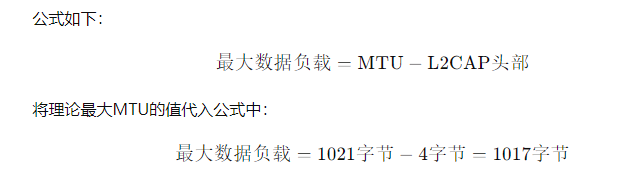

--

蓝牙的MTU（Maximum Transmission Unit）是指在蓝牙通信中每次数据传输的最大字节数。

MTU的大小对于蓝牙通信的性能和效率具有重要影响，

因为它决定了一次数据传输的大小，从而影响了数据传输的速率和稳定性。

在蓝牙通信中，MTU的大小通常由蓝牙协议栈或操作系统决定，并且可能因设备和配置而有所不同。

通常情况下，

==蓝牙传统模式（BR/EDR）下的MTU大小为672字节，==

==而蓝牙低功耗模式（BLE）下的MTU大小通常在20到512字节之间，==

具体取决于设备和协议栈的支持情况。

MTU的大小对于蓝牙通信有以下影响：
1. **数据传输效率**：较大的MTU可以减少通信开销，提高数据传输效率。
2. **延迟**：较大的MTU通常会降低传输数据的延迟，因为每次传输的数据量更大。
3. **内存消耗**：较大的MTU可能需要更多的内存来缓存数据，特别是在接收端。
4. **稳定性**：过大的MTU可能会增加数据传输的丢包率，特别是在信号弱或干扰严重的环境中。

因此，在进行蓝牙开发时，需要根据具体的应用场景和要求来合理设置MTU大小，以确保通信性能和稳定性。


MTU是不可协商的。双方在获知对方的mtu后，用较小值做MTU进行通信。

ble的mtu是23个字节。

ble的完整包的构成是这样：

```
引导 | 访问地址 |  LL头 | Data       |  CRC |
1字节   4字节      2字节  0到255字节    3字节
```

Data这个部分的长度，跟蓝牙的版本有关系。

在4.0和4.1上面，Data的值是27字节。

在4.2上面，增加了新的特性。

对Data部分进一步分解，分为2部分：

```
L2CAP Header |   ATT Data
4字节               0到251字节
```

L2CAP头部固定为4字节。里面包含了分片和重组信息。靠这个头部信息支持，上层的包最大可以到64KB。

这4个字节，又分为2部分：

2个自己的长度。

2个字节的Channel id。


iPhone6和iPhone6s的ATT_MTU是185字节。


给gatt的，是20字节。

因为23字节里，一个字节的ATT操作码。2个字节的ATT handle。


蓝牙mtu和其他网络的mtu情况对比

```
以太网：1500

IEEE 802.3/802.2:　1492

X.25: 576

BLE: 23 => 这就是为什么WIFI 可以用于传输视频，传统蓝牙(BT)可以传输音频，而低功耗蓝牙（BTLE 或者BLE）只能够传输控制数据的原因了。
```


# 经典蓝牙的mtu和ble的mtu

经典蓝牙（BR/EDR）和BLE（Bluetooth Low Energy）都有MTU（Maximum Transmission Unit，最大传输单元）的概念，但它们的作用和实现有所不同。

| **特性**          | **经典蓝牙的MTU**                                           | **BLE的MTU**                                                |
| ----------------- | ----------------------------------------------------------- | ----------------------------------------------------------- |
| **协议层**        | 适用于L2CAP（Logical Link Control and Adaptation Protocol） | 适用于ATT（Attribute Protocol）                             |
| **默认MTU大小**   | 672字节（理论最大1021字节，实际使用时通常小于672字节）      | 23字节（ATT层，应用层可以协商更大的MTU）                    |
| **最大可协商MTU** | 理论上最大1021字节（实际依赖于具体实现和应用需求）          | 可协商至更大值（如255字节及以上，取决于蓝牙版本和设备支持） |
| **数据传输类型**  | 常用于RFCOMM、OBEX等应用的流数据和数据包传输                | 主要用于GATT服务的数据交换，如通知、读写属性                |
| **影响因素**      | L2CAP配置、具体应用协议（如RFCOMM）的要求                   | BLE版本、设备支持情况、连接参数                             |
| **优化方向**      | 高带宽传输，适合音频和大数据包传输                          | 低功耗，适合小数据包和低带宽应用                            |

### 详细说明

1. **经典蓝牙的MTU**：
   - 经典蓝牙的MTU定义在L2CAP层，用于控制最大传输单元的大小。虽然理论最大值可以达到1021字节，但在实际应用中，默认大小通常为672字节。
   - MTU的大小会受到L2CAP协议的限制，并且还可能受其他应用协议（如RFCOMM、OBEX等）的影响，这些协议通常基于L2CAP运行。

2. **BLE的MTU**：
   - BLE的MTU主要涉及到ATT层，用于定义在GATT（Generic Attribute Profile）操作中单次传输的最大数据量。默认情况下，MTU为23字节，这包含1字节的操作码和22字节的数据。
   - BLE允许设备协商更大的MTU，这取决于设备的支持情况和蓝牙版本。例如，BLE 4.2及更高版本支持更大的MTU，常见的协商结果可能是255字节或更高。
   - 增大MTU可以提高数据传输效率，特别是在低功耗的情况下，可以减少传输的包数和功耗。

### 总结

经典蓝牙的MTU和BLE的MTU虽然都表示最大传输单元，但它们在用途、默认值和可协商大小上有所不同。经典蓝牙主要面向高带宽应用，而BLE则专注于低功耗、小数据包的应用场景。BLE的MTU在现代蓝牙应用中尤其重要，因为它直接影响到数据传输的效率和功耗。


# 蓝牙的mtu是受到什么因素限制

蓝牙的MTU（Maximum Transmission Unit，最大传输单元）受到以下几个因素的限制：

| **因素**           | **说明**                                                     |
| ------------------ | ------------------------------------------------------------ |
| **蓝牙协议版本**   | 不同版本的蓝牙协议支持的MTU大小不同。例如，经典蓝牙和BLE（Bluetooth Low Energy）在MTU的默认值和最大值上有所区别。 |
| **协议层**         | 在经典蓝牙中，MTU通常由L2CAP层定义；在BLE中，MTU由ATT（Attribute Protocol）层定义。不同层的MTU值影响最终的数据传输能力。 |
| **设备支持**       | 设备的硬件和固件设计会影响MTU的实际大小。即使协议支持更大的MTU，如果设备不支持，也无法使用更大的值。 |
| **连接参数**       | 在BLE中，连接参数（如连接间隔、超时等）也会影响MTU协商。更频繁的连接间隔和较高的超时值可以帮助提高MTU。 |
| **蓝牙栈实现**     | 蓝牙栈的实现（如芯片厂商的固件或操作系统的蓝牙栈）可能对MTU的大小有具体限制和优化。不同的实现可能会有不同的默认值和限制。 |
| **应用协议**       | 上层应用协议可能对数据包的大小有自己的要求和限制。例如，应用层协议可能要求较小的数据包以保证兼容性和效率。 |
| **设备配对和安全** | 设备配对过程和安全特性也可能影响MTU的大小。例如，某些安全特性可能会要求额外的数据包头，从而减少实际可用的MTU。 |

### 详细解释

1. **蓝牙协议版本**：
   - 经典蓝牙（BR/EDR）的MTU默认最大值为672字节（理论上1021字节），用于L2CAP层的数据传输。
   - BLE的MTU在默认情况下为23字节，但允许协商更大的值，通常可以达到255字节或更高，具体取决于蓝牙版本和设备支持。

2. **协议层**：
   - 在经典蓝牙中，L2CAP层的MTU定义了数据包的最大大小。
   - 在BLE中，ATT层的MTU定义了属性操作的数据包大小。MTU的增大会提高数据传输效率，减少传输的包数。

3. **设备支持**：
   - 不同设备的硬件和固件实现可能对MTU大小有所限制。有些设备可能不支持协议所允许的最大MTU。

4. **连接参数**：
   - 在BLE中，连接参数（如连接间隔、超时）影响MTU协商和数据传输的效率。适当的连接参数设置可以帮助实现更高的MTU值。

5. **蓝牙栈实现**：
   - 不同的蓝牙栈实现可能有不同的MTU限制。芯片厂商和操作系统可能会根据具体应用优化MTU的使用。

6. **应用协议**：
   - 上层应用协议可能会影响MTU的实际使用。例如，有些协议可能要求分段或使用较小的数据包来确保传输的稳定性和兼容性。

7. **设备配对和安全**：
   - 安全特性和设备配对过程可能会影响MTU。例如，配对过程中的密钥交换和加密操作可能会增加数据包头部，从而减少可用的MTU。

### 总结

蓝牙的MTU受到协议版本、协议层、设备支持、连接参数、蓝牙栈实现、应用协议和设备配对等多个因素的影响。这些因素共同决定了蓝牙设备在实际应用中能够支持的MTU大小。


# 经典蓝牙（BR/EDR）的MTU理论上1021字节，这个是怎么算出来的？

经典蓝牙（BR/EDR）的MTU理论上是1021字节，这个值是基于L2CAP（Logical Link Control and Adaptation Protocol）层的数据包结构计算的。以下是计算过程的详细说明：

### 经典蓝牙（BR/EDR）MTU的计算

1. **L2CAP数据包结构**：
   - 经典蓝牙中的L2CAP数据包结构包括了L2CAP头部和数据负载。L2CAP头部的大小为4字节。

2. **最大数据负载计算**：
   - L2CAP协议允许的最大数据负载是通过协议规范定义的。L2CAP的最大数据包大小（MTU）包括L2CAP头部和实际的数据负载。
   - L2CAP的MTU定义了数据包的最大总大小，通常为672字节，但理论上L2CAP层允许的数据负载可以达到1021字节。

3. **计算过程**：
   - L2CAP头部的大小是4字节。为了计算最大数据负载的大小，我们从最大MTU中减去L2CAP头部的大小。

   
   
4. **总MTU计算**：
   - 实际上，经典蓝牙的MTU通常为672字节（包括4字节的L2CAP头部），这是因为大多数设备和实现都遵循这一默认值。
   - 理论最大值（1021字节）是基于协议允许的最大值，但实际使用中很少达到这个值。许多设备和==蓝牙栈在实际应用中可能会选择较小的MTU值，以确保兼容性和稳定性。==

### 总结

经典蓝牙（BR/EDR）的理论MTU为1021字节，计算时考虑了L2CAP头部的4字节。实际中，MTU的大小通常为672字节，但理论上可以达到1021字节。这个计算基于L2CAP层的数据包结构和协议定义。

# 参考资料

1、一分钟读懂低功耗蓝牙(BLE)MTU交换数据包

https://zhuanlan.zhihu.com/p/28141658

2、Maximizing BLE Throughput Part 2: Use Larger ATT MTU

https://punchthrough.com/pt-blog-post/maximizing-ble-throughput-part-2-use-larger-att-mtu/

3、Logical Link Control and Adaptation Layer Protocol (L2CAP)

http://dev.ti.com/tirex/content/simplelink_cc2640r2_sdk_1_35_00_33/docs/ble5stack/ble_user_guide/html/ble-stack/l2cap.html

4、

https://www.bbsmax.com/A/RnJWrvoBzq/

5、一分钟读懂低功耗蓝牙(BLE)MTU交换数据包

https://zhuanlan.zhihu.com/p/28141658