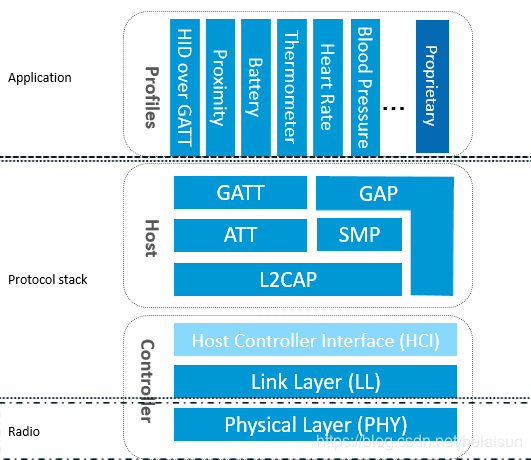

我觉得蓝牙协议栈不太好理解，但是tcpip协议栈平时用得多看得也多，

既然都是协议栈，那么它们有什么相似之处？又有什么不同呢？

蓝牙协议栈的分层, 所有 Profile (配置文件层)和应用都建构在GAP或GATT之上。

# 参考资料

1、蓝牙协议与普通网络协议的对比

https://blog.csdn.net/aotony_1988/article/details/52489173

2、蓝牙协议与普通网络协议的对比

http://www.voidcn.com/article/p-mjysjvfb-vc.html

3、蓝牙协议栈分层

https://blog.csdn.net/helaisun/article/details/90676922