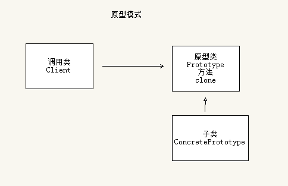

原型模式主要是用来做对象的复制。

类图是这样的：




prototype需要满足下面2个条件：

```
1、实现Cloneable接口。
2、重写Object类的clone方法。
```


原型模式是一种比较简单的模式，也很容易理解。

实现一个接口，重写一个方法，只需要这2步，就完成了原型模式。


参考资料

1、23种设计模式（5）：原型模式

https://blog.csdn.net/zhengzhb/article/details/7393528