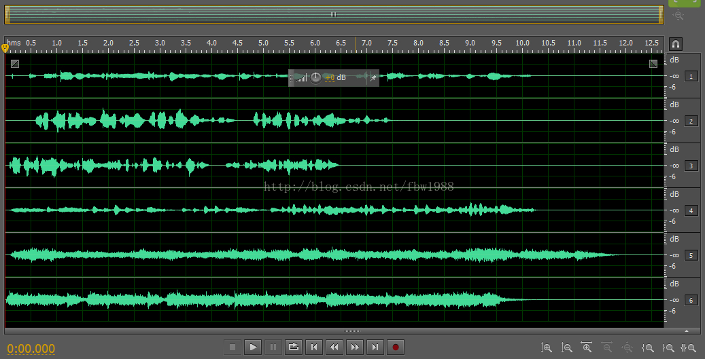

1

一个5.1声道的音频文件的6个channel的数据情况。




51.声道是：

```
左前     中置    右前

        低音
左后            右后
```

总共6个喇叭。

中置喇叭用来发出人声的。

低音喇叭主要发出低频声音。


# 树莓派5.1声道

树莓派是我学习各种知识的好帮手。

看看网上有没有做这个的。

5.1 output in ALSA is possible but you need a USB sound card to get the 5.1 output,


子设备用于混音，以便多个应用程序可以同时播放声音而无需对输出进行独占控制，因此这并不表示环绕声处于活动状态。

Raspbian 中包含的 snd_bcm2835 内核模块需要稍作改动以支持多声道声音输出。

要使其正常工作，您必须重建内核并修补 bcm2835-pcm 文件以将 max_channels 值从 2 增加到 8（如果您想使用 7.1 环绕声）。

如果您还需要能够将通道重定向到其他扬声器，那么您将需要找到一个添加该功能的补丁，

因为它根本没有实现。


可以用一个usb声卡在树莓派上实现5.1声道的输出。


有个叫HiFiBerry的论坛。估计是讨论在树莓派上实现hifi的论坛。


在本教程中，一个名为 MPLAYER 的媒体播放器将用于解码以杜比数字 5.1 编码的声音，

并将 6 个音频通道发送到 ALSA 虚拟设备。

 ALSA 虚拟设备将 6 个音频通道缩混为 2 个通道，

因为 Raspberry Pi 的内置声音芯片仅支持立体声（2 个通道：LEFT 和 RIGHT）


本教程将涵盖以下内容：

播放杜比数字 5.1 音频并将 6 个声道发送到 ALSA 虚拟设备，将 5.1 声道声音缩混为 2.0

创建一个将 5.1 声道声音缩混为 2.0 的虚拟设备

安装(ALSA) 实用程序

使用 ALSA 实用程序测试声卡和声音设备


```
pcm.51to20 {
	type route
	slave.pcm default
	slave.channels 2
	ttable.0.0 0.33
	ttable.1.1 0.33
	ttable.2.0 0.33
	ttable.3.1 0.33
	
	ttable.4.0 0.16
	ttable.4.1 0.16
	
	ttable.5.0 0.16
	ttable.5.1 0.16
	
	hint {
		show {
			@func refer
			name defaults.namehint.extended
			
		}
		description "virtual device that downmixes 5.1 channel to 2.0 channel"
	}
}
```

使用这个设备播放

```
aplay -D 51to20 1.wav
```


最后播放5.1声道的音频文件

```
mplayer --ac=a52 --channels=6 -ao alsa:device=51to20 dolbyaurora.vob
```


参考资料

1、5.1声道WAVE音频文件信息的写入及生成

https://blog.csdn.net/fbw1988/article/details/38273795

2、利用ALSA插件将5.1通道音频通过2通道立体声卡播放的配置（.asoundrc配置文件）

https://blog.csdn.net/u010312436/article/details/47838171

3、
https://forums.raspberrypi.com/viewtopic.php?t=250879

4、Play Dolby Digital 5.1 Audio on Raspberry Pi

这个教程网似乎不错。比较有体系。值得看看。

https://www.instructables.com/Play-Dolby-Digital-51-Audio-on-Raspberry-Pi/