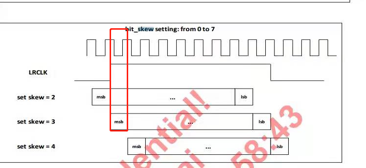

--

# 重要文档

这个说得很系统全面了。有这一篇基本够了。

http://www.wangdali.net/i2s/

# i2s协议说明

I2S(Inter—IC Sound)总线, 又称 集成电路内置音频总线，

是飞利浦公司为数字音频设备之间的音频数据传输而制定的一种总线标准，

该总线专门用于音频设备之间的数据传输，广泛应用于各种多媒体系统。


主要用来在板子内部和板子之间传递数字音频信号。

相比于模拟信号，数字信号抗干扰能力更强。


I2S是比较简单的数字接口协议，

**没有地址或设备选择机制。**

在I2S总线上，**只能同时存在一个主设备和发送设备**。

主设备可以是发送设备，也可以是接收设备，

或是协调发送设备和接收设备的其它控制设备。


**在I2S系统中，提供时钟（SCK和WS）的设备为主设备。**


I2S包括两个声道（Left/Right）的数据，

在主设备发出声道选择/字选择（WS）控制下进行左右声道数据切换。

通过**增加I2S接口的数目**或其它I2S设备可以实现多声道（Multi-Channels）应用。

## 信号线定义

在I2S传输协议中，数据信号、时钟信号以及控制信号是分开传输的。

I2S协议只定义**三根**信号线：时钟信号***SCK***、数据信号***SD\***和左右声道选择信号***WS***。


WS也称**帧时钟**，即LRCLK/Left Right Clock。

**WS频率等于声音的采样率。**

WS既可以在SCK的上升沿，也可以在SCK的下降沿变化。

从设备在SCK的上升沿采样WS信号。

数据信号MSB在WS改变后的第二个时钟（SCK）上升沿有效（即延迟一个SCK），这样可以让从设备有足够的时间以存储当前接收的数据，并准备好接收下一组数据。


它采用了沿独立的导线传输时钟与数据信号的设计，

**通过将数据和时钟信号分离，**

**避免了因时差诱发的失真，**

为用户节省了购买抵抗音频抖动的专业设备的费用。 


1、支持全双工/半双工

2、支持主/从模式

3、和PCM相比，I2S更适合立体声系统。

**当然，I2S的变体也支持多通道的时分复用，因此可以支持多声道。**


I2S主要有三个信号

1、串行时钟SCLK，也叫位时钟（BCLK），对应数字音频的每一位数据，SCLK都有一个脉冲。SCLK的频率=2 * 采样频率 * 采样位深。

2、帧时钟LRCK（也称WS），用于切换左右声道的数据。LRCK为‘1’表示传输右声道数据，为“0”则是左声道。LRCK的频率 = 采样频率

3、串行数据（SDATA），就是用二进制补码表示的音频数据，（MSB ---> LSB：数据由高位到低位依次传输）

**4、一般还有MCLK，主时钟。** 


随着技术的发展，也出现了很多种不同的数据格式。

根据data相对于LRCK和SCLK位置的不同，

分为I2S标准格式（飞利浦规定的格式），

左对齐（较少使用）

和右对齐（日本格式，普通格式），

**发送和接收端必须使用相同的数据格式。** 


这里有Great Scott的视频讲解。

https://www.bilibili.com/video/BV1Pt4y1X7M1


那么我们知道I2S是有一个LRCLK(帧时钟,用来切换左右声道的, 看上去只能处理两个声道咯?).

那么4个声道得怎么处理呢? 是用到两路I2S么?

那如果是用到两路I2S, 是不是需要把4声道的数据分成两部分来传输, 前4个字节(左前, 右前)用I2S1来传输, 后4个字节(左后, 右后)用I2S2来传输?


I2S数据可以合并在一起传，比如我们用的AD芯片TW2867，输出就是4路音频合并在一起的，还可以串接4片，16路音频在一个I2S信号里传，不过总的bit位需要合乎I2S协议的规定，好像是256bit。我搞硬件的，软件不是很确定。


为了保证数字音频信号的正确传输，发送端和接收端应该采用相同的数据格式和长度。当然，对I2S格式来说数据长度可以不同。


**在IIS总线中，任何设备都可以通过提供必需的时钟信号成为系统的主设备置，**

而从属设备通过外部时钟信号来得到它的内部时钟信号，

这就意味着必须重视主设备和数据以及命令选择信号之间的传播延迟，

总的延迟主要由两部分组成：

1.外部时钟和从设备的内部时钟之间的延迟
2.内部时钟和数据信号以及命令选择信号之间的延迟


skew表示偏斜。




4，I2S初始化配置
①，i2s的时钟使能和GPIO口配置
②，配置为i2s模式
③，i2s标准，包括**左对齐，右对齐，i2s标准**，即数据的最高位总是出现在WS变化（也就是一帧开始）后的第2个CK脉冲处。
④，i2s数据长度，包括16位，16位扩展（16位数据以32位包发送），24位，32位。
⑤，设置i2s时钟
⑥，设置i2s空闲状态下时钟电平
⑦，i2s使能
⑨，设置I2S的采样率。采样率一般在8K-192K之间。

5，I2S读写数据流程
①，WS时钟线用于切换左右声道，在该时钟的同一周期内的高电平和低电平应发送相同的数据，然后左右声道的声音才会一样。
②，CK时钟用于启动传输每一位音频数据


6，单声道音频数据转双声道音频数据
把单声道数据转换成双声道数据传输时，可作如下数据转换：

```
 for(res=0;res<DATA_LEN;res++)
{
buf2[res*4]=buf1[res*2];
buf2[res*4+1]=buf1[res*2+1];
buf2[res*4+2]=buf1[res*2];
buf2[res*4+3]=buf1[res*2+1];  
}  
```


另外I2S只能传2个声道的数据，PCM可以传多达16路数据，采用时分复用的方式，就是TDM。

像现在最流行的语音智能音箱的7麦克风矩阵，一般都是用TDM来传的数据，同时可以传输7路麦克风输入和3路以上的音频反馈信号。

AP处理器和蓝牙之间也是通过PCM来传输语音数据，打电话的蓝牙数据走的是PCM，放音乐的蓝牙数据走的是串口（不是PCM）。

 

# 一个stm32 i2s录音的例子

WM8978可以支持同时放音和录音，

但是STM32的I2S接口是个“跛子”，

同一时刻只能选择一个方向传输数据。

标准的I2S接口的CODEC芯片（比如WM8978）具有2个独立的数据引脚，

1个是ADCDAT，用于录音；

1个是DACDAT用于放音。

由于STM32的I2S接口只有一个数据引脚，

因此在设计引脚的时候，就需要确定是录音还是放音。

为了方便学习，开发板上增加了软件可控制的录音和放音切换电路。

可以实现类似于对讲机的半双工模式（即不能同时录音和放音）。


https://www.amobbs.com/thread-5054113-1-1.html

# I2S调试总结

关于IIS协议，可参考

http://www.wangdali.net/i2s/  

内核关于i2s的介绍Documentation/sound/soc/dai.rst

i2S模式:标准I2S模式、左对齐模式和右对齐模式  **多数都是用标准的I2S格式**

帧时钟LRCK:如8k，16k，24k，44.1k ，48k

串行时钟SCLK:LRLK*2*N(bits)(N=8，16，24，32)

调试i2s芯片时，要确认i2s谁做主(搞过乌龙，固件是ic做主，导致无法录音)，做主就需要发出LRCK和SCLK

如果手上缺示波器，不能量i2s波形，需要确认i2s信号有没有发出来，可通过量电压的方式，工作时clk电压基本在0.9V左右

如果通过i2s录音录不到数据，一方面可能是芯片没发波形出来，另一种可能是cpu这的i2s设置有误。

可通过外灌电压的方式来确认。拿镊子短接SDIN到1.8v，如果这样还是没有录到音，就是i2s设置有问题了。


https://blog.csdn.net/mike8825/article/details/51471366

# 参考资料

1、【音频】I2S协议详解

https://www.bilibili.com/read/cv7248991

2、**4声道数据如何在I2S上传输? 是否需要用到2个I2S?** 

https://www.amobbs.com/thread-5493228-1-1.html

3、

https://zhuanlan.zhihu.com/p/38330995

4、

https://www.cnblogs.com/linhaostudy/p/7700287.html

5、I2S通信详解

https://blog.csdn.net/qzl1221/article/details/77499684

