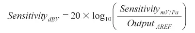

1

mic的典型电路如下：

这是个差分输入的例子，MICP2和MICN2是一对差分信号，经过C156的滤波，输入到MIC两端

MIC两引脚分别是到地和供电，上图的R177参数就关系到MIC输入的灵敏度

2、电阻R177影响灵敏度分析

MICBIAS是提供MIC的偏置电压，其大小一般是由codec的内部寄存器配置的，比如为0.6AVDD；

显然，电阻R177越大，通过R177的电流就越小，输入到MIC的电流就变化了。

这里先讲到MIC输入电流受R177电阻参数影响，下面分析下MIC工作原理

3、MIC工作原理分析

MIC内部设计，**可以简单理解为一个电容，电容的一端是固定的，另一端是可动的**，两端之间的距离和声音输入有关系，声音的大小、频率导致金属片震动产生幅度和频率的变化，

如此，在电容这边就转换为电容电荷量大小与充电快慢，在MIC输出端就表示为一个幅度和频率有随着声音输入变化而变化的电信号，联系第二点中输入MIC电流大小，就不难理解，

**R177影响输入电容两端的电流大小，然后影响输出的电平动态范围，就是灵敏度了！**比如，R177过大，输入电流过小，MIC录音输出电平都偏小，在处理MIC输出的电信号时，会被当做噪声或者是无输入而放弃，灵敏度就比较低了，对较小的声音输入，就无法获取了。

所以，在硬件设计的时候，**这个电阻的参数，要综合噪音和灵敏度的考虑，一般设为 2.2K ，较高灵敏度的可以选择 1K。**

灵敏度，即模拟输出电压或数字**输出值与输入压力之比**，

对任何麦克风来说都是一项关键指标。

在输入已知的情况下，**从声域单元到电域单元**的映射决定麦克风**输出信号的幅度。**

麦克风灵敏度一般在94 dB的声压级(SPL)（或者1帕(Pa)压力）下，

用1 kHz正弦波进行测量。

麦克风在该输入激励下的模拟或数字**输出信号幅度即是衡量麦克风灵敏度。**

该基准点只是麦克风的特性之一，并不代表麦克风性能的全部。

模拟麦克风的灵敏度很简单，不难理解。

**该指标一般表示为对数单位dBV（相对于1 V的分贝数)，**

代表着给定SPL下输出信号的伏特数。

对于模拟麦克风，灵敏度（表示为线性单位mV/Pa）可以用对数表示为分贝:

数字麦克风的灵敏度（单位为dBFS，相对于数字满量程的分贝数）则并非如此简单。单位的差异表明，数字麦克风与模拟麦克风的灵敏度在定义上存在细微差异。

选择灵敏度和设置增益 

高灵敏度麦克风并非始终优于低灵敏度麦克风。

虽然灵敏度可以显示麦克风的部分特性，但不一定能体现麦克风的性能。

麦克风噪声电平、削波点、**失真和灵敏度之间的平衡**决定了麦克风是否适用于特定应用。

高灵敏度麦克风在模数转换之前需要的前置放大器增益可能较少，

但其在削波前的裕量可能少于低灵敏度麦克风。  

**在手机等近场应用中**，麦克风接近声源，灵敏度较高的麦克风更可能达到最大声学输入，产生削波现象，最后导致失真。

另一方面，**较高的灵敏度可能适合远场应用（如会议电话和安保摄像头**），

因为在这类应用中，随着麦克风与声源之间距离的增加，声音会被衰减。

图3显示了麦克风与声源之间的距离会对SPL产生什么影响。与声源的距离每增加一倍，声学信号电平将下降6 dB（一半）。

尽管数字麦克风的灵敏度似乎缺乏灵活性，

**但可通过数字处理器中的增益轻松调节麦克风信号的电平。**

对于数字增益，只要处理器的位数足以完全表示原始麦克风信号的动态范围，

就不会导致信号的噪声电平降低。

在模拟设计中，每个增益级都会向信号中引入一些噪声；

需要系统设计师来保证每个增益级的噪声足够低，以避免其注入噪声而降低音频信号。

例如，我们可以看看ADMP441， 

这是一款数字(I2S )输出麦克风，最大SPL为120 dB（灵敏度为–26 dBFS），

等效输入噪声为33 dB SPL(61 dB SNR)。

参考资料

1、

https://blog.csdn.net/xujianqun/article/details/6661947

2、了解麦克风灵敏度

https://www.bilibili.com/read/cv801115/