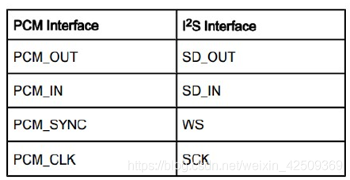
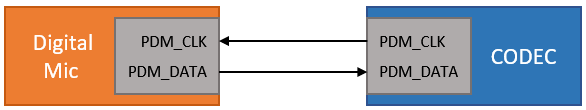
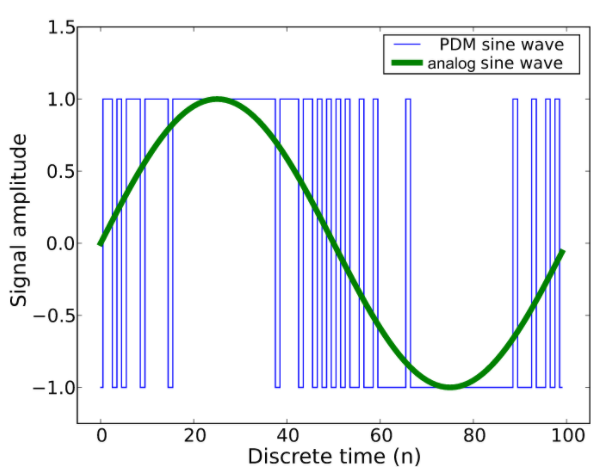

--

pcm是Pulse Code Modulation。

脉冲代码调制。

基本思路是，把离散的脉冲值来表示模拟信号波形。

PCM数字音频接口，

说明接口传输的音频数据是通过PCM方式采样得到的，

区别于PDM形式；

**IIS传输的也是PCM类型数据，属于其一个特例。**

相比于IIS，PCM接口更加灵活，

通过时分复用TDM方式，PCM接口支持多达N个声道的数据；

TDM不像IIS有统一标准，不同厂家TDM时有差异。

TDM/PCM数字音频接口的硬件拓扑结构也与I2S相近；

​           

接口名称有如下规律：

PCM：传输单声道数据，比如麦克风；

IIS：传输双声道数据，比如喇叭；

TDM：传输两个以上声道数据，同时区别于IIS特定格式。

 

根据SD相对于FSYNC的位置，TDM分两种基本模式：

Mode A ：数据在FSYNC有效后，BCLK的第二个上升沿有效；

Mode B： 数据在FSYNC有效后，BCLK的第一个上升沿有效；、

PDM接口只有两根信号线：
    **PDM_CLK** 时钟信号。
    **PDM_DATA** 数据信号。

**特点：**
信号线数量少，只需两根；多用于传输麦克风录音；PDM接口发送端IC设计简单。

**传输内容：**
PDM编码后的音频数据。(不同于I2S接口和PCM接口哦)

在数字麦克风领域，应用最广的就是PDM接口，其次为I2S接口。

PDM在诸如手机和平板等对于空间限制严格的场合有着广泛的应用前景。

除了表示接口，pcm和pdm也表示两种不同的编码格式。

**PDM**（Pulse Density Modulation）是一种用数字信号表示模拟信号的调制方法。同为将模拟量转换为数字量的方法。

PDM使用远高于PCM采样率的时钟采样调制模拟分量，

只有1位输出，要么为0，要么为1。

因此通过PDM方式表示的数字音频也被称为Oversampled 1-bit Audio。

**相比PDM一连串的0和1，PCM的量化结果更为直观简单。**

参考资料

1、

https://blog.csdn.net/dop102/article/details/105359696

2、

https://blog.csdn.net/yangjizhen1533/article/details/113758138