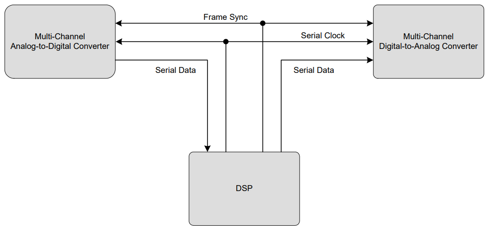

--

tdm：就是时分复用调制的缩写。

有些IC支持使用一个公共时钟的多路I2S数据输入或输出，

但这样的方法显然会增加数据传输所需要的管脚数量。

当同一个数据线上传输两个以上通道的数据时，就要使用TDM格式。

TDM数据流可以承载多达16通道的数据，并有一个类似于I2S的数据/时钟结构。

每个通道的数据都使用数据总线上的一个槽（Slot），

其宽度相当于帧的1/N， 其中N是传输通道的数量。

出于实用考虑，N通常四舍五入到最近的2次幂（2、4、8、或16），

**并且任何多余通道都被空闲。**

一个TDM帧时钟通常实现为一位宽的脉冲，

这与I2S的50%占空比时钟相反。

**超过25 MHz的时钟速率通常不用于TDM数据，**

原因是较高的频率会引起印刷电路板设计者要避免的板面布局问题。

TDM常用于多个源馈入一个输入端，

或单源驱动多只器件的系统。

在前一种情况下，（多源馈入一个输入端），

每个TDM源共享一个公共的数据总线。

该信源必须配置为在其适用通道期间才驱动总线，

而当其它器件在驱动其它总线时，其驱动器要置为三态。

**TDM接口还没出现类似飞利浦I2S的其他标准，**

因此，很多IC都有着自己略微不同的TDM实现方法。

这些变化体现在时钟极性、通道配置，以及闲置通道的三态化和驱动上。

当然，通常情况下不同IC是可以一起工作的，

但系统设计者必须确保一个器件的输出格式要符合另一只器件输入端的预期

**PDM数据连接**

PDM数据连接在手机和平板电脑等**便携音频应用**上方面变得越来越普遍。

PDM在尺寸受限应用中优势明显，

因为它可以将音频信号的布放围绕LCD显示屏等高噪声电路，

而不必处理模拟音频信号可能面临的干扰问题。

有了PDM，仅两根信号线就可以传输两个音频通道。

如图4系统框图所示，

两个PDM源将一根公共数据线驱动为一个接收器。

系统主控生成一个可被两个从设备使用的时钟，

这两个从设备交替使用时钟的边缘，

通过一根公共信号线将其数据输出出去。

TDM相比I2S 可以传输多ch音频数据，分为2种模式:dsp_a 和dsp_b

参考资料

1、TDM格式介绍 - 音频数据传输的常见IC间数字接口介绍

http://www.elecfans.com/video/yinpinjishu/20121210301406_2.html

2、

http://www.wangdali.net/wp-content/uploads/2014/10/%E6%95%B0%E5%AD%97%E9%9F%B3%E9%A2%91%E6%8E%A5%E5%8F%A3.pdf

3、数字音频接口之TDM

https://blog.csdn.net/songche123/article/details/118154829