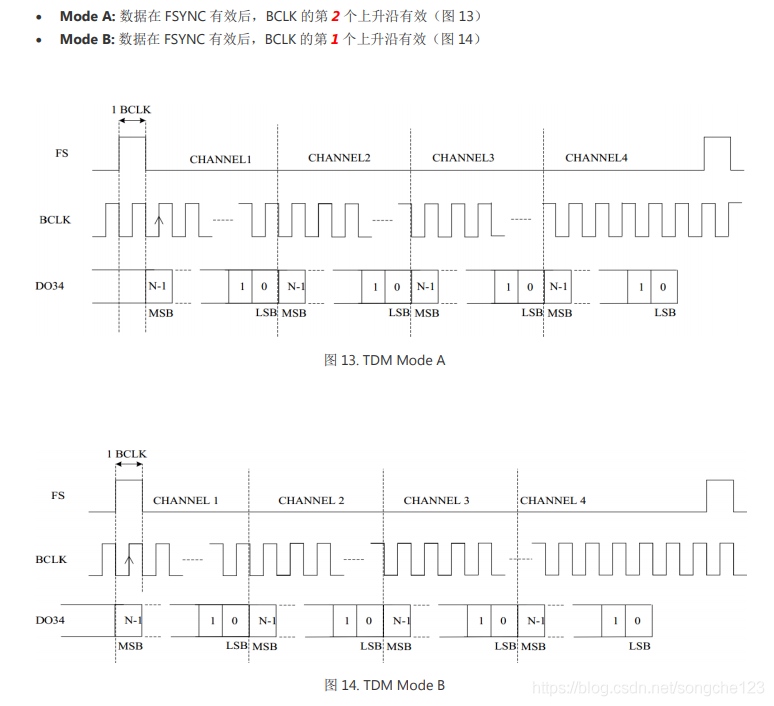

--

tdm：就是时分复用调制的缩写。


有些IC支持使用一个公共时钟的多路I2S数据输入或输出，

但这样的方法显然会增加数据传输所需要的管脚数量。

**当同一个数据线上传输两个以上通道的数据时，就要使用TDM格式。**

TDM数据流可以承载多达16通道的数据，并有一个类似于I2S的数据/时钟结构。


**每个通道的数据都使用数据总线上的一个槽（Slot），**

其宽度相当于帧的1/N， 其中N是传输通道的数量。

出于实用考虑，N通常四舍五入到最近的2次幂（2、4、8、或16），

**并且任何多余通道都被空闲。**

一个TDM帧时钟通常实现为一位宽的脉冲，

这与I2S的50%占空比时钟相反。

**超过25 MHz的时钟速率通常不用于TDM数据，**

原因是较高的频率会引起印刷电路板设计者要避免的板面布局问题。


TDM常用于多个源馈入一个输入端，

或单源驱动多只器件的系统。

在前一种情况下，（多源馈入一个输入端），

每个TDM源共享一个公共的数据总线。

该信源必须配置为在其适用通道期间才驱动总线，

而当其它器件在驱动其它总线时，其驱动器要置为三态。


**TDM接口还没出现类似飞利浦I2S的其他标准，**

因此，很多IC都有着自己略微不同的TDM实现方法。

这些变化体现在时钟极性、通道配置，以及闲置通道的三态化和驱动上。

当然，通常情况下不同IC是可以一起工作的，

但系统设计者必须确保一个器件的输出格式要符合另一只器件输入端的预期


**PDM数据连接**

PDM数据连接在手机和平板电脑等**便携音频应用**上方面变得越来越普遍。

PDM在尺寸受限应用中优势明显，

因为它可以将音频信号的布放围绕LCD显示屏等高噪声电路，

而不必处理模拟音频信号可能面临的干扰问题。


有了PDM，仅两根信号线就可以传输两个音频通道。

如图4系统框图所示，

两个PDM源将一根公共数据线驱动为一个接收器。

系统主控生成一个可被两个从设备使用的时钟，

这两个从设备交替使用时钟的边缘，

通过一根公共信号线将其数据输出出去。


TDM相比I2S 可以传输多ch音频数据，分为2种模式:dsp_a 和dsp_b




PCM数字音频接口，

即说明接口上传输的音频数据通过PCM方式采样得到的，

以区别于PDM方式。

在音频领域，PCM接口常用于板级音频数字信号的传输，与I2S相似。

PCM和I2S的区别于数据相对于帧时钟（FSYNC/WS）的位置、时钟的极性和帧的长度。

**其实，I2S上传输的也是PCM类型的数据，因此可以说I2S不过是PCM接口的特例。**


相比于I2S接口，PCM接口应用更加灵活。

通过时分复用（TDM, Time Division Multiplexing）方式，

PCM接口支持同时传输多达N个（N>8）声道的数据，

**减少了管脚数目（实际上是减少I2S的“组”数，因为每组I2S只能传输两声道数据嘛）。**

TDM不像I2S有统一的标准，不同的IC厂商在应用TDM时可能略有差异，

这些差异表现在时钟的极性、声道配置的触发条件和对闲置声道的处理等。


综合不少厂商的数据手册，笔者发现，在应用PCM音频接口传输单声道数据（如麦克风）时，其接口名称为***PCM\***；双声道经常使用***I2S\***；而***TDM\***则表示传输两个及以上声道的数据，同时区别于I2S特定的格式。


在实际应用中，总是以帧同步时钟FSYNC的上升沿表示一次传输的开始。帧同步时钟的频率总是等于音频的采样率，比如44.1 kHz，48 kHz等。多数应用只用到FSYNC的上升沿，而忽略其下降沿。根据不同应用FSYNC[脉冲宽度](https://www.zhihu.com/search?q=脉冲宽度&search_source=Entity&hybrid_search_source=Entity&hybrid_search_extra={"sourceType"%3A"article"%2C"sourceId"%3A373060896})的差别，PCM帧同步时钟模式大致分为两种：

- **长帧同步** Long Frame Sync
- **短帧同步** Short Frame Sync

# 设备树配置相关

最近配置amlogic的tdm接口，发现这个还比较复杂。需要通过多读文章来加深理解。

比如我们要配置一个12.288MHz，BCLK的TDM总线， **WS/LRCK**一般都是配置48Khz，位深度是32 bit，然后有8个声道，计算起来**SCLK/BCLK**就是12.288MHz。

```

 12.288 MHz =  48 kHz * 32 bits per slot * 8 slots/channels
```

改了之后用示波器抓波形，然后执行以下tinyalsa命令使得总线工作：

```cpp
tinymix "MultiMedia1 Mixer SEN_TDM_TX_0" "1"
```


# tdm和i2s区别

```
I need to receive 8 channels of 24 bits at 48KHz. So I have two possibilities to accomplish that: either using 4 I2S or TDM.

I would like to understand the difference in clock rates between I2S and TDM. For example: in TDM mode the bit rate is 24 x 48KHz x 8 = 9.216 Mbps. In I2S mode the bit rate is slower once it transmits just two channels : 24 x 48KHz x 2 = 2.304 Mbps.
```


https://electronics.stackexchange.com/questions/601569/multi-channel-i2s-vs-tdm

# slot时间槽

# tdm一个pin脚可以传输几个声道

TDM（时分多路复用）是一种通过单个传输线路同时传输多个声道的技术。传输的声道数量取决于TDM的配置和传输线路的带宽。

在TDM中，声道被划分为时间槽（slots），**每个时间槽在一个时钟周期内传输一个声道的数据。通过增加时间槽的数量，可以传输更多的声道。**

具体一个pin脚可以传输几个声道，取决于以下因素：

1. TDM接口的配置：TDM接口的配置决定了时间槽的数量和每个时间槽的宽度。如果TDM接口被配置为每个时间槽传输一个声道的数据，那么每个pin脚可以传输一个声道。

2. 传输线路的带宽：传输线路的带宽决定了能够在一个时钟周期内传输的数据量。如果传输线路的带宽足够大，可以在一个时钟周期内传输多个时间槽的数据，从而实现传输多个声道。

总的来说，一个pin脚能够传输的声道数量取决于TDM接口的配置和传输线路的带宽。通常情况下，可以通过增加时间槽的数量或提高传输线路的带宽来实现传输更多的声道。

# 时间槽的数量最多多少个

TDM（时分多路复用）接口的时间槽数量的最大值取决于硬件和系统的设计。在理论上，时间槽的数量可以非常大，但实际上，它受到以下因素的限制：

1. 硬件限制：硬件实现TDM接口时可能会限制时间槽的数量。这取决于芯片或集成电路的设计和能力。硬件可能有特定的限制，如时钟频率、数据线的数量和宽度等。

2. 带宽限制：每个时间槽都需要在一个时钟周期内传输数据，因此时间槽的数量受到传输线路的带宽限制。如果带宽不足以支持大量时间槽的数据传输，将会导致数据丢失或传输错误。

3. 系统需求：实际应用中，时间槽的数量也受到系统需求的限制。系统可能需要考虑其他因素，如实时性要求、延迟限制、功耗消耗等，从而限制时间槽的数量。

因此，时间槽的数量最多可以达到硬件设计和系统需求所允许的限制。具体的最大数量可能因芯片、系统和应用而有所不同。要确定特定系统中时间槽的最大数量，请查阅相关的硬件规格表、设备文档或咨询芯片厂商。


# CLKID_MCLK_PAD1和mclk_pad

如果codec需要master的mclk，那么clk需要配置mclk_pad这个属性。

# Power Amplifier 和codec的区别

Power Amplifier（功率放大器）和Codec（编解码器）是音频系统中两个关键的组件，它们有不同的功能和作用：

1. Power Amplifier（功率放大器）：功率放大器是音频系统中负责将低功率音频信号放大为足够大的电流和电压输出以驱动扬声器的设备。它的主要功能是提供足够的功率和电流以产生高音量和高质量的音频输出。功率放大器通常与扬声器直接连接，将音频信号转换为声音。

2. Codec（编解码器）：编解码器是音频系统中负责编码和解码音频信号的设备。它通常由两部分组成：音频编码器和音频解码器。音频编码器将音频信号压缩编码，以减小数据大小并提高传输效率。音频解码器将压缩的音频数据解码为原始音频信号，以便音频系统可以处理和播放。

总体而言，Power Amplifier和Codec在音频系统中扮演着不同的角色和功能：

- Power Amplifier负责将低功率音频信号放大为足够的电流和电压以驱动扬声器，实现音频的放大和输出。

- Codec负责音频信号的编码和解码，将音频信号转换为压缩格式以便传输或存储，并将压缩的音频数据解码为原始音频信号以进行处理和播放。

需要注意的是，Power Amplifier和Codec通常在音频系统中相互配合工作。音频信号经过Codec的编码和解码处理后，通过音频输出接口传输到Power Amplifier，再由Power Amplifier放大后驱动扬声器产生声音。它们的协同作用使得音频系统能够实现高质量的音频播放。

# 参考资料

1、TDM格式介绍 - 音频数据传输的常见IC间数字接口介绍

http://www.elecfans.com/video/yinpinjishu/20121210301406_2.html

2、

http://www.wangdali.net/wp-content/uploads/2014/10/%E6%95%B0%E5%AD%97%E9%9F%B3%E9%A2%91%E6%8E%A5%E5%8F%A3.pdf

3、数字音频接口之TDM

https://blog.csdn.net/songche123/article/details/118154829

4、TDM协议

https://zhuanlan.zhihu.com/p/373060896

5、

https://blog.csdn.net/Codeliang666/article/details/113859859