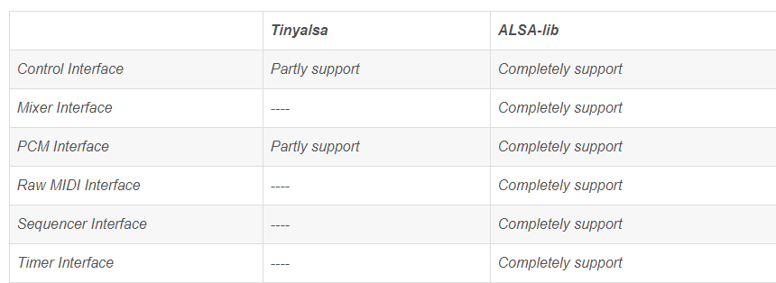

--

tinyalsa的代码量不大，可以读一下。

看顶层Makefile。

```
all:
	$(MAKE) -C src
	$(MAKE) -C utils
	$(MAKE) -C doxygen
	$(MAKE) -C examples
```

主要代码在src目录，工具的代码在utils目录。

还有例子。

```
install include/tinyalsa/pcm.h $(DESTDIR)$(INCDIR)/
	install include/tinyalsa/mixer.h $(DESTDIR)$(INCDIR)/
	install include/tinyalsa/asoundlib.h $(DESTDIR)$(INCDIR)/
	install include/tinyalsa/version.h $(DESTDIR)$(INCDIR)/
```

主要的头文件，就是4个。

pcm.h

mixer.h

asoundlib.h

version.h

utils目录下有5个文件，对应了5个工具：

```
tinycap.c  
tinymix.c  
tinypcminfo.c  
tinyplay.c  
tinywavinfo.c
```

我们先看tinycap。

从名字看，这个工具就是用来录音的。

基本用法

```
tinycap xx.wav
```

可以带的参数有：

```
-D card -d device -c channels -r rate -b bits -p period_size -n n_periods -t time_in_sec
```

card和device都是0这样的数字描述的。

录音测试一下

```
/userdata # tinycap 1.wav                  
Capturing sample: 2 ch, 48000 hz, 16 bit   
^CCaptured 151576 frames                   
```

默认是双通道，48K，16bit。

录音正常。

看看代码。

```
tinycap -- 
```

表示把录音数据输出到stdout。打印出来全是乱码。不知道这个什么场景下需要使用。

通过管道给后面的程序用。

主要就是capture_sample这个函数里在工作。这个函数是阻塞的。

```
capture_sample
	pcm_open(0, 0,)//传递设备的硬件号进行，还有配置信息。
		这样打开/dev/snd/pcmC%uD%u%c设备的。
		然后是设置参数。
	while (capturing) {
        frames_read = pcm_read(pcm, buffer, pcm_get_buffer_size(pcm));
        靠这里持续录音。
    sigint，把capturing设置为0。这样来跳出循环。
```

整体逻辑还是比较简单的。

但是对pcm相关函数的使用，跟我们一般的用法不相同。

```
是打开/dev/snd/pcmC%uD%u%c 这样的设备节点。
我之前看到的代码，都是打开"default"或者"hw:0，0"这样的。
操作上，都是使用了ioctl来操作fd的。包括读取音频数据。
alsa-lib就是调用了ioctl的。

snd_pcm_writei()-->snd_pcm_hw_writei(alsa-lib-1.1.3/src/pcm/pcm_hw.c)-->ioctl(fd, SNDRV_PCM_IOCTL_WRITEI_FRAMES, &xferi)调进内核
```


# tinyalsa跟alsa-lib的关系

tinyalsa借用了alsa-lib的一些头文件，主要是一些结构体和宏定义，没有链接alsa-lib的库。

tinyalsa只实现了pcm和mixer，而且没有配置文件系统。

而alsa则还实现了seq、timer、midi等接口。

# tinyplay

```
/ # tinyplay                                                        
usage: tinyplay file.wav [options]                                  
options:                                                            
-D | --card   <card number>    The device to receive the audio      
-d | --device <device number>  The card to receive the audio        
-p | --period-size <size>      The size of the PCM's period         
-n | --period-count <count>    The number of PCM periods            
-i | --file-type <file-type >  The type of file to read (raw or wav)
-c | --channels <count>        The amount of channels per frame     
-r | --rate <rate>             The amount of frames per second      
-b | --bits <bit-count>        The number of bits in one sample     
-M | --mmap                    Use memory mapped IO to play audio   
```

基本测试：

```
tinycap 1.wav
# 录音3秒，按ctrl+c停掉。
# 不带任何参数播放。
tinyplay 1.wav 
```


# tinypcminfo

```
/userdata # tinypcminfo                      
Info for card 0, device 0:                   
                                             
PCM out:                                     
      Access:   0x000009                     
   Format[0]:   0x000444                     
   Format[1]:   00000000                     
 Format Name:   S16_LE, S24_LE, S32_LE       
   Subformat:   0x000001                     
        Rate:   min=8000Hz      max=192000Hz 
    Channels:   min=2           max=2        
 Sample bits:   min=16          max=32       
 Period size:   min=32          max=65536    
Period count:   min=2           max=4096     
                                             
PCM in:                                      
      Access:   0x000009                     
   Format[0]:   0x000444                     
   Format[1]:   00000000                     
 Format Name:   S16_LE, S24_LE, S32_LE       
   Subformat:   0x000001                     
        Rate:   min=8000Hz      max=192000Hz 
    Channels:   min=2           max=8        
 Sample bits:   min=16          max=32       
 Period size:   min=8           max=65536    
Period count:   min=2           max=16384    
```

# tinywavinfo

这个是查看wav文件的信息。

# tinymix

```
/userdata # tinymix --help                                                 
usage: tinymix [options] <command>                                         
options:                                                                   
        -h, --help        : prints this help message and exists            
        -v, --version     : prints this version of tinymix and exists      
        -D, --card NUMBER : specifies the card number of the mixer         
commands:                                                                  
        get NAME|ID       : prints the values of a control                 
        set NAME|ID VALUE : sets the value of a control                    
        controls          : lists controls of the mixer                    
        contents          : lists controls of the mixer and their contents 
```


总的代码量其实不大。

# tinyalsa和alsa代码替换

现在有一份代码，是用tinyalsa的接口写的，我要替换为alsa的接口。

主要是mixer相关的接口。

tinyalsa

```
int snd_mixer_open(snd_mixer_t **mixer, int mode);
int snd_mixer_close(snd_mixer_t *mixer);
```

alsa

```
struct mixer *mixer_open(unsigned int card);
void mixer_close(struct mixer *mixer);
```

首先名字是区别就是，alsa的多了snd_的前缀

接口参数也不同了。

alsa的接口多了很多。

tinyalsa的基本数据结构

文件数量上相差很大，tinyalsa只有十几个。而alsa有200多个。

对外的主头文件

alsa：asoundlib.h，里面是include其他的所有头文件。只需要包含这一个就可以了。接口都是snd_开头的。

tinyalsa：asoundlib.h。这个是零散的定义。接口以pcm和mixer为开头。

tinyalsa使用的部分头文件，是kernel的。

```
#include <sound/asound.h>
struct mixer_ctl {
    struct mixer *mixer;
    struct snd_ctl_elem_info *info;//这个以snd开头的，是kernel里的。
```

相比于tinyalsa直接使用kernel里的结构体。

alsa则对kernel的结构体进行了重新定义，使用这样的方式：

```
struct _xxx {

};
typedef struct _xxx xxx_t;
```


snd_ctl_elem_info

```
id
type
int access
int count
value：union类型。
```

snd_ctl_card_info

```
id
name
多是字符串数组。
```

tinyalsa的mixer，主要2个结构体

```
mixer
mixer_ctl
```

open做了什么？

```
open "/dev/snd/controlC0"
用ioctl拿到snd_ctl_elem_list
malloc mixer结构体
ioctl拿到SNDRV_CTL_IOCTL_CARD_INFO
其他事情
返回mixer指针
```

alsa的open

```
返回是0表示成功。
输出的mixer，是靠二级指针来输出。
open里，只是malloc。
有3个链表：
class
elem
slave
```

alsa的close

```
遍历了链表进行free。
```


当前tinyalsa操作一个mixer的过程

```
static int eq_drc_ctl_value_set(int card, int val, char *name)
以这个为例
card是0，就一个声卡。
这个函数作用个是给name这个mixer，赋值为val。

需要这2个指针。
struct mixer_ctl *ctl;
struct mixer *mixer;

打开mixer
mixer = mixer_open(card);
拿到ctl
ctl = mixer_get_ctl_by_name(mixer, name);
拿到值的个数？
num_ctl_values = mixer_ctl_get_num_values(ctl);
根据num_ctl_values遍历设置，
mixer_ctl_set_value(ctl, i, val)
```

基本逻辑就是上面这个，比较简单清晰。

我需要做的，就是用alsa的接口来实现eq_drc_ctl_value_set这个函数。


alsa的mixer对外暴露的接口

数据结构

```
snd_mixer_t
snd_mixer_class_t
snd_mixer_elem_t

snd_mixer_elem_type_t
	这个是enum，里面就simple这一个值。
	
```

看alsa接口设置音量的示例代码。


mixer编程可以参考alsa-utils这个包里的amixer的代码，

照猫画虎就能满足一些需求；

snd_mixer_open没指定打开哪个，

我觉得这说明这些问题我们不用关心，一般应该是default设备，

这也是使用alsalib编程的原因，

如果像你说的需要指定的话，可以考虑使用更底层的API，

例如有关控制的那部分接口（control interface）。


我可以这样来思考，用把amixer cset的过程，看amixer里的代码，转成C语言代码就可以了。

这个代码在alsa-utils这个仓库。

我看sget和sset的分支。

把这个函数拿出来改改应该就好了。

```
static int sset(unsigned int argc, char *argv[], int roflag, int keep_handle)
```

函数逻辑

```
//先定义了这些局部变量
static snd_mixer_t *handle = NULL;
snd_mixer_elem_t *elem;
snd_mixer_selem_id_t *sid;
snd_mixer_selem_id_alloca(&sid);//分配sid

//这一步是把amixer sget name='Master Volume'的name这部分，解析出来，给sid进行赋值。
parse_simple_id(argv[0], sid)

snd_mixer_open(&handle, 0)
snd_mixer_attach(handle, card)
```


snd_ctl和snd_mixer区别


```
amixer-用户层    
  |->snd_ctl_ioctl-系统调用    
       |->snd_ctl_elem_write_user-内核钩子函数    
            |->snd_ctl_elem_wirte-    
                 |->snd_ctl_find_id-遍历kcontrol链表找到name字段匹配的kctl    
                 |->kctl->put()-调用kctl的成员函数put()    
                      |->snd_soc_put_volsw_2r   
```


直接输入amixer，是调用selems这个函数。这个是遍历所有的mixer。

然后打印信息。


看看tinymix的代码。

代码才400行。而amixer的代码有1700行。

不能用sget的，因为我发现有需要的内容，sget获取不到，而cget的可以。

哪些cget可以而sget不行呢？依据是什么？


cget的，是用snd_ctl_open来打开操作的。

而sget的，是用snd_mixer_open来操作的。


以这个作为例子来测试

```
amlogic@amlogic-BAD-INDEX:~$ amixer cget name='Master Playback Volume'
numid=10,iface=MIXER,name='Master Playback Volume'
  ; type=INTEGER,access=rw---R--,values=1,min=0,max=87,step=0
  : values=60
  | dBscale-min=-65.25dB,step=0.75dB,mute=0
```


ctl和mixer的关系，从这个枚举可以看出来。

```
typedef enum _snd_ctl_elem_iface {
	/** Card level */
	SND_CTL_ELEM_IFACE_CARD = 0,
	/** Hardware dependent device */
	SND_CTL_ELEM_IFACE_HWDEP,
	/** Mixer */
	SND_CTL_ELEM_IFACE_MIXER,
	/** PCM */
	SND_CTL_ELEM_IFACE_PCM,
```

很明显，ctl有多种，mixer只是ctl中的一种。


以alsa的ucm/main.c里的execute_cset和amixer的cset作为参考依据。


alsalib下的test/user-ctl-element-set.c可以作为学习材料。

当前还有个疑问，就是tinyalsa是通过/proc/asound/cards这里面看到的内容来作为mixer_open的参数的。

```
/ # cat /proc/asound/cards
 0 [AMLAUGESOUND   ]: AML-AUGESOUND - AML-AUGESOUND
                      AML-AUGESOUND
```

给的参数就是0 。

而现在alsa的，需要的是一个字符串参数。

我当前是给“default”。

是否完全合理？是否具有通用性？

这个要看tinyalsa把这个0怎么往下传递的。

是打开/dev/snd/controlC%u，把0拼接到这里。

/dev/snd目录下有这些文件。control的只有一个。

```
/dev/snd/controlC0    
/dev/snd/pcmC0D0c     
/dev/snd/pcmC0D0p     
/dev/snd/pcmC0D1c     
/dev/snd/pcmC0D1p     
/dev/snd/pcmC0D2c     
/dev/snd/pcmC0D3c     
/dev/snd/pcmC0D3p     
/dev/snd/pcmC0D4c     
/dev/snd/timer        
```

而alsa的snd_ctl_open是怎么处理的呢？

是到配置文件里去找的。

```
snd_config_search_definition(root, "ctl", name, &ctl_conf);
```

最后是怎么调用打开的？open的哪个文件？

通过加编译错误确认，PIC这个宏是被定义了的。

动态库得到的是

```
lib:(null), open_name:_snd_ctl_hw_open
```

这个函数在control_hw.c里。

通过这个宏来导出的。

```
SND_DLSYM_BUILD_VERSION(_snd_ctl_hw_open, SND_CONTROL_DLSYM_VERSION);
```

_snd_ctl_hw_open这个里面再根据名字找card。

card只有一个。就是0

```
pcm.!default{
    type hw
    card 0
    device 1
}
```

参数这样也可以的。

```
snd_ctl_open(&handle, "hw:CARD=0", 0)
```

# alsa和tinyalsa对比



https://blog.csdn.net/myzhzygh/article/details/8468210

在命名上：

| 代码         | 说明             |
| ------------ | ---------------- |
| linux 内核里 | snd_xx           |
| alsalib      | snd_pcm_xx       |
| tinyalsa     | pcm_xx、mixer_xx |


# pcm_params结构体

struct pcm_params

这个结构体相当于void。根本没有进行定义。只是声明了一下。

真正使用的时候，都是这样：

```
struct snd_pcm_hw_params *params = (struct snd_pcm_hw_params *)pcm_params;
```

# pcm设备相关代码解析

https://blog.csdn.net/hhx123456798/article/details/123605555


https://blog.csdn.net/hhx123456798/category_11616057.html

# 一篇好文章

这篇文章很好。

https://zhuanlan.zhihu.com/p/537562136

基于tinyalsa分析了完整的调用栈。

这种分析方法跟我的习惯很像，但是做得很完整，值得我去学习。

# 另外一篇好文章

https://www.cnblogs.com/wolfcs/p/17757779.html

# 参考资料

1、alsa-lib应用层接口分析

https://blog.csdn.net/yuhuqiao/article/details/82785234

2、

https://blog.csdn.net/u013209302/article/details/56835328

3、

https://bbs.csdn.net/topics/370092929

4、

https://blog.csdn.net/Guet_Kite/article/details/108126500

5、

https://blog.csdn.net/weixin_34332905/article/details/90333262