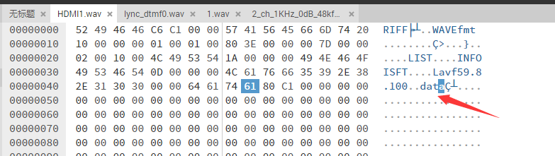

--

头部一共44个字节：

```
00到03：
	RIFF 这4个字符。
04到07
	int类型。文件长度。
08到0B
	WAVE这4个字符。
0C到0F
	fmt这3个字符，后面是一个空格。
10到13
	保留。但是看结构体里的名字，是fmt的size。目前看到是1 。
14到15
	2个字节。表示格式。1表示pcm
16到17
	2个字节。通道数。2或者1
18到1b
	4个字节，采样率。48000这样的数。
1c到1f
	4字节。传输速率。=ch * bit * sample_rate/8 = 2 * 16 * 48000/8 = 192000 
	播放软件根据这个值来估算buffer的大小。
20到21
	2字节。目前我在文件里看到的是04 。数据块的调整数。= ch * bit /8 = 2*16/8 = 4，对的上。
22到23
	2字节。采用位数。16位的。
24到27
	4字节。data这4个字符。
28到2b
	4字节。音频数据的长度。
```

在tinyalsa里，对应的结构体是：

```
struct wav_header {
    uint32_t riff_id;
    uint32_t riff_sz;
    uint32_t riff_fmt;
    uint32_t fmt_id;
    uint32_t fmt_sz;
    uint16_t audio_format;
    uint16_t num_channels;
    uint32_t sample_rate;
    uint32_t byte_rate;
    uint16_t block_align;
    uint16_t bits_per_sample;
    uint32_t data_id;
    uint32_t data_sz;
};
```


# 简单的wav库

dr_wav

https://mackron.github.io/dr_wav

dr是作者名字*David Reid*的缩写。

所有代码只是一个头文件，你只需要包含头文件就好了。

不过头文件有3000行左右。

下面的例子就是从wav文件读取数据出来。

```
#define DR_WAV_IMPLEMENTATION
#include "dr_wav.h"

int main()
{
    drwav wav;
    if (!drwav_init_file(&wav, "my_sound.wav", NULL)) {
        return -1;
    }

    int32_t* pSampleData = (int32_t*)malloc((size_t)wav.totalPCMFrameCount * wav.channels * sizeof(int32_t));
    drwav_read_pcm_frames_s32(&wav, wav.totalPCMFrameCount, pSampleData);

    // At this point pSampleData contains every decoded sample as signed 32-bit PCM.

    drwav_uninit(&wav);
    return 0;
}
```


我有个wav文件解析出来是这个样子。

```
RIFFNAME:RIFF
RIFFSize:49606
WAVNAME:WAVE
FMTNAME:fmt 
FMTSize:16
AudioFormat:1
Channels:1
SampleRate:16000
BytesPerSecond:32000
BlockAlign:2
BitsPerSample:16
DATANAME:LIST
DataSize:26
```

问题在于我的这个wav不标准。

数据的长度是在“data”后面这里。也就是0xc180才是后面data的长度。



所以我的解析不够健壮。

所以这个解析没有我想象的简单。

所以还是使用dr_wav的接口来做。这样才足够健壮。


```
drwav
	结构体
	这个结构体是全局性的。比较复杂。
drwav_init_file
drwav_read_pcm_frames_s32
drwav_open_file_and_read_pcm_frames_f32

drwav_fmt
drwav_fmt_get_format

drwav_init
drwav_uninit

drwav_read_raw
drwav_read_pcm_frames
drwav_get_length_in_pcm_frames

drwav_read_pcm_frames_s16le

drwav_init_file

drwav_open_and_read_pcm_frames_s16
drwav_open_file_and_read_pcm_frames_s16
```

看这个注释：

```
The examples above use versions of the API that convert the audio data to a consistent format (32-bit signed PCM, in this case), but you can still output the
audio data in its internal format (see notes below for supported formats):
```

那就是说，可以把任意格式转成指定的格式？那就正是我需要的。

编译选项

```
#define these options before including this file.

#define DR_WAV_NO_CONVERSION_API
  Disables conversion APIs such as `drwav_read_pcm_frames_f32()` and `drwav_s16_to_f32()`.

#define DR_WAV_NO_STDIO
  Disables APIs that initialize a decoder from a file such as `drwav_init_file()`, `drwav_init_file_write()`, etc.

#define DR_WAV_NO_WCHAR
  Disables all functions ending with `_w`. Use this if your compiler does not provide wchar.h. Not required if DR_WAV_NO_STDIO is also defined.

```


定义了这个宏，才会打开函数实现的部分。

```
#define DR_WAV_IMPLEMENTATION
    #include "dr_wav.h"
```


# 参考资料

1、wav文件头分析

https://blog.csdn.net/xieyanyi1/article/details/48207663

2、

这个的图片画得好。

https://blog.csdn.net/Guet_Kite/article/details/114625653

3、

https://blog.csdn.net/u013286409/article/details/47414273

