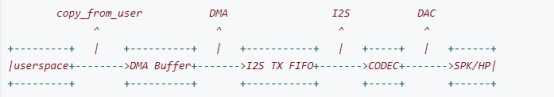

--

[音频](https://so.csdn.net/so/search?q=音频&spm=1001.2101.3001.7020)文件在播放时出现断断续续或类似“爆破”（Pop-Click）杂音的现象，称之为 Xrun（可以是 underrun，也可以是 overrun）。


最好的解决办法当然是分析出 Xrun 的问题到底是上面哪个原因导致的，

然后对症下药的改动相应的代码以修复问题。

但并不是所有人都对内核各部分了如指掌能精确定位到问题代码的位置（我承认至少我还没有那个水平），

所以这里有一个类似万金油的办法：

增加音频数据的 buffer 大小或 buffer 数量来进行补偿。

但这样也会使音频播放/录音的 数据准备时间变长，也就是说会增加音频操作的延迟，算是这种方法的一个副作用。


xrun_debug查看

```
cat /proc/asound/card0/pcm*/xrun_debug
```

它的存在有赖于CONFIG_SND_DEBUG=y` and `CONFIG_SND_PCM_XRUN_DEBUG=y

目前系统里的debug有

```
CONFIG_SLUB_DEBUG=y
CONFIG_ARCH_SUPPORTS_DEBUG_PAGEALLOC=y
CONFIG_PM_DEBUG=y
CONFIG_PM_SLEEP_DEBUG=y
CONFIG_CMA_DEBUG=y
CONFIG_CMA_DEBUGFS=y
CONFIG_AMLOGIC_CLK_DEBUG=y
CONFIG_AMLOGIC_DEBUG=y
CONFIG_AMLOGIC_DEBUG_LOCKUP=y
CONFIG_AMLOGIC_DEBUG_ATRACE=y
CONFIG_AMLOGIC_DEBUG_FTRACE_PSTORE=y
CONFIG_AMLOGIC_DEBUG_SCRAMBLER_RAMOOPS=y
CONFIG_AMLOGIC_MEM_DEBUG=y
CONFIG_DEBUG_INFO=y
CONFIG_DEBUG_FS=y
CONFIG_DEBUG_KERNEL=y
CONFIG_DEBUG_MISC=y
CONFIG_HAVE_DEBUG_KMEMLEAK=y
CONFIG_ARCH_HAS_DEBUG_VIRTUAL=y
CONFIG_SCHED_DEBUG=y
CONFIG_LOCK_DEBUGGING_SUPPORT=y
CONFIG_DEBUG_ATOMIC_SLEEP=y
CONFIG_HAVE_DEBUG_BUGVERBOSE=y
CONFIG_DEBUG_BUGVERBOSE=y
CONFIG_DEBUG_LIST=y
```

可见当前都没有打开。

```
# echo 5 > /proc/asound/card0/pcm0p/xrun_debug
```

The value consists of the following bit flags:

- bit 0 = Enable XRUN/jiffies debug messages
- bit 1 = Show stack trace at XRUN / jiffies check
- bit 2 = Enable additional jiffies check


status信息解读

```
state: RUNNING
owner_pid   : 964
trigger_time: 36.755556850
tstamp      : 0.000000000
delay       : 20194
avail       : 1856
avail_max   : 16537
-----
hw_ptr      : 4907712
appl_ptr    : 4927906
```


```
state: 当前输出运行状态
owner_pid:调用者的线程号
delay: 当前buffer中可用数据大小（单位为：帧）
avail：当前buffer中空闲空间大小（单位为：帧）[为pcm*c录音时，该值为可用数据大小]
hw_ptr: alsa驱动读取指针位置 [为pcm*c录音时，该值为 alsa驱动写入指针位置]
appl_ptr:alsa写入数据者的指针位置 [为pcm*c录音时，该值为alsa读取数据者的指针位置]
```


```
/proc/asound/card0/pcm1p/sub0 # cat hw_params
access: RW_INTERLEAVED
format: S16_LE
subformat: STD
channels: 2
rate: 44100 (44100/1)
period_size: 5513
buffer_size: 22050
```


使用dmix播放时，这些参数好像就没有参考意义了。

```
/proc/asound/card0/pcm1p/sub0 # cat status
state: RUNNING
owner_pid   : 3623
trigger_time: 615.968886709
tstamp      : 654.080353352
delay       : -1829376
avail       : 1837568
avail_max   : 1837568
-----
hw_ptr      : 1829376
appl_ptr    : 0
```


period_size的单位是什么？字节？

是字节。

一个[frame](https://so.csdn.net/so/search?q=frame&spm=1001.2101.3001.7020)就等于一个要被播放的声音样本。与通道数和样本长度无关。
例子：

- 1帧立体声48khz 16位的pcm数据长度为4bytes
- 1帧5.1正道48k 16位pcm流的大小为12bytes

一个period就是每两次硬件[中断](https://so.csdn.net/so/search?q=中断&spm=1001.2101.3001.7020)之间的帧数。

poll()会每个周期return一次。

[buffer](https://so.csdn.net/so/search?q=buffer&spm=1001.2101.3001.7020)是一个环形buffer，大小一般来说比一个period size大，一般设做 2 * period size，但是一些硬件可以支持到8个周期大小的buffer，也可以设为非整数倍的period的大小。


PCM 数据管理可以说是 ALSA 系统中最核心的部分。

不管是录音还是播放，都要用到buffer管理数据。

播放：copy_from_user 把用户态的音频数据拷贝到 buffer 中，启动 dma 设备把音频数据从 buffer 传送到 I2S tx FIFO。

录音：启动 dma 设备把音频数据从 I2S rx FIFO 传送到 buffer， copy_to_user 把 buffer 中音频数据拷贝到用户态。




ALSA buffer是采用ring buffer来实现的。

ring buffer有多个HW buffer组成。

之所以采用多个HW buffer来组成ring buffer,是防止读写指针的前后位置频繁的互换（即写指针到达HW buffer边界时，就要回到HW buffer起始点）。


hw_ptr_base：

当前HW buffer在Ring buffer中的起始位置。

当读指针到达HW buffer尾部时,hw_ptr_base按buffer size移动.

hw_ptr：硬件逻辑位置，播放时相当于读指针，录音时相当于写指针。

appl_ptr：应用逻辑位置，播放时相当于写指针，录音时相当于读指针。

boundary：扩展后的逻辑缓冲区大小，通常是(2^n)*size。

buffer_size：HW buffer的大小，大小为period_size * period_count 。

avail：HW buffer中空闲的地址，我们可以稳定的通过一个公式获取avail：


现在怀疑可能是resume后clk发生变化了。

发现axi clk变小了很多。


# 参考资料

1、

https://blog.csdn.net/Qidi_Huang/article/details/53100493

2、

https://blog.csdn.net/bingyu880101/article/details/83106497

3、

https://www.kernel.org/doc/html/latest/sound/designs/procfile.html

4、

https://www.alsa-project.org/wiki/XRUN_Debug

5、

https://blog.csdn.net/Guet_Kite/article/details/110821610

6、

https://blog.csdn.net/u012769691/article/details/46727543

7、ALSA子系统（十二）------ALSA Buffer的更新

这个系列不错。

https://blog.csdn.net/Guet_Kite/article/details/110957059