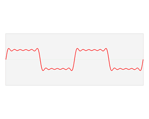
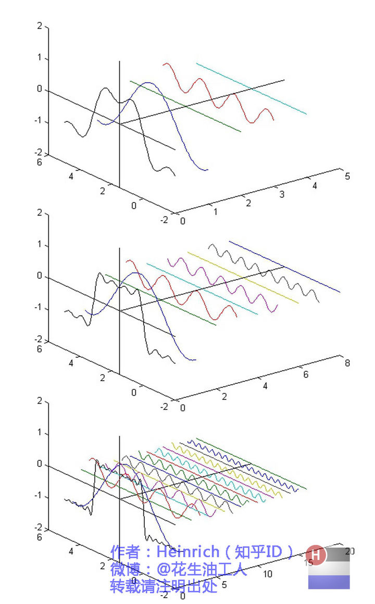

--

到了这里，频域和时域最基本的关系就很明显了，

第一幅图是一个矩形波的时域图，

第二幅则是频域图。

将一个表示波的函数从时域（时间与振幅的关系）

转化为频域（频率与振幅的关系）

的数学操作被称为傅立叶变换

以上的演示的是对于周期性信号的傅立叶变换，

而对于非周期信号，其过程较为抽象，

对其的变换便是傅立叶变换的一般形式，具体细节可以参阅有关资料。

在这里我仅说明一个一般性结论：

非周期信号的傅立叶变换所得频域图像是连续的，而不像上图那样离散。

也就是说，非周期信号各个分量的频率是连续的。

以下是一个非周期信号的例子，具体得到的过程不再给出。

下面这个动图就很形象了。

参考资料

1、

https://www.zhihu.com/question/21040374

2、

https://zhuanlan.zhihu.com/p/19759362