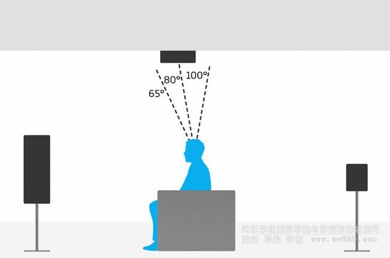
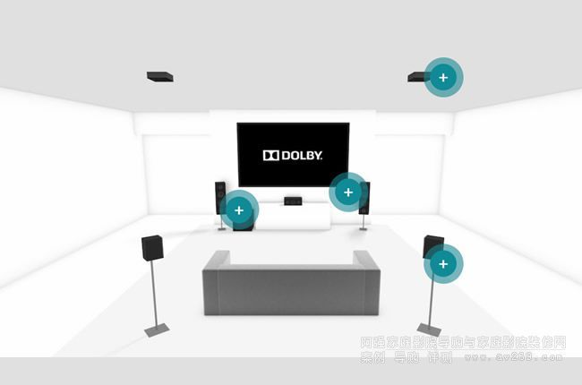
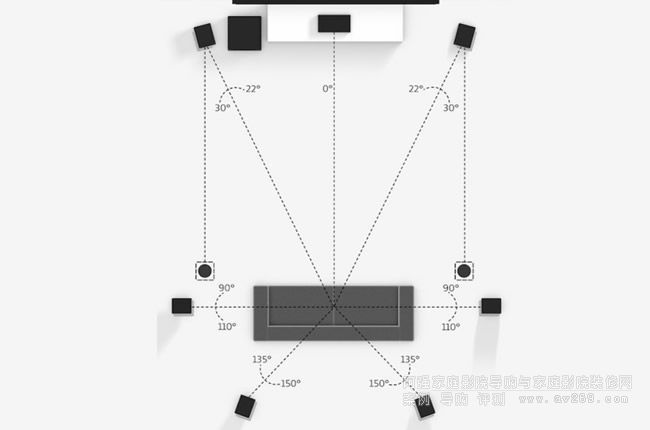
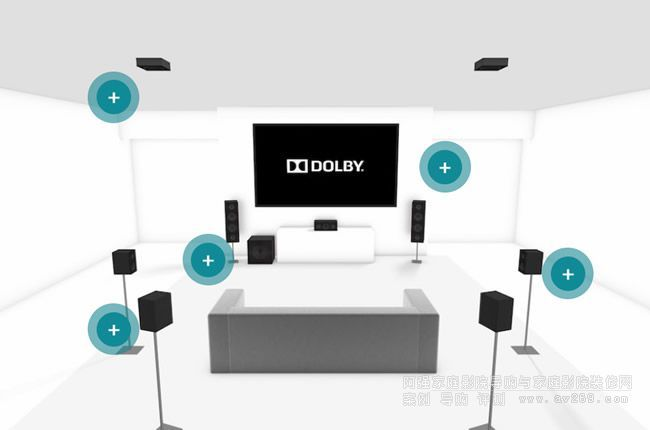

--

什么是杜比全景声？

如何搭建和体验？

**多声道电影和游戏比较有用；听音乐也增加一点空间感，但是不明显。**

杜比全景声最主要的作用是

无论你的音源是立体声、5.1/7.1还是全景声

无论你的设备是耳机、音响还是家庭影院

杜比全景声都可以充分利用音源，无缝对接你的设备，实现比直推更准确的声场还原效果。


在官方的FAQ中表示，推荐使用频响范围更大 低频更强的耳机，杜比全景声的提升效果会更明显。


虽然我也尝试过用好一些的耳机去妄图满足自己对视听的要求，但是很遗憾。杜比全景声没法用耳机来实现。因为主要还是声道的问题。


首先我们都知道，耳机的声道是2.0，那么杜比全景声的声道有多少呢？拿杜比全景声推荐的家庭影院最低配置也要5.1.2


什么是杜比全景声
Dolby Atmos并不是一种音轨格式，

FLAC、AAC、AC3这种是音轨格式，

但Dolby Atmos不是，

准确来说，它是封装在TrueHD或者Dolby Digital+音轨里面的描述声音信息方位的元数据(metadata)，

**通俗点就是它是一份描述文件，**

用来描述什么时候什么声音应该在哪个方位出现的。

采购回音壁、功放的时候你会看到一些产品标的是5.1.2、7.1.2，

**多出来的2就是这个元数据，用来区别于原来的5.1、7.1声道的。**

上面说了，Dolby Atmos主要有两种封装容器，

分别是TrueHD和Dolby Digital+(DD+)，他们都是一种音轨格式。


TrueHD音轨多见于蓝光资源，是一种无损的封装格式。

Dolby Digital+(DDP/DD5.1/AC3/EAC3) 音轨多见于Amazon、Netflix等在线流媒体网站，是一种有损压缩的封装格式。

直通、解码与转码

直通
直通(Passthrough)是指不对音轨进行解码，

直接原原本本发送到回音壁或者功放，专业的事让专业的设备来做。


解码
解码是指将Dolby Atmos的音频信息映射到音响直接发声的方式。

杜比全景声的解码，需要解码包。

音响设备厂商的软件部门或者播放器开发者**需要向杜比公司支付一定的费用来获取解码包的证书授权才可以进行解码。**

解码它本应该是属于最末端直接跟音响连接在一起的一环，比如说：

设备本身硬件是否达到要求

比如说大部分电视自带的音箱就已经算不上支持了，

这个很好理解，就好比你不可能用双声道的耳机获取完整的7.1声道的体验一样。

# 5.1.2 基本杜比全景声布局

5：表示5个传统环绕扬声器的数量。按照下面这样来摆放。

```
O      O      O

      人
O             O
```

1：这个表示超低音音箱。

2：这2个在天花板上安装。





# 7.1.2 

人的两侧也加2个。





# 安装走线

# 杜比全景声录制


# bass management

bass管理是指跟低频内容处理相关的功能。

包括LFE声道和其他声道的低频内容。

LFE是：Low-frequency effects 

# 相关开源代码

就在github上搜索“dolby”。看看能找到什么。

# atmos

**杜比全景声（Dolby Atmos）**是杜比实验室于2012年推出的高级环绕声标准，

用于电影院，

通过将前置、侧置、后置和天空扬声器加上复杂的音频处理和算法相结合，

提供高达最高64声道的环绕声，增加空间沉浸感。

杜比全景声（Dolby Atmos）的目的是在商业电影环境中提供完整的声音沉浸体验。

继电影院（2012-2014）取得初步成功之后，

杜比与多家AV功放和扬声器制造商合作，

将杜比全景声（Dolby Atmos）体验融入到家庭影院场景中。

当然，只有具有一定消费能力或非常钟爱于音视频系统的家庭可以负担得起安装在商业环境中使用的相同类型的杜比全景声（Dolby Atmos）系统所需的功能，

因此杜比实验室为制造商提供了更合适的物理缩小版本（并且价格合理） ）对消费者进行必要的升级以在家中享受杜比全景声（Dolby Atmos）体验。


**体验天空声：**天空声通道是杜比全景声（Dolby Atmos）体验中不可或缺的一部分。要体验天空声通道，您可以在天花板上安装扬声器。所有扬声器连接复杂性的最终解决方案可能只是有源无线扬声器，但是这个方案只能在以后能解决，因为在这之前，并没有无线支持Dolby Atmos的扬声器可用。


**新的声轨配置：**过往我们熟悉的描述声轨配置的方法，诸如5.1、7.1、9.1等.....而现在你会看到5.1.2、7.1.2、7.1.4、9.1.4等等的描述......扬声器放在一个水平面上（左/右前面和环绕声）是第一个数字，超低音扬声器（低音炮）是第二个数字（可能是.1或.2），天花板安装代表最后一个数字（通常为.2或.4）


**对消费者的价值**： 超越此前所有技术标准，从我一直使用杜比全景声（Dolby Atmos）的经验来看，它是家庭影院音频的颠覆者。从录音和混音开始，到最终的聆听体验，杜比全景声（Dolby Atmos）虽然仍然需要扬声器和功放来重现声音，但是从各扬声器中发出的声音，这种沉浸式的环绕声体验式史无前例的！从飞越头顶的鸟类或直升机，到从上方落下的雨水，到任何方向的雷声，杜比全景声（Dolby Atmos）能给你带来高度准确的沉浸式聆听体验。


Dolby Atmos并不是一种音轨格式，

FLAC、AAC、AC3这种是音轨格式，

但Dolby Atmos不是，

准确来说，它是封装在TrueHD或者Dolby Digital+音轨里面的描述声音信息方位的元数据(metadata)，

通俗点就是它是一份描述文件，

用来描述什么时候什么声音应该在哪个方位出现的。

采购回音壁、功放的时候你会看到一些产品标的是5.1.2、7.1.2，

多出来的2就是这个元数据，用来区别于原来的5.1、7.1声道的。 

上面说了，Dolby Atmos主要有两种封装容器，

分别是TrueHD和Dolby Digital+(DD+)，他们都是一种音轨格式。 

TrueHD音轨多见于蓝光资源，是一种无损的封装格式。 

Dolby Digital+(DDP/DD5.1/AC3/EAC3) 音轨多见于Amazon、Netflix等在线流媒体网站，是一种有损压缩的封装格式。 

作为一种有损的音频格式，DDP未必都会携带Dolby Atmos信息。 

直通、解码与转码
直通
直通(Passthrough)是指不对音轨进行解码，直接原原本本发送到回音壁或者功放，专业的事让专业的设备来做。

解码是指将Dolby Atmos的音频信息映射到音响直接发声的方式。

杜比全景声的解码，需要解码包。

音响设备厂商的软件部门或者播放器开发者需要向杜比公司支付一定的费用来获取解码包的证书授权才可以进行解码。

解码它本应该是属于最末端直接跟音响连接在一起的一环， 

转码
当播放Dolby Atmos的设备或软件并不处在最后一环直接与音箱相连，而软件又没开放音频直通的时候，

这时候想要把音频发送到回音壁或者功放，就需要转码成普通的LPCM音频格式了，

这个过程会丢失的是全景声的元数据。

此时到回音壁或者功放的声音文件已经跟普通的7.1**声道没有区别了**，

你花了钱在上面的回音壁和功放的声音处理芯片或软件就成了摆设。 

杜比全景声直通必要硬件条件是HDMI2.0（HDCP2.2），光纤不行。 


7.1与7.1.2区别

7.1 LPCM是转码后的音频文件，丢失了7.1.2所带有的全景声元数据，所以最终你可能无法清楚感知“发声物体的方位变化”，比如说你无法体验到直升机经过头顶时的临场感了。 


# 参考资料

1、杜比全景声（Dolby Atmos）到底是什么？告诉你怎么才能享受到杜比全景声！

https://zhuanlan.zhihu.com/p/158957340

2、简单认识杜比全景声(Dolby Atmos)

https://www.bilibili.com/read/cv3312567/

3、杜比全景声(Dolby Atmos)音箱设置 

https://www.sohu.com/a/253765994_228757

4、

http://www.360doc.com/content/18/1202/17/35271556_798794278.shtml

5、带你探秘杜比全景声混音棚（一）

http://www.hdav.com.cn/news/20150113_1663.html

6、

https://www.zhihu.com/question/327755951

7、

https://ipce.pixnet.net/blog/post/1968151-%E5%85%A5%E9%96%80%E5%AE%B6%E5%BA%AD%E5%8A%87%E9%99%A2%E8%A6%8F%E5%8A%83%E5%82%99%E7%BD%AE%E5%B0%8F%E7%9F%A5%E8%AD%98%E5%88%86%E4%BA%AB%EF%BC%8C5.1%E3%80%815.1.2

8、走进音视频的世界——杜比音效之AC3与AC4

https://blog.csdn.net/u011686167/article/details/113576628

https://en.wikipedia.org/wiki/Dolby