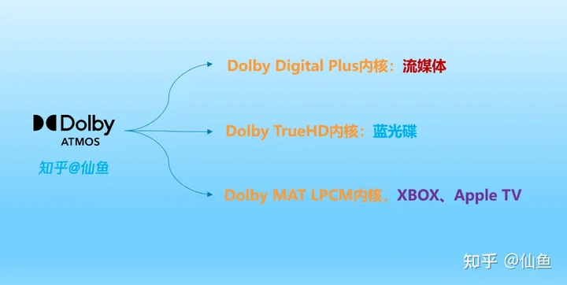
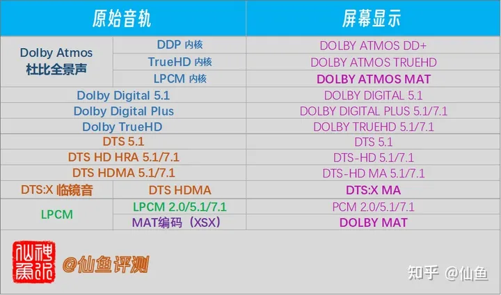
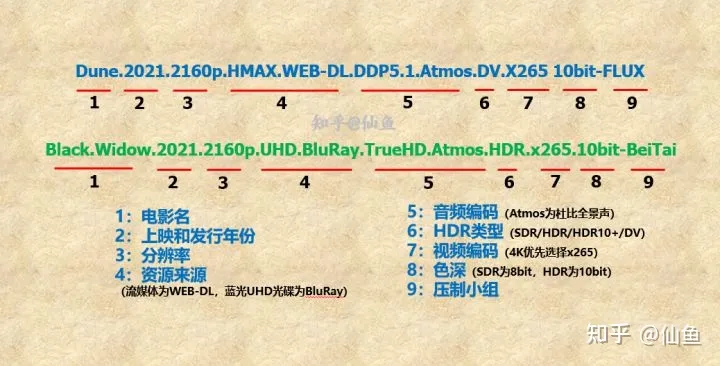

--

什么是杜比全景声？

如何搭建和体验？

**多声道电影和游戏比较有用；听音乐也增加一点空间感，但是不明显。**

杜比全景声最主要的作用是

无论你的音源是立体声、5.1/7.1还是全景声

无论你的设备是耳机、音响还是家庭影院

杜比全景声都可以充分利用音源，无缝对接你的设备，实现比直推更准确的声场还原效果。


在官方的FAQ中表示，推荐使用频响范围更大 低频更强的耳机，杜比全景声的提升效果会更明显。


虽然我也尝试过用好一些的耳机去妄图满足自己对视听的要求，但是很遗憾。杜比全景声没法用耳机来实现。因为主要还是声道的问题。


首先我们都知道，耳机的声道是2.0，那么杜比全景声的声道有多少呢？拿杜比全景声推荐的家庭影院最低配置也要5.1.2


什么是杜比全景声
Dolby Atmos并不是一种音轨格式，

FLAC、AAC、AC3这种是音轨格式，

但Dolby Atmos不是，

准确来说，它是封装在TrueHD或者Dolby Digital+音轨里面的描述声音信息方位的元数据(metadata)，

**通俗点就是它是一份描述文件，**

用来描述什么时候什么声音应该在哪个方位出现的。

采购回音壁、功放的时候你会看到一些产品标的是5.1.2、7.1.2，

**多出来的2就是这个元数据，用来区别于原来的5.1、7.1声道的。**

上面说了，Dolby Atmos主要有两种封装容器，

分别是TrueHD和Dolby Digital+(DD+)，他们都是一种音轨格式。


TrueHD音轨多见于蓝光资源，是一种无损的封装格式。

Dolby Digital+(DDP/DD5.1/AC3/EAC3) 音轨多见于Amazon、Netflix等在线流媒体网站，是一种有损压缩的封装格式。

直通、解码与转码

直通
直通(Passthrough)是指不对音轨进行解码，

直接原原本本发送到回音壁或者功放，专业的事让专业的设备来做。


解码
解码是指将Dolby Atmos的音频信息映射到音响直接发声的方式。

杜比全景声的解码，需要解码包。

音响设备厂商的软件部门或者播放器开发者**需要向杜比公司支付一定的费用来获取解码包的证书授权才可以进行解码。**

解码它本应该是属于最末端直接跟音响连接在一起的一环，比如说：

设备本身硬件是否达到要求

比如说大部分电视自带的音箱就已经算不上支持了，

这个很好理解，就好比你不可能用双声道的耳机获取完整的7.1声道的体验一样。

# 5.1.2 基本杜比全景声布局

5：表示5个传统环绕扬声器的数量。按照下面这样来摆放。

```
O      O      O

      人
O             O
```

1：这个表示超低音音箱。

2：这2个在天花板上安装。


# 7.1.2 

人的两侧也加2个。


# 安装走线

# 杜比全景声录制


# bass management

bass管理是指跟低频内容处理相关的功能。

包括LFE声道和其他声道的低频内容。

LFE是：Low-frequency effects 

# 相关开源代码

就在github上搜索“dolby”。看看能找到什么。

# atmos

**杜比全景声（Dolby Atmos）**是杜比实验室于2012年推出的高级环绕声标准，

用于电影院，

通过将前置、侧置、后置和天空扬声器加上复杂的音频处理和算法相结合，

提供高达最高64声道的环绕声，增加空间沉浸感。

杜比全景声（Dolby Atmos）的目的是在商业电影环境中提供完整的声音沉浸体验。

继电影院（2012-2014）取得初步成功之后，

杜比与多家AV功放和扬声器制造商合作，

将杜比全景声（Dolby Atmos）体验融入到家庭影院场景中。

当然，只有具有一定消费能力或非常钟爱于音视频系统的家庭可以负担得起安装在商业环境中使用的相同类型的杜比全景声（Dolby Atmos）系统所需的功能，

因此杜比实验室为制造商提供了更合适的物理缩小版本（并且价格合理） ）对消费者进行必要的升级以在家中享受杜比全景声（Dolby Atmos）体验。


**体验天空声：**天空声通道是杜比全景声（Dolby Atmos）体验中不可或缺的一部分。要体验天空声通道，您可以在天花板上安装扬声器。所有扬声器连接复杂性的最终解决方案可能只是有源无线扬声器，但是这个方案只能在以后能解决，因为在这之前，并没有无线支持Dolby Atmos的扬声器可用。


**新的声轨配置：**过往我们熟悉的描述声轨配置的方法，诸如5.1、7.1、9.1等.....而现在你会看到5.1.2、7.1.2、7.1.4、9.1.4等等的描述......扬声器放在一个水平面上（左/右前面和环绕声）是第一个数字，超低音扬声器（低音炮）是第二个数字（可能是.1或.2），天花板安装代表最后一个数字（通常为.2或.4）


**对消费者的价值**： 超越此前所有技术标准，从我一直使用杜比全景声（Dolby Atmos）的经验来看，它是家庭影院音频的颠覆者。从录音和混音开始，到最终的聆听体验，杜比全景声（Dolby Atmos）虽然仍然需要扬声器和功放来重现声音，但是从各扬声器中发出的声音，这种沉浸式的环绕声体验式史无前例的！从飞越头顶的鸟类或直升机，到从上方落下的雨水，到任何方向的雷声，杜比全景声（Dolby Atmos）能给你带来高度准确的沉浸式聆听体验。


Dolby Atmos并不是一种音轨格式，

FLAC、AAC、AC3这种是音轨格式，

但Dolby Atmos不是，

准确来说，它是封装在TrueHD或者Dolby Digital+音轨里面的描述声音信息方位的元数据(metadata)，

通俗点就是它是一份描述文件，

用来描述什么时候什么声音应该在哪个方位出现的。

采购回音壁、功放的时候你会看到一些产品标的是5.1.2、7.1.2，

多出来的2就是这个元数据，用来区别于原来的5.1、7.1声道的。 

上面说了，Dolby Atmos主要有两种封装容器，

分别是TrueHD和Dolby Digital+(DD+)，他们都是一种音轨格式。 

TrueHD音轨多见于蓝光资源，是一种无损的封装格式。 

Dolby Digital+(DDP/DD5.1/AC3/EAC3) 音轨多见于Amazon、Netflix等在线流媒体网站，是一种有损压缩的封装格式。 

作为一种有损的音频格式，DDP未必都会携带Dolby Atmos信息。 

直通、解码与转码
直通
直通(Passthrough)是指不对音轨进行解码，直接原原本本发送到回音壁或者功放，专业的事让专业的设备来做。

解码是指将Dolby Atmos的音频信息映射到音响直接发声的方式。

杜比全景声的解码，需要解码包。

音响设备厂商的软件部门或者播放器开发者需要向杜比公司支付一定的费用来获取解码包的证书授权才可以进行解码。

解码它本应该是属于最末端直接跟音响连接在一起的一环， 

转码
当播放Dolby Atmos的设备或软件并不处在最后一环直接与音箱相连，而软件又没开放音频直通的时候，

这时候想要把音频发送到回音壁或者功放，就需要转码成普通的LPCM音频格式了，

这个过程会丢失的是全景声的元数据。

此时到回音壁或者功放的声音文件已经跟普通的7.1**声道没有区别了**，

你花了钱在上面的回音壁和功放的声音处理芯片或软件就成了摆设。 

杜比全景声直通必要硬件条件是HDMI2.0（HDCP2.2），光纤不行。 


7.1与7.1.2区别

7.1 LPCM是转码后的音频文件，丢失了7.1.2所带有的全景声元数据，所以最终你可能无法清楚感知“发声物体的方位变化”，比如说你无法体验到直升机经过头顶时的临场感了。 


# 无法解码TRUEHD的功放是否能保留其中ATMOS信息？

如果功放只能解码EAC3，那么接收到TrueHD音轨的时候，音响也无法发出声音。

在dts里，无损的dts-hd ma是向下兼容的。音轨里带了dts5.1 core的内核。

所以当功放无法解码dts-hd ma的时候，会向下降级为dts 5.1来播放。

而dolby不一样，EAC3、AC3、TrueHD是并列的关系的，不是从属关系。

TrueHD不会被降级为EAC3、AC3来进行播放。



杜比很擅长与利用原有技术推陈出新，例如全景声就是DDP、TrueHD和LPCM叠加对象元数据（meta）实现的。

当功放不支持全景声，但是支持truehd解码的时候，

收到truehd的全景声音轨时，会把meta data丢掉，只播放truehd音轨。

在实际使用中，就是天空声道没有了。


https://www.zhihu.com/question/463187296/answer/2955481702

# 2023年「全景声」回音壁超级购买指南（三星/索尼/普乐之声/BOSE篇）

上篇主要是三星/索尼/普乐之声/BOSE这四个品牌，下篇则是JBL/飞利浦/TCL/LG/天龙篇：

跟传统实体家庭影院不同的是，**回音壁具有非常明显的电视属性**。

**挑选回音壁（条形音响）的三大要点：解码、声道、无线环绕。**

**解码：**条形音响在喇叭尺寸和材质上已经做了很多妥协了，所以解码这块不能再省。一般都要选择市面上所有音频格式通吃的，如果现在买，那么基于TrueHD编码的Dolby ATMOS和DTS:X次时代音轨一定要支持；

**声道：**声道越多，声音包围感更足，环绕效果越好；

**无线环绕：**早期的条形音响环绕声靠的是虚拟和反射，这也是回音壁这个名字的由来，因为对听音环境墙壁反射要求很高，所以在客厅反射效果不佳。现在的条形音响一般都会配无线环绕音响，环绕效果有质的提升。




# 高清电影文件名中的“DTS-HD.MA.TrueHD.HDR.SDR.”是什么意思？



其中跟音频和视频相关的信息如下：

## 1、分辨率

目前我们能看到的==一般只有1080P和2160P两种，分别对应HD和4K UHD==。如果你现在正在使用4K电视，推荐首选2160P；

不过要注意的是，部分老电影，例如星爷的《功夫》，还有《无间道》三部曲目前没有出UHD 4K蓝光碟，所以网上资源基本都是1080P；

## 2、电影来源

目前常见的有3种，WEB-DL、[BluRay-REMUX](https://www.zhihu.com/search?q=BluRay-REMUX&search_source=Entity&hybrid_search_source=Entity&hybrid_search_extra={"sourceType"%3A"answer"%2C"sourceId"%3A2652047155})、BDRIP。

WEB-DL应该是现在最常见的，片源来迪士尼、HBO-MAX等海外流媒体平台，最高码率可达17Mb左右，一部2小时的电影体积在15GB以上，音轨则以杜比全景声为主（ddp内核）；

BluRay-REMUX是以蓝光碟片源，去掉蓝光碟内不需要的花絮和音轨压制而成，一般来说对片源和主要音轨没有压制，所以整体码率可达80Mb左右，内涵的音轨也是无损次世代环绕。

而BD-RIP就是蓝光压制，这个情况就比较多了。根据压制组的特色，码率从几兆到几十兆都有，大家可以根据电影文件大小来判断。

作者：仙鱼
链接：https://www.zhihu.com/question/490532118/answer/2652047155
来源：知乎
著作权归作者所有。商业转载请联系作者获得授权，非商业转载请注明出处。

## 3、音频编码

音频编码常见的有DDP 5.1、DDP 5.1(Atmos)、dd5.1、dts5.1、dts-hdma、dtsX、AAC等等。

### 3.1 AAC/FLAC/LPCM

AAC编码一般都为立体声（也有部分含多声道），码率从128Kbps到640kbps不等，一般来说看到AAC就说明这部片子视频和音频码率都比较低。

在有些片子上，我们还能看到FLAC音轨。FLAC格式在音乐中使用比较多，码率在800Kb左右，播放器解码后其实就是PCM格式；

另外，还会见到LPCM格式，无损的多声道PCM格式，基本上是原汁原味的。

### 3.2 DD 5.1

dd 5.1是最基础的Dolby digital 5.1环绕声，一般都是比较老的片子上才会使用；

### 3.3 DDP 5.1(ATMOS)

ddp 5.1的全称为Dolby Digital Plus。经常与WEB-DL同时出现，因为海外流媒体平台的杜比全景声都采用ddp 5.1内核，码率一般为640Kb或者是768Kb，如果你有全景声功放或者回音壁的话，已经可以体验全景声效果了。

这里需要注意下，如果电影文件名里ddp 5.1后还跟着atmos，那么肯定支持杜比全景声；如果仅有ddp 5.1，那么可能支持全景声，也可能不支持。

### 3.4 TrueHD

[杜比TrueHD](https://www.zhihu.com/search?q=杜比TrueHD&search_source=Entity&hybrid_search_source=Entity&hybrid_search_extra={"sourceType"%3A"answer"%2C"sourceId"%3A2652047155})是无损次世代音轨，码率较高，所以只会出现在蓝光资源中。因为无损格式的杜比全景声使用TrueHD内核，所以当文件名中只有TrueHD时，可能可以点亮全景声，也可能只是传统的无损环绕声；

### 3.5 dts家族

dts因为码率较高，所以也没有流媒体片源会采用（索尼Bravia Core除外），dts片源都是DVD或者蓝光碟片源。

[dts 5.1](https://www.zhihu.com/search?q=dts 5.1&search_source=Entity&hybrid_search_source=Entity&hybrid_search_extra={"sourceType"%3A"answer"%2C"sourceId"%3A2652047155})为最基础的5.1环绕声，码率固定为1536Kb；

[dts-HDMA](https://www.zhihu.com/search?q=dts-HDMA&search_source=Entity&hybrid_search_source=Entity&hybrid_search_extra={"sourceType"%3A"answer"%2C"sourceId"%3A2652047155})为dts版本的无损次世代音轨，最高码率可到37Mb；

dtsX为dts版本的全景声，中文名叫做临镜音，内核是dts-hdma音轨，所以码率一般都非常高。

# 全景声测试资源


https://zhuanlan.zhihu.com/p/424772851


# 次世代音轨介绍

次世代音轨是专为高清光盘媒体所开发的==下一代无损压缩技术==，

包括LPCM(无损压缩)、

杜比数字Plus(Dolby Digital Plus 有损压缩，简称DDP)、

杜比TrueHD(Dolby TrueHD 无损压缩)、

DTS-HD High resolution(有损压缩)、

DTS-HD Master Audio(无损压缩)。

普通音轨和次世代音轨相比就像256kbps码率的mp3和无损ape相比一样，音质差距十分明显。

“次世代”音频均支持分离式7.1声道，

各声道单独编码，

可以充分发挥7.1音响系统的功能，声音的环绕效果和定位更为精准。

下载到的资源文件名包含DTS-HD、LPCM、DD+、TrueHD的都是次世代音轨。

一般次世代音轨都是源码输出给功放解码。


什么是源码输出?

播放器将未解码的Dolby TrueHD和DTS-HD Master Audio音频信号传输给具备解码能力的功放解码，次世代播放机音频信号—（HDMI线）—次世代功放解码—（喇叭线）—音箱。

解码输出就是将Dolby TrueHD和DTS-HD Master Audio信号先转换为LPCM音轨后传输到功放中，播放器转换次世代音频信号为LPCM—（光纤或同轴）—AV功放—（喇叭线）—音箱。


http://www.kodiplayer.cn/media/3041.html

# Kodi怎样才能观看杜比视界电影？

杜比视界英文名：Dolby Vision，

是美国杜比实验室推出的影像画质技术，

==通过提升亮度、扩展动态范围来提升影像效果。==

它不是开放的标准，需要使用它必须交付一定的版权费用。

杜比视界要求必须使用宽色域 Rec.2020 色彩空间， SMPTE ST 2084（PQ）图像传输功能，采用 12bit 色深。

杜比视界是目前最先进的HDR技术，它可以提升视频信号保真度，从而让图像的无论从亮度、色彩还是对比度角度看都非常逼真。

想要观看杜比视界需要支持杜比视界的电视、播放机、片源，缺一不可。


# dolby vision具体是指什么

Dolby Vision是一种高动态范围（HDR）视频技术，它旨在提供更高质量、更逼真的图像。它与传统视频格式相比，提供更广阔的色彩范围和更高的亮度级别，使得画面更为真实、生动。

它与其他HDR格式的不同之处在于其采用动态元数据。这意味着，与静态HDR不同，Dolby Vision的每一帧都包含动态的元数据信息，可以优化每一帧的显示，根据具体的显示设备和场景进行调整。这种个性化的调整可以确保在不同类型的屏幕上都能够呈现最佳的画质，无论是高端电视、移动设备还是大屏幕影院。

Dolby Vision还具备更高的亮度水平和更丰富的颜色深度，以及更高的对比度。这些特性共同作用，使其成为一种突出的视频技术，为观众带来更为生动、逼真的影像体验。


# 参考资料

1、杜比全景声（Dolby Atmos）到底是什么？告诉你怎么才能享受到杜比全景声！

https://zhuanlan.zhihu.com/p/158957340

2、简单认识杜比全景声(Dolby Atmos)

https://www.bilibili.com/read/cv3312567/

3、杜比全景声(Dolby Atmos)音箱设置 

https://www.sohu.com/a/253765994_228757

4、

http://www.360doc.com/content/18/1202/17/35271556_798794278.shtml

5、带你探秘杜比全景声混音棚（一）

http://www.hdav.com.cn/news/20150113_1663.html

6、

https://www.zhihu.com/question/327755951

7、

https://ipce.pixnet.net/blog/post/1968151-%E5%85%A5%E9%96%80%E5%AE%B6%E5%BA%AD%E5%8A%87%E9%99%A2%E8%A6%8F%E5%8A%83%E5%82%99%E7%BD%AE%E5%B0%8F%E7%9F%A5%E8%AD%98%E5%88%86%E4%BA%AB%EF%BC%8C5.1%E3%80%815.1.2

8、走进音视频的世界——杜比音效之AC3与AC4

https://blog.csdn.net/u011686167/article/details/113576628

https://en.wikipedia.org/wiki/Dolby