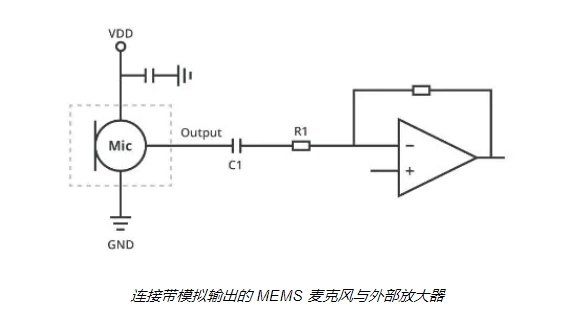
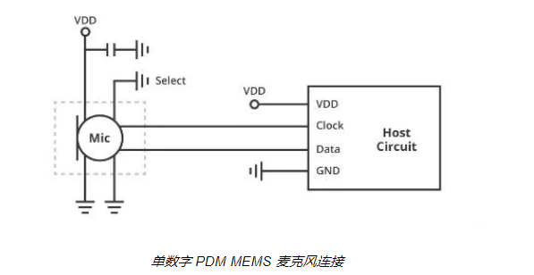
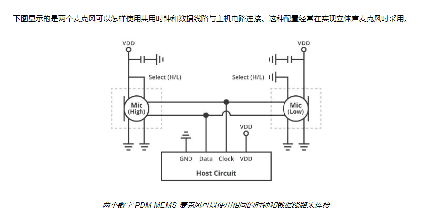

MEMS麦克风

一般叫做硅麦。

```
MEMS是微型机电系统的意思。
简单说就是一个电容器集成到一个芯片上。
在中高端手机上应用较多。

稳定性非常好。
```

ECM麦克风

一般叫做驻极体麦。

```
这个是传统的麦克风。
驻极体电容麦克风。
```


MEMS（微电子机械系统）麦克风扩展了为一系列设备增添**高级通信和监控功能**的机会。

当前家庭数字助理和**语音导航设备**的普及只是其中一些例子，

有望开启语音控制电子产品巨大增长的序幕。

随着 MEMS 技术**开始主导麦克风领域的市场份额**，现在是审视现有 MEMS 麦克风电气接口类型以及如何使用它们的好时机。

MEMS 麦克风的构造通常是将**两个半导体芯片**放置在**单个封装**结构中。

第一个半导体芯片是将**声波转换为电信号的 MEMS 膜**，

第二个芯片则是**有时含有**模数转换器 (ADC) 的放大器。

**如果 MEMS 麦克风中没有 ADC，则向用户提供模拟输出信号；**

**如果 MEMS 中有 ADC，则会有数字输出信号。**


带模拟输出的 MEMS 麦克风能实现与主机电路的直观接口

输出就是一个引脚的模拟信号。



数字mic的，则有2个引脚，一个clock，一个数字data。



立体声，2个mic共用clock和data引脚。




# 选择模拟或数字输出

是否决定采用带模拟或数字输出信号的 MEMS 麦克风**取决于使用输出信号的方式**。

如果是连接到放大器的输入以便在主机系统内进行模拟处理，则模拟输出信号比较方便。

传统模拟应用情形的例子包括**简单的扬声器或无线电通信系统。**

另外，带模拟输出的 MEMS 麦克风由于没有 ADC，因此功耗比那些带数字输出的要低。

**来自 MEMS 麦克风的数字输出信号在运用于数字电路时会有优势**，通常是微控制器或数字信号处理器 (DSP)。

如果麦克风和主机电路之间的导体位于**有电噪声的环境中，数字输出信号也比较有益，**

因为数字输出信号比传统模拟信号的电噪声抗扰性更强。


# 参考资料

1、数字麦克风与模拟麦克风的区别

https://wenku.baidu.com/view/baf438026d175f0e7cd184254b35eefdc8d315dd.html

2、模拟还是数字：如何选择适当的 MEMS 麦克风接口

https://www.arrow.com/zh-cn/research-and-events/articles/how-to-choose-the-right-mems-microphone-interface

3、一个说明书

https://www.knowles.com/docs/default-source/default-document-library/sisonic-design-guide.pdf