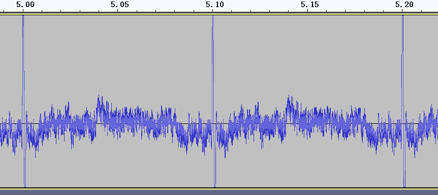

--

# 系统梳理

以下是基于ALSA接口和工具测试及优化音频延迟的方法，分为**测试准备**、**测试音频延迟**和**优化音频延迟**三个部分：

---

**1. 测试准备**

| 步骤         | 说明                                                         |
| ------------ | ------------------------------------------------------------ |
| **硬件环境** | 使用具备音频输入（麦克风）和输出（耳机或音箱）的设备。       |
| **工具安装** | 确保系统安装了 `alsa-utils`（包含 `arecord` 和 `aplay`）、`jackd` 和 `latencytop` 等工具。 |
| **确认配置** | 使用 `aplay -l` 和 `arecord -l` 确认音频设备，指定测试使用的设备号（如 `hw:0,0`）。 |

---

**2. 测试音频延迟**

| 方法             | 工具及步骤                                                   |
| ---------------- | ------------------------------------------------------------ |
| **静态延迟测试** | 1. 使用 `arecord` 录制音频：<br>`arecord -D hw:0,0 -f cd -d 10 test.wav`<br>2. 回放：<br>`aplay -D hw:0,0 test.wav`<br>3. 主观感知延迟。 |
| **回环延迟测试** | 1. 将音频输入连接到输出（硬件或软件方式）；<br>2. 使用 [jack_iodelay](https://jackaudio.org/faq/latency_tests.html) 测量。 |
| **软件延迟分析** | 使用 `latencytop` 或 `strace` 分析 `aplay` 或 `arecord` 系统调用的延迟来源：<br>`strace -tt -T aplay test.wav` |
| **实时延迟测量** | 编写实时音频处理程序，使用 `snd_pcm_writei` 和 `snd_pcm_readi` 的返回时间戳计算延迟。 |

---

**3. 优化音频延迟**

| 优化点             | 方法                                                         |
| ------------------ | ------------------------------------------------------------ |
| **降低Buffer大小** | 修改ALSA缓冲区参数：<br>在代码中调整 `snd_pcm_hw_params_set_buffer_size()` 和 `snd_pcm_hw_params_set_period_size()`。 |
| **优化调度优先级** | 将音频应用程序设置为实时优先级：<br>`chrt -f 99 ./your_audio_app` 或使用 `set_rtprio`。 |
| **禁用省电功能**   | 禁用CPU C状态和音频设备的省电模式（通过 `/sys/module/snd_hda_intel/parameters/power_save`）。 |
| **内核优化**       | 确保使用低延迟内核（`CONFIG_PREEMPT` 和 `CONFIG_HZ_1000`），并优化 `tickless`。 |
| **调节采样率**     | 保证输入和输出设备采样率一致，避免重采样开销（可通过 `arecord` 和 `aplay` 参数指定）。 |
| **排除干扰**       | 禁用可能影响音频性能的服务（如NetworkManager），通过 `htop` 或 `top` 查看系统负载。 |

---

**附加建议**

1. 使用 [rt-tests](https://rt.wiki.kernel.org/index.php/RT-tests) 测试系统实时性能。
2. 如果使用的是USB音频设备，检查并优化 `snd-usb-audio` 模块参数（如 `nrpacks`）。
3. 将关键路径日志（dmesg、ALSA debug）启用，分析具体延迟来源。

# latencytop

https://www.latencytop.org/

延迟有多种类型和原因。LatencyTOP 专注于导致音频跳帧、桌面体验卡顿或服务器过载（即使你还有大量的 CPU 功率）的那类延迟。

LatencyTOP 专注于应用程序希望运行并执行有用代码的情况，但在某些资源当前不可用时（内核随后阻止进程）。这既在系统级别也针对每个进程级别进行，以便您可以了解系统发生的情况，以及哪个进程正在遭受延迟或导致延迟。

# superpowered latency

https://blog.csdn.net/feelinghappy/article/details/111160940

https://www.52audio.com/archives/44524.html

Latency Test可以检测扬声器和蓝牙耳机的音频。用它来测试蓝牙音频延迟的步骤大体如下：

第一步：测试扬声器的音频延迟，这是机内音频延迟
第二步：连接蓝牙耳机，测试蓝牙耳机此时的音频延迟，这是总延迟。
第三步：总延迟-机内延迟=蓝牙耳机本身的延迟


这个是一个手机App。

断开蓝牙设备，先测试自己手机系统的声音处理延时。

手机本身的在70ms左右。也有170ms的手机。

然后连接上蓝牙，把hfp的关闭。

然后把音频调到最大声，把耳机放在手机的通话孔旁边，进行测试。

现在得到一个新的延时，例如500ms。

拿这个值减去70ms。得到430ms。再除以2，得到215ms，那就是蓝牙耳机的延迟。

这个[软件](https://marketing.csdn.net/p/3127db09a98e0723b83b2914d9256174?pId=2782&utm_source=glcblog&spm=1001.2101.3001.7020)的原理是软件发出信号，

再用mic接受耳机传过来的信号，

扣除os处理信号的时间，

那就是蓝牙设备的延时了。

但其实这不合理，

因为耳机发出声频信号，到耳机的动圈产生音频，再音频再传递到mic都要点时间。

简单的除2肯定不对，

但是我对比了2款在rtings有参考值的数据，

发现不除2差了很远，除2大概少个5%左右。

比如mdr1000x，除2是145ms左右，rtings的专业测试是156ms。

如果按300ms算，我的耳朵不相信，这个延时会太高了，300ms已经能产生视频的不同步效果了。

你自己可以决定是否修正吧。

我测试了一下手上的5，6个蓝牙设备。

aptX普遍在150ms左右，ldac大约200ms。

所以如果玩音游，基本上android手机走蓝牙暂时没啥指望了，等aptX LL的版本吧。


buffer 240，采样率48K，我的手机本机延迟是55ms。


# 如何准确测量蓝牙耳机的延时？

Audio Precision提供精准解决方案

https://www.52audio.com/archives/206800.html


蓝牙音频的传输原理及特殊性，

使得无法单独测量其作为Source或Sink的延时。

当由一个Source和一个Sink设备构成一个完整链路时，

那就可以测量这个链路的延时。

需要强调的是这个链路同时包含了两个不同设备的延时，

一个Source设备和一个Sink设备。

首先，在这个链路中需要把Source设备（APx Bluetooth Duo蓝牙模块）与Sink设备（蓝牙耳机）作为一个整体来测量，

而实际使用的Source设备往往是其它产品，

如：手机，PC端的蓝牙设备，

这就导致我们基于分析仪平台测到的延时与实际使用中的延时可能并不一致；

其次，Source设备与Sink设备采用不同蓝牙方案，

不同方案之间采用的Codec协议，

这些不同的应用都有可能导致延时测量的差异。

所以，我们只能把蓝牙耳机延时测量作为相对参考测量，

在测量中尽量将已知条件描述清楚，测试结果才更具有参考价值。


蓝牙音频延时的测量往往是因为音视频同步的需求，

其实Audio Precision在多年之前就推出了一个插件，

“APx_AVSync_PluginSetup” 来实现音视同步的测量（文末提供下载链接）。

其原理是把待测产品的视频信号

转换成电信号与产品输出的音频信号同时给到分析仪，

来测量它们之间的延时差，

这个时差可以是产品的实际应用场景，最接近真实的使用感受，如下图所示。

Audio Precision基于这个测量推出了LTV-1光电转换器，可直接搭配分析仪使用。


# 延迟（编码、传输、解码） 这3个延迟分别怎么进行测量？

**编码、传输和解码延迟**是音频性能测试的关键指标。以下是每种延迟的测量方法和工具：

------

| **延迟类型** | **测量方法**                                                 | **工具**                                                     |
| ------------ | ------------------------------------------------------------ | ------------------------------------------------------------ |
| **编码延迟** | 1. 提供已知音频输入信号（如脉冲信号或正弦波）。2. 捕获音频输入信号进入编码器后的编码输出数据流。3. 计算输入音频信号和编码器输出信号之间的时间差。 | - 高速示波器或逻辑分析仪- 蓝牙协议栈或编码器实现工具- 专用音频分析仪（如 APx 系列） |
| **传输延迟** | 1. 在蓝牙传输路径两端（源设备和接收设备）同步时间。2. 使用蓝牙分析仪捕获 HCI 数据包，记录从源发送到接收的数据包时间戳。 | - Ellisys Bluetooth Analyzer- Time Domain Reflectometer (TDR) |
| **解码延迟** | 1. 提供蓝牙传输后的数据流作为输入信号到解码器。2. 捕获解码器输出的音频信号，计算解码器输入和输出之间的时间差。 | - 音频分析仪（如 APx555）- 编解码器相关工具 (Zephyr、BlueZ)  |

------

### **详细测量步骤**

1. **编码延迟测量**：
   - 输入一个高精度标记信号（如单个脉冲信号）。
   - 监测编码器内部处理的时间，可以通过调试接口或日志记录计算延迟。
2. **传输延迟测量**：
   - 在发射端和接收端同步时间戳（使用高精度时钟或蓝牙堆栈工具）。
   - 捕获传输链路上数据包的发送和接收时间，计算差值。
3. **解码延迟测量**：
   - 将蓝牙接收的 LC3 数据流输入解码器。
   - 使用音频分析仪对解码后的输出信号时间和输入时间对比，计算延迟。

------

### **综合延迟测量**

为了更贴近实际使用场景，可以直接测量 **端到端延迟**（编码、传输和解码的总和）：

1. 在音频输入端插入测试信号（如脉冲信号）。
2. 在接收设备音频输出端用高速麦克风或传感器采集信号。
3. 通过工具（如示波器或音频分析仪）计算输入与输出信号的时间差。

这种方法适用于评估整体用户体验，但无法单独区分各部分的延迟。

# AV Latency.com

https://avlatency.com/tools/av-latency-com-toolkit/

AV Latency.com 工具包是一个软件套件，利用廉价且常见的消费电子设备来准确测量目标设备的音频延迟。


# rtings.com

https://www.rtings.com/headphones/learn/research/latency

查看他对 HDMI 延迟测试的解释时，将 HDMI 输出分成两个环路并在这两个环路之间比较差异（其中一个环路包含待测设备）的概念很简单且非常巧妙。

然而，由于这种方法需要在信号源侧使用电缆分隔音频，我们立刻看到了使用这种方法添加蓝牙测量所增加的挑战。

不过，如果我们采用 AVLatency.com 使用的偏移方法，这个想法可能是可扩展的。

# pipewire增加的延迟

- `aplay` **直接播放**：ALSA 内核级驱动 + 硬件缓冲，典型延迟约 **5-20ms**（取决于 buffer/period 配置）
- **PipeWire 默认配置**：客户端 ↔ PipeWire 服务 ↔ ALSA，额外增加 **10-40ms**（默认 quantum 通常为 64-256 samples）
- **总延迟对比**：PipeWire 默认比直接 ALSA 多 **15-60ms**（若配置不当可能更高）

优化方法

```
# /etc/pipewire/pipewire.conf.d/low-latency.conf
context.properties = {
    default.clock.quantum     = 64   # 量子数（帧数）
    default.clock.min-quantum = 64   # 最小量子数
    default.clock.max-quantum = 64   # 强制固定量子数
    default.clock.rate        = 48000 # 高采样率可降低相对延迟
}

context.modules = [
    { name = libpipewire-module-rtkit
      flags = [ nofail ] }
]
```

# 测试方法

## 基于硬件的测试

- 将LED与音频信号同步输出（如通过GPIO控制）。
- 使用光传感器捕捉LED信号，同时连接示波器探头到耳机插孔。

应该就是2s播放一个音频。播放音频的同时把gpio拉一下。

gpio的波形变化可以认为是没有延迟的。

看音频的滞后了多少。

特点是跟平台关系不大，有很好的通用性。

## 基于软件的测试

## **系统级优化与测量**

**缓冲区大小调整**

**Linux内核优化**


**信号控制**：测试信号需具备可辨识特征（如短脉冲或正弦波），否则需依赖交叉相关法

**多因素分析**：延迟可能由硬件转换（ADC/DAC）、驱动、系统负载共同导致，需分层排查


`audio_sync` 是一个 Python 库，用于比较两个音频信号并获得一个信号相对于另一个信号的延迟（或延迟）。该库最初是为测试 Chromecast Audio 的多房间功能而开发的。

为了库能够确定延迟，

测试用的音频源（例如扬声器）输出的音频信号需要具有某些特性（详见如何测量延迟部分）。

这限制了库的应用范围，

仅适用于可以控制源播放的音频的情况。

如果做不到这一点，则可能需要考虑使用互相关技术。


以下 SoX 命令生成一个测试音频文件，具有以下属性

- Duration: 1 min 持续时间: 1 分钟
- Period: 100 msecs 周期: 100 毫秒
- Max sine pulse amplitud: 0.8
  最大正弦脉冲幅度: 0.8
- Max noise amplitud: 0.2
  最大噪声幅度: 0.2
- Sampling rate: 48 kHz
  采样率: 48 kHz
- Encoding: signed int, low-endian
  编码：带符号整数，小端序

```
sox -n -r 48k sine.wav synth 0.002 sine 500 gain -n vol 0.8
sox -n -r 48k noise.wav synth 0.098 pinknoise gain -n vol 0.2
sox sine.wav noise.wav sine_noise_f48k_p100msecs_d60sec.wav repeat 599
```

生成的文件是轻微的杂音，每100ms一个脉冲。




较小的帧大小和更高的采样率会降低往返延迟。然而，代价是出现中断（溢出/下溢）的概率更高。


https://www.cnblogs.com/lp1129/articles/15820483.html


从科伊尔公布的测量图表来看，

苹果公司的第一代AirPods测量延迟时间为274毫秒；

第二代AirPods延迟时间为178毫秒，

第三代AirPods(即AirPods Pro)延迟降达144毫秒。

据悉，第二代AirPods和AirPods Pro使用同样芯片(H1芯片)，

这似乎意味着苹果公司找到了更好的算法来缩短延迟。

| 蓝牙音讯转码器 | 延迟时间     |
| -------------- | ------------ |
| SBC            | 150～250毫秒 |
| AAC            | 140～200毫秒 |
| aptX           | 130～180毫秒 |
| aptX HD        | 40～100毫秒  |
| aptX LL        | 32～40毫秒   |
| LDAC           | 160～210毫秒 |

https://www.audioapp.cn/thread-209023-1-1.html

BLE传输延迟(Latency)主要是指设备端将数据放至蓝牙协议栈到Android主机收到的时间间隔。

由于通信双方时间戳不统一，

无法按照前面通过打印时间戳的方式来做统计传输延迟，

只能通过硬件信号做同步。

设备端将数据放至蓝牙协议栈时给出一个信号，

Android主机收到该数据时也给出一个信号，

使用示波器抓取两个信号即可得到数据通过蓝牙BLE传输的延迟，如下图所示。


对于视频播放来说，任何平台都有可能采用音频早一点、视频晚一点的方法来解决延迟问题。
